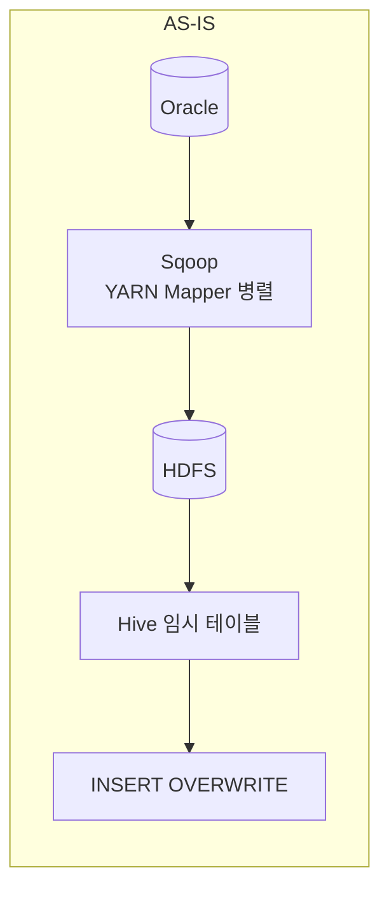
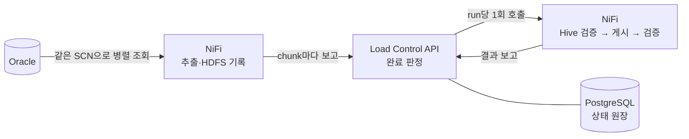

# Sqoop 대체 적재: NiFi + Load Control API

Oracle 데이터를 Hive로 적재할 때 쓰던 Sqoop(Kylo `ImportSqoop`)을 없애고, Cloudera CFM 4.12(NiFi 2.6)의 표준 Processor와 작은 Python 서비스(Load Control API)로 바꾼다.

## 무엇이 바뀌나





- **NiFi**는 데이터만 다룬다: Oracle 조회, Parquet 변환, HDFS 기록, Hive SQL 실행.
- **Load Control API**는 상태만 다룬다: 모든 파티션이 끝났는지 판정하고, 다음 단계를 한 번만 시작시키고, 실패를 기록한다.
- **PostgreSQL**(`nifi_ops` 스키마)이 실행 상태의 원장이다. 원장에 쓰는 것은 API 하나다.

## 핵심 보장

| 보장 | 방법 |
|---|---|
| 모든 파티션이 같은 시점의 데이터를 읽는다 | 시작할 때 Oracle SCN을 하나 고정하고 모든 조회에 `AS OF SCN`을 쓴다 |
| 실행끼리 섞이지 않는다 | 실행마다 `run_id`를 발급하고 HDFS 경로·staging 테이블을 run별로 나눈다 |
| 일부만 성공하면 게시하지 않는다 | API가 파티션 건수 합계 = 원천 건수일 때만 다음 단계를 시작한다 |
| 검증·게시는 run당 한 번만 실행된다 | API가 조건부 UPDATE(CAS)로 한 요청에만 허락한다 |
| 게시 결과가 불명확하면 자동으로 다시 게시하지 않는다 | `PUBLISH_UNKNOWN`으로 남기고 운영자가 확정한다 |
| 원천 = 추출 = staging = target | 건수, 금액 합계, 시각 최소·최대, PK 중복, NULL을 단계마다 비교한다 |

## 처리 순서

1. **PG-00 Trigger**: 업무일자로 실행을 시작한다.
2. **PG-10 Run Coordinator**: API에 run을 만들고, SCN을 고정하고, 원천 건수와 파티션 범위를 계산해 등록한다.
3. **PG-20 Extract Worker**: 파티션마다 병렬로 조회해 Parquet로 HDFS에 쓰고 chunk마다 API에 보고한다.
4. **API**: 마지막 보고에서 모든 파티션이 맞으면 검증 단계를 호출한다(run당 1회).
5. **PG-40 Staging Validation**: run 경로를 가리키는 Hive 임시 테이블을 만들고 원천 지표와 비교한다.
6. **PG-50 Publish**: target 파티션을 `INSERT OVERWRITE`로 교체한다.
7. **PG-60 Target Validation**: target을 다시 원천 지표와 비교하고 `SUCCESS`로 끝낸다.
8. **PG-70 Cleanup**: 보존 기간이 지난 임시 테이블과 HDFS 경로를 지운다.
9. **PG-90 Error and Event**: 모든 단계의 실패를 모아 API에 보고하고 이벤트를 남긴다.

> [!IMPORTANT]
> 현재 빌더는 설정 JSON 하나당 Job PG 전체(PG-00·10·20·40·50·60·70·90)를 새로 만든다. Oracle
> 원천 테이블이 6개면 서로 다른 `JOB.KEY`를 가진 Job PG 6개가 필요하며, PG-05만 공통으로 사용한다.
> 빌더가 반복 생성을 자동화하지만 한 Processor 세트를 여러 테이블이 공유하는 구조는 아니다.

## 저장소 구조

```text
.
├── README.md                      이 문서
├── docs/                          전체 적용·설정·검증·운영 매뉴얼
├── TODO.md                        운영 적용에 남은 일
├── poc/
│   ├── build_flow_v4.py           NiFi Flow를 REST API로 만드는 빌더
│   ├── teardown_flow.py           빌더가 만든 Job 삭제
│   ├── config.v4.example.json     빌더 설정 예시
│   ├── VERIFICATION.md            검증 결과
│   └── hdfs-hive/                 시험용 HDFS·Hive 컨테이너
└── load-control-api/              Load Control API(Python FastAPI). 사용법은 그 안의 README
```

## 시작하기

처음 적용하는 경우 [전체 적용 매뉴얼](./docs/README.md)부터 읽는다. 아키텍처, 모든 설정값, PG별 동작과
검증, Load Control API 상호작용, 장애 복구까지 실제 배포 순서로 정리되어 있다.

1. 전체 적용 절차: [docs/README.md](./docs/README.md)
2. Load Control API 설치·실행: [load-control-api/README.md](./load-control-api/README.md)
3. NiFi Flow 생성·실행: [설치 및 적용 절차](./docs/03-installation-and-apply.md)
4. 상태 보기: API 서버에서 `load-control-api/bin/monitor.sh`(터미널 대시보드)

## 현재 상태

Cloudera CFM 4.12(NiFi 2.6) 2노드 클러스터, Oracle 23ai, Hive 4.0.1 시험 환경에서 정상 실행과 주요 장애 시나리오를 확인했다([검증 결과](./poc/VERIFICATION.md)). 운영 적용 전에 남은 일은 [TODO.md](./TODO.md)에 있다.

## 운영 환경 전제

- NiFi↔API 통신은 HTTP, API 인증은 Bearer 토큰
- HDFS 권한 검사와 Hive 인증은 쓰지 않는다
- Flow는 빌더(`poc/build_flow_v4.py`)로 만든다(NiFi Registry 미사용)
