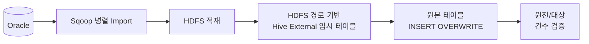
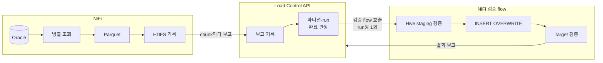
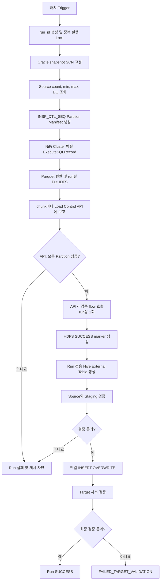

# Sqoop Removal for NiFi

## 프로젝트 개요

기존 NiFi 1.x Flow에서 Kylo `ImportSqoop` Processor로 수행하던 Oracle 데이터 적재를 제거하고, NiFi 2.6.0 기반 Cloudera Flow Management 4.12.0의 표준 Processor만으로 대체하기 위한 설계 프로젝트이다.

AS-IS 처리는 다음 순서로 동작한다.



TO-BE에서는 Sqoop Mapper가 담당하던 분할 조회와 병렬 실행을 NiFi Flow로, 실패 전파와 전체 작업 완료 판정을 Load Control API(Python FastAPI)와 PostgreSQL 영속 관리 테이블로 구현한다.



## 설계 목표

- Oracle 데이터를 `INSP_DTL_SEQ` 범위로 나누어 병렬 추출한다.
- 모든 병렬 파티션이 성공한 경우에만 Hive `INSERT OVERWRITE`를 실행한다.
- 한 파티션이라도 실패하면 실행 전체를 실패 처리하고 게시를 차단한다.
- NiFi 재시도, 재기동 및 노드 장애에도 중복 완료나 부분 게시가 발생하지 않게 한다.
- 원천, HDFS 파일, Hive staging 및 최종 테이블을 단계별로 검증한다.
- 실패 실행과 성공 실행의 HDFS 경로 및 상태를 완전히 격리한다.
- 실행과 파티션 단위의 감사 이력 및 구조화 로그를 남긴다.

## 핵심 개념

### 실행 식별자와 격리

각 실행에 불변의 `run_id`를 발급한다. 모든 FlowFile, 관리 테이블, 로그와 HDFS 경로에서 동일한 값을 사용한다.

```text
/data/nifi/stage/<job_key>/run_id=<run_id>/part-<partition_id>-<chunk_index>.parquet
```

실패한 실행의 파일이 다음 실행이나 최종 테이블에 섞이지 않으며, 재실행은 기존 실행을 수정하지 않고 새 `run_id`로 시작한다.

### 동일 시점 Oracle Snapshot

병렬 JDBC Connection이 서로 다른 시점의 데이터를 읽는 것을 방지하기 위해 작업 시작 시 Oracle SCN을 고정한다. 경계 조회, source count, 데이터 추출은 모두 동일한 `AS OF SCN`을 사용한다.

Flashback Query를 사용할 수 없다면 Oracle snapshot/staging table, 불변 업무 마감 조건 또는 변경이 없는 배치 시간대를 사용해야 한다. 단순한 추출 전후 건수 비교만으로는 동일 시점 정합성을 보장할 수 없다.

### 범위 파티셔닝

`INSP_DTL_SEQ`를 하한 포함·상한 미포함 범위로 분할한다. 마지막 파티션만 최댓값을 포함한다.

```text
partition 0   : seq >= b0   AND seq < b1
partition 1   : seq >= b1   AND seq < b2
...
partition N-1 : seq >= bN-1 AND seq <= max_seq
```

NULL 값은 사전 검증에서 실패시키거나 `IS NULL` 전용 파티션으로 분리한다. 값 분포가 불균등하면 단순 MIN/MAX 범위 대신 통계 또는 분위수 기반 경계를 사용한다.

### 영속 Manifest와 Load Control API

관리 DB의 Run, Partition, File Manifest가 상태의 최종 원장이다. 원장에 쓰는 주체는 Load Control API 하나이고, NiFi는 관측 이벤트만 직접 기록한다.

```text
nifi_ops.load_run
nifi_ops.load_partition
nifi_ops.load_file
nifi_ops.load_validation
nifi_ops.load_dispatch   (검증 호출 outbox)
nifi_ops.load_event
```

NiFi Worker는 PutHDFS가 성공한 chunk마다 API에 보고한다. API는 보고마다 run 행을 잠근 트랜잭션에서 다음을 판정하고, run 완료를 확정한 단 하나의 보고만 검증 flow 호출을 예약한다. NiFi Queue나 `Wait/Notify` cache는 쓰지 않는다.

```text
파티션: 받은 chunk 수 = fragment.count, row 합계 = expected count
run   : 모든 파티션 상태 = SUCCESS
        파티션 실제 건수 합계 = Oracle source count
```

검증 호출은 outbox(`load_dispatch`)와 PostgreSQL `LISTEN/NOTIFY`로 commit 후에 전달하고, 받는 쪽은 `STAGE_VALIDATING` CAS로 중복을 걸러 낸다.

### CAS 기반 중복 방지

파티션 Worker와 게시 Flow는 API에 고유 token으로 소유권을 요청하고, API는 compare-and-set으로 하나의 요청에만 소유권을 준다.

```sql
UPDATE nifi_ops.load_run
   SET status = 'PUBLISHING', publish_token = CAST(:publish_token AS uuid)
 WHERE run_id = CAST(:run_id AS uuid)
   AND status = 'STAGING_VALIDATED'
RETURNING run_id;
```

반환 행이 있으면 API가 `claimed=true`를 돌려주고, 그 FlowFile만 `INSERT OVERWRITE`를 수행한다. 같은 token의 재요청은 성공으로 처리하므로 응답 유실 후 재시도해도 소유권을 잃지 않는다.

## 전체 처리 흐름



## NiFi Process Group 구성

| Process Group | 역할 | 실행 위치 |
|---|---|---|
| `PG-00 Trigger` | 스케줄 및 업무키 생성 | Primary Node |
| `PG-05 Control Receiver` | API의 검증·재발행 호출 수신, `jobKey`별 Job PG로 전달 | All Nodes |
| `PG-10 Run Coordinator` | API에 run 등록, SCN, source metrics, manifest 계산과 등록 | Primary Node |
| `PG-20 Extract Worker` | claim, Oracle 병렬 조회, Parquet 변환, HDFS 기록, chunk 보고 | All Nodes |
| `PG-40 Staging Validation` | 검증 시작 CAS, External table 생성 및 staging 검증 | All Nodes |
| `PG-50 Publish` | API 게시 소유권 획득 및 `INSERT OVERWRITE` | All Nodes |
| `PG-60 Target Validation` | 최종 테이블 사후 검증 | All Nodes |
| `PG-90 Error and Event` | NiFi Processor 오류 정규화, 실패 보고 API 호출, 오류 이벤트 기록 | All Nodes |

| 구성요소 | 역할 |
|---|---|
| Load Control API (`api` 프로세스) | 원장 기록, 불변식 검증, 파티션·run 완료 판정, 상태 전이 CAS |
| Load Control API (`worker` 프로세스) | outbox dispatcher(검증·재발행 호출), sweeper(stale·timeout 정리) |

각 PG는 Job PG 아래 자식 PG로 두고 Input/Output Port로 연결한다. 모든 PG의 실패는 `errors` Port로 PG-90에 모인다(가이드 2장). 가이드 초안의 `PG-30 Partition and Run Gate`(Wait/Notify)와 `PG-70 Recovery Monitor`는 API로 대체되어 없다. PG-40~60은 API가 NiFi LB로 호출하므로 All Nodes에서 실행하고, 중복 실행은 Primary Node 대신 API CAS로 막는다.

Worker 입력 Connection만 Round Robin Load Balance를 적용한다. 실제 Oracle 동시 세션 수는 다음 식으로 제한한다.

```text
NiFi 노드 수 × 노드별 ExecuteSQLRecord Concurrent Tasks
+ 제어 및 검증용 JDBC 세션
```

기존 Sqoop Mapper 수를 NiFi 노드마다 그대로 설정하면 원천 DB 부하가 노드 수만큼 증가할 수 있다.

## 데이터 검증

건수 일치만으로는 같은 수의 누락과 중복이 상쇄되는 오류를 찾을 수 없다. 다음 검증을 단계별로 수행한다.

1. Oracle source count와 SCN
2. 파티션별 expected/actual row count
3. HDFS chunk 수와 `record.count` 합계
4. Hive staging count와 schema
5. PK NULL 및 중복 건수
6. split 컬럼 MIN/MAX와 NULL 건수
7. 주요 금액·수량 합계 및 코드별 건수
8. 최종 target count와 업무 품질 지표

다음 등식과 품질 규칙이 모두 만족된 경우에만 성공이다.

```text
source count
  = SUM(partition actual count)
  = staging count
  = target count
```

원천이 0건이면 기존 데이터가 비워질 수 있으므로 기본 정책은 `ALLOW.EMPTY.SOURCE=false`이다.

## 실패와 재처리 원칙

- Oracle/HDFS 일시 오류는 해당 파티션만 제한적으로 재시도한다.
- `ORA-01555`, SQL 문법, 권한, schema 오류는 반복 재시도하지 않는다.
- 동일 실행의 일부 파티션만 새 SCN으로 다시 읽지 않는다.
- PutHDFS는 run 전용 경로와 결정적 파일명으로 멱등 재시도한다.
- Staging 검증 전에는 `INSERT OVERWRITE`를 실행하지 않는다.
- Hive 게시 결과가 불명확한 timeout은 `PUBLISH_UNKNOWN`으로 기록하고 자동 재실행하지 않는다.
- Target 사후 검증 실패는 중대 오류로 처리하며 자동 overwrite를 반복하지 않는다.
- NiFi나 API가 재기동되어도 관리 DB Manifest와 outbox를 기준으로 이어서 처리한다. stale 작업은 API sweeper가 정리한다.
- NiFi→API 호출은 모두 멱등이므로 5xx·연결 오류는 같은 요청으로 재시도한다.

## 로그와 추적성

모든 주요 이벤트에는 다음 상관키를 기록한다.

```text
run_id, job_key, business_key, partition_id, chunk_index,
processor_name, node_id, attempt_no, row_count, duration_ms,
error_class, error_code, message
```

업무 상태와 검증 결과는 NiFi가 Load Control API를 동기 호출해 PostgreSQL 관리 테이블에 기록한다. 상태 전이 이벤트는 API가 같은 트랜잭션에서, NiFi 오류·관측 이벤트는 PG-90이 `nifi_ops.load_event`에 저장한다. NiFi와 API 로그는 `run_id`와 `X-Request-Id`로 대조한다. SQL 원문, 자격증명 및 원천 행 데이터는 로그에 남기지 않는다.

## 문서 구성

1. [Sqoop 병렬 처리 및 전환 사전 분석](./sqoop.md)
   - 기존 Sqoop Mapper, split-by, 성능과 정합성 특성
2. [CFM 4.12.0 Sqoop 제거 통합 설계 및 NiFi Flow 구현 명세](./nifi-sqoop-removal-guide.md)
   - 아키텍처, 상태·검증 모델, PostgreSQL DDL, Processor별 연결, Property, Parameter Context, API 연동, SQL, Mermaid Flow, 로그 및 운영 설정
3. [Load Control API 설계](./load-control-api-design.md)
   - 완료 판정 트랜잭션, outbox, API 명세, sweeper, FastAPI 구현(구조, 코드 예시, 배포, 테스트), 전환 순서
4. [Load Control API 구현](./load-control-api/README.md)
   - FastAPI 프로젝트(API 설계 12장 1~2단계): 실행, migration, 테스트 방법
5. [가이드 검토 및 NiFi 2.4.0 PoC 결과](./poc/REVIEW.md)
   - V1(API 없음, NiFi가 원장 직접 기록, PG-30 Wait/Notify)과 V3(Load Control API 연동, 자식 PG + Port, Processor 41개, PostgreSQL 원천) PoC 결과, V4(V3 구조의 Oracle 원천, Oracle 23ai Free 컨테이너에서 V3 시나리오 재수행). 빌더는 `poc/build_flow_v1.py`, `poc/build_flow_v3.py`, `poc/build_flow_v4.py`
6. [V4 Oracle 원천 Flow 사용 매뉴얼](./poc/V4-MANUAL.md)
   - V4 구성, Oracle·API 사전 준비, 설정 Parameter, 생성·실행·삭제, 결과 확인, 오류 코드와 대응, Oracle 시험 환경
7. [운영 적용 TODO](./TODO.md)
   - PoC 이후 운영 적용까지 남은 일: 플랫폼 확정, 미구현 PG-40~60, 운영 Oracle·HDFS·Hive, API 배포·보안, cluster 재시험, 전환

## 구현 전 확인 항목

- Oracle 버전, Flashback 권한과 UNDO 보존시간
- 원천 DDL과 `INSP_DTL_SEQ` 타입, NULL 여부, 인덱스 및 분포
- 현재 Sqoop query, mapper 수, 파일 형식과 추출 조건
- 전체/일 최대 건수, 평균 행 크기와 목표 처리시간
- NiFi 노드 수와 Oracle 허용 동시 세션 수
- Hive target의 external/managed/ACID/Iceberg 및 partition 구조
- 전체 테이블 또는 특정 partition overwrite 여부
- 원천 0건 처리 정책
- 필수 업무 검증 지표와 허용 오차
- Kerberos, Ranger, HDFS 경로와 서비스 계정 권한
- Load Control API 배포 환경(컨테이너/VM), 이중화 대수, 관리 DB 연결 수 한도
- NiFi↔API mTLS 인증서 발급 주체와 방화벽 경로(NiFi→API, API→NiFi PG-05 포트)
- API 소유·운영 조직과 장애 대응 절차

## 참고 자료

- [Cloudera CFM 4.12.0 지원 Processor](https://docs.cloudera.com/cfm/4.12.0/release-notes/topics/cfm-supported-processors.html)
- [Apache NiFi ExecuteSQLRecord](https://nifi.apache.org/components/org.apache.nifi.processors.standard.ExecuteSQLRecord/)
- [Apache NiFi InvokeHTTP](https://nifi.apache.org/components/org.apache.nifi.processors.standard.InvokeHTTP/)
- [Apache NiFi HandleHttpRequest](https://nifi.apache.org/components/org.apache.nifi.processors.standard.HandleHttpRequest/)
- [FastAPI](https://fastapi.tiangolo.com/)
- [Oracle Flashback Query와 Read Consistency](https://docs.oracle.com/cd/B28359_01/server.111/b28318/consist.htm)
