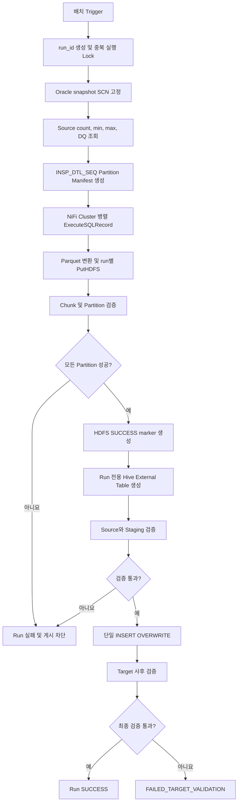

# Sqoop Removal for NiFi

## 프로젝트 개요

기존 NiFi 1.x Flow에서 Kylo `ImportSqoop` Processor로 수행하던 Oracle 데이터 적재를 제거하고, NiFi 2.6.0 기반 Cloudera Flow Management 4.12.0의 표준 Processor만으로 대체하기 위한 설계 프로젝트이다.

AS-IS 처리는 다음 순서로 동작한다.

```text
Oracle
  → Sqoop 병렬 Import
  → HDFS 적재
  → HDFS 경로 기반 Hive External 임시 테이블
  → 원본 테이블 INSERT OVERWRITE
  → 원천/대상 건수 검증
```

TO-BE에서는 Sqoop Mapper가 담당하던 분할 조회, 병렬 실행, 실패 전파 및 전체 작업 완료 판정을 NiFi Flow와 영속 관리 테이블로 구현한다.

## 설계 목표

- Oracle 데이터를 `INSP_DTL_SEQ` 범위로 나누어 병렬 추출한다.
- 모든 병렬 파티션이 성공한 경우에만 Hive `INSERT OVERWRITE`를 실행한다.
- 한 파티션이라도 실패하면 실행 전체를 실패 처리하고 게시를 차단한다.
- NiFi 재시도, 재기동 및 노드 장애에도 중복 완료나 부분 게시가 발생하지 않게 한다.
- 원천, HDFS 파일, Hive staging 및 최종 테이블을 단계별로 검증한다.
- 실패 실행과 성공 실행의 HDFS 경로 및 상태를 완전히 격리한다.
- 실행과 파티션 단위의 감사 이력 및 구조화 로그를 남긴다.

## 핵심 개념

### 실행 식별자와 격리

각 실행에 불변의 `run_id`를 발급한다. 모든 FlowFile, 관리 테이블, 로그와 HDFS 경로에서 동일한 값을 사용한다.

```text
/data/nifi/stage/<job_key>/run_id=<run_id>/part=<partition_id>/part-xxxx.parquet
```

실패한 실행의 파일이 다음 실행이나 최종 테이블에 섞이지 않으며, 재실행은 기존 실행을 수정하지 않고 새 `run_id`로 시작한다.

### 동일 시점 Oracle Snapshot

병렬 JDBC Connection이 서로 다른 시점의 데이터를 읽는 것을 방지하기 위해 작업 시작 시 Oracle SCN을 고정한다. 경계 조회, source count, 데이터 추출은 모두 동일한 `AS OF SCN`을 사용한다.

Flashback Query를 사용할 수 없다면 Oracle snapshot/staging table, 불변 업무 마감 조건 또는 변경이 없는 배치 시간대를 사용해야 한다. 단순한 추출 전후 건수 비교만으로는 동일 시점 정합성을 보장할 수 없다.

### 범위 파티셔닝

`INSP_DTL_SEQ`를 하한 포함·상한 미포함 범위로 분할한다. 마지막 파티션만 최댓값을 포함한다.

```text
partition 0   : seq >= b0   AND seq < b1
partition 1   : seq >= b1   AND seq < b2
...
partition N-1 : seq >= bN-1 AND seq <= max_seq
```

NULL 값은 사전 검증에서 실패시키거나 `IS NULL` 전용 파티션으로 분리한다. 값 분포가 불균등하면 단순 MIN/MAX 범위 대신 통계 또는 분위수 기반 경계를 사용한다.

### 영속 Manifest

NiFi Queue나 `Wait/Notify` cache만으로 작업 완료 여부를 판정하지 않는다. 관리 DB의 Run, Partition, File Manifest가 상태의 최종 원장이다.

```text
NIFI_LOAD_RUN
NIFI_LOAD_PARTITION
NIFI_LOAD_FILE
NIFI_LOAD_VALIDATION
NIFI_LOAD_EVENT
```

`Wait/Notify`는 완료 확인을 빠르게 깨우는 용도로 사용한다. 게시 직전에는 반드시 Manifest를 다시 조회해 다음 조건을 확인한다.

```text
모든 파티션 상태 = SUCCESS
실패/대기/실행 중 파티션 = 0
파티션 실제 건수 합계 = Oracle source count
```

### CAS 기반 중복 방지

파티션 Worker와 게시 Flow는 고유 token을 사용한 compare-and-set 방식으로 소유권을 획득한다.

```sql
UPDATE NIFI_LOAD_RUN
   SET status = 'PUBLISHING', publish_token = ?
 WHERE run_id = ?
   AND status = 'STAGING_VALIDATED';
```

갱신 후 token을 다시 조회하여 소유권을 확인한 하나의 FlowFile만 `INSERT OVERWRITE`를 수행한다.

## 전체 처리 흐름



## NiFi Process Group 구성

| Process Group | 역할 | 실행 위치 |
|---|---|---|
| `PG-00 Trigger` | 스케줄 및 업무키 생성 | Primary Node |
| `PG-10 Run Coordinator` | 실행 Lock, SCN, source metrics, manifest 생성 | Primary Node |
| `PG-20 Oracle Extract Workers` | Oracle 병렬 조회, Parquet 변환, HDFS 기록 | All Nodes |
| `PG-30 Partition and Run Gate` | chunk·partition·run 완료 판정 | Primary Node 중심 |
| `PG-40 Staging Validation` | External table 생성 및 staging 검증 | Primary Node |
| `PG-50 Publish` | 게시 소유권 획득 및 `INSERT OVERWRITE` | Primary Node |
| `PG-60 Target Validation` | 최종 테이블 사후 검증 | Primary Node |
| `PG-70 Recovery Monitor` | stale run/partition 복구 | Primary Node |
| `PG-90 Audit and Error` | 감사 이벤트, 오류 로그 및 알림 | All Nodes |

Worker 입력 Connection만 Round Robin Load Balance를 적용한다. 실제 Oracle 동시 세션 수는 다음 식으로 제한한다.

```text
NiFi 노드 수 × 노드별 ExecuteSQLRecord Concurrent Tasks
+ 제어 및 검증용 JDBC 세션
```

기존 Sqoop Mapper 수를 NiFi 노드마다 그대로 설정하면 원천 DB 부하가 노드 수만큼 증가할 수 있다.

## 데이터 검증

건수 일치만으로는 같은 수의 누락과 중복이 상쇄되는 오류를 찾을 수 없다. 다음 검증을 단계별로 수행한다.

1. Oracle source count와 SCN
2. 파티션별 expected/actual row count
3. HDFS chunk 수와 `record.count` 합계
4. Hive staging count와 schema
5. PK NULL 및 중복 건수
6. split 컬럼 MIN/MAX와 NULL 건수
7. 주요 금액·수량 합계 및 코드별 건수
8. 최종 target count와 업무 품질 지표

다음 등식과 품질 규칙이 모두 만족된 경우에만 성공이다.

```text
source count
  = SUM(partition actual count)
  = staging count
  = target count
```

원천이 0건이면 기존 데이터가 비워질 수 있으므로 기본 정책은 `ALLOW.EMPTY.SOURCE=false`이다.

## 실패와 재처리 원칙

- Oracle/HDFS 일시 오류는 해당 파티션만 제한적으로 재시도한다.
- `ORA-01555`, SQL 문법, 권한, schema 오류는 반복 재시도하지 않는다.
- 동일 실행의 일부 파티션만 새 SCN으로 다시 읽지 않는다.
- PutHDFS는 run 전용 경로와 결정적 파일명으로 멱등 재시도한다.
- Staging 검증 전에는 `INSERT OVERWRITE`를 실행하지 않는다.
- Hive 게시 결과가 불명확한 timeout은 `PUBLISH_UNKNOWN`으로 기록하고 자동 재실행하지 않는다.
- Target 사후 검증 실패는 중대 오류로 처리하며 자동 overwrite를 반복하지 않는다.
- NiFi 재기동 시 cache가 아니라 관리 DB Manifest를 기준으로 복구한다.

## 로그와 추적성

모든 주요 이벤트에는 다음 상관키를 기록한다.

```text
run_id, job_key, business_key, partition_id, chunk_index,
processor_name, node_id, attempt_no, row_count, duration_ms,
error_class, error_code, message
```

업무 상태와 검증 결과는 관리 테이블에 동기적으로 기록하고, 운영 관측 로그는 JSON 형식의 `LogMessage`와 `NIFI_LOAD_EVENT`에 저장한다. SQL 원문, 자격증명 및 원천 행 데이터는 로그에 남기지 않는다.

## 문서 구성

1. [Sqoop 병렬 처리 및 전환 사전 분석](./sqoop.md)
   - 기존 Sqoop Mapper, split-by, 성능과 정합성 특성
2. [CFM 4.12.0 기반 Sqoop 제거 상세 설계](./nifi-sqoop-removal-design.md)
   - 목표 아키텍처, 관리 모델, 검증, 실패 및 복구 정책
3. [Processor 단위 NiFi Flow 구현 명세](./nifi-flow-implementation.md)
   - Processor별 연결, Property, Parameter Context, SQL, Mermaid Flow, 로그 및 운영 설정

## 구현 전 확인 항목

- Oracle 버전, Flashback 권한과 UNDO 보존시간
- 원천 DDL과 `INSP_DTL_SEQ` 타입, NULL 여부, 인덱스 및 분포
- 현재 Sqoop query, mapper 수, 파일 형식과 추출 조건
- 전체/일 최대 건수, 평균 행 크기와 목표 처리시간
- NiFi 노드 수와 Oracle 허용 동시 세션 수
- Hive target의 external/managed/ACID/Iceberg 및 partition 구조
- 전체 테이블 또는 특정 partition overwrite 여부
- 원천 0건 처리 정책
- 필수 업무 검증 지표와 허용 오차
- Kerberos, Ranger, HDFS 경로와 서비스 계정 권한

## 참고 자료

- [Cloudera CFM 4.12.0 지원 Processor](https://docs.cloudera.com/cfm/4.12.0/release-notes/topics/cfm-supported-processors.html)
- [Apache NiFi ExecuteSQLRecord](https://nifi.apache.org/components/org.apache.nifi.processors.standard.ExecuteSQLRecord/)
- [Apache NiFi Wait](https://nifi.apache.org/components/org.apache.nifi.processors.standard.Wait/)
- [Apache NiFi Notify](https://nifi.apache.org/components/org.apache.nifi.processors.standard.Notify/)
- [Oracle Flashback Query와 Read Consistency](https://docs.oracle.com/cd/B28359_01/server.111/b28318/consist.htm)
