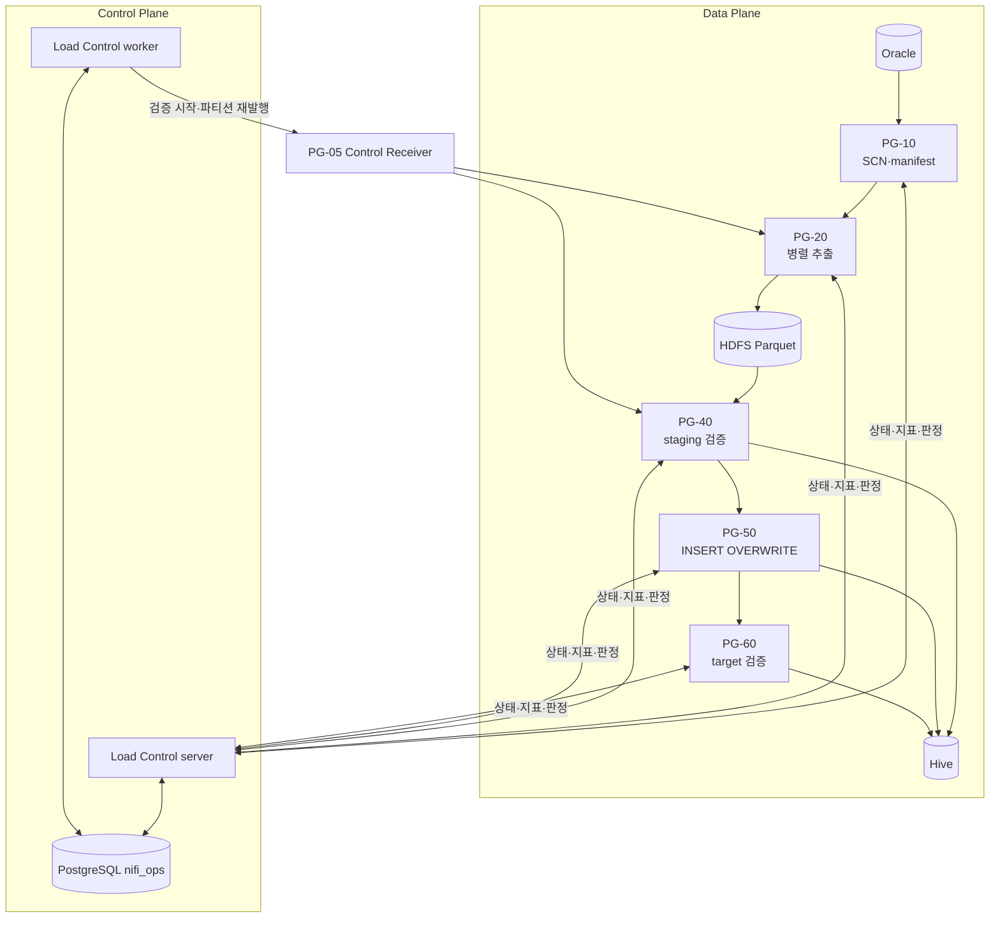
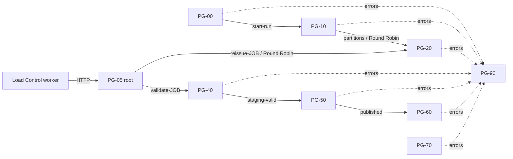
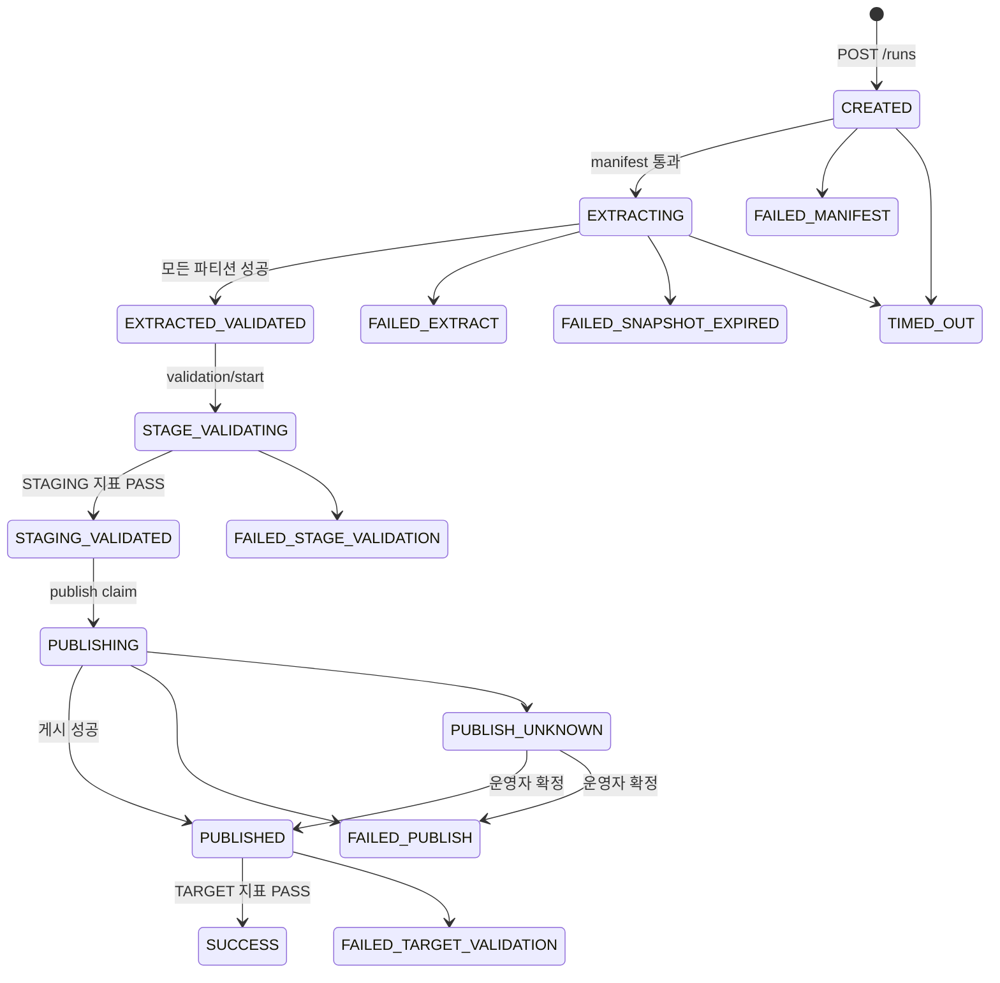
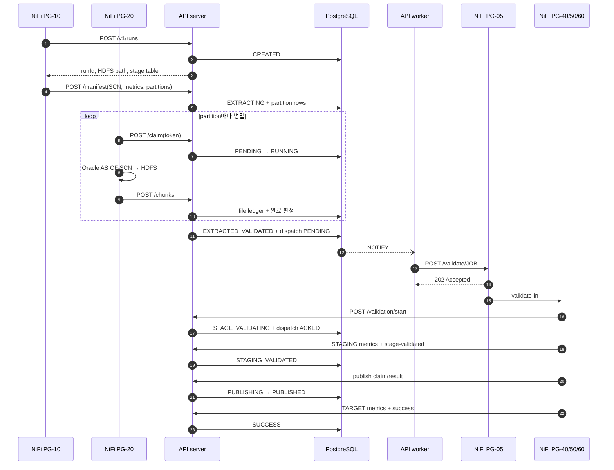

# 아키텍처와 전환 설계

## 1. Sqoop에서 무엇을 대체하는가

Sqoop은 split column의 범위를 나누고 여러 Mapper가 각 범위를 JDBC로 읽어 HDFS에 씁니다. 이 프로젝트는
그 기능을 다음처럼 분리합니다.

| 기존 역할 | 대체 구성 |
|---|---|
| split 범위 계산 | PG-10이 같은 SCN에서 경계와 예상 건수를 계산 |
| Mapper 병렬 실행 | PG-20이 NiFi 클러스터 노드에 Round Robin으로 분산 |
| Job 전체 완료 판정 | API가 모든 파티션 상태와 chunk 건수를 집계 |
| Mapper 실패 집계 | PG-90이 API에 실패 보고, API가 run을 실패 상태로 전이 |
| HDFS 파일 생성 | PG-20이 Parquet chunk를 run 전용 경로에 기록 |
| 후속 Hive 처리 | PG-40·50·60이 검증·게시·재검증 |
| 임시 산출물 정리 | PG-70이 API가 선정한 대상만 삭제 |

NiFi Processor의 병렬 실행만으로는 모든 파티션의 성공과 후속 단계 1회 실행을 원자적으로 판정하기
어렵습니다. 그래서 완료 판정을 PostgreSQL 트랜잭션과 CAS를 사용하는 API로 분리합니다.

## 2. 데이터 plane과 control plane



`server`는 HTTP 요청을 받아 트랜잭션 안에서 판정하고, `worker`는 요청 없이 계속 실행되며 다음을 맡습니다.

- dispatcher: outbox의 NiFi 호출을 PG-05로 전달합니다.
- sweeper: stale 파티션, run timeout, ACK timeout, 검증 정체, 게시 결과 불명을 찾습니다.

두 프로세스는 직접 통신하지 않고 PostgreSQL만 공유합니다.

## 3. Canvas 구조

```text
NiFi root
├── PG-05 Control Receiver                # 모든 Job 공통, 공통 Parameter Context
└── JOB_<JOB.KEY>                       # Job별 Parameter Context와 Controller Service
    ├── PG-00 Trigger
    ├── PG-10 Run Coordinator
    ├── PG-20 Extract Worker
    ├── PG-40 Staging Validation
    ├── PG-50 Publish
    ├── PG-60 Target Validation
    ├── PG-70 Cleanup
    └── PG-90 Error and Event
```

> [!IMPORTANT]
> 위 `JOB_<JOB.KEY>` 구조는 원천 테이블마다 하나씩 생성합니다. 예를 들어 Oracle 테이블 6개면 Job PG 6개,
> Job별 자식 PG 8개로 총 48개의 자식 PG가 생기며, PG-05만 하나를 공유합니다. 빌더는 설정을 템플릿처럼
> 사용해 생성 작업을 자동화하지만, 생성된 Processor를 여러 Job이 공유하지는 않습니다.



Trigger 00과 Cleanup 70만 Primary Node에서 실행합니다. 다른 Processor는 All Nodes입니다. PG-20의 실질적인
최대 병렬도는 `NiFi 노드 수 × 34_Execute_Partition_Query Concurrent Tasks`이며 Oracle 연결 풀과
승인 세션 수보다 크면 안 됩니다.

6개 Job을 동시에 실행하면 이 병렬도와 Oracle 연결 풀이 Job별로 존재합니다. 전체 Oracle 최대 부하는
`동시 실행 Job 수 × NiFi 노드 수 × Job별 PG-20 Concurrent Tasks`를 기준으로 계산하고, PG-10의 SCN·manifest
조회 연결도 여유분에 포함합니다.

## 4. 식별자와 산출물 격리

| 식별자 | 의미 | 예 |
|---|---|---|
| `job_key` | 적재 정의의 고정 식별자 | `ORACLE_INSP_DTL_DAILY` |
| `business_key` | 한 run이 처리하는 업무 범위 | `2026-09-28` |
| `run_id` | API가 발급하는 실행 UUID | `ca803dd4-...` |
| `snapshot_scn` | run 전체가 읽는 Oracle 시점 | `2388556` |
| `partition_id` | run 안의 범위 파티션 | `0000` |
| `chunk_index` | 파티션 결과 파일 순번 | `0` |

```text
<HDFS.STAGE.ROOT>/<JOB.KEY>/run_id=<run_id>/part-<partition_id>-<chunk 6자리>.parquet
<HDFS.STAGE.ROOT>/<JOB.KEY>/run_id=<run_id>/_SUCCESS
<HIVE.STAGE.DB>.<HIVE.STAGE.TABLE.PREFIX><run_id에서 하이픈 제거>
```

재실행은 실패한 run을 고치지 않고 새 run ID와 새 SCN으로 전체를 다시 실행합니다.

## 5. 동일 시점 읽기와 파티션

PG-10이 run 시작 시 SCN을 한 번 조회합니다. 원천 지표, 파티션별 예상 건수, PG-20의 실제 데이터 조회가
모두 `AS OF SCN <snapshot_scn>`을 사용합니다.

SCN의 개념, Oracle Undo가 과거 block을 재구성하는 방식, snapshot 오류와 6개 테이블 간 동일 시점의
보장 경계는 [Oracle SCN 상세 기술](./07-oracle-scn.md)을 참고합니다.

```sql
WHERE split_column >= lower_bound
  AND split_column <  upper_bound  -- 마지막 파티션만 <=
```

현재 빌더는 split column의 NULL 전용 파티션을 만들지 않습니다. 업무 범위 안에 NULL이 있으면 manifest의
`sourceNullSplitCount`가 0보다 크지만 NULL 파티션이 없어 API가 manifest를 거부합니다. 따라서 split column은
NOT NULL이거나 업무 조건 안에서 NULL이 없어야 합니다.

예상 건수가 0인 파티션은 API가 등록 시점에 `SUCCESS`로 처리하고 PG-20에 보내지 않습니다.

## 6. run 상태 모델



같은 `job_key + business_key`에는 활성 run이 하나만 존재할 수 있습니다. `PUBLISH_UNKNOWN`도 운영자가
확정하기 전까지 활성 run입니다.

## 7. 중복과 장애를 막는 장치

| 위험 | 장치 |
|---|---|
| 같은 업무일자의 중복 Trigger | 활성 run partial unique index |
| 같은 파티션을 두 worker가 처리 | claim token과 상태 CAS |
| 마지막 파티션 동시 완료 | run 행 `FOR UPDATE`와 완료 CAS |
| 검증 호출 유실 | transactional outbox, retry, ACK timeout |
| 검증 중복 실행 | `/validation/start` CAS, 첫 요청만 `started=true` |
| 게시 중복 실행 | publish token, 첫 요청만 `claimed=true` |
| 게시 성공 여부 불명 | `PUBLISH_UNKNOWN`, 운영자 확인 전 자동 재실행 금지 |
| 오래 멈춘 실행 | worker sweeper |
| 잘못된 HDFS 대량 삭제 | PG-70의 정확한 경로·table prefix 검사 |

## 8. 정상 실행 시퀀스



## 9. 설계 시 반드시 결정할 항목

- AS-IS Sqoop의 `--split-by`, mapper 수, boundary/query 조건
- 업무 키와 target 교체 범위
- split column 분포, NULL, 인덱스
- Oracle undo 보존 시간과 최대 세션 수
- 날짜·timestamp 시간대와 decimal 정밀도
- 원천/staging/target 검증 지표와 허용 오차
- 성공/실패 산출물 보존 기간
- API 및 PG-05의 이중화와 방화벽 경로
- `FAIL` 또는 `REISSUE` 복구 정책

다음 단계는 [설정 레퍼런스](./02-configuration.md)에서 각 결정을 실제 값으로 옮기는 것입니다.
