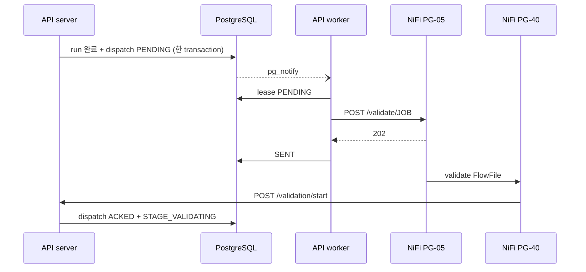
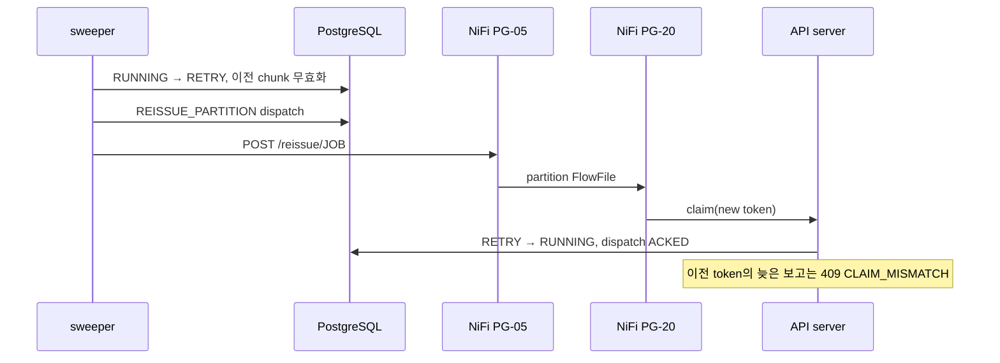

# Load Control API 상호작용

## 1. API의 책임

Load Control API는 데이터를 이동하지 않는다. PostgreSQL 원장에 다음을 기록하고 판정한다.

- run과 partition 상태
- claim/publish token 소유권
- chunk 파일 원장과 건수
- SOURCE/STAGING/TARGET 지표
- NiFi 후속 호출 outbox
- 상태 변화와 운영 이벤트
- timeout, stale, ACK 유실 복구

## 2. 프로세스와 데이터베이스

| 구성 | 책임 |
|---|---|
| API server | HTTP 요청, 인증, 입력 검증, 트랜잭션, 상태 판정 |
| API worker dispatcher | `load_dispatch`를 PG-05에 최소 1회 전달 |
| API worker sweeper | 정체와 timeout을 주기적으로 복구 |
| PostgreSQL | durable ledger, CAS, lock, outbox, event |

server와 worker를 여러 개 실행해도 DB의 lock, lease, advisory lock으로 경합을 제어한다.

## 3. 인증과 공통 규칙

- Base path: `/v1`
- Content-Type: `application/json`
- 인증: `Authorization: Bearer <token>`
- role: `nifi`, `operator`
- JSON field: camelCase
- 알 수 없는 JSON field: 422
- SCN과 큰 경계값: 정밀도 보존을 위해 문자열
- `X-Request-Id`: NiFi가 보내거나 API가 생성, 응답에도 반환
- `X-Run-Id`: NiFi가 전달하는 로그 상관관계 키

| 범위 | 허용 role |
|---|---|
| run/partition/validation/publish 상태 변경 | `nifi` |
| run 조회, monitor, validation/event 조회 | `nifi`, `operator` |
| cleanup 후보/완료 기록 | `nifi`, `operator` |
| dispatch resend, publish unknown resolve | `operator` |
| health/ready/metrics | 인증 없음; 내부망 제한 필요 |

## 4. 엔드포인트 맵

| 단계 | Method/Path | 호출자 | 핵심 결과 |
|---|---|---|---|
| run | `POST /v1/runs` | PG-10 | `CREATED`, run 경로와 stage table |
| manifest | `POST /v1/runs/{id}/manifest` | PG-10 | `EXTRACTING`, worker 대상 partition |
| run 실패 | `POST /v1/runs/{id}/fail` | PG-90 | 허용된 실패 상태 |
| partition claim | `POST /v1/runs/{id}/partitions/{pid}/claim` | PG-20 | `RUNNING`, 소유권 결과 |
| chunk | `POST .../partitions/{pid}/chunks` | PG-20 | file ledger, partition/run 완료 판정 |
| partition 실패 | `POST .../partitions/{pid}/fail` | PG-90 | partition/run 실패 |
| 검증 시작 | `POST /v1/runs/{id}/validation/start` | PG-40 | dispatch ACK, `STAGE_VALIDATING` |
| 지표 저장 | `POST /v1/runs/{id}/validations` | PG-40/60 | STAGING/TARGET 지표 UPSERT |
| staging 판정 | `POST /v1/runs/{id}/stage-validated` | PG-40 | `STAGING_VALIDATED` |
| publish claim | `POST /v1/runs/{id}/publish/claim` | PG-50 | `PUBLISHING`, 소유권 결과 |
| publish 결과 | `POST /v1/runs/{id}/publish/result` | PG-50 | `PUBLISHED`/실패/불명 |
| 최종 성공 | `POST /v1/runs/{id}/success` | PG-60 | `SUCCESS` |
| cleanup 후보 | `GET /v1/cleanup/candidates` | PG-70 | 삭제 허용 run 목록 |
| cleanup 기록 | `POST /v1/runs/{id}/cleanup` | PG-70/운영자 | `cleaned_at` |
| run 조회 | `GET /v1/runs`, `/v1/runs/{id}` | 운영 | 상태, partition, dispatch |
| monitor | `GET /v1/monitor/summary` | TUI | 집계와 경보 |
| 상세 조회 | `GET /v1/runs/{id}/validations`, `/events` | TUI/운영 | 지표와 timeline |
| dispatch 재전송 | `POST /v1/runs/{id}/dispatches/{did}/resend` | 운영자 | `PENDING` |
| 게시 결과 확정 | `POST /v1/runs/{id}/publish-unknown/resolve` | 운영자 | 게시 성공/실패 확정 |

실제 OpenAPI는 실행 중인 API의 `/docs`, `/openapi.json`에서 확인한다.

## 5. run과 manifest

### 5.1 run 생성

```http
POST /v1/runs
Authorization: Bearer <nifi-token>
Content-Type: application/json
```

```json
{
  "jobKey": "ORACLE_INSP_DTL_DAILY",
  "businessKey": "2026-09-28",
  "hdfsRoot": "/data/nifi/stage",
  "stageTablePrefix": "TMP_INSP_DTL_",
  "allowEmptySource": false
}
```

```json
{
  "runId": "ca803dd4-...",
  "status": "CREATED",
  "hdfsRunPath": "/data/nifi/stage/ORACLE_INSP_DTL_DAILY/run_id=ca803dd4-...",
  "stageTable": "tmp_insp_dtl_ca803dd4..."
}
```

같은 Job/business key의 활성 run이 있으면 409 `DUPLICATE_ACTIVE_RUN`이다.

### 5.2 manifest 등록

```json
{
  "snapshotScn": "2388556",
  "sourceCount": 105000,
  "sourceNullSplitCount": 0,
  "sourceMinSplit": "1",
  "sourceMaxSplit": "120000",
  "plannedPartitionCount": 8,
  "sourceMetricsVersion": "v1",
  "sourceMetrics": {
    "AMOUNT_SUM": "71853075",
    "MIN_TS": "2026-09-28 00:00:01",
    "MAX_TS": "2026-09-29 09:20:00"
  },
  "partitions": [
    {
      "partitionId": "0000",
      "lowerBound": "1",
      "upperBound": "15001",
      "upperInclusive": false,
      "isNullPartition": false,
      "expectedRowCount": 15000
    }
  ]
}
```

응답의 `dispatchPartitions`에는 예상 0건 partition이 빠진다. 같은 manifest 재요청은 기존 partition 목록을
반환하지만 검증 예약을 다시 만들지 않는다.

manifest 위반은 상태를 `FAILED_MANIFEST`로 commit한 뒤 422 `MANIFEST_INVALID`를 반환한다. 단순 예외로
rollback하지 않는 이유는 실패 원인을 원장에 남기기 위해서다.

## 6. partition claim과 chunk 보고

### 6.1 claim

```json
{
  "claimToken": "a-worker-generated-uuid",
  "workerNode": "nifi-01"
}
```

```json
{
  "claimed": true,
  "runStatus": "EXTRACTING",
  "partitionStatus": "RUNNING",
  "attempt": 1
}
```

`claimed=false`는 오류가 아니라 정상 경합이다. NiFi는 Oracle query를 실행하지 않고 FlowFile을 종료한다.

### 6.2 chunk 보고

```json
{
  "claimToken": "a-worker-generated-uuid",
  "chunkIndex": 2,
  "chunkCount": 3,
  "fragmentIdentifier": "nifi-fragment-uuid",
  "hdfsPath": "/data/nifi/stage/JOB/run_id=.../part-0000-000002.parquet",
  "recordCount": 5000,
  "byteCount": 183552
}
```

```json
{
  "recorded": true,
  "partitionStatus": "SUCCESS",
  "runStatus": "EXTRACTED_VALIDATED",
  "receivedChunks": 3,
  "chunkCount": 3,
  "validationScheduled": true
}
```

API는 다음을 검증한다.

- claim token이 현재 소유자와 같은가
- `chunkIndex < chunkCount`인가
- HDFS path가 run 경로 바로 아래인가, `..`가 없는가
- 성공 partition에 다른 내용이 다시 오지 않았는가
- 모든 chunk index가 연속이고 같은 chunkCount를 보고했는가
- row count 합계가 partition 예상값과 같은가
- 모든 partition 합계가 source count와 같은가

마지막 판정과 `VALIDATE_RUN` dispatch INSERT는 같은 트랜잭션이다.

## 7. outbox와 PG-05 ACK



| dispatch 상태 | 의미 |
|---|---|
| `PENDING` | 전송 대기 또는 backoff 중 |
| `SENT` | PG-05가 2xx로 수신했지만 실제 처리 시작은 미확인 |
| `ACKED` | validation/start 또는 reissue claim이 도착 |
| `DEAD` | 영구 오류/최대 시도 초과, 운영자 조치 필요 |

dispatcher는 `FOR UPDATE SKIP LOCKED`로 짧게 lease하고 transaction을 닫은 뒤 HTTP를 호출한다. 전송 중
worker가 종료되면 lease 만료 후 다시 가져간다. 전달 보장은 최소 1회이므로 수신 측 CAS가 중복을 제거한다.

## 8. validation과 publish

### 8.1 validation start

```json
{"dispatchId":"<dispatch-uuid>","node":"nifi-01"}
```

첫 호출만 `started=true`이며 다음 기대값을 반환한다.

```json
{
  "started": true,
  "runStatus": "STAGE_VALIDATING",
  "jobKey": "ORACLE_INSP_DTL_DAILY",
  "businessKey": "2026-09-28",
  "snapshotScn": "2388556",
  "hdfsRunPath": "...",
  "stageTable": "...",
  "sourceCount": 105000,
  "extractedCount": 105000,
  "sourceMetrics": {"AMOUNT_SUM":"71853075","MIN_TS":"...","MAX_TS":"..."}
}
```

### 8.2 지표 저장과 판정

```json
{
  "stage": "STAGING",
  "queryVersion": "v1",
  "metrics": [
    {
      "metricName": "STAGE_COUNT",
      "expectedValue": "105000",
      "actualValue": "105000",
      "result": "PASS"
    }
  ]
}
```

같은 `(run, stage, metricName, queryVersion)`은 UPSERT된다. `stage-validated`와 `success`는 저장된 지표를
다시 읽어 FAIL이 없고 지표가 비어 있지 않을 때만 다음 상태로 전이한다.

### 8.3 publish claim/result

claim:

```json
{"publishToken":"<uuid>"}
```

첫 token만 `claimed=true`다. 결과:

```json
{"publishToken":"<uuid>","outcome":"PUBLISHED","message":""}
```

outcome은 `PUBLISHED`, `FAILED_PUBLISH`, `PUBLISH_UNKNOWN` 중 하나다. `PUBLISH_UNKNOWN`은 종료 상태가
아니며 새 run도 막는다.

## 9. 실패 보고

### 9.1 단계 실패

```json
{
  "expectedStatus": "STAGE_VALIDATING",
  "failStatus": "FAILED_STAGE_VALIDATION",
  "errorStage": "STAGE_VALIDATION",
  "errorCode": "STAGE_VALIDATION_FAILED",
  "message": "..."
}
```

허용된 `(expectedStatus, failStatus)` 조합만 받는다. 잘못된 전이는 422
`FAIL_TRANSITION_NOT_ALLOWED`다.

### 9.2 partition 실패

```json
{
  "claimToken": "<uuid>",
  "errorStage": "EXTRACT",
  "errorClass": "NON_RETRYABLE",
  "errorCode": "ORA-01555",
  "message": "snapshot too old"
}
```

`ORA-01555`, `ORA-08180` 또는 `errorClass=SNAPSHOT`이면 run은 `FAILED_SNAPSHOT_EXPIRED`, 나머지는
`FAILED_EXTRACT`다.

## 10. HTTP 상태와 호출자 동작

| HTTP | 예 | NiFi/worker 동작 |
|---|---|---|
| 200 | 처리/멱등 재요청 | 응답 boolean/status로 분기 |
| 202 | PG-05 수신 | worker가 `SENT` 기록, ACK 대기 |
| 400 | PG-05 header/body 오류 | worker 재시도 후 DEAD 가능 |
| 401/403 | token 없음/role 불일치 | 설정 수정, 자동 성공 처리 금지 |
| 404 | run/partition/route 없음 | 재시도하지 않음, 오류 이벤트 |
| 409 | 중복 활성 run, token/status 경합 | 재시도하지 않음, 대개 WARN |
| 422 | 입력/manifest/전이 위반 | 설정 또는 Flow 수정 |
| 5xx | DB/API 일시 장애 | backoff 재시도 |

409가 모두 무해한 것은 아니다. `DUPLICATE_ACTIVE_RUN`, 늦은 `CLAIM_MISMATCH`는 정상 경합일 수 있지만
`CHUNK_CONFLICT`는 이미 성공한 파일 보고가 달라졌다는 뜻이므로 조사해야 한다.

## 11. sweeper 상호작용

| 대상 | 조건 | 자동 조치 |
|---|---|---|
| RUNNING partition | heartbeat > `recovery.stale` | FAIL이면 run timeout, REISSUE면 재발행 |
| CREATED/EXTRACTING run | 시작 > `run_timeout` | run/미완료 partition `TIMED_OUT` |
| SENT dispatch | ACK > `ack_timeout` | `PENDING` 재전송 또는 `DEAD` |
| STAGE_VALIDATING/PUBLISHED | 변화 > `validation_stale` | 오류 이벤트만, 상태 유지 |
| PUBLISHING | 게시 > `publish_stale` | `PUBLISH_UNKNOWN` |

REISSUE 흐름:



## 12. 운영자 API

### 12.1 dispatch 재전송

PG-05 route/port/Job PG를 먼저 복구한 뒤 실행한다.

```bash
curl -X POST \
  -H 'Authorization: Bearer <operator-token>' \
  <API>/v1/runs/<run_id>/dispatches/<dispatch_id>/resend
```

`DEAD` 또는 ACK 없는 `SENT`를 `PENDING`으로 돌리고 attempt count를 초기화한다.

### 12.2 `PUBLISH_UNKNOWN` 확정

Hive query history와 target 데이터를 확인한 증거를 먼저 확보한다.

```bash
curl -X POST \
  -H 'Authorization: Bearer <operator-token>' \
  -H 'Content-Type: application/json' \
  -d '{"resolution":"FAILED_PUBLISH","reason":"컴파일 단계 실패, target 변경 없음 확인"}' \
  <API>/v1/runs/<run_id>/publish-unknown/resolve
```

실제로 게시가 완료되었으면 `PUBLISHED`로 확정한다. 이 경우 PG-60이 자동 재개되지 않으므로 target 지표를
직접 검증하고 필요한 후속 조치를 운영 절차에 따라 수행한다.

## 13. DB 원장과 추적

| table | 내용 |
|---|---|
| `load_run` | 상태, SCN, 건수, 경로, publish, cleanup |
| `load_partition` | 경계, 예상/실제 건수, claim, attempt |
| `load_file` | chunk ledger |
| `load_validation` | SOURCE/STAGING/TARGET 지표 |
| `load_dispatch` | NiFi 호출 outbox |
| `load_event` | API 상태 이벤트와 PG-90 오류 이벤트 |

한 장애를 추적할 때 다음 키를 사용한다.

1. `run_id`
2. 필요하면 `partition_id`, `dispatch_id`
3. 한 HTTP 요청은 `requestId`
4. API `server.log`, `worker.log`
5. NiFi provenance와 `nifi-app.log`
