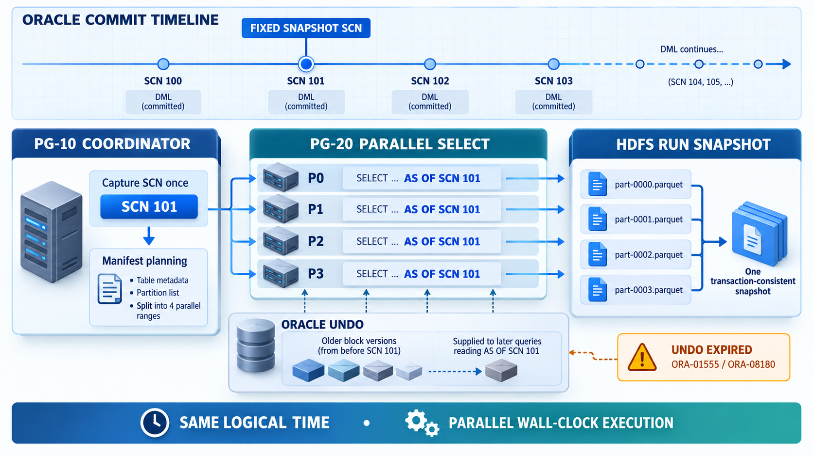
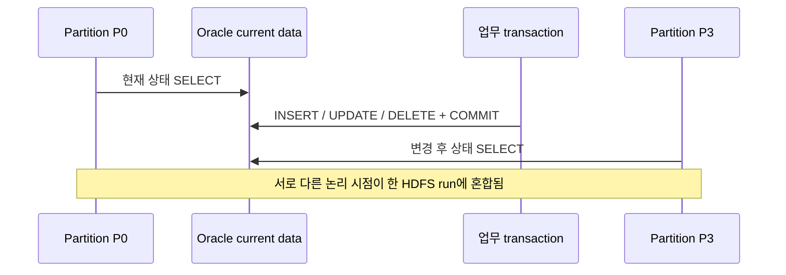
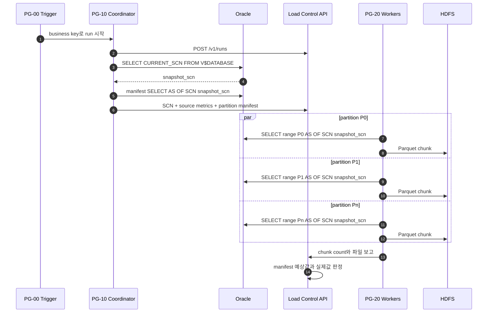

# Oracle SCN 기반 병렬 추출 일관성

이 장은 제안서와 기술 검토에서 사용할 수 있도록 Oracle SCN(System Change Number)을 이용한 병렬 추출의
목적, 구현 방식, 보장 범위와 운영 조건을 설명한다.



## 1. 제안 요약

NiFi는 파티션을 병렬로 조회하므로 각 SELECT의 실제 시작·종료 시각이 다르다. 아무 조치 없이 현재 데이터를
읽으면 먼저 시작한 파티션과 나중에 시작한 파티션 사이에 발생한 INSERT·UPDATE·DELETE가 결과에 섞일 수
있다. 이 프로젝트는 run 시작 시 Oracle SCN을 한 번 고정하고 manifest와 모든 파티션 SELECT에 같은
`AS OF SCN`을 적용한다.

```text
하나의 논리적 DB 시점(SCN) + 여러 개의 실제 병렬 실행 시각
                    ↓
run 단위 transaction-consistent HDFS snapshot
```

핵심 효과는 다음과 같다.

- 각 파티션이 서로 다른 NiFi 노드와 시각에 실행되어도 동일한 committed snapshot을 읽는다.
- manifest의 원천 건수·경계·예상 건수와 실제 추출 데이터의 기준 시점이 같다.
- 추출 중 Oracle 업무 트랜잭션을 잠그거나 중지하지 않는다.
- 완료 후 HDFS run 경로는 한 논리 시점의 데이터로 구성된다.

## 2. SCN이란 무엇인가

SCN은 Oracle 데이터베이스 내부 변경 순서를 나타내는 논리적 버전 번호다. transaction commit과 데이터베이스
변화를 순서화하며, Flashback Query는 SCN을 지정해 그 시점에 committed 상태였던 데이터를 반환한다.
Oracle 공식 문서도 `AS OF` Flashback Query가 과거 SCN 또는 timestamp 시점의 committed 데이터를
조회한다고 설명한다.

| 개념 | 의미 |
|---|---|
| SCN | 데이터베이스 변경 순서를 나타내는 논리적 버전 |
| wall-clock time | 사람이 읽는 날짜·시각. SCN과 같은 값이 아님 |
| `CURRENT_SCN` | 조회 시점의 현재 데이터베이스 SCN |
| `AS OF SCN n` | SCN `n`에 committed되어 보이던 데이터 읽기 |
| Undo | 현재 block에서 SCN `n`의 과거 버전을 재구성하는 정보 |

SCN을 timestamp처럼 해석하거나 업무일자로 사용하지 않는다. `SCN_TO_TIMESTAMP`는 운영 추적에 도움이 되는
근사 시각이며, 변환 정보의 보존 기간에도 제한이 있다. 데이터 일관성의 기준값은 timestamp가 아니라 run에
저장된 원래 SCN이다.

참고: [Oracle Flashback Query](https://docs.oracle.com/en/database/oracle/oracle-database/26/adfns/flashback.html),
[DBMS_FLASHBACK](https://docs.oracle.com/en/database/oracle/oracle-database/19/arpls/DBMS_FLASHBACK.html)

## 3. SCN이 없을 때 발생하는 문제

예를 들어 P0 조회가 시작된 뒤 P3 조회 전에 원천에서 행이 변경되면 파티션마다 관찰한 상태가 달라질 수 있다.



manifest도 현재 상태로 계산하고 파티션을 나중에 현재 상태로 읽으면 다음 문제가 생길 수 있다.

- manifest의 `source_count`와 chunk 실제 건수 불일치
- split column의 min/max 또는 범위별 예상 건수 변화
- 추출 도중 이동·삭제된 행의 누락 또는 예상하지 않은 추가
- 금액 합계와 timestamp 최소·최대 같은 품질 지표 불일치

API의 건수 검증이 일부 문제를 실패로 감지할 수는 있지만, 검증 실패 후 다시 실행하는 것보다 처음부터 같은
snapshot을 읽는 것이 설계상 안전하다.

## 4. 이 프로젝트의 SCN 적용 순서



Processor와 원장 필드의 연결은 다음과 같다.

| 단계 | 구현 | SCN 역할 |
|---|---|---|
| PG-10 14 | `14_Query_Current_SCN` | run에서 사용할 현재 SCN 한 번 조회 |
| PG-10 15 | `15_Extract_SCN` | `load.snapshot.scn` attribute로 저장 |
| PG-10 16 | `16_Query_Source_Manifest` | 같은 SCN으로 전체 지표와 범위별 예상 건수 계산 |
| API manifest | `POST /runs/{id}/manifest` | `load_run.snapshot_scn NUMERIC(38,0)`에 영구 기록 |
| PG-20 34 | `34_Execute_Partition_Query` | 모든 병렬 SELECT가 같은 `load.snapshot.scn` 사용 |
| REISSUE | API worker payload | 재발행된 파티션에도 원래 run SCN을 다시 전달 |
| PG-40 이후 | validation start 응답 | 감사·추적용으로 원래 SCN 반환 |

Oracle `NUMBER(38)`과 JSON number 변환 사이의 정밀도 손실을 피하기 위해 SCN은 API 요청·응답에서 숫자
문자열로 전달하고, PostgreSQL에는 `NUMERIC(38,0)`으로 저장한다. SQL에 넣기 전에는 NiFi EL로 숫자 형식만
허용한다.

## 5. `AS OF SCN`에서 행 변경이 보이는 방식

고정 SCN이 `101`일 때 SCN 101 이후의 업무 DML은 다음처럼 처리된다.

| SCN 101 이후 변경 | `AS OF SCN 101` 결과 |
|---|---|
| 새 행 INSERT 후 COMMIT | 보이지 않음 |
| 기존 행 UPDATE 후 COMMIT | UPDATE 이전 값이 보임 |
| 기존 행 DELETE 후 COMMIT | 삭제 이전 행이 보임 |
| 아직 COMMIT되지 않은 변경 | SCN 101의 committed 상태를 기준으로 보이지 않음 |

따라서 추출 실행 중에도 Oracle 업무 DML은 계속될 수 있다. NiFi는 원천을 lock하거나 장시간 transaction을
열어 두는 대신 Oracle의 multiversion read consistency와 Undo를 사용한다.

## 6. Undo와 SCN의 관계

Oracle은 현재 block만으로 과거 SCN을 만들 수 없을 때 Undo의 이전 정보를 적용해 consistent read block을
재구성한다. 고정 SCN이 오래될수록, 원천 DML이 많을수록, 파티션 query가 오래 대기하거나 실행될수록 필요한
Undo 보존량이 늘어난다.

필요 보존 구간은 단순히 가장 긴 SELECT 실행 시간만이 아니다.

```text
SCN 획득
  → manifest 계산
  → partition queue 대기
  → 마지막 partition SELECT 완료
  + 장애·부하 여유 시간
```

운영 기준은 다음 관계를 만족해야 한다.

```text
실효 Undo 보존 시간 > SCN 획득부터 마지막 파티션 완료까지의 최악 시간 + 안전 여유
```

`UNDO_RETENTION`은 목표 보존 시간이며 tablespace 공간 압박에 따라 필요한 Undo가 먼저 재사용될 수 있다.
Retention Guarantee는 보존을 강화하지만 Undo 공간이 부족하면 업무 DML 자체가 실패할 수 있으므로 DBA가
업무 부하와 함께 결정한다. Oracle은 `ORA-01555` 발생 시 Undo retention 또는 Undo tablespace 크기를
늘리는 방향을 안내한다.

참고: [Oracle Undo 관리](https://docs.oracle.com/en/database/oracle/oracle-database/tutorial-manage-undo/index.html),
[ORA-01555 설명](https://docs.oracle.com/en/error-help/db/ora-01555/)

## 7. snapshot 오류와 복구 원칙

| 오류 | 의미 | 이 프로젝트의 처리 |
|---|---|---|
| `ORA-01555` | consistent read에 필요한 Undo가 다른 writer에 의해 덮어써짐 | `FAILED_SNAPSHOT_EXPIRED` |
| `ORA-08180` | 지정한 시점/SCN에 대한 snapshot을 찾을 수 없음 | `FAILED_SNAPSHOT_EXPIRED` |

PG-20은 snapshot 오류가 발생한 긴 query를 같은 SCN으로 자동 재시도하지 않는다. 이미 필요한 Undo가 사라진
경우 같은 SCN 재시도는 성공 가능성이 낮고 다른 파티션까지 더 오래 붙잡을 수 있기 때문이다.

복구 절차:

1. 해당 run의 게시가 시작되지 않았음을 확인한다.
2. Oracle Undo 사용량, `TUNED_UNDORETENTION`, 장기 query와 DML 급증을 확인한다.
3. Undo 크기·보존 정책 또는 NiFi 병렬도·파티션 크기를 조정한다.
4. 실패한 파티션만 새 SCN으로 이어 붙이지 않고 새 run을 시작한다.
5. 새 run은 새 SCN, 새 HDFS 경로, 새 staging table을 사용한다.

일부 파티션을 새 SCN으로 읽어 기존 파일과 합치면 하나의 HDFS run 안에 서로 다른 snapshot이 섞이므로
금지한다.

## 8. SQL 예시와 점검

### 8.1 현재 SCN 조회

```sql
SELECT TO_CHAR(CURRENT_SCN) AS SNAPSHOT_SCN
  FROM V$DATABASE;
```

`V$DATABASE` 권한을 줄 수 없으면 다음 대안을 사용한다.

```sql
SELECT TO_CHAR(DBMS_FLASHBACK.GET_SYSTEM_CHANGE_NUMBER) AS SNAPSHOT_SCN
  FROM DUAL;
```

두 방법 모두 SCN을 계속 새로 조회하는 용도가 아니라 run에서 사용할 값 하나를 획득하는 용도다.

### 8.2 manifest와 partition SELECT

```sql
-- manifest도 동일 SCN
SELECT COUNT(*) AS source_count,
       MIN(INSP_DTL_SEQ) AS min_split,
       MAX(INSP_DTL_SEQ) AS max_split
  FROM APP.INSP_DTL AS OF SCN 2388556
 WHERE BASE_DT = DATE '2026-09-28';

-- 병렬 partition 하나
SELECT INSP_DTL_SEQ, BASE_DT, ITEM_CD, AMOUNT, REG_TS, NOTE
  FROM APP.INSP_DTL AS OF SCN 2388556
 WHERE BASE_DT = DATE '2026-09-28'
   AND INSP_DTL_SEQ >= 1
   AND INSP_DTL_SEQ < 15001;
```

### 8.3 DBA 운영 점검

```sql
SELECT name, value
  FROM V$PARAMETER
 WHERE name = 'undo_retention';

SELECT begin_time, end_time, tuned_undoretention,
       maxquerylen, ssolderrcnt
  FROM V$UNDOSTAT
 ORDER BY begin_time DESC
 FETCH FIRST 24 ROWS ONLY;

SELECT tablespace_name, retention
  FROM DBA_TABLESPACES
 WHERE contents = 'UNDO';
```

| 항목 | 해석 |
|---|---|
| `undo_retention` | 설정된 최소 목표 보존 시간 |
| `tuned_undoretention` | 실제 부하와 공간을 반영해 Oracle이 계산한 보존 시간 |
| `maxquerylen` | 구간 내 가장 오래 실행된 query 시간 |
| `ssolderrcnt` | snapshot too old 발생 횟수 |
| `retention` | Undo tablespace의 `GUARANTEE`/`NOGUARANTEE` 정책 |

최장 run 시간만 보지 말고 업무 DML 피크 시간대의 `tuned_undoretention`, Undo 사용량, `ssolderrcnt`를 함께
관찰한다.

## 9. 보장 범위와 비보장 범위

| 구분 | 보장 여부 |
|---|---|
| 한 run 안 모든 manifest/partition의 동일 Oracle snapshot | 보장 |
| 추출 중 원천 DML 차단 | 차단하지 않음 |
| HDFS run 경로가 한 SCN 기준으로 구성됨 | 모든 partition 성공 시 보장 |
| Undo가 부족한 상태에서 과거 snapshot 재구성 | 보장하지 않음; run 실패 |
| 실패 partition만 새 SCN으로 교체 | 허용하지 않음 |
| SCN을 이용한 증분 CDC | 제공하지 않음 |
| 서로 다른 Job 6개의 동일 SCN | 현재 보장하지 않음 |

### 9.1 6개 테이블의 SCN 경계

현재는 원천 테이블마다 독립 Job PG가 있고 각 PG-10이 자체적으로 `CURRENT_SCN`을 조회한다. 따라서 각
테이블 Job 내부 파티션은 일관되지만, 여섯 테이블의 SCN은 서로 조금씩 다를 수 있다.

업무 요구사항이 “각 테이블의 일관된 snapshot”이면 현재 구조로 충분하다. 반면 PK/FK 또는 회계 마감처럼
“여섯 테이블 전체가 정확히 같은 논리 시점”이어야 한다면 다음 확장이 필요하다.

1. 상위 coordinator가 공통 SCN을 한 번 조회한다.
2. 여섯 Job run에 같은 SCN을 입력한다.
3. 각 PG-10이 자체 SCN 조회를 생략하고 전달받은 SCN을 검증한다.
4. 여섯 Job 전체 성공을 묶는 batch 단위 상태와 실패 정책을 추가한다.
5. 공통 SCN의 Undo 보존 시간은 가장 늦게 끝나는 테이블까지 계산한다.

이 기능은 현재 `build_flow_v4.py`와 Load Control API에 구현되어 있지 않으므로 별도 설계·개발·회귀 시험
범위다.

## 10. 제안서 인수 기준

- 한 run의 `load_run.snapshot_scn`이 하나만 존재한다.
- manifest와 모든 PG-20 provenance의 SQL이 같은 SCN을 사용한다.
- 추출 중 원천 DML이 발생해도 manifest 예상 건수와 chunk 합계가 일치한다.
- `source_count = extracted_count = staging_count = target_count`다.
- Undo 보존 기준이 최악 run 시간과 안전 여유를 포함한다.
- `ORA-01555`/`ORA-08180` 시험에서 게시 없이 `FAILED_SNAPSHOT_EXPIRED`로 종료된다.
- 새 run이 새 SCN과 새 HDFS 경로로 전체 재실행된다.
- 6개 테이블 간 동일 시점이 필요한지 업무 요구사항으로 명시되어 있다.
