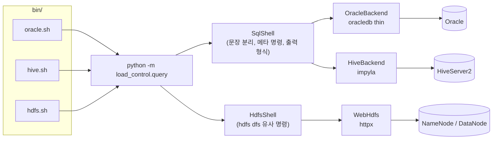

# 운영 조회 도구: bin/oracle.sh, bin/hive.sh, bin/hdfs.sh

적재 결과는 원천(Oracle), HDFS chunk, Hive staging·target 세 곳에 남는다. 이 문서는 Load Control API
설치 디렉터리의 `bin/`에 있는 세 조회 도구의 설계와 사용법을 설명한다. 세 도구는 psql처럼 대화형으로도,
`-c`·`-f`로 일괄 실행으로도 쓸 수 있다. sqlplus, beeline, hadoop 클라이언트(JVM)를 따로 설치하지 않아도
API 호스트에서 바로 실행된다.

## 1. 설계 요약

| 항목 | 결정 | 이유 |
|---|---|---|
| 구현 위치 | `load_control.query` 패키지와 `bin/*.sh` 래퍼 | 같은 `.venv`, `config.yaml`, airgap wheel 설치 절차를 그대로 쓴다 |
| Oracle | python-oracledb **thin 모드** | Oracle Instant Client가 필요 없다(Oracle 12.1 이상) |
| Hive | impyla(HiveServer2 Thrift, SASL PLAIN·NOSASL) | beeline·JVM이 필요 없다. NiFi가 쓰는 HS2에 그대로 붙는다 |
| HDFS | WebHDFS REST(httpx, 이미 있는 의존성) | NameNode HTTP 포트만 있으면 된다. HA standby는 건너뛴다 |
| 접속 정보 | `config.yaml`의 `clients` 섹션(평문, 파일 권한 600) | API와 같은 비밀 관리 원칙을 따른다. server·worker는 이 섹션을 읽지 않는다 |
| 기본 모드 | **읽기 전용** | 원천과 운영 테이블을 실수로 바꾸지 않게 한다. 쓰기는 `--write`로만 허용한다 |



| 모듈(`src/load_control/query/`) | 역할 |
|---|---|
| `__main__.py` | 하위 명령 `oracle`·`hive`·`hdfs`, 옵션, 실행 방식 선택, 종료 코드 |
| `statements.py` | `;`(Oracle PL/SQL은 `/` 줄)로 문장 나누기, 읽기 전용 판정(`write_reason`) |
| `sqlshell.py` | psql식 대화형·일괄 실행, 백슬래시 메타 명령, `SqlBackend` 인터페이스 |
| `oracle.py`, `hive.py` | DB별 연결, 실행, `\dt`·`\d`·`\dn` 구현, Ctrl-C 취소 |
| `webhdfs.py` | WebHDFS 클라이언트(HA failover, DataNode redirect, 오류 변환) |
| `hdfsshell.py` | `ls`·`du`·`count`·`find`·`cat` 등 명령, glob, 쓰기 보호 |
| `output.py` | table·vertical·csv·tsv·json 출력. table·vertical은 한글을 2칸으로 계산해 열을 맞춘다 |
| `console.py` | readline 줄 편집과 이력(`~/.lca_<도구>_history`, 권한 600) |

## 2. 설정

`config/config.yaml`에 `clients` 섹션을 추가한다. 쓰지 않는 도구는 `null`로 두거나 섹션을 생략한다.
모든 값은 환경변수로 덮어쓸 수 있다. 예를 들어 Oracle 비밀번호는 `LCA_CLIENTS__ORACLE__PASSWORD`이다.

```yaml
clients:
  oracle:
    dsn: oracle-host:1521/ORCLPDB   # NiFi ORACLE.JDBC.URL에서 jdbc:oracle:thin:@// 뒤 부분
    user: NIFI_READER               # 원천 조회 계정(읽기 전용 권한 계정 권장)
    password: CHANGE_ME
    current_schema: APP             # 스키마를 붙이지 않은 이름을 이 스키마에서 찾는다
    call_timeout: PT10M             # 문장 하나의 최대 실행 시간
  hive:
    host: hs2-host                  # NiFi HIVE.JDBC.URL과 같은 HS2
    port: 10000
    database: default
    user: nifi
    auth: NONE                      # NONE(SASL PLAIN, HS2 기본) 또는 NOSASL
    transport: binary               # binary 또는 http
    query_timeout: PT30M            # 문장마다 hive.query.timeout.seconds로 보낸다
  hdfs:
    namenode_urls: [http://nn1:9870, http://nn2:9870]   # HA면 둘 다 적는다
    user: nifi                      # simple 인증 user.name
    home: /data/nifi/stage          # 대화형 시작 디렉터리(NiFi HDFS.STAGE.ROOT)
    datanode_hosts: {}              # DataNode 이름이 이 호스트에서 풀리지 않을 때 {이름: IP}
```

전체 항목과 기본값은 `config/config.example.yaml`의 `clients` 섹션에 있다. 명령행 옵션이 설정값보다
우선한다. Oracle은 `--dsn`, `--user`, `-W`(비밀번호 입력)를 받는다. Hive는 `--host`, `--port`, `-d`,
`--user`를 받는다. HDFS는 `--url`(여러 번 가능)과 `--user`를 받는다.

## 3. 공통 사용법

| 실행 | 동작 |
|---|---|
| `bin/oracle.sh` (터미널) | 대화형. 문장이 끝나지 않았으면 프롬프트가 `=>`에서 `->`로 바뀐다 |
| `-c '문장'` (여러 번 가능) | 순서대로 실행하고 첫 오류에서 멈춘다. `;` 없는 마지막 문장도 실행한다 |
| `-f 파일` (`-f -`는 표준입력) | 파일을 실행한다. `-c`와 섞으면 입력한 순서대로 실행한다 |
| 표준입력 파이프 | `echo 'select 1 from dual' \| bin/oracle.sh` |
| `bin/hdfs.sh 명령 인자...` | HDFS 명령 하나를 실행한다(예: `bin/hdfs.sh ls -h /data`) |

| 옵션 | 설명 |
|---|---|
| `-F table\|vertical\|csv\|tsv\|json` | 출력 형식. csv·tsv·json이면 행 수 같은 안내를 표준오류로 보내서 파이프 결과가 깨끗하다 |
| `-t`, `--no-header` | 열 이름 머리글을 뺀다 |
| `--max-rows N` | SQL 문장마다 최대 출력 행 수(기본 1000, 0이면 제한 없음). 잘리면 안내를 출력한다 |
| `--timing`, `--echo`, `--null 문자열` | 실행 시간을 보여 준다 / 실행 전에 문장을 출력한다 / NULL을 표시할 문자열 |
| `--write` | 쓰기를 허용한다(아래 4절) |

종료 코드는 다음과 같다. 스크립트에서 `$?`로 판정한다.

| 코드 | 의미 |
|---:|---|
| 0 | 성공 |
| 1 | 실행 오류(ORA-, Hive SemanticException, HDFS FileNotFoundException 등) |
| 2 | 사용법·설정·접속 오류 |
| 3 | 읽기 전용이라 거부함, 또는 보호 경로라 거부함 |
| 130 | Ctrl-C로 취소함 |

SQL 셸의 메타 명령은 줄 첫머리에서만 받는다. 문장을 입력하는 중에는 받지 않는다.

| 명령 | Oracle | Hive |
|---|---|---|
| `\dt [패턴]` | `ALL_OBJECTS`의 테이블·뷰·MV·synonym과 `NUM_ROWS`(Oracle 관리 계정 제외) | `SHOW TABLES [IN db]` 결과를 glob으로 거른다 |
| `\d 이름` / `\d+ 이름` | 열·타입·NOT NULL / 기본값·주석 추가(`DESC 이름`도 같다) | `DESCRIBE` / `DESCRIBE FORMATTED` |
| `\dn [패턴]` | 스키마(사용자) | database |
| `\scn` | 현재 SCN(`v$database`, 권한이 없으면 `TIMESTAMP_TO_SCN`) | – |
| `\x`, `\format 형식`, `\t`, `\timing`, `\maxrows N` | 출력 설정 | 같음 |
| `\o 파일`, `\i 파일`, `\conninfo`, `\?`, `\q` | 결과를 파일로 쓴다, SQL 파일을 실행한다, 접속 정보, 도움말, 종료 | 같음 |

패턴은 `*`를 와일드카드로 쓴다(예: `\dt APP.INSP*`, `\dt stg.tmp_*`). Hive 3은 `SHOW ... LIKE`에
`*`를 쓰고 Hive 4는 `%`를 쓴다. 이 차이를 피하려고 Hive 패턴은 서버로 보내지 않고 도구가 직접 거른다.

## 4. 읽기 전용과 안전장치

| 대상 | 기본(읽기 전용) | `--write` |
|---|---|---|
| Oracle | 첫 키워드가 `SELECT`, `WITH`, `DESC`인 문장만 실행한다. 문장 안에 쓰기 키워드나 `FOR UPDATE`가 있으면 거부한다. 실행할 때마다 `SET TRANSACTION READ ONLY` 트랜잭션을 열고 끝나면 ROLLBACK하므로, 검사를 통과한 문장도 DB가 DML을 한 번 더 막는다 | autocommit을 끈다. `COMMIT`을 직접 입력해야 반영되고, 종료하면 ROLLBACK한다 |
| Hive | `SELECT`, `WITH`, `FROM`, `VALUES`, `EXPLAIN`, `SHOW`, `DESCRIBE`, `USE`, `SET`, `RESET`만 실행한다. `WITH … INSERT`, `FROM … INSERT`, `EXPLAIN ANALYZE INSERT`는 거부한다(Hive에는 읽기 전용 트랜잭션이 없어 검사로만 막는다) | 모든 문장을 실행한다 |
| HDFS | `mkdir`, `rm`, `mv`, `put`, `chmod`를 거부한다 | 실행한다. 단 `/`, `/data`처럼 깊이가 2 미만인 경로는 지우거나 옮기지 않는다 |

- 판정은 문자열·주석·따옴표 식별자를 가린 뒤 단어로 한다. 그래서 `WHERE note = 'delete'` 같은 값에는
  걸리지 않는다. 판정이 보수적이라 열 이름이 정확히 `DELETE`인 드문 경우도 거부한다.
- 읽기 전용 Oracle 계정(NiFi `ORACLE.JDBC.USER`)을 쓰면 DB 권한으로도 한 번 더 보호된다.
- Ctrl-C를 누르면 실행 중인 문장을 서버에서 취소한다(Oracle `ORA-01013`, Hive cancel operation).
  연결은 다음 문장을 실행할 때 다시 맺는다.
- `cat`, `head`, `tail`은 Parquet 같은 바이너리 파일을 터미널에 그대로 출력하지 않는다. `get`으로
  받거나 Hive staging 테이블로 조회한다. 강제로 출력하려면 `-f`를 쓰고, 파이프로 넘길 때는 그대로 출력한다.

## 5. HDFS 명령

| 명령 | 설명 |
|---|---|
| `ls [-R] [-h] [-d] [경로...]` | 권한, 복제 수, 소유자, 크기, 수정 시각, 경로 |
| `cd [경로]`, `pwd` | 대화형 현재 디렉터리. 인자가 없으면 `home`으로 간다 |
| `stat 경로...` | 상세 정보(세로 출력) |
| `du [-s] [-h] 경로...` | 하위 항목별 크기. `-s`면 합계만 |
| `count [-h] 경로...` | 디렉터리 수, 파일 수, 크기 |
| `find [경로] [-name 패턴] [-type f\|d]` | 하위 검색 |
| `cat [-f]`, `head [-c N]`, `tail [-c N]` | 내용. `head`·`tail`은 기본 1024바이트 |
| `get [-f] 경로 [로컬경로]` | 로컬로 내려받는다 |
| `mkdir`, `rm [-r] [-f]`, `mv`, `put [-f]`, `chmod 750` | `--write`일 때만 동작한다 |

경로는 현재 디렉터리 기준 상대 경로도 받는다. 중간 조각에도 glob(`*`, `?`, `[..]`)을 쓸 수 있다.
로컬 셸이 glob을 먼저 펼치지 않도록 따옴표로 감싼다(예: `bin/hdfs.sh du -s -h '/data/nifi/stage/*'`).
`-F json`을 주면 `ls`, `du`, `count`, `stat` 결과를 다른 도구로 넘길 수 있다.

파일 읽기·쓰기는 NameNode가 DataNode 호스트 이름으로 redirect한다. 그 이름이 조회 호스트에서 풀리지
않거나 다른 주소로 가야 하면 `datanode_hosts`에 `{DataNode 이름: IP}`를 적는다. 예를 들어 시험 환경의
DataNode는 호스트 FQDN(10.0.1.50)을 알리지만, HTTP는 192.168.122.1에서만 받는다.

## 6. 사용 예: run 하나를 세 저장소에서 대조

run 정보(`snapshot_scn`, `hdfs_run_path`, `stage_table_name`)는 TUI run 상세나 `GET /v1/runs/{id}`에서
확인한다. 아래는 시험 환경에서 실제로 실행한 결과다. 원천 SCN 시점, HDFS chunk, staging, target 모두
105,000행이고 금액 합계 71,853,075가 같다.

```console
$ bin/oracle.sh -c "SELECT COUNT(*) cnt, SUM(amount) amount_sum FROM insp_dtl AS OF SCN 2390399
                    WHERE base_dt = DATE '2026-09-28'"
 CNT    | AMOUNT_SUM
--------+------------
 105000 |   71853075
(1행)

$ bin/hdfs.sh count -h '/data/nifi/stage/ORACLE_INSP_DTL_DAILY/run_id=d4a0ede7-*'
 dirs | files | size  | path
------+-------+-------+------------------------------------------------------------------------------------
    1 |     8 | 1.4 M | /data/nifi/stage/ORACLE_INSP_DTL_DAILY/run_id=d4a0ede7-36e1-4bef-ad2e-21973a3bd7d2

$ bin/hive.sh -c "SELECT COUNT(*) cnt, SUM(amount) amount_sum FROM stg.tmp_insp_dtl_d4a0ede736e14befad2e21973a3bd7d2" \
              -c "SELECT COUNT(*) cnt, SUM(amount) amount_sum FROM dw.insp_dtl WHERE base_dt = '2026-09-28'"
 cnt    | amount_sum
--------+-------------
 105000 | 71853075.00
(1행)
 cnt    | amount_sum
--------+-------------
 105000 | 71853075.00
(1행)
```

자주 쓰는 확인 방법은 다음과 같다.

- 원천 SCN 시점 다시 조회: `AS OF SCN <snapshot_scn>`. undo 보존 기간이 지나면 `ORA-01555`가 난다([Oracle SCN](./07-oracle-scn.md)).
- chunk 파일 목록과 `_SUCCESS`: `bin/hdfs.sh ls -h <hdfs_run_path>`
- staging 위치와 형식: `bin/hive.sh -c '\d+ stg.<stage_table_name>'`
- 정리(PG-70) 뒤 남은 것: `bin/hdfs.sh du -s -h '/data/nifi/stage/*/*'`, `bin/hive.sh -c '\dt stg.tmp_*'`
- 결과 파일로 저장: `bin/hive.sh -F csv --max-rows 0 -c "SELECT ..." > out.csv`

## 7. 설치와 제약

- 의존 패키지는 `oracledb`, `impyla`(thrift, thrift-sasl, pure-sasl, bitarray 등)이다.
  `packages/requirements.txt`에 고정되어 있고, `bin/install.sh`가 airgap으로 설치한다.
- `pure-sasl`은 소스 배포본만 있다. `bin/download-packages.sh`가 인터넷이 되는 장비에서 순수 python
  wheel(`py3-none-any`)로 만들어 `packages/`에 함께 둔다(`LCA_PKG_BUILD`로 대상 패키지를 바꿀 수 있다).
- 지원하지 않는 것:
  - Kerberos(Oracle·Hive·HDFS 모두). 이 환경은 인증이 없는 Hive와 simple 인증 HDFS를 쓴다.
  - Hive LDAP 인증, Oracle 11g 이하(thin 모드 미지원, thick 모드 미구성).
  - HDFS 디렉터리 단위 get·put.
- 기존 bin 스크립트와 같이 설치 디렉터리에서 실행하며, `config.yaml`이 있어야 한다(`database` 섹션 포함).
