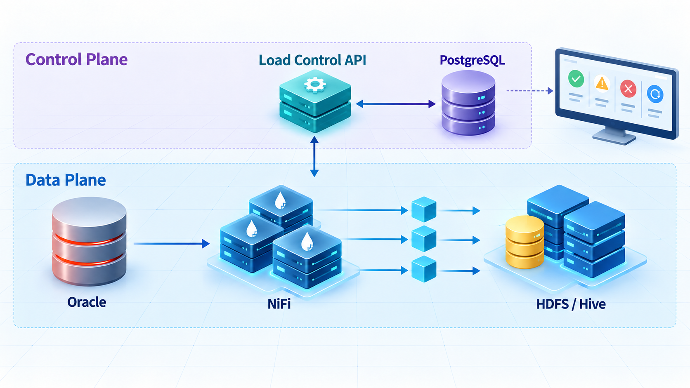
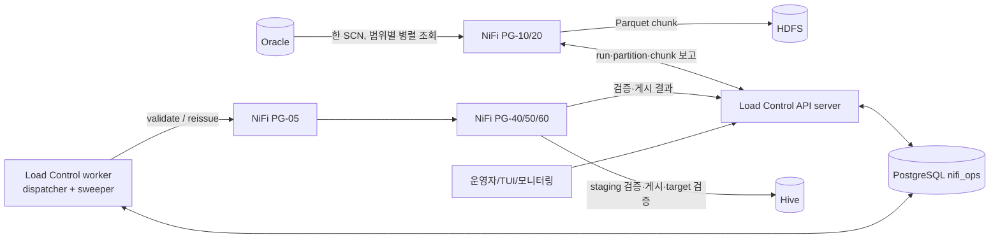
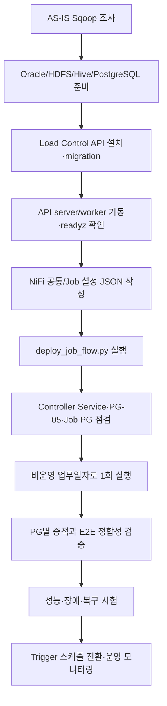

# NiFi + Load Control API 전체 적용 매뉴얼

이 문서는 Sqoop 기반 Oracle→Hive 적재를 Cloudera CFM의 NiFi Flow와 Load Control API로 전환하고,
실제 환경에 배포·검증·운영하는 절차를 한곳에 모은 실행 매뉴얼이다. 설명은 현재 저장소의
`nifi-flow/deploy_job_flow.py`, Load Control API 구현, 검증 결과를 기준으로 한다.

## 1. 요약

기존 Sqoop Mapper가 담당하던 범위 분할과 병렬 추출을 NiFi가 수행하고, 분산 Flow만으로 보장하기
어려운 전체 완료 판정과 중복 방지는 Load Control API가 맡는다.

핵심 원칙은 다음과 같다.

- NiFi는 Oracle, HDFS, Hive의 실제 데이터를 처리한다.
- API는 run 상태, 소유권, 완료 판정, 후속 단계 호출을 관리한다.
- 모든 파티션은 동일한 Oracle SCN을 읽는다.
- HDFS 경로와 staging table은 run ID별로 격리한다.
- 검증과 게시는 CAS와 token으로 run당 한 번만 허용한다.
- 게시 결과가 불명확하면 자동 재게시하지 않고 `PUBLISH_UNKNOWN`으로 멈춘다.
- 원천, 추출, staging, target의 건수와 품질 지표를 단계마다 비교한다.

> [!IMPORTANT]
> 현재 `nifi-flow/deploy_job_flow.py`는 여러 테이블이 한 Processor 세트를 공유하는 런타임 템플릿이 아니다.
> 설정 JSON 하나를 실행할 때마다 `JOB_<JOB.KEY>` 아래에 PG-00·10·20·40·50·60·70·90 전체를 새로
> 만든다. 따라서 Oracle 테이블 6개를 이관하려면 서로 다른 `JOB.KEY`를 가진 Job PG 6개와 그 하위 PG
> 전체가 필요하다. NiFi UI에서 Processor를 직접 복사할 필요는 없지만, 빌더가 같은 구조를 Job별로 생성한다.
> 단일 PG 한 벌에서 변수만 바꿔 6개 테이블을 동시에 처리하는 구조는 현재 구현 범위가 아니다.

## 2. 문서 읽는 순서

| 순서 | 문서 | 목적 |
|---:|---|---|
| 1 | [아키텍처와 전환 설계](./01-architecture.md) | 구성요소, 데이터/제어 흐름, 상태 모델 이해 |
| 2 | [Oracle SCN 상세 기술](./07-oracle-scn.md) | 동일 시점 병렬 추출, Undo, 보장 범위 이해 |
| 3 | [설정 레퍼런스](./02-configuration.md) | NiFi와 Load Control API의 모든 설정값 결정 |
| 4 | [설치 및 적용 절차](./03-installation-and-apply.md) | DB·API·NiFi Flow를 순서대로 배포 |
| 5 | [PG별 동작 원리와 검증](./04-process-groups.md) | PG-00~90의 Processor 흐름과 단계별 확인 |
| 6 | [Load Control API 상호작용](./05-api-interactions.md) | 요청·응답, 상태 전이, outbox/ACK 이해 |
| 7 | [통합 검증과 운영·복구](./06-validation-and-operations.md) | 인수 테스트, 모니터링, 장애 대응, 재처리 |
| 8 | [검증 결과](./08-verification-results.md) | 실제 클러스터 환경과 시나리오별 검증 증적 확인 |

부록:

| 부록 | 문서 | 목적 |
|---|---|---|
| A | [운영 조회 도구 사용법](./appendix-a-query-tools.md) | `bin/oracle.sh`·`hive.sh`·`hdfs.sh`로 원천·HDFS·Hive를 직접 조회·대조 |

## 3. 적용 범위와 전제

현재 구현이 전제로 하는 환경은 다음과 같다.

| 구분 | 기준 |
|---|---|
| NiFi | Cloudera CFM 4.12 / NiFi 2.6 |
| 원천 | Oracle, 숫자형 split column, `AS OF SCN` 사용 가능 |
| 파일 | Snappy Parquet, HDFS run 전용 경로 |
| Hive | CFM의 `ClouderaHiveConnectionPool`, `PutClouderaHiveQL` 사용 |
| 상태 DB | PostgreSQL `nifi_ops` 스키마 |
| API | Python 3.11 이상, FastAPI server + background worker |
| 보안 기본값 | NiFi↔API HTTP, API Bearer token, 방화벽으로 접근 제한 |
| 배포 방식 | NiFi Registry가 아니라 `nifi-flow/deploy_job_flow.py`가 NiFi REST API로 생성 |

현재 빌더는 NiFi REST API 인증 헤더나 클라이언트 인증서를 처리하지 않는다. 따라서 다음 중 하나가
필요하다.

1. 관리망 안의 인증 없는 NiFi REST endpoint에서 빌더를 실행한다.
2. 운영 환경의 인증 방식에 맞게 빌더의 `call()`에 인증 처리를 추가한다.

이 제한은 Flow가 생성된 뒤 NiFi와 Load Control API 사이의 Bearer 인증과는 별개다.

## 4. 전체 적용 흐름

운영 전환 완료 조건은 최소한 다음을 만족해야 한다.

- 정상 run이 `SUCCESS`이고 `source_count = extracted_count = staging_count = target_count`다.
- 모든 STAGING/TARGET 지표가 `PASS`다.
- 같은 업무 키 동시 실행이 409로 차단된다.
- 파티션 하나가 실패하면 게시가 실행되지 않는다.
- `PUBLISH_UNKNOWN`, `DEAD` dispatch, stale run에 대한 운영 절차를 시험했다.
- Oracle 세션, NiFi queue/back pressure, HDFS/Hive 부하가 승인 범위 안이다.

## 5. 구현 기준과 검증 증적

- 실제 Flow 배포 코드: [`nifi-flow/deploy_job_flow.py`](../nifi-flow/deploy_job_flow.py)
- Flow 설정 예시: [`nifi-flow/job-config.example.json`](../nifi-flow/job-config.example.json)
- API 설정 예시: [`load-control-api/config/config.example.yaml`](../load-control-api/config/config.example.yaml)
- API migration: [`load-control-api/src/migrations`](../load-control-api/src/migrations)
- 검증된 시나리오: [검증 결과](./08-verification-results.md)

Processor 속성의 최종 기준은 항상 `nifi-flow/deploy_job_flow.py`다. 문서와 생성된 Flow가 다르면 먼저 사용한
commit과 빌더 출력의 Processor ID를 확인한다.
