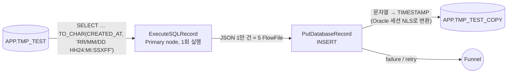

# 부록 B. Oracle→Oracle 복제 Flow: ExecuteSQLRecord + PutDatabaseRecord

이 부록은 Oracle 테이블을 NiFi에서 SQL로 조회하고, 같은 스키마로 만든 다른 Oracle 테이블에
`PutDatabaseRecord`로 적재하는 시험 Flow를 정리한다. timestamp 컬럼은 조회 SQL에서
`RR/MM/DD HH24:MI:SSXFF` 형식의 문자열로 바꿔 넘긴다. 본 매뉴얼의 Sqoop 대체 Flow(PG-00~90)와는
독립된 PG이고, Load Control API를 쓰지 않는다.

시험 환경(CFM 4.12 / NiFi 2.6, Oracle 23 Free `FREEPDB1`)에서 2026-10-07에 실행했고, 5만 건이
원본과 완전히 일치했다. 예시 값은 시험 환경 기준이다.



## B.1 핵심: timestamp를 NiFi가 아니라 Oracle이 변환한다

`CREATED_AT`을 문자열로 꺼낸 뒤 적재할 때 NiFi Record Reader에서 timestamp 형식으로 다시 해석하면
안 된다. NiFi는 문자열을 `java.sql.Timestamp`로 바꿀 때 JVM 기본 시간대를 쓰고, CFM 노드의 JVM
시간대는 `America/New_York`이다. 서머타임이 시작되는 2026-03-08 02:00~03:00은 이 시간대에 존재하지
않으므로, 그 사이 값은 1시간 뒤로 밀려 저장된다.

처음 시도(Reader 스키마 `CREATED_AT`을 `timestamp-micros`, Timestamp Format
`yy/MM/dd HH:mm:ss.SSSSSS`로 지정)의 결과는 다음과 같았다. 49,998건은 일치하고 2건이 어긋났다.

| ID | 원본 | 적재본 |
|---:|---|---|
| 177 | 2026-03-08 02:52:36.547885 | 2026-03-08 **03**:52:36.547885 |
| 12106 | 2026-03-08 02:09:52.219361 | 2026-03-08 **03**:09:52.219361 |

그래서 다음과 같이 바꿨다.

1. Reader 스키마에서 `CREATED_AT`을 `string`으로 둔다. NiFi는 값을 해석하지 않고 문자열 그대로 넘긴다.
2. `PutDatabaseRecord`가 TIMESTAMP 컬럼에 문자열을 바인딩하면 Oracle이 세션의
   `NLS_TIMESTAMP_FORMAT`으로 암묵 변환한다.
3. Oracle JDBC thin 드라이버는 세션 NLS를 JVM locale(`en_US` → `DD-MON-RR HH.MI.SSXFF AM`)로 정하고,
   NLS 형식을 지정하는 연결 속성이 없다. 그래서 logon trigger로 이 Flow의 세션에만
   `NLS_TIMESTAMP_FORMAT='RR/MM/DD HH24:MI:SSXFF'`를 적용한다.
4. 이 Flow의 세션을 구분하려고 Connection Pool에 JDBC 연결 속성 `v$session.program`을 준다.
   같은 `NIFI_READER` 계정을 쓰는 V4 세션(`JDBC Thin Client`)에는 trigger가 적용되지 않는다.

> [!IMPORTANT]
> NiFi JVM 시간대를 UTC로 바꾸면 근본 원인이 사라지지만, 클러스터 재시작이 필요하고
> "NiFi JVM 시간대 = Hive `hive.local.time.zone`" 원칙([설정 레퍼런스](./02-configuration.md)) 때문에
> Hive 설정과 V4 Flow에도 영향을 준다. 이 시험에서는 JVM 설정을 바꾸지 않았다.

## B.2 Oracle 준비

모든 문장은 `FREEPDB1`에서 관리자 권한으로 실행한다.

### B.2.1 원천 테이블과 시험 데이터

문자열 10개와 timestamp 1개 컬럼, 행 구분용 `ID`를 가진 테이블에 5만 건을 만든다. `CREATED_AT`은
2026-01-01부터 약 280일 범위의 무작위 시각(마이크로초 포함)이다.

```sql
create table APP.TMP_TEST (
  ID      number(10) primary key,
  COL01   varchar2(100), COL02 varchar2(100), COL03 varchar2(100), COL04 varchar2(100), COL05 varchar2(100),
  COL06   varchar2(100), COL07 varchar2(100), COL08 varchar2(100), COL09 varchar2(100), COL10 varchar2(100),
  CREATED_AT timestamp
);

insert /*+ append */ into APP.TMP_TEST
select level,
  'A-'||level, dbms_random.string('U',10), dbms_random.string('L',20), dbms_random.string('A',15), dbms_random.string('X',12),
  'CODE'||lpad(mod(level,100),3,'0'), dbms_random.string('U',30), '홍길동'||mod(level,1000), dbms_random.string('A',50), to_char(level,'FM00000000'),
  timestamp '2026-01-01 00:00:00' + numtodsinterval(dbms_random.value(0, 280*86400), 'SECOND')
from dual connect by level <= 50000;
commit;

grant select on APP.TMP_TEST to NIFI_READER;
```

GLOBAL TEMPORARY TABLE은 다른 세션에서 데이터가 보이지 않아 NiFi가 읽을 수 없으므로 일반 테이블로 만든다.

### B.2.2 대상 테이블과 권한

원천 스키마를 데이터 없이 복제하고 기본키를 건다. 별도 적재 계정은 만들지 않고 `NIFI_READER`에
이 테이블에 한한 쓰기 권한을 준다.

```sql
create table APP.TMP_TEST_COPY as select * from APP.TMP_TEST where 1=0;
alter table APP.TMP_TEST_COPY add primary key (ID);
grant select, insert, delete on APP.TMP_TEST_COPY to NIFI_READER;
```

### B.2.3 NLS logon trigger

```sql
create or replace trigger SYS.TRG_NIFI_TMP_TEST_NLS after logon on database
declare
  v_prog varchar2(100);
begin
  if sys_context('USERENV','SESSION_USER') = 'NIFI_READER' then
    select program into v_prog from v$session where sid = sys_context('USERENV','SID');
    if v_prog = 'NIFI_TMP_TEST_COPY' then
      execute immediate q'[alter session set nls_timestamp_format = 'RR/MM/DD HH24:MI:SSXFF']';
    end if;
  end if;
exception when others then null;
end;
/
```

`exception when others then null`은 trigger 오류로 모든 로그인이 막히는 것을 방지한다. 대신 trigger가
실패하면 NLS가 적용되지 않아 적재가 변환 오류로 실패하므로 결과는 곧바로 드러난다.

## B.3 NiFi 구성

루트 PG 아래 `TEST_TMP_TEST_COPY` PG를 만들고 Parameter Context `PC_SQOOP_REPLACEMENT_COMMON`을
연결한다. 접속 정보는 이 Context의 `ORACLE.*` 파라미터를 그대로 쓴다.

### B.3.1 Controller Service

| 이름 | 유형 | 주요 속성 |
|---|---|---|
| `CS_DBCP_ORACLE_RW` | `HikariCPConnectionPool` | URL `#{ORACLE.JDBC.URL}`, Driver `oracle.jdbc.OracleDriver`, Driver Location `#{ORACLE.JDBC.DRIVER.PATH}`, User `#{ORACLE.JDBC.USER}`, Password `#{ORACLE.JDBC.PASSWORD}`, Max Total Connections `4`, Minimum Idle `0`, Validation Query `SELECT 1 FROM DUAL` |
| | | 동적 속성 `v$session.program` = `NIFI_TMP_TEST_COPY`(B.1의 4) |
| `CS_JSON_WRITER` | `JsonRecordSetWriter` | Output Grouping `Array`, 스키마는 기본값(Record 스키마 상속) |
| `CS_JSON_READER` | `JsonTreeReader` | Schema Access Strategy `Use 'Schema Text' Property`, Schema Text 아래, Timestamp Format 비움 |

`CS_JSON_READER`의 Schema Text:

```json
{
 "type": "record",
 "name": "TMP_TEST",
 "fields": [
  {"name": "ID",         "type": ["null", "long"]},
  {"name": "COL01",      "type": ["null", "string"]},
  {"name": "COL02",      "type": ["null", "string"]},
  {"name": "COL03",      "type": ["null", "string"]},
  {"name": "COL04",      "type": ["null", "string"]},
  {"name": "COL05",      "type": ["null", "string"]},
  {"name": "COL06",      "type": ["null", "string"]},
  {"name": "COL07",      "type": ["null", "string"]},
  {"name": "COL08",      "type": ["null", "string"]},
  {"name": "COL09",      "type": ["null", "string"]},
  {"name": "COL10",      "type": ["null", "string"]},
  {"name": "CREATED_AT", "type": ["null", "string"]}
 ]
}
```

### B.3.2 ExecuteSQLRecord - TMP_TEST

| 속성 | 값 |
|---|---|
| Database Connection Pooling Service | `CS_DBCP_ORACLE_RW` |
| SQL Query | 아래 |
| Record Writer | `CS_JSON_WRITER` |
| Max Rows Per Flow File | `10000` |
| Fetch Size | `1000` |
| Scheduling | Timer driven `1 day`, Execution `Primary node` |
| 자동 종료 관계 | `failure` |

```sql
SELECT ID, COL01, COL02, COL03, COL04, COL05, COL06, COL07, COL08, COL09, COL10,
       TO_CHAR(CREATED_AT, 'RR/MM/DD HH24:MI:SSXFF') AS CREATED_AT
  FROM APP.TMP_TEST
```

입력 연결이 없는 Processor라 노드마다 실행되지 않도록 Primary node로 둔다. `CREATED_AT`은
`26/03/21 03:58:04.706016`처럼 나온다(`TIMESTAMP(6)`이라 소수부는 6자리).

### B.3.3 PutDatabaseRecord - TMP_TEST_COPY

| 속성 | 값 |
|---|---|
| Record Reader | `CS_JSON_READER` |
| Database Type | `Oracle 12+` |
| Statement Type | `INSERT` |
| Database Connection Pooling Service | `CS_DBCP_ORACLE_RW` |
| Schema Name / Table Name | `APP` / `TMP_TEST_COPY` |
| Unmatched Column Behavior | `Fail on Unmatched Columns` |
| Maximum Batch Size | `1000` |
| 자동 종료 관계 | `success` |

### B.3.4 연결

| 출발 | 관계 | 도착 |
|---|---|---|
| ExecuteSQLRecord | `success` | PutDatabaseRecord |
| PutDatabaseRecord | `failure`, `retry` | Funnel(실패 FlowFile 보관·확인용) |

## B.4 실행

1. Controller Service 세 개를 Enable한다.
2. PutDatabaseRecord를 Start한다.
3. ExecuteSQLRecord에서 **Run Once**를 실행한다.
4. PG queue가 0이고 Funnel 앞 queue가 비어 있으면 완료다. 시험 환경에서는 FlowFile 5개(약 16 MB)가
   수 초 안에 처리됐다.

다시 실행할 때는 `truncate table APP.TMP_TEST_COPY`를 먼저 한다. `ID`가 기본키라 비우지 않으면
중복 키로 failure에 쌓인다.

## B.5 검증

```sql
select count(*) from APP.TMP_TEST_COPY;                                                   -- 50000
select count(*) from (select * from APP.TMP_TEST      minus select * from APP.TMP_TEST_COPY); -- 0
select count(*) from (select * from APP.TMP_TEST_COPY minus select * from APP.TMP_TEST);      -- 0

-- 서머타임 갭 구간 값이 그대로인지 확인
select ID, to_char(CREATED_AT, 'YYYY-MM-DD HH24:MI:SSXFF')
  from APP.TMP_TEST_COPY where ID in (177, 12106);

-- trigger가 이 Flow 세션에만 적용되는지 확인
select program, count(*) from v$session where username = 'NIFI_READER' group by program;
```

시험 결과는 다음과 같다.

| 항목 | 결과 |
|---|---|
| 적재 건수 | 50,000 |
| 양방향 `MINUS` 차이 | 0 / 0 |
| ID 177, 12106 | 2026-03-08 02:52:36.547885, 02:09:52.219361(원본과 같음) |
| `NIFI_READER` 세션 | `JDBC Thin Client` 16, `NIFI_TMP_TEST_COPY` 1 |

## B.6 주의 사항

- 적재는 Oracle 세션 NLS에 의존한다. trigger가 없거나 Pool의 `v$session.program`이 빠지면
  Oracle 날짜 변환 오류로 failure에 쌓인다.
- 같은 원리로, NiFi에서 문자열을 timestamp로 해석해 적재하는 다른 Flow도 JVM 시간대의 서머타임 갭에서
  값이 바뀔 수 있다.
- `RR`은 연도 두 자리를 현재 세기 기준(00~49 → 20xx, 50~99 → 19xx)으로 해석한다. 1950년 이전이나
  2050년 이후 값이 있으면 `YYYY` 형식을 써야 한다.
- `NIFI_READER`는 `APP.TMP_TEST_COPY`에 한해 쓰기 권한이 있다. 시험이 끝나면 회수한다.

## B.7 정리

```sql
drop trigger SYS.TRG_NIFI_TMP_TEST_NLS;
drop table APP.TMP_TEST_COPY purge;
drop table APP.TMP_TEST purge;
```

NiFi에서는 `TEST_TMP_TEST_COPY` PG의 Processor를 Stop하고 queue를 비운 뒤 Controller Service를
Disable하고 PG를 삭제한다.
