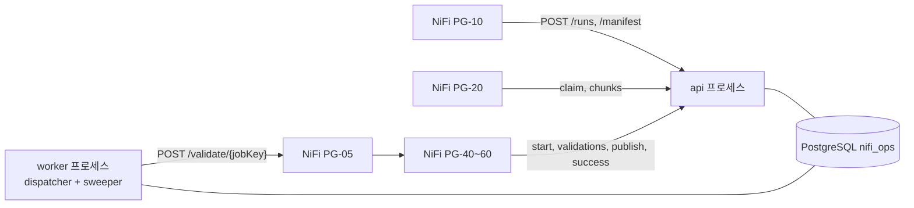

# Load Control API 설계

NiFi 적재의 상태를 기록하고 완료를 판정하는 Python FastAPI 서비스다. NiFi 쪽 설계는 [NiFi Flow 설계](./nifi-sqoop-removal-guide.md), 설치·실행은 [load-control-api/README.md](./load-control-api/README.md)에 있다.

## 1. 왜 API가 필요한가

NiFi Processor를 병렬로 돌리는 것만으로는 "모든 파티션이 성공했을 때만, 다음 단계를 한 번만 시작"을 보장하기 어렵다. 파티션은 여러 노드에서 따로 끝나고, NiFi는 재시도·재기동으로 같은 보고를 여러 번 보낼 수 있다. 그래서 판정을 한 곳(API)에 모았다.

```text
NiFi (데이터): 파티션 조회 → Parquet → HDFS → chunk마다 API에 보고
API  (상태)  : 보고 기록 → 파티션 완료 판정 → run 완료 판정 → 검증 단계 호출(run당 1회)
NiFi (검증)  : 호출을 받아 staging 검증 → 게시 → target 검증, 결과를 API에 보고
```

- 상태 원장(PostgreSQL `nifi_ops`)에 쓰는 것은 API 하나다. NiFi는 오류 이벤트(`load_event`)만 직접 쓴다.
- 판정과 상태 변경은 모두 한 트랜잭션 안의 코드다. 그래서 동시성 테스트로 검증할 수 있다.
- 대가: API를 운영해야 하고, API가 내려가면 판정이 멈춘다(보고는 NiFi가 재시도하고, 오래 멈춘 run은 sweeper가 정리한다).

## 2. 구성



| 프로세스 | 역할 | 실행 |
|---|---|---|
| `api` | HTTP 엔드포인트. 판정과 상태 변경 | `bin/start.sh server`. 운영은 2개 이상을 LB 뒤에 |
| `worker` | dispatcher(NiFi 호출 전달), sweeper(멈춘 작업 정리) | `bin/start.sh worker`. 2개를 띄워도 중복 처리하지 않는다 |

## 3. 상태

### 3.1 run

| 상태 | 의미 | 다음 |
|---|---|---|
| `CREATED` | run 생성 | manifest 등록 → `EXTRACTING` |
| `EXTRACTING` | 파티션 추출 중 | 모두 성공 → `EXTRACTED_VALIDATED` |
| `EXTRACTED_VALIDATED` | 추출 완료, 검증 호출 대기 | `/validation/start` → `STAGE_VALIDATING` |
| `STAGE_VALIDATING` | staging 검증 중 | 지표 모두 PASS → `STAGING_VALIDATED` |
| `STAGING_VALIDATED` | 게시 대기 | `/publish/claim` → `PUBLISHING` |
| `PUBLISHING` | 게시 중 | 결과 보고 → `PUBLISHED` / `FAILED_PUBLISH` / `PUBLISH_UNKNOWN` |
| `PUBLISHED` | 게시 완료, target 검증 중 | 지표 모두 PASS → `SUCCESS` |
| `SUCCESS` | 정상 종료 | |
| `FAILED_MANIFEST`, `FAILED_EXTRACT`, `FAILED_SNAPSHOT_EXPIRED`, `FAILED_STAGE_VALIDATION`, `FAILED_PUBLISH`, `FAILED_TARGET_VALIDATION`, `TIMED_OUT` | 실패 종료 | 새 run으로 재실행 |
| `PUBLISH_UNKNOWN` | 게시 결과 불명 | 운영자가 `PUBLISHED` 또는 `FAILED_PUBLISH`로 확정 |

같은 `job_key + business_key`에는 진행 중인 run(끝나지 않은 상태와 `PUBLISH_UNKNOWN`)이 하나만 있을 수 있다(partial unique index). 두 번째 `POST /runs`는 409 `DUPLICATE_ACTIVE_RUN`.

### 3.2 파티션

`PENDING` → (claim) `RUNNING` → `SUCCESS` / `FAILED`. 재발행 모드에서 멈춘 파티션은 `RETRY`로 돌아가 다시 claim된다. sweeper가 정리하면 `TIMED_OUT`.

### 3.3 모든 상태 변경은 CAS

상태는 `UPDATE ... WHERE run_id = :id AND status = <기대 상태> RETURNING`으로만 바꾸고, 반환 행이 있을 때만 성공으로 본다. 동시에 같은 요청이 여러 개 와도 한 요청만 성공한다. 잠금 순서는 항상 `load_run` → `load_partition` → `load_file` → `load_dispatch`(deadlock 방지).

## 4. 완료 판정

### 4.1 manifest 등록(`POST /runs/{id}/manifest`)

한 트랜잭션에서:

1. 검사: `SUM(파티션 예상 건수) = 원천 건수`, 파티션 수 = 계획 수, 경계 연속(`다음 하한 = 이전 상한`, 마지막만 상한 포함), split 컬럼 NULL 없음, 원천 0건이면 `allowEmptySource=true`일 때만.
2. 어긋나면 run을 `FAILED_MANIFEST`로 바꾸고 422.
3. 파티션을 일괄 등록하고, 예상 0건 파티션은 바로 `SUCCESS`.
4. run을 `EXTRACTING`으로 바꾸고 run 판정(4.2의 5단계)을 한 번 한다(모두 0건이면 여기서 완료).
5. Worker로 보낼 파티션(예상 건수 > 0) 목록을 돌려준다.

원천 지표(`AMOUNT_SUM`, `MIN_TS`, `MAX_TS`)는 `load_validation`(stage=`SOURCE`)에 저장하고 검증 단계 시작 때 돌려준다.

### 4.2 chunk 보고(`POST .../partitions/{pid}/chunks`)

한 파티션은 여러 Parquet 파일(chunk)로 나뉘므로 chunk마다 보고받고 API가 모은다. 보고 한 건을 한 트랜잭션으로 처리한다.

```text
1. load_run 행을 FOR UPDATE로 잠근다. run이 EXTRACTING이 아니면 파일만 기록하고 현재 상태를 돌려준다(판정 안 함)
2. claim token이 파티션의 token과 같은지 확인(다르면 409 CLAIM_MISMATCH)
3. load_file UPSERT(run, partition, chunk_index). heartbeat 갱신
   이미 성공한 파티션에 다른 내용이 오면 409 CHUNK_CONFLICT
4. 파티션 판정: 받은 chunk 수 = chunkCount이고 chunk 번호가 0..n-1 연속이면
     건수 합계 = 예상 건수 → 파티션 SUCCESS
     다르면               → 파티션 FAILED, run FAILED_EXTRACT
5. run 판정(파티션이 방금 SUCCESS가 됐을 때만):
     UPDATE load_run SET status='EXTRACTED_VALIDATED'
      WHERE status='EXTRACTING' AND 모든 파티션 SUCCESS AND 건수 합계 = 원천 건수
   갱신됐으면 같은 트랜잭션에서 검증 dispatch INSERT + pg_notify
COMMIT
```

run 행 잠금이 필수다. 잠그지 않으면 마지막 두 파티션이 동시에 끝났을 때 서로의 커밋을 보지 못해 아무도 run을 완료하지 못한다. 잠금은 트랜잭션 하나(수 ms) 동안만 유지된다.

### 4.3 실패

- NiFi(PG-90)가 claim에 성공한 파티션의 실패만 `POST .../partitions/{pid}/fail`로 보고한다. API는 파티션 `FAILED`, run `FAILED_EXTRACT`로 바꾼다(`ORA-01555`·`ORA-08180`이면 `FAILED_SNAPSHOT_EXPIRED`).
- 그 뒤 도착하는 다른 파티션의 보고는 파일만 기록하고 `runStatus=FAILED_*`를 돌려준다. 대기 중인 파티션의 claim은 `claimed=false`라서 조회를 시작하지 않는다.
- 그 밖의 단계 실패는 `POST /runs/{id}/fail`(기대 상태와 실패 상태를 함께 받음)로 기록한다.

## 5. 검증 단계 호출(outbox)

### 5.1 원리

트랜잭션 안에서 NiFi를 호출하면 "호출은 됐는데 커밋 실패"나 "커밋은 됐는데 호출 실패"가 생긴다. 그래서 run 완료와 같은 트랜잭션에서 `load_dispatch` 행(= 호출 요청)만 만들고, 커밋 후 worker의 dispatcher가 NiFi로 보낸다.

| dispatch 상태 | 의미 |
|---|---|
| `PENDING` | 전송 대기(실패하면 backoff 후 다시 `PENDING`) |
| `SENT` | NiFi가 202로 받음. 실제 처리 시작은 아직 모름 |
| `ACKED` | 검증 단계가 `/validation/start`를 호출함(재발행은 새 claim) |
| `DEAD` | 최대 시도 초과. `DISPATCH_DEAD` 이벤트, 운영자가 재전송 |

`SENT`인데 `dispatch.ack_timeout` 안에 `ACKED`가 안 되면 다시 보낸다(202 직후 NiFi 노드가 죽은 경우).

### 5.2 dispatcher

- `pg_notify`로 즉시 깨어나고, 놓쳐도 `poll_interval`마다 확인한다.
- 짧은 트랜잭션에서 행을 선점(`FOR UPDATE SKIP LOCKED`, lease)한 뒤 커밋하고 전송한다. 전송 중 worker가 죽으면 lease가 끝난 뒤 다른 worker가 가져간다.
- 5xx·연결 실패는 backoff 재시도, 4xx는 설정 오류로 보고 바로 `DEAD`.
- 호출: `POST {nifi.receiver_url}/validate/{jobKey}` 또는 `/reissue/{jobKey}`, 헤더 `X-Run-Id`, `X-Dispatch-Id`.

### 5.3 중복 수신

outbox는 "최소 1회" 전달이라 같은 요청이 두 번 올 수 있다. 검증 단계의 첫 호출 `/validation/start`가 `EXTRACTED_VALIDATED → STAGE_VALIDATING` CAS에 성공한 경우에만 `started=true`를 주고, 두 번째 요청은 `started=false`로 조용히 끝난다.

## 6. API 명세

### 6.1 공통 규칙

- Base path `/v1`, JSON(UTF-8), HTTP. 인증은 `Authorization: Bearer <token>`. 토큰 role은 `nifi`(NiFi)와 `operator`(운영자).
- 모든 요청·응답에 `X-Request-Id`(없으면 API가 만든다). 로그 추적 키다.
- 모든 상태 변경 호출은 멱등이다. 같은 요청을 다시 보내면 같은 결과를 준다(같은 token의 claim 재요청도 `claimed=true`).
- JSON 필드는 camelCase. 모르는 필드는 422(NiFi 설정 실수를 바로 드러낸다). 큰 숫자(SCN, 경계)는 문자열로 받는다.

### 6.2 엔드포인트

| Method | Path | 호출자 | 동작 |
|---|---|---|---|
| POST | `/v1/runs` | PG-10 | run 생성. run 경로·staging 테이블 이름을 만들어 돌려준다 |
| POST | `/v1/runs/{id}/manifest` | PG-10 | 4.1 |
| POST | `/v1/runs/{id}/fail` | PG-90 | 단계 실패 기록(기대 상태가 맞을 때만) |
| POST | `/v1/runs/{id}/partitions/{pid}/claim` | PG-20 | `PENDING`/`RETRY` → `RUNNING` |
| POST | `/v1/runs/{id}/partitions/{pid}/chunks` | PG-20 | 4.2 |
| POST | `/v1/runs/{id}/partitions/{pid}/fail` | PG-90 | 4.3 |
| POST | `/v1/runs/{id}/validation/start` | PG-40 | 5.3. 검증에 필요한 기대값(원천 건수·지표, 경로, 테이블)을 돌려준다 |
| POST | `/v1/runs/{id}/validations` | PG-40, 60 | stage(`STAGING`/`TARGET`)별 지표 저장 |
| POST | `/v1/runs/{id}/stage-validated` | PG-40 | 저장된 STAGING 지표가 모두 PASS일 때만 `STAGING_VALIDATED` |
| POST | `/v1/runs/{id}/publish/claim` | PG-50 | publish token CAS로 `PUBLISHING` |
| POST | `/v1/runs/{id}/publish/result` | PG-50 | token이 맞을 때만 `PUBLISHED`/`FAILED_PUBLISH`/`PUBLISH_UNKNOWN` |
| POST | `/v1/runs/{id}/success` | PG-60 | 저장된 TARGET 지표가 모두 PASS일 때만 `SUCCESS` |
| GET | `/v1/cleanup/candidates?jobKey=&limit=` | PG-70 | 9장 |
| POST | `/v1/runs/{id}/cleanup` | PG-70, 운영자 | 9장 |
| GET | `/v1/runs`, `/v1/runs/{id}` | 운영 | 목록·상세(파티션, dispatch 포함) |
| POST | `/v1/runs/{id}/dispatches/{did}/resend` | 운영자 | `DEAD`/`SENT` dispatch 재전송 |
| POST | `/v1/runs/{id}/publish-unknown/resolve` | 운영자 | `PUBLISH_UNKNOWN`을 확정. 사유 필수 |
| GET | `/v1/monitor/summary` | TUI 모니터 | 진행 중·최근 24시간 run 수, dispatch 현황, 정리 대상 수, 경보 목록 |
| GET | `/v1/runs/{id}/validations`, `/v1/runs/{id}/events` | TUI 모니터, 운영 | run의 검증 지표, 이벤트 타임라인 |
| GET | `/healthz`, `/readyz`, `/metrics` | 모니터링 | 생존, DB 연결, Prometheus |

API는 NiFi의 PASS/FAIL 판정을 그대로 믿지 않는다. 저장된 지표에 FAIL이 하나라도 있으면 `stage-validated`, `success`가 거절한다(`reasons`에 이유).

### 6.3 주요 요청·응답

`POST /v1/runs`

```json
{ "jobKey": "ORACLE_INSP_DTL_DAILY", "businessKey": "2026-09-28",
  "hdfsRoot": "/data/nifi/stage", "stageTablePrefix": "TMP_INSP_DTL_", "allowEmptySource": false }
→ { "runId": "...", "status": "CREATED",
    "hdfsRunPath": "/data/nifi/stage/ORACLE_INSP_DTL_DAILY/run_id=...", "stageTable": "tmp_insp_dtl_<runId hex>" }
```

`POST /v1/runs/{id}/manifest`

```json
{ "snapshotScn": "2388556", "sourceCount": 105000, "sourceNullSplitCount": 0,
  "sourceMinSplit": "1", "sourceMaxSplit": "120000", "plannedPartitionCount": 8,
  "sourceMetrics": { "AMOUNT_SUM": "71853075", "MIN_TS": "2026-09-28 00:00:01", "MAX_TS": "2026-09-29 09:20:00" },
  "partitions": [ { "partitionId": "0000", "lowerBound": "1", "upperBound": "15001",
                    "upperInclusive": false, "isNullPartition": false, "expectedRowCount": 15000 } ] }
→ { "runId": "...", "status": "EXTRACTING", "dispatchPartitions": [ ... ], "emptyPartitionCount": 1 }
```

`POST /v1/runs/{id}/partitions/{pid}/claim` → `{ "claimed": true, "runStatus": "EXTRACTING", "partitionStatus": "RUNNING", "attempt": 1 }`

`POST /v1/runs/{id}/partitions/{pid}/chunks`

```json
{ "claimToken": "...", "chunkIndex": 2, "chunkCount": 3, "fragmentIdentifier": "...",
  "hdfsPath": "<run 경로>/part-0000-000002.parquet", "recordCount": 5000, "byteCount": 183552 }
→ { "recorded": true, "partitionStatus": "SUCCESS", "runStatus": "EXTRACTED_VALIDATED",
    "receivedChunks": 3, "chunkCount": 3, "validationScheduled": true }
```

API는 `hdfsPath`가 그 run의 경로 아래인지 확인한다.

`POST /v1/runs/{id}/validation/start`

```json
{ "dispatchId": "...", "node": "nifi-01" }
→ { "started": true, "runStatus": "STAGE_VALIDATING", "jobKey": "...", "businessKey": "...",
    "hdfsRunPath": "...", "stageTable": "...", "sourceCount": 105000, "extractedCount": 105000,
    "sourceMetrics": { "AMOUNT_SUM": "71853075", "MIN_TS": "...", "MAX_TS": "..." } }
```

API → NiFi 호출 본문: 검증은 `{ "runId", "dispatchId" }`, 재발행은 여기에 파티션 실행에 필요한 값(`partitionId`, `businessKey`, `snapshotScn`, `hdfsRunPath`, 경계, `expectedRowCount`)을 더한다.

### 6.4 HTTP 상태와 NiFi 처리

| HTTP | 의미 | NiFi `InvokeHTTP` |
|---|---|---|
| 200 | 처리 완료(멱등 재요청 포함) | 응답으로 분기 |
| 409 | 정상 경합(`CLAIM_MISMATCH`, `CHUNK_CONFLICT`, `DUPLICATE_ACTIVE_RUN`, `CLEANUP_NOT_DUE` 등) | 재시도 없이 WARN |
| 404, 422 | run 없음, 입력·불변식 위반 | 재시도 없이 ERROR |
| 5xx, 연결 실패 | 일시 장애 | 재시도 |

run이 이미 실패한 뒤 온 chunk 보고는 409가 아니라 200(`runStatus=FAILED_*`)이다.

## 7. 데이터베이스

DDL의 원본은 migration(`load-control-api/src/migrations/versions/`)이다. 적용은 `bin/migrate.sh`.

| 테이블 | 내용 |
|---|---|
| `load_run` | run 상태, 원천 건수·SCN, 단계별 건수, run 경로, staging 테이블, publish token, 정리 시각(`cleaned_at`) |
| `load_partition` | 파티션 경계, 예상·실제 건수, claim token, 상태 |
| `load_file` | chunk 보고 기록. `(run, partition, chunk_index)` 기준 UPSERT |
| `load_validation` | stage별 지표(SOURCE, STAGING, TARGET) |
| `load_dispatch` | outbox. run당 검증 dispatch는 하나(unique index) |
| `load_event` | 이벤트 로그. API의 상태 변화 이벤트 + NiFi PG-90의 오류 이벤트. run FK 없음(로그 기록 실패가 상태 변경을 막지 않게) |

권한 원칙:

```sql
-- API 런타임 계정: 원장 읽기·쓰기(DELETE·DDL 없음)
GRANT USAGE ON SCHEMA nifi_ops TO load_control_api;
GRANT SELECT, INSERT, UPDATE ON nifi_ops.load_run, nifi_ops.load_partition, nifi_ops.load_file,
      nifi_ops.load_validation, nifi_ops.load_dispatch TO load_control_api;
GRANT SELECT, INSERT ON nifi_ops.load_event TO load_control_api;
-- NiFi 계정: 이벤트 INSERT만
GRANT USAGE ON SCHEMA nifi_ops TO nifi_runtime;
GRANT INSERT ON nifi_ops.load_event TO nifi_runtime;
```

DDL은 migration 전용 계정이 실행한다. `load_event` 보존 삭제(예: 90일)는 DBA 작업으로 둔다.

## 8. Sweeper(복구)

worker가 `recovery.sweeper_interval`마다 실행한다. 여러 worker 중 advisory lock을 얻은 하나만 돈다.

| 대상 | 조건 | 동작 |
|---|---|---|
| 파티션 `RUNNING` | heartbeat가 `recovery.stale`보다 오래됨 | `mode=FAIL`: run과 미완료 파티션 `TIMED_OUT`. `mode=REISSUE`: claim을 지우고 `RETRY`, 이전 chunk 기록 무효화, 재발행 dispatch. 최대 시도(`max_attempts`)를 넘으면 `FAIL`과 같게 |
| run `CREATED`, `EXTRACTING` | 시작 후 `recovery.run_timeout` 경과 | `TIMED_OUT` |
| dispatch `SENT` | `dispatch.ack_timeout` 동안 ACK 없음 | 재전송 |
| run `STAGE_VALIDATING`, `PUBLISHED` | `recovery.validation_stale` 동안 변화 없음 | ERROR 이벤트만(자동 전이 없음) |
| run `PUBLISHING` | `recovery.publish_stale` 경과 | `PUBLISH_UNKNOWN`. 자동 재실행 없음 |

- heartbeat는 claim과 chunk 보고 때만 갱신된다. 파티션 쿼리가 도는 동안에는 갱신되지 않으므로 `recovery.stale`은 NiFi `EXTRACT.QUERY.TIMEOUT`(= `recovery.extract_query_timeout`)보다 커야 한다. 아니면 API가 시작하지 않는다.
- 기본은 `mode=FAIL`(멈추면 run 실패 → 새 run으로 재실행). `REISSUE`는 Oracle undo 보존 시간이 run 시간보다 길 때만 켠다.
- 재발행 후 늦게 도착한 이전 시도의 보고는 token이 달라 409 `CLAIM_MISMATCH`로 거부된다.

## 9. 정리(cleanup)

PG-70이 끝난 run의 staging 테이블과 HDFS run 경로를 지울 때 대상 판정과 기록을 맡는다.

- `GET /v1/cleanup/candidates?jobKey=`: `cleaned_at`이 비어 있고, 끝난 시각(`completed_at`)이 보존 기간을 지난 run. `SUCCESS`는 `cleanup.success_retention`(기본 3일), `FAILED_*`·`TIMED_OUT`은 `cleanup.failed_retention`(기본 14일). 진행 중인 run과 `PUBLISH_UNKNOWN`은 제외.
- `POST /v1/runs/{id}/cleanup`: 같은 조건을 다시 확인하고 `cleaned_at`과 `RUN_CLEANED` 이벤트를 남긴다. 대상이 아니면 409 `CLEANUP_NOT_DUE`, 이미 기록됐으면 `changed=false`. NiFi가 거부한 run을 운영자가 직접 지운 뒤 기록할 때도 쓴다(operator 토큰).

## 10. 운영

- **이중화**: API는 상태를 갖지 않으므로 여러 개를 LB 뒤에 둔다. worker도 2개를 띄워도 lease와 advisory lock 때문에 중복 처리하지 않는다. PostgreSQL은 단일 장애점이다.
- **NiFi 재시도와 API 재기동**: NiFi는 API 호출을 약 2분 15초 동안 재시도한다. API 재기동은 그보다 짧아야 한다.
- **보안**: 통신은 HTTP. API 포트는 NiFi 노드와 운영자 대역에만, NiFi PG-05 포트는 API worker 호스트에만 연다. 요청 값으로 SQL 식별자를 만들지 않는다.
- **로그**: `logs/server.log`, `logs/worker.log`. 한 줄 형식, 한글 메시지, `YYYY-MM-DD HH:MM:SS.SSS`. API 호출마다 수신·응답 두 줄(본문 포함), 같은 요청의 모든 로그에 `requestId`·`runId`가 붙는다.
- **메트릭(`/metrics`)**: 엔드포인트별 요청 수·지연, dispatch 상태별 수, 활성 run 수, sweeper 처리 건수.
- **알림 대상**: `DEAD` dispatch, `PUBLISH_UNKNOWN`, `TIMED_OUT`, `FAILED_*`, 5xx 급증, `PENDING` dispatch 증가.
- **TUI 모니터**: `bin/monitor.sh`. 조회 API로 대시보드·경보·run 상세·로그를 본다([load-control-api/README.md](./load-control-api/README.md) "모니터").
- **설정**: `config/config.yaml` 하나. 항목은 `config/config.example.yaml`에 설명이 있다.

## 11. 구현 구조와 테스트

```text
src/load_control/
├── routers/       인증, 입력 검증, 트랜잭션 시작
├── services/      한 트랜잭션 안의 업무 규칙(판정, claim, 검증, 게시, 정리)
├── repositories/  SQL만(판단 없음). ORM 없이 FOR UPDATE, 조건부 UPDATE를 그대로 쓴다
├── schemas/       요청·응답 모델(Pydantic)
└── worker/        dispatcher, sweeper
```

테스트는 실제 PostgreSQL로 돌린다(잠금과 CAS는 mock으로 검증할 수 없다). 주요 시나리오:

| 시나리오 | 기대 결과 |
|---|---|
| 마지막 두 파티션의 마지막 chunk를 동시에 보고 | run 완료 1회, dispatch 1행 |
| 같은 chunk 2회 보고 | 두 번째도 200, 기록 1행 |
| 성공한 파티션에 다른 내용 재보고 | 409 `CHUNK_CONFLICT` |
| claim 응답 유실 후 같은 token 재요청 | `claimed=true` |
| `/validation/start` 2회, publish claim 동시 요청 | 한 번만 성공 |
| dispatcher 2개 동시 실행, 전송 중 worker 종료 | 한 번만 전송, lease 만료 후 재전송 |
| manifest 합계 ≠ 원천 건수 | 422, `FAILED_MANIFEST` |
| deadlock 주입 | 트랜잭션 재시도 후 정상 |

실행 방법은 [load-control-api/README.md](./load-control-api/README.md).
