# CFM 4.12.0 Sqoop 제거 NiFi Flow 구현 명세

> 기준: CFM 4.12.0 / Apache NiFi 2.6.0, Oracle → HDFS Parquet → Hive External Staging → `INSERT OVERWRITE`

## 1. 구현 범위와 전제

이 문서는 [상세 설계](./nifi-sqoop-removal-design.md)를 NiFi Canvas에 그대로 옮길 수 있도록 Process Group, Processor, Controller Service, Parameter Context, Connection, 오류 처리 및 로그를 구현 수준으로 매핑한다.

예시 이름은 다음 규칙을 사용한다.

```text
Process Group : PG-번호-기능
Processor     : 번호_동사_대상
ControllerSvc : CS_종류_용도
Parameter     : 대문자 점 표기(예: SRC.TABLE)
Attribute     : load.* / partition.* / error.* / event.*
```

테이블 DDL, 컬럼 목록, 업무 WHERE 조건은 실제 대상별로 확정해야 한다. 테이블명과 컬럼명은 JDBC bind parameter가 될 수 없으므로 승인된 Parameter Context에서만 공급한다.

---

## 2. 최상위 Canvas

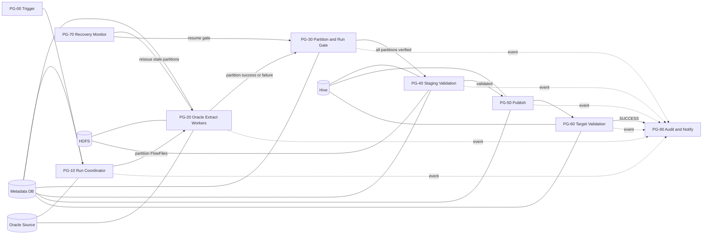

실행 정책은 다음과 같다.

| 영역 | 실행 노드 | Concurrent Tasks |
|---|---|---:|
| Trigger, Coordinator, Gate, Publish, Recovery | Primary Node | 1 |
| Oracle Extract, PutHDFS | All Nodes | 노드당 `${WORKER.CONCURRENT.TASKS}` |
| Audit writer | All Nodes | 2~4 |

Coordinator에서 Worker로 가는 Connection은 `Round Robin` Load Balance를 설정한다. 그 외 제어 Connection은 load balance를 사용하지 않는다.

---

## 3. Parameter Context

### 3.1 `PC_SQOOP_REPLACEMENT_COMMON`

| Parameter | 예시 | Sensitive | 용도 |
|---|---|---:|---|
| `META.JDBC.URL` | `jdbc:postgresql://meta:5432/nifiops` | N | 관리 DB |
| `META.JDBC.USER` | `nifi_ops` | N | 관리 DB 계정 |
| `META.JDBC.PASSWORD` | 미표시 | Y | 관리 DB 암호 |
| `ORACLE.JDBC.URL` | `jdbc:oracle:thin:@//host:1521/service` | N | 원천 Oracle |
| `ORACLE.JDBC.USER` | `nifi_reader` | N | 원천 조회 계정 |
| `ORACLE.JDBC.PASSWORD` | 미표시 | Y | 원천 암호 |
| `ORACLE.JDBC.DRIVER.PATH` | `/opt/nifi/jdbc/ojdbc11.jar` | N | JDBC Driver |
| `HIVE.JDBC.URL` | 환경별 HiveServer2 URL | N | HiveQL 실행 |
| `HIVE.USER` | service account | N | Hive 계정 |
| `HADOOP.CONF.FILES` | `core-site.xml,hdfs-site.xml` 절대경로 | N | PutHDFS |
| `HDFS.STAGE.ROOT` | `/data/nifi/stage` | N | staging root |
| `WORKER.CONCURRENT.TASKS` | `2` | N | 노드당 추출 병렬도 |
| `ORACLE.POOL.MAX` | `8` | N | 전체 노드 정책과 맞춤 |
| `EXTRACT.FETCH.SIZE` | `5000` | N | JDBC fetch size |
| `EXTRACT.ROWS.PER.FILE` | `500000` | N | chunk 행 수, 부하 시험으로 조정 |
| `EXTRACT.QUERY.TIMEOUT` | `60 min` | N | 파티션 query timeout |
| `PARTITION.RETRY.MAX` | `3` | N | 일시 오류 재시도 |
| `PARTITION.WAIT.TIMEOUT` | `90 min` | N | 파티션 barrier timeout |
| `RUN.WAIT.TIMEOUT` | `6 hours` | N | 전체 run timeout |
| `RECOVERY.STALE.MINUTES` | `15` | N | stale 판정 |
| `ALLOW.EMPTY.SOURCE` | `false` | N | 0건 overwrite 방지 |
| `FAILED.RETENTION.DAYS` | `14` | N | 실패 staging 보존 |
| `SUCCESS.RETENTION.DAYS` | `3` | N | 성공 staging 보존 |

### 3.2 `PC_JOB_<JOB_NAME>`

| Parameter | 예시 | 설명 |
|---|---|---|
| `JOB.KEY` | `ORACLE_INSP_DTL_DAILY` | 관리용 고유 키 |
| `SRC.OWNER` | `APP` | Oracle owner |
| `SRC.TABLE` | `INSP_DTL` | Oracle table |
| `SRC.COLUMNS` | `COL_A,COL_B,...,INSP_DTL_SEQ` | 순서를 고정한 컬럼 목록 |
| `SRC.SPLIT.COLUMN` | `INSP_DTL_SEQ` | split-by 대체 컬럼 |
| `SRC.BASE.WHERE` | `BASE_DT = ?` | 승인된 고정 조건 템플릿 |
| `SRC.BUSINESS.KEY.TYPE` | `91` | JDBC type, DATE=91 등 |
| `PARTITION.COUNT` | `8` | 논리 파티션 수 |
| `SPLIT.NULL.POLICY` | `FAIL` | `FAIL` 또는 `SEPARATE` |
| `HIVE.STAGE.DB` | `STG_DB` | 임시 external DB |
| `HIVE.STAGE.TABLE.PREFIX` | `TMP_INSP_DTL_` | run별 테이블 prefix |
| `HIVE.STAGE.DDL.COLUMNS` | 실제 Hive DDL 컬럼 | external table schema |
| `HIVE.TARGET.DB` | `DW` | target DB |
| `HIVE.TARGET.TABLE` | `INSP_DTL` | target table |
| `HIVE.INSERT.COLUMNS` | 명시적 SELECT 컬럼 | `SELECT *` 금지 |
| `TARGET.PARTITION.CLAUSE` | `PARTITION (BASE_DT='...')` | 전체 overwrite면 빈 값 |
| `DQ.SOURCE.SQL` | 승인된 집계 SQL | count 외 검증 |
| `DQ.STAGE.SQL` | 대응 Hive SQL | 동일 의미의 집계 |
| `DQ.TARGET.SQL` | 대응 target SQL | 게시 후 검증 |

JDBC type 주요 값은 `NUMERIC=2`, `BIGINT=-5`, `VARCHAR=12`, `DATE=91`, `TIMESTAMP=93`이다. 실제 Oracle 컬럼 타입에 맞춰 지정한다.

---

## 4. Controller Services

| 이름 | 구현 | 주요 설정 |
|---|---|---|
| `CS_DBCP_ORACLE` | `HikariCPConnectionPool` | URL/계정/ojdbc, Max Total=`${ORACLE.POOL.MAX}`, validation query=`SELECT 1 FROM DUAL` |
| `CS_DBCP_META` | `HikariCPConnectionPool` | 관리 DB, Max Total 10~20, autocommit 정책 확인 |
| `CS_HIVE3_DBCP` | 환경에 맞는 Hive3 Connection Pool | Kerberos principal/keytab 또는 workload identity |
| `CS_JSON_READER` | `JsonTreeReader` | Schema Access=`Infer Schema`는 제어 레코드에만 사용 |
| `CS_JSON_WRITER_ARRAY` | `JsonRecordSetWriter` | Output Grouping=`Array`, pretty print=false |
| `CS_JSON_WRITER_LINE` | `JsonRecordSetWriter` | Output Grouping=`One Line per Object` |
| `CS_PARQUET_WRITER` | `ParquetRecordSetWriter` | Schema=`Inherit Record Schema`, compression=`SNAPPY` |
| `CS_PARQUET_READER` | `ParquetReader` | ValidateRecord에서 기록 결과 schema를 다시 읽음 |
| `CS_SCHEMA_REGISTRY` | 조직 표준 Schema Registry | target Avro schema를 버전으로 고정 |
| `CS_DMC_CLIENT` | `DistributedMapCacheClientService` | 모든 NiFi 노드가 공유하는 외부/공용 cache endpoint |
| `CS_KERBEROS_HDFS` | 배포판 지원 Kerberos User Service | service principal/keytab |

운영 데이터에는 schema inference를 사용하지 않는다. Oracle JDBC schema를 상속하되, Oracle `NUMBER`, `DATE`, `TIMESTAMP`, CLOB 처리 결과가 Hive DDL과 일치하는지 사전 시험하고 필요하면 `ConvertRecord`를 추가해 명시적 schema로 변환한다.

### 4.1 구현에 필요한 관리 스키마 확장

상세 설계의 기본 DDL에 아래 필드를 추가한다. 자료형과 partial unique index 문법은 실제 관리 DB에 맞춘다.

```sql
-- NIFI_LOAD_RUN 추가 필드
ACTIVE_FLAG         CHAR(1) DEFAULT 'Y',
PUBLISH_TOKEN       VARCHAR(64),
PUBLISH_STARTED_AT  TIMESTAMP,

-- NIFI_LOAD_PARTITION 추가 필드
CLAIM_TOKEN         VARCHAR(64),
CLAIMED_AT          TIMESTAMP,
FRAGMENT_COUNT      INTEGER,

-- 활성 실행 중복 방지. DB별 partial index 또는 별도 lock table로 구현
UNIQUE (JOB_KEY, BUSINESS_KEY, ACTIVE_FLAG)
```

`NIFI_LOAD_FILE`은 다음 필드를 최소로 갖는다.

```sql
CREATE TABLE NIFI_LOAD_FILE (
    RUN_ID          VARCHAR(64) NOT NULL,
    PARTITION_ID    VARCHAR(20) NOT NULL,
    CHUNK_INDEX     INTEGER NOT NULL,
    FRAGMENT_COUNT  INTEGER NOT NULL,
    HDFS_PATH       VARCHAR(1000) NOT NULL,
    RECORD_COUNT    BIGINT NOT NULL,
    BYTE_COUNT      BIGINT,
    STATUS          VARCHAR(20) NOT NULL,
    WRITTEN_AT      TIMESTAMP NOT NULL,
    PRIMARY KEY (RUN_ID, PARTITION_ID, CHUNK_INDEX)
);
```

Run이 `SUCCESS` 또는 최종 실패 상태가 되면 `ACTIVE_FLAG='N'`으로 같은 트랜잭션에서 변경한다.

---

## 5. 공통 FlowFile Attributes

| Attribute | 생성 위치 | 예시/의미 |
|---|---|---|
| `load.run.id` | Coordinator | UUID, 실행 불변 키 |
| `load.job.key` | Trigger | `ORACLE_INSP_DTL_DAILY` |
| `load.business.key` | Trigger | `2026-09-28` |
| `load.started.at` | Coordinator | UTC ISO-8601 |
| `load.snapshot.scn` | Snapshot query | 숫자 문자열 |
| `load.source.count` | Source metrics | 전체 source count |
| `load.partition.count` | Manifest | NULL 파티션 포함 실제 개수 |
| `load.hdfs.path` | Coordinator | run 전용 root |
| `load.stage.table` | Coordinator | 안전한 run suffix 포함 |
| `partition.id` | Manifest split | `0003` 또는 `NULL` |
| `partition.lower` | Manifest split | 포함 하한 |
| `partition.upper` | Manifest split | 상한 |
| `partition.upper.inclusive` | Manifest split | `true/false` |
| `partition.expected.rows` | Manifest split | 동일 SCN 예상 건수 |
| `partition.claim.token` | Worker | 중복 worker 방지 UUID |
| `partition.retry.count` | RetryFlowFile | 재시도 횟수 |
| `chunk.index` | Extract output | `${fragment.index}` |
| `chunk.record.count` | Extract output | `${record.count}` |
| `event.name` | 각 단계 | 구조화 이벤트 이름 |
| `error.stage` | 오류 경로 | `ORACLE_EXTRACT`, `HDFS_WRITE` 등 |
| `error.class` | 오류 경로 | `TRANSIENT`, `NON_RETRYABLE`, `VALIDATION` |
| `error.message` | 오류 경로 | 비밀값을 제거한 메시지 |

SCN, partition bound, count는 숫자 정규식으로 검증한 뒤 SQL에 사용한다. table/column/where 문자열을 외부 FlowFile에서 받지 않는다.

---

## 6. PG-00 Trigger

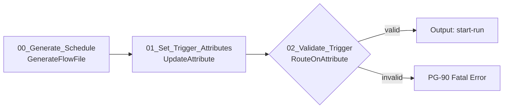

| ID | Processor | 핵심 설정 | Relationship |
|---|---|---|---|
| 00 | `GenerateFlowFile` | Primary only, CRON 또는 상위 scheduler 입력, Custom Text=`{}` | success→01 |
| 01 | `UpdateAttribute` | `load.job.key=#{JOB.KEY}`, `load.business.key=${now():format('yyyy-MM-dd','Asia/Seoul')}`, `load.trigger.type=SCHEDULE` | success→02 |
| 02 | `RouteOnAttribute` | 업무키 형식과 필수값 검증 | valid→PG-10, unmatched→Fatal |

외부에서 업무일자를 전달받는 경우 `HandleHttpRequest` 등을 직접 worker에 연결하지 않고 인증된 상위 orchestration flow가 이 Process Group의 Input Port를 호출하도록 한다.

---

## 7. PG-10 Run Coordinator

### 7.1 Processor 흐름

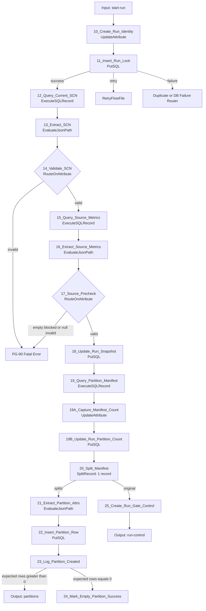

### 7.2 주요 Processor 설정

| ID | Processor | Scheduling | 주요 Properties |
|---|---|---|---|
| 10 | `UpdateAttribute` | Primary, 1 | `load.run.id=${UUID()}`, `load.started.at=${now():format("yyyy-MM-dd'T'HH:mm:ss.SSSX","UTC")}`, run HDFS path와 stage table 계산 |
| 11 | `PutSQL` | Primary, 1 | `CS_DBCP_META`, Batch Size=1, SQL Statement 사용, `(job_key,business_key,active_flag)` unique lock |
| 12 | `ExecuteSQLRecord` | Primary, 1 | Oracle pool, SQL=`SELECT current_scn AS SNAPSHOT_SCN FROM v$database`, JSON array writer |
| 13 | `EvaluateJsonPath` | Primary, 1 | `load.snapshot.scn=$[0].SNAPSHOT_SCN`, Destination=`flowfile-attribute` |
| 14 | `RouteOnAttribute` | Primary, 1 | `${load.snapshot.scn:matches('^[0-9]+$')}` |
| 15 | `ExecuteSQLRecord` | Primary, 1 | 아래 source metric SQL, JSON array writer, timeout 적용 |
| 16 | `EvaluateJsonPath` | Primary, 1 | count/min/max/null/DQ 값을 attribute로 추출 |
| 17 | `RouteOnAttribute` | Primary, 1 | empty source, NULL split 정책, min/max 유효성 분기 |
| 18 | `PutSQL` | Primary, 1 | SCN/metrics 저장 후 Run을 `EXTRACTING`으로 갱신; 상태 이력에는 `SNAPSHOT_FIXED` 이벤트도 기록 |
| 19 | `ExecuteSQLRecord` | Primary, 1 | 동일 SCN에서 range와 expected row count 생성; Max Rows Per FlowFile=0, Output Batch Size=0 |
| 19A | `UpdateAttribute` | Primary, 1 | `load.partition.count=${record.count}`; SplitRecord 전에 보존 |
| 19B | `PutSQL` | Primary, 1 | Run의 `EXPECTED_PARTITION_COUNT` 저장; Support Fragmented Transactions=false, Batch Size=1 |
| 20 | `SplitRecord` | Primary, 1 | Reader=JSON, Writer=JSON line, Records Per Split=1 |
| 21 | `EvaluateJsonPath` | Primary, 1 | partition id/lower/upper/expected/null flag 추출 |
| 22 | `PutSQL` | Primary, 1 | manifest 행 INSERT, unique(run_id,partition_id) |
| 24 | `PutSQL` | Primary, 1 | 0건 파티션은 `SUCCESS`, actual=0으로 즉시 완료 |
| 25 | `UpdateAttribute` + `ReplaceText` | Primary, 1 | control content를 `{}`로 축소; 분할 전 저장한 `load.partition.count` 유지 |

중복 Run lock INSERT 실패는 일반 DB 장애와 구분해야 한다. SQLState/벤더코드로 unique violation이면 `DUPLICATE_ACTIVE_RUN`으로 종료하고, 연결 장애만 제한 재시도한다.

### 7.3 Source metric SQL

`snapshot_scn`은 숫자 검증을 마친 시스템 생성 값이다. 업무값은 bind parameter를 사용한다.

```sql
SELECT COUNT(*) AS SOURCE_COUNT,
       MIN(INSP_DTL_SEQ) AS MIN_SEQ,
       MAX(INSP_DTL_SEQ) AS MAX_SEQ,
       SUM(CASE WHEN INSP_DTL_SEQ IS NULL THEN 1 ELSE 0 END) AS NULL_SEQ_COUNT,
       COUNT(DISTINCT INSP_DTL_SEQ) AS DISTINCT_SEQ_COUNT
  FROM APP.INSP_DTL AS OF SCN ${load.snapshot.scn}
 WHERE BASE_DT = ?
```

```text
sql.args.1.type  = #{SRC.BUSINESS.KEY.TYPE}
sql.args.1.value = ${load.business.key}
```

실제 구현에서는 `APP.INSP_DTL`, 컬럼, WHERE 부분을 Job Parameter로 치환한다.

### 7.4 Manifest SQL 원칙

Oracle `CONNECT BY LEVEL <= #{PARTITION.COUNT}` 또는 관리 DB에서 경계를 생성한다. 모든 파티션은 다음 규칙을 만족해야 한다.

```text
0..N-2 : split_column >= lower AND split_column < upper
N-1    : split_column >= lower AND split_column <= upper
NULL    : split_column IS NULL, SPLIT.NULL.POLICY=SEPARATE일 때만
```

각 range의 `EXPECTED_ROW_COUNT`를 동일 SCN에서 계산한다. 0건 range는 Worker에 보내지 않고 manifest에서 바로 성공 처리한다. Manifest 생성 후 아래 불변식을 확인한다.

```text
SUM(expected_row_count) = source_count
AND range overlap count = 0
AND range gap count = 0
```

불변식 불일치는 `FAILED_MANIFEST`이며 Worker를 시작하지 않는다. 0건 파티션을 24에서 성공 처리할 때도 `${load.run.id}`의 `partitions` counter를 1 증가시켜 Run Wait가 불필요하게 만료될 때까지 기다리지 않게 한다.

---

## 8. PG-20 Oracle Extract Workers

### 8.1 Processor 흐름

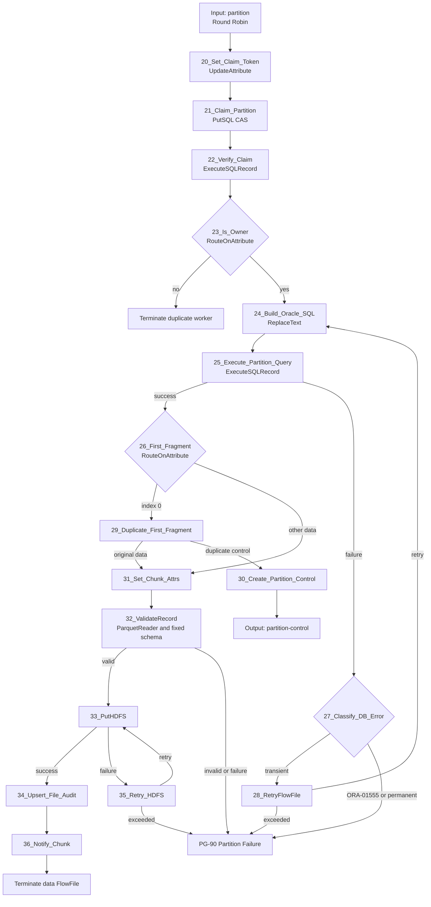

### 8.2 Claim 구현

20에서 `partition.claim.token=${UUID()}`를 생성한다. 21은 다음 조건부 갱신을 실행한다.

```sql
UPDATE NIFI_LOAD_PARTITION
   SET status='RUNNING',
       claim_token=?,
       worker_node=?,
       attempt_count=attempt_count+1,
       started_at=CURRENT_TIMESTAMP
 WHERE run_id=?
   AND partition_id=?
   AND status IN ('PENDING','RETRY');
```

`PutSQL`은 영향 행 수를 성공/실패 판정에 사용하지 않으므로 22에서 `run_id + partition_id`를 조회한다. 조회된 `claim_token`이 현재 FlowFile과 일치하고 Run 상태가 `EXTRACTING`일 때만 진행한다. 이 패턴이 동일 파티션의 이중 Worker를 막는다.

### 8.3 Extract SQL 생성

중간 파티션:

```sql
SELECT #{SRC.COLUMNS}
  FROM #{SRC.OWNER}.#{SRC.TABLE} AS OF SCN ${load.snapshot.scn}
 WHERE #{SRC.BASE.WHERE}
   AND #{SRC.SPLIT.COLUMN} >= ?
   AND #{SRC.SPLIT.COLUMN} < ?
```

마지막 파티션은 `< ?` 대신 `<= ?`, NULL 파티션은 `IS NULL`을 사용한다.

```text
sql.args.1 = business key
sql.args.2 = lower bound, NUMERIC(2)
sql.args.3 = upper bound, NUMERIC(2)
```

24 `ReplaceText`는 Entire text를 위 SQL로 치환한다. 25 `ExecuteSQLRecord` 설정은 다음과 같다.

| Property | 값 |
|---|---|
| Database Connection Pooling Service | `CS_DBCP_ORACLE` |
| SQL select query | 빈 값, FlowFile content 사용 |
| Record Writer | `CS_PARQUET_WRITER` |
| Fetch Size | `#{EXTRACT.FETCH.SIZE}` |
| Max Rows Per FlowFile | `#{EXTRACT.ROWS.PER.FILE}` |
| Output Batch Size | `0` |
| Max Wait Time | `#{EXTRACT.QUERY.TIMEOUT}` |
| Concurrent Tasks | `#{WORKER.CONCURRENT.TASKS}` |
| Execution | All Nodes |

`Output Batch Size=0`이어야 한 ResultSet의 `fragment.count`, `fragment.index`, `fragment.identifier`가 완전하게 생성된다. 파티션 크기가 너무 커 session/repository 압력이 생기면 Output Batch를 켜기보다 논리 파티션 수를 늘린다.

### 8.4 Chunk 기록

31에서 다음 속성을 만든다.

```text
chunk.index        = ${fragment.index:padLeft(6,'0')}
chunk.record.count = ${record.count}
filename           = part-${partition.id}-${chunk.index}.parquet
load.hdfs.part.path = ${load.hdfs.path}/part=${partition.id}
```

33 `PutHDFS`:

| Property | 값 |
|---|---|
| Hadoop Configuration Resources | `#{HADOOP.CONF.FILES}` |
| Kerberos User Service | `CS_KERBEROS_HDFS` |
| Directory | `${load.hdfs.part.path}` |
| Conflict Resolution Strategy | `replace` |
| Writing Strategy | `Write and rename` |
| Concurrent Tasks | Worker 동시성과 HDFS 부하에 맞춰 설정 |

`replace`는 run 전용 경로와 결정적 파일명인 경우에만 허용한다.

34는 `(run_id, partition_id, chunk_index)` unique key로 `NIFI_LOAD_FILE`을 upsert한다. 저장 값은 `record.count`, `absolute.hdfs.path`, file size, fragment count, status=`WRITTEN`이다. 동일 chunk 재시도는 같은 행을 갱신한다.

32 `ValidateRecord`는 Reader=`CS_PARQUET_READER`, validation schema=`CS_SCHEMA_REGISTRY`의 승인 버전, Writer=`CS_PARQUET_WRITER`로 설정한다. `invalid` 또는 `failure`가 한 건이라도 발생하면 해당 partition 전체를 실패시킨다. 대용량 재직렬화 비용이 허용되지 않으면 이 Processor를 제거할 수 있지만, 그 경우 동일 schema 검증을 staging Hive 조회에서 필수로 수행한다.

36 `Notify`:

```text
Release Signal Identifier = ${load.run.id}:${partition.id}
Signal Counter Name       = chunks
Signal Counter Delta      = 1
Attribute Cache Regex     = ^(load\.run\.id|partition\.id)$
```

Notify 중복이나 cache 유실이 있어도 PG-30은 반드시 DB file audit를 재검증한다.

---

## 9. PG-30 Partition and Run Gate

### 9.1 Processor 흐름

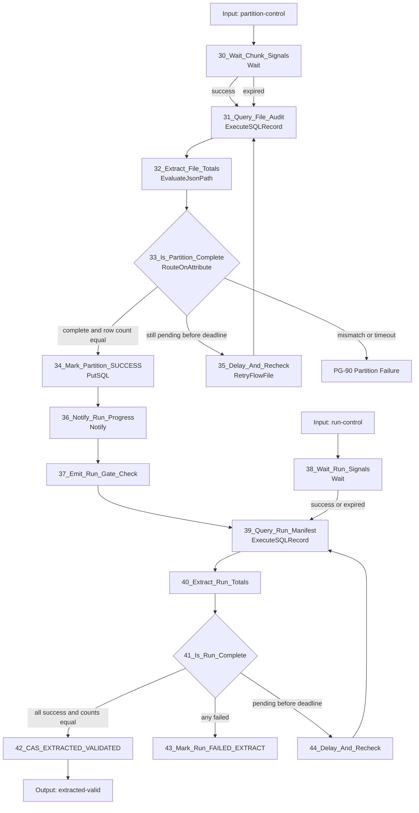

30 `Wait` 설정:

```text
Release Signal Identifier = ${load.run.id}:${partition.id}
Signal Counter Name       = chunks
Target Signal Count       = ${fragment.count}
Expiration Duration       = #{PARTITION.WAIT.TIMEOUT}
Wait Mode                 = Keep in upstream connection
```

Connection에는 FIFO Prioritizer를 설정한다. `expired`도 즉시 실패시키지 않고 DB를 조회한다. cache가 유실되었지만 HDFS와 audit가 모두 성공했을 수 있기 때문이다.

38 `Wait` 설정:

```text
Release Signal Identifier = ${load.run.id}
Signal Counter Name       = partitions
Target Signal Count       = ${load.partition.count}
Expiration Duration       = #{RUN.WAIT.TIMEOUT}
Wait Mode                 = Keep in upstream connection
```

38의 `expired`도 39로 연결한다. cache 신호가 없거나 중복되어도 run manifest의 상태와 count만이 최종 판정 기준이다.

33 완료 조건:

```text
audit.file_count = fragment.count
AND audit.row_count = partition.expected.rows
AND audit.failed_file_count = 0
AND run.status = EXTRACTING
```

34는 claim token과 현재 상태까지 조건으로 `SUCCESS`를 갱신한다. 완료 후 36은 run key로 progress signal을 보낸다.

```text
Release Signal Identifier = ${load.run.id}
Signal Counter Name       = partitions
Signal Counter Delta      = 1
```

41의 최종 완료 조건은 다음 SQL 결과로만 판정한다.

```text
total_partition_count = expected_partition_count
success_partition_count = expected_partition_count
failed_partition_count = 0
pending_partition_count = 0
SUM(actual_row_count) = source_count
```

`Wait/Notify` counter 값만으로 42로 갈 수 없다. 42는 `status='EXTRACTING'` 조건의 CAS update로 `EXTRACTED_VALIDATED`를 선점한다.

Partition failure 공통 경로는 partition과 run을 실패 상태로 갱신한 뒤 별도의 `run-gate-check` FlowFile을 39로 보낸다. 따라서 다른 파티션 신호를 모두 기다리지 않고 `failed_partition_count > 0`을 확인해 조기에 전체 실패시킬 수 있다.

---

## 10. PG-40 Staging Validation

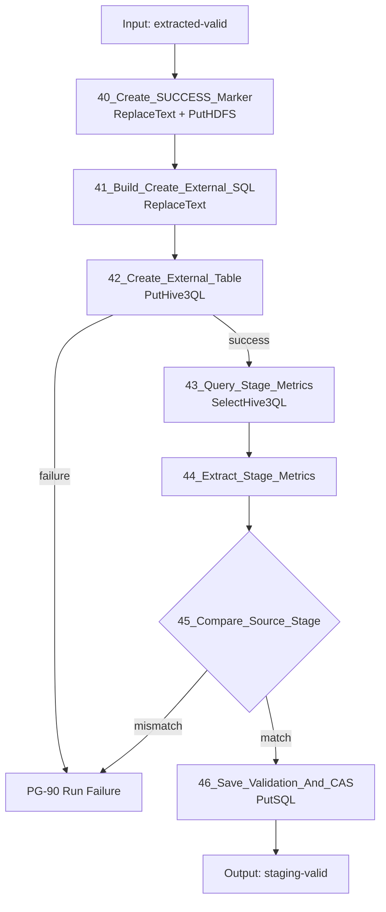

40은 기존 control FlowFile의 content를 `ReplaceText`로 비우고 `filename=_SUCCESS`를 설정한 뒤 run root에 `Write and rename`으로 기록한다. FlowFile attribute는 유지되므로 PutHDFS 성공 관계에서 바로 41로 진행한다. 이 파일은 global manifest 검증 후에만 존재한다.

41의 예시 SQL:

```sql
CREATE EXTERNAL TABLE #{HIVE.STAGE.DB}.${load.stage.table} (
  #{HIVE.STAGE.DDL.COLUMNS}
)
STORED AS PARQUET
LOCATION '${load.hdfs.path}'
```

`load.stage.table`은 `${load.run.id}`에서 하이픈을 제거한 안전한 suffix만 사용하고 정규식으로 검증한다.

42는 `PutHive3QL` 또는 설치 환경에서 권장되는 `PutClouderaHiveQL`을 사용한다. 43은 `SelectHive3QL` 계열 Processor가 제공되면 사용하고, 환경 표준이 Hive JDBC라면 `ExecuteSQLRecord + CS_HIVE3_DBCP`로 대체한다.

필수 stage 지표:

```sql
SELECT COUNT(*) AS STAGE_COUNT,
       SUM(CASE WHEN INSP_DTL_SEQ IS NULL THEN 1 ELSE 0 END) AS NULL_SEQ_COUNT,
       COUNT(*) - COUNT(DISTINCT <BUSINESS_PK>) AS DUP_PK_COUNT,
       MIN(INSP_DTL_SEQ) AS MIN_SEQ,
       MAX(INSP_DTL_SEQ) AS MAX_SEQ,
       SUM(<BUSINESS_AMOUNT>) AS AMOUNT_SUM
  FROM #{HIVE.STAGE.DB}.${load.stage.table}
```

46은 `NIFI_LOAD_VALIDATION`에 지표별 PASS/FAIL을 저장하고, 모두 PASS일 때만 `STAGING_VALIDATED`로 CAS 갱신한다.

---

## 11. PG-50 Publish

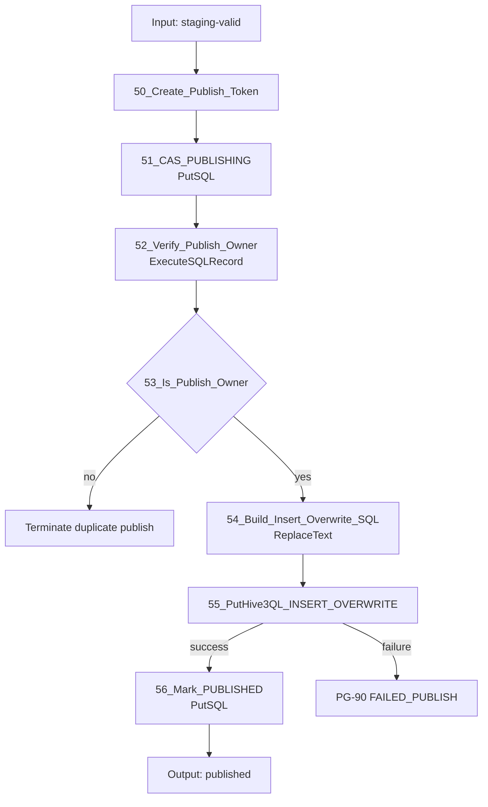

50에서 `publish.token=${UUID()}`를 만들고 51에서 다음 CAS를 수행한다.

```sql
UPDATE NIFI_LOAD_RUN
   SET status='PUBLISHING', publish_token=?, publish_started_at=CURRENT_TIMESTAMP
 WHERE run_id=?
   AND status='STAGING_VALIDATED';
```

52에서 token 소유권을 재조회하여 한 FlowFile만 55로 진입한다.

54 SQL 예시:

```sql
INSERT OVERWRITE TABLE #{HIVE.TARGET.DB}.#{HIVE.TARGET.TABLE}
#{TARGET.PARTITION.CLAUSE}
SELECT #{HIVE.INSERT.COLUMNS}
  FROM #{HIVE.STAGE.DB}.${load.stage.table}
```

전체 테이블이 아니라 업무일자 파티션만 교체해야 한다면 `TARGET.PARTITION.CLAUSE`를 반드시 설정한다. SQL에는 FlowFile에서 받은 임의 identifier를 사용하지 않는다.

55 설정:

| Property | 값 |
|---|---|
| Hive Database Connection Pooling Service | `CS_HIVE3_DBCP` |
| Query Timeout | 업무 SLA보다 크고 무한대는 피함 |
| Rollback On Failure | Processor 제공 시 true |
| Concurrent Tasks | 1 |
| Execution | Primary Node |

Hive 응답을 받지 못해 성공 여부가 불명확한 timeout은 자동 재실행하지 않고 `PUBLISH_UNKNOWN`으로 기록한다. Recovery Monitor가 Hive query history와 target 지표를 확인한 후 운영 정책에 따라 확정한다.

---

## 12. PG-60 Target Validation

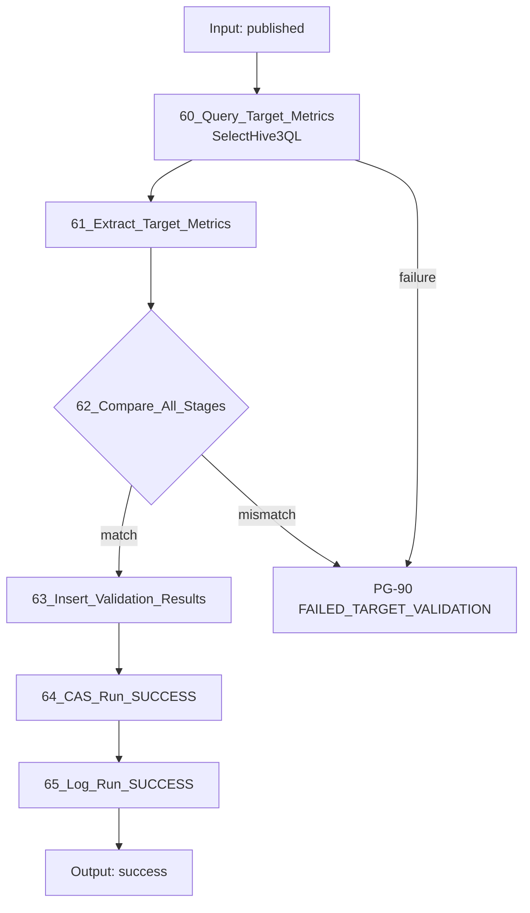

62 조건:

```text
target_count = stage_count = extracted_count = source_count
AND target key/null/duplicate metrics pass
AND target business aggregates = stage/source aggregates
```

64는 `status='PUBLISHED'` 조건에서만 `SUCCESS`로 갱신하고 완료시각과 모든 count를 저장한다. Target 검증 실패 시 재추출이나 overwrite를 자동 반복하지 않는다.

---

## 13. PG-70 Recovery Monitor

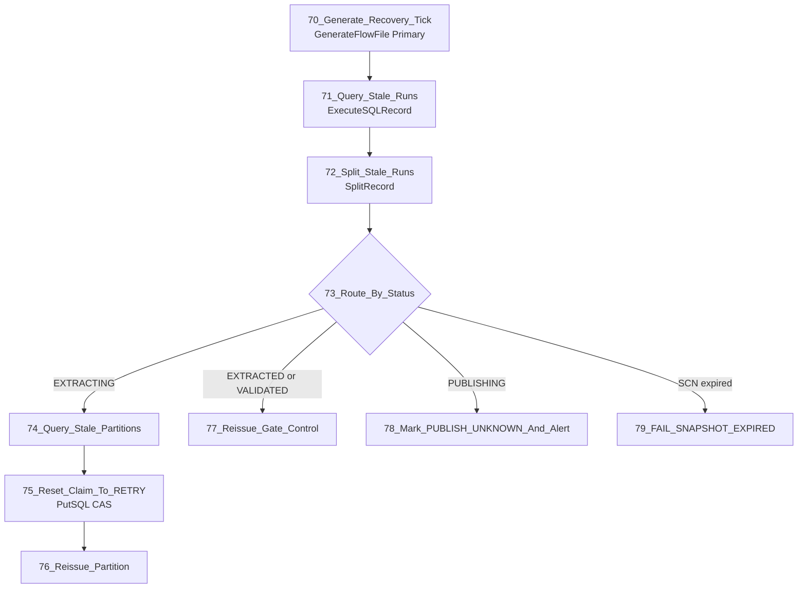

- Primary Node, 5분 주기, Concurrent Tasks=1
- `heartbeat_at < now - #{RECOVERY.STALE.MINUTES}`인 활성 run만 조회
- stale partition은 현재 claim token과 timestamp를 조건으로 CAS reset
- 동일 `run_id + partition_id`와 같은 SCN으로만 재발행
- Oracle UNDO에서 SCN을 읽을 수 없으면 전체 run 실패
- `PUBLISHING`은 자동 `INSERT OVERWRITE` 재실행 금지

---

## 14. PG-90 Audit, Error and Notification

### 14.1 이벤트 흐름

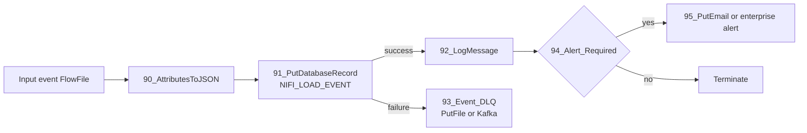

업무 상태를 바꾸는 `NIFI_LOAD_RUN/PARTITION/FILE/VALIDATION` 기록은 각 주 흐름에서 동기적으로 처리한다. PG-90 이벤트는 관측용이며, 이벤트 DB 장애가 데이터 FlowFile을 무한 정지시키지 않도록 로컬 보호 DLQ 또는 운영 Kafka로 보낸다.

### 14.2 `NIFI_LOAD_EVENT`

```sql
CREATE TABLE NIFI_LOAD_EVENT (
    EVENT_ID       VARCHAR(64) PRIMARY KEY,
    EVENT_TIME     TIMESTAMP NOT NULL,
    EVENT_LEVEL    VARCHAR(10) NOT NULL,
    EVENT_NAME     VARCHAR(80) NOT NULL,
    RUN_ID         VARCHAR(64),
    JOB_KEY        VARCHAR(200),
    BUSINESS_KEY   VARCHAR(200),
    PARTITION_ID   VARCHAR(20),
    CHUNK_INDEX    VARCHAR(20),
    PROCESS_GROUP  VARCHAR(100),
    PROCESSOR_NAME VARCHAR(150),
    NODE_ID        VARCHAR(200),
    ATTEMPT_NO     INTEGER,
    ROW_COUNT      BIGINT,
    BYTE_COUNT     BIGINT,
    DURATION_MS    BIGINT,
    ERROR_CLASS    VARCHAR(40),
    ERROR_CODE     VARCHAR(100),
    MESSAGE        VARCHAR(2000),
    DETAILS_JSON   TEXT
);
```

### 14.3 필수 이벤트

| Level | Event | 기록 시점 |
|---|---|---|
| INFO | `RUN_STARTED` | run lock 획득 |
| INFO | `SNAPSHOT_FIXED` | SCN/source metrics 확정 |
| INFO | `MANIFEST_CREATED` | partition manifest 완성 |
| INFO | `PARTITION_STARTED` | claim 성공 |
| DEBUG | `CHUNK_WRITTEN` | PutHDFS 성공; 운영 로그량에 따라 DB file audit만 유지 가능 |
| INFO | `PARTITION_SUCCESS` | 파티션 row/file 검증 성공 |
| ERROR | `PARTITION_FAILED` | 재시도 소진 또는 비일시 오류 |
| INFO | `EXTRACT_VALIDATED` | 전체 파티션 검증 성공 |
| INFO | `STAGE_VALIDATED` | external table 검증 성공 |
| INFO | `PUBLISH_STARTED` | publish CAS 획득 |
| INFO | `PUBLISH_FINISHED` | HiveQL 성공 응답 |
| ERROR | `PUBLISH_UNKNOWN` | timeout/연결 단절로 결과 불명 |
| INFO | `RUN_SUCCESS` | target 검증 완료 |
| ERROR | `RUN_FAILED` | 최종 실패 확정 |
| WARN | `RECOVERY_REISSUED` | stale partition 재발행 |

### 14.4 `LogMessage` 형식

```text
Log Prefix  = SQOOP_REPLACEMENT
Log Level   = ${event.level}
Log Message = {"event":"${event.name}","run_id":"${load.run.id}",
 "job_key":"${load.job.key}","business_key":"${load.business.key}",
 "partition_id":"${partition.id}","chunk_index":"${chunk.index}",
 "node":"${hostname(true)}","attempt":"${partition.retry.count}",
 "rows":"${event.row.count}","duration_ms":"${event.duration.ms}",
 "error_class":"${error.class}","error_code":"${error.code}",
 "message":"${error.message}"}
```

`error.message`는 줄바꿈 제거, 길이 제한 및 비밀값 마스킹 후 기록한다. SQL 본문 전체, JDBC URL의 credential, 원천 행 데이터는 로그에 기록하지 않는다.

### 14.5 오류 공통 경로

각 Processor의 failure 관계에는 먼저 전용 `UpdateAttribute`를 둔다.

```text
error.stage     = ORACLE_EXTRACT | HDFS_WRITE | STAGE_VALIDATE | PUBLISH ...
error.processor = 25_Execute_Partition_Query
error.class     = TRANSIENT | NON_RETRYABLE | VALIDATION | UNKNOWN
error.code      = processor가 제공한 SQLState/vendor code 또는 INTERNAL
error.message   = processor error attribute, 없으면 고정 설명
event.level     = ERROR
event.name      = PARTITION_FAILED 또는 RUN_FAILED
```

`ExecuteSQLRecord`의 `executesql.error.message`처럼 Processor가 제공하는 attribute를 사용한다. PutHDFS처럼 구체적인 오류 attribute가 없는 경우 `PutHDFS routed failure; see bulletin and provenance for run_id/partition_id`를 기록하고 NiFi Bulletin/Provenance와 상관 조회한다.

---

## 15. Connection과 Back Pressure

| Connection | Object threshold | Data threshold | 기타 |
|---|---:|---:|---|
| Coordinator → Worker | `2 × 전체 worker 수` 이상 | 제어 FlowFile이므로 100 MB | Round Robin |
| ExecuteSQLRecord → Validate/PutHDFS | 100~500 | HDFS 지연을 견디되 repository 용량의 20% 이하 | Oldest First |
| PutHDFS retry loop | 100 | 10 GB 예시 | RetryFlowFile penalty 사용 |
| Partition Wait | 예상 partition 수 × active run | 100 MB | FIFO Prioritizer |
| Run Wait | active run 수 | 10 MB | FIFO Prioritizer |
| Audit | 10,000 | 1 GB | 중요 이벤트 우선순위 가능 |

정확한 값은 평균 FlowFile 크기, Content Repository 용량, 동시 run 수로 산정한다. Back Pressure가 걸렸는데 Coordinator가 새 run을 계속 생성하지 않도록 활성 run lock을 유지한다.

### 15.1 `PutSQL`의 fragment 처리 주의사항

`SplitRecord`가 만든 partition FlowFile에는 `fragment.identifier/count/index`가 남는다. 따라서 다음 설정을 명시하지 않으면 일부 `PutSQL`이 모든 fragment가 모일 때까지 기다리는 의도치 않은 동작을 할 수 있다.

| 사용처 | Support Fragmented Transactions | Batch Size |
|---|---:|---:|
| 22 manifest 전체 INSERT | `true` | 전체 partition 수 이하의 적정값; 한 트랜잭션으로 manifest 생성 |
| Worker claim/update | `false` | 1 |
| File audit upsert | `false` | 1 또는 소규모 batch |
| Partition/Run 상태 CAS | `false` | 1 |
| Validation/Event INSERT | `false` | 처리량에 맞춤 |

Worker 이후의 FlowFile에는 Oracle query가 새로 설정한 fragment 속성도 있으므로, Worker 영역의 `PutSQL`에서는 항상 `Support Fragmented Transactions=false`를 명시한다.

---

## 16. Retry 분류

| 분류 | 예 | 동작 |
|---|---|---|
| 일시적 | connection reset, 일시 HDFS unavailable, DB pool timeout | 최대 `${PARTITION.RETRY.MAX}`, penalty/backoff 후 같은 partition 재시도 |
| 스냅샷 불가 | `ORA-01555`, snapshot too old | 즉시 전체 run 실패, 새 SCN 일부 재시도 금지 |
| 영구 SQL | ORA-00942, 문법/컬럼/권한 오류 | 즉시 실패 |
| 데이터 | schema 변환 실패, expected/actual mismatch | 즉시 실패 및 파일 격리 |
| 게시 불명 | Hive timeout, connection loss after submit | `PUBLISH_UNKNOWN`, 자동 overwrite 재실행 금지 |

`RetryFlowFile` 설정 예:

```text
Retry Attribute               = partition.retry.count
Maximum Retries               = #{PARTITION.RETRY.MAX}
Penalize Retries              = true
Fail on Non-numerical Overwrite = true
Reuse Mode                    = Fail on Reuse
```

Connection의 Penalty Duration으로 최소 backoff를 설정한다. 더 긴 지수 backoff가 필요하면 retry count별 `RouteOnAttribute`와 `ControlRate`/지연 queue를 사용한다.

---

## 17. 상태 변경과 게시 안전장치

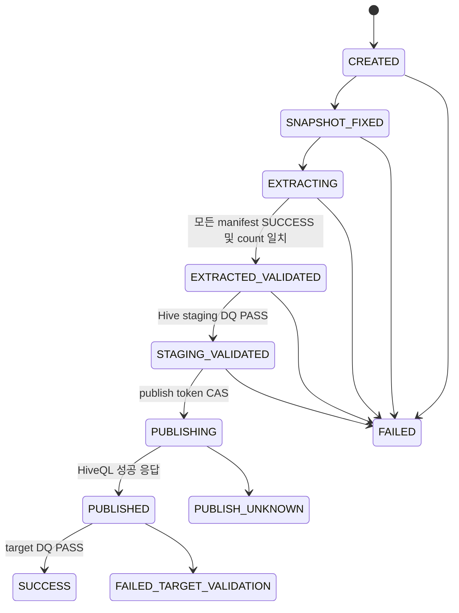

모든 상태 변경 SQL은 `WHERE run_id=? AND status=<expected>` 조건을 사용한다. publish token 소유권 검증, active run unique constraint, Primary Node scheduling을 함께 적용해 중복 게시를 방지한다.

---

## 18. NiFi 운영 설정

- 모든 Coordinator Processor: `Run Schedule=0 sec` 또는 입력 기반, `Concurrent Tasks=1`, `Execution=Primary Node`
- Worker: `Execution=All Nodes`, 입력 Connection Round Robin
- DB pool 상한: `노드 수 × worker concurrent tasks + control 여유`가 Oracle 승인 세션 수를 넘지 않게 설정
- Processor `Yield Duration`: DB/HDFS failure 폭주 방지를 위해 10~30초부터 시험
- Provenance: run/partition/chunk 상관 분석이 가능한 기간 유지
- Bulletin: ERROR/WARN 수집을 모니터링 시스템에 연계
- Parameter Context 변경 권한과 NiFi Policy를 운영자/개발자로 분리
- 민감 Parameter는 버전관리 flow JSON에 평문으로 포함하지 않음
- flow definition은 NiFi Registry 또는 조직 표준 Git 배포 절차로 승격

---

## 19. 구현 및 검증 순서

1. 관리 테이블과 unique/CAS 조건을 먼저 구현한다.
2. `PARTITION.COUNT=1`, 작은 기준 데이터로 source → HDFS만 구현한다.
3. 경계값, NULL, 0건, Oracle 타입을 검증한다.
4. chunk/file audit 및 partition gate를 구현한다.
5. 2/4/8 partition으로 늘려 병렬성과 DB 부하를 측정한다.
6. external staging DDL과 count/DQ를 구현한다.
7. 비운영 target에서 `INSERT OVERWRITE`와 복구 시험을 수행한다.
8. Target validation과 최종 상태를 연결한다.
9. 노드 종료, cache 초기화, NiFi 재기동, HDFS 오류, `ORA-01555`를 주입한다.
10. Recovery Monitor와 보존/정리 flow를 마지막에 활성화한다.

운영 승인 조건:

```text
파티션 하나가 실패하면 PutHive3QL 호출 건수는 0이다.
중복 FlowFile/Notify/cache 유실 후에도 manifest DB 검증 없이는 publish되지 않는다.
재기동 후 동일 run_id와 snapshot_scn으로만 복구된다.
source = partition sum = staging = target 검증이 모두 PASS인 경우만 SUCCESS이다.
PUBLISH_UNKNOWN은 사람 또는 별도 reconciliation 없이 자동 재실행되지 않는다.
```

---

## 20. Processor 지원 근거

- CFM 4.12.0 supported processors: https://docs.cloudera.com/cfm/4.12.0/release-notes/topics/cfm-supported-processors.html
- `ExecuteSQLRecord`: https://nifi.apache.org/components/org.apache.nifi.processors.standard.ExecuteSQLRecord/
- `PutSQL`: https://nifi.apache.org/components/org.apache.nifi.processors.standard.PutSQL/
- `SplitRecord`: https://nifi.apache.org/components/org.apache.nifi.processors.standard.SplitRecord/
- `Wait`: https://nifi.apache.org/components/org.apache.nifi.processors.standard.Wait/
- `Notify`: https://nifi.apache.org/components/org.apache.nifi.processors.standard.Notify/
- `PutHDFS`: https://nifi.apache.org/docs/nifi-docs/components/org.apache.nifi/nifi-hadoop-nar/1.28.0/org.apache.nifi.processors.hadoop.PutHDFS/
- `RetryFlowFile`: https://nifi.apache.org/components/org.apache.nifi.processors.standard.RetryFlowFile/
- `LogMessage`: https://nifi.apache.org/components/org.apache.nifi.processors.standard.LogMessage/
