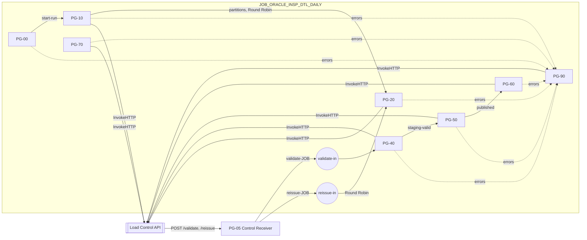
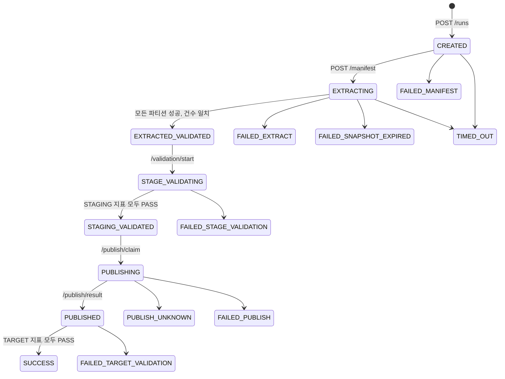

# NiFi Flow 설계

> 기준: Cloudera CFM 4.12(NiFi 2.6), Oracle → HDFS Parquet → Hive external staging → `INSERT OVERWRITE`.
> 상태 판정은 [Load Control API](./load-control-api-design.md)가 한다. 이 문서는 NiFi 쪽 설계다. 실제 구현은 빌더 `poc/build_flow_v4.py`이고, Processor 속성의 정확한 값은 빌더를 기준으로 한다.

## 1. 역할과 기본 개념

### 1.1 역할 분담

| 구성요소 | 하는 일 | 하지 않는 일 |
|---|---|---|
| NiFi | Oracle 조회, Parquet 변환, HDFS 기록, Hive DDL·지표 조회·`INSERT OVERWRITE`, 결과를 API에 보고 | 완료 판정, 상태 테이블 직접 쓰기 |
| Load Control API | 상태 원장 기록, 파티션·run 완료 판정, 검증 단계 호출(run당 1회), 소유권(CAS), 시간 초과 정리 | 원천·HDFS·Hive 접근 |
| PostgreSQL `nifi_ops` | 상태 원장. NiFi는 오류 이벤트(`load_event`)만 직접 INSERT | |

### 1.2 식별자

| 이름 | 의미 | 예 |
|---|---|---|
| `job_key` | 적재 Job의 고정 식별자 | `ORACLE_INSP_DTL_DAILY` |
| `business_key` | 이번 실행이 적재하는 업무 범위(업무일자) | `2026-09-28` |
| `run_id` | 한 번의 실행. API가 UUID로 발급 | `ca803dd4-...` |
| `snapshot_scn` | 이 run이 읽는 Oracle 시점 | `2388556` |
| `partition_id` | run 안의 범위 파티션 | `0000` ~ `0007` |
| chunk | 한 파티션 결과를 `EXTRACT.ROWS.PER.FILE` 행씩 나눈 Parquet 파일 하나 | `part-0003-000001.parquet` |

모든 FlowFile, 상태 테이블, 로그, HDFS 경로에 같은 `run_id`를 쓴다. run마다 경로가 다르므로 실패한 run의 파일이 다른 run이나 target에 섞이지 않는다. 재실행은 이전 run을 고치지 않고 새 `run_id`로 한다.

```text
#{HDFS.STAGE.ROOT}/<job_key>/run_id=<run_id>/part-<partition_id>-<chunk>.parquet
#{HDFS.STAGE.ROOT}/<job_key>/run_id=<run_id>/_SUCCESS
```

파일은 run 경로 바로 아래에 둔다(하위 디렉터리 없음). Hive external table의 `LOCATION`을 run 경로로 지정하면 바로 읽힌다.

### 1.3 같은 시점 읽기(SCN)

병렬 조회가 서로 다른 시점의 데이터를 읽지 않도록, run 시작 시 Oracle SCN을 하나 고정하고 원천 지표 계산과 모든 파티션 조회에 같은 `AS OF SCN`을 쓴다. 추출 전후 `COUNT(*)`가 같다는 것만으로는 같은 시점이 보장되지 않는다. undo가 run 시간보다 짧으면 `ORA-01555`가 나고 run은 `FAILED_SNAPSHOT_EXPIRED`가 된다.

### 1.4 범위 파티션

split 컬럼(예: `INSP_DTL_SEQ`)의 최소~최대를 `PARTITION.COUNT`개로 나눈다. 하한 포함·상한 미포함이고 마지막만 최댓값을 포함한다.

```text
partition 0   : seq >= b0   AND seq < b1
...
partition N-1 : seq >= bN-1 AND seq <= max
```

split 컬럼에 NULL이 있으면 API가 manifest를 거부한다(NULL 전용 파티션은 만들지 않는다). 0건인 파티션은 API가 바로 성공 처리해 Worker로 보내지 않는다.

## 2. Canvas 구조

```text
root
├── PG-05 Control Receiver        모든 Job 공통. 공통 Parameter Context
└── JOB_<JOB.KEY>                 Job PG. Job Parameter Context, Controller Service
    ├── PG-00 Trigger
    ├── PG-10 Run Coordinator
    ├── PG-20 Extract Worker
    ├── PG-40 Staging Validation
    ├── PG-50 Publish
    ├── PG-60 Target Validation
    ├── PG-70 Cleanup
    └── PG-90 Error and Event
```



| 연결 | 출발 → 도착 | Load Balance |
|---|---|---|
| `start-run` | PG-00 → PG-10 | 없음 |
| `partitions` | PG-10 → PG-20 | Round Robin |
| `validate-<JOB>` | root PG-05 → Job PG `validate-in` → PG-40 | 없음 |
| `reissue-<JOB>` | root PG-05 → Job PG `reissue-in` → PG-20 | Round Robin |
| `staging-valid` | PG-40 → PG-50 | 없음 |
| `published` | PG-50 → PG-60 | 없음 |
| `errors` | 각 자식 PG → PG-90 | 없음 |

### 2.1 실행 정책

| 영역 | 실행 노드 | 이유 |
|---|---|---|
| PG-00 00(Trigger), PG-70 70(정리 트리거) | Primary Node | 클러스터에서 노드마다 실행이 생기지 않게 |
| 그 밖의 모든 Processor | All Nodes | API는 NiFi 노드 하나(또는 LB)로 호출하므로 어느 노드가 받을지 모른다 |

중복 실행은 Primary Node가 아니라 API의 CAS가 막는다(8장). PG-20 Worker 동시성은 `노드 수 × 34 Concurrent Tasks`가 Oracle 승인 세션 수(`ORACLE.POOL.MAX`)를 넘지 않게 정한다.

### 2.2 구현 규칙

1. **재시도**: Processor 설정의 relationship 재시도(Retry Count, Penalize backoff)를 쓴다. `RetryFlowFile`은 쓰지 않는다. Retry Count는 Parameter를 참조할 수 없어 빌더가 정수로 넣는다(7장).
2. **오류 경로**: 단계 입구의 `UpdateAttribute`가 `load.stage`를 정하고, 모든 실패 relationship은 PG의 `errors` Port로 보낸다. 오류 정리와 실패 보고는 PG-90이 한다.
3. **API 요청 본문**: `ReplaceText`(Always Replace) 하나로 JSON을 만든다. 문자열 값은 `escapeJson()`으로 감싼다. 본문이 `{}`인 호출도 `ReplaceText`로 만든다(앞 단계 content가 본문으로 가지 않게).
4. **판정은 API가**: NiFi는 API 응답의 boolean(`claimed`, `started`, `stageValidated`, `success`)으로만 분기한다.
5. **이벤트**: 상태 변화 이벤트는 API가 기록한다. NiFi(PG-90)는 오류·경고만 기록한다.
6. **UpdateAttribute 평가 순서**: 한 `UpdateAttribute` 안에서 방금 만든 attribute를 참조하지 않는다(모든 속성은 들어온 attribute로 평가된다).
7. **Parameter와 EL**: EL 문자열 리터럴 안의 Parameter(`${x:equals('#{P}')}`, `literal('#{P}')`)는 치환되지 않는다. Parameter 값과 비교하려면 먼저 `UpdateAttribute`로 attribute에 옮긴다.
8. **SQL에 넣는 값**: SCN, 파티션 경계, 건수는 숫자 정규식으로, 테이블 이름은 형식 정규식으로 검사한 값만 SQL에 넣는다. 테이블·컬럼·조건 문자열은 Parameter Context에서만 받는다.

자식 PG는 Parameter Context를 상속하지 않으므로 Job PG와 모든 자식 PG에 같은 Job Context를 지정한다. Controller Service는 Job PG에 두고 자식 PG가 공유한다.

## 3. Parameter Context

이름: 공통 `PC_SQOOP_REPLACEMENT_COMMON`(root PG-05와 모든 Job이 공유), Job별 `PC_JOB_<JOB.KEY>`(공통을 상속). 값의 예와 설명은 `poc/config.v4.example.json`과 [매뉴얼](./poc/V4-MANUAL.md) 4장에 있다.

### 3.1 공통

| Parameter | 용도 |
|---|---|
| `CONTROL.API.URL`, `CONTROL.API.AUTHORIZATION`, `CONTROL.API.TIMEOUT` | API 주소(HTTP), `Bearer <token>` 전체(Sensitive), 응답 대기 |
| `CONTROL.LISTEN.PORT` | PG-05 수신 포트(모든 Job 공유) |
| `CLEANUP.BATCH` | PG-70이 한 번에 정리할 run 수 |
| `META.JDBC.*` | 관리 DB(PostgreSQL). PG-90 이벤트 INSERT 전용 |
| `ORACLE.JDBC.*`, `ORACLE.POOL.MAX` | 원천 Oracle 연결과 최대 연결 수 |
| `ORACLE.NUMBER.DEFAULT.PRECISION`, `ORACLE.NUMBER.DEFAULT.SCALE` | 정밀도 없는 `NUMBER`를 Parquet decimal로 쓸 때의 기본값(4.2) |
| `HADOOP.CONF.FILES`, `HDFS.STAGE.ROOT`, `HDFS.PERMISSIONS.UMASK` | HDFS 설정 파일, run 경로의 상위, 파일 umask |
| `HIVE.JDBC.URL`, `HIVE.JDBC.USER`, `HIVE.JDBC.PASSWORD`, `HIVE.POOL.MAX`, `HIVE.QUERY.TIMEOUT` | HiveServer2 연결(인증 없음) |
| `EXTRACT.FETCH.SIZE`, `EXTRACT.ROWS.PER.FILE`, `EXTRACT.QUERY.TIMEOUT` | 파티션 조회 fetch 크기, chunk 행 수, 쿼리 timeout |

### 3.2 Job별

| Parameter | 용도 |
|---|---|
| `JOB.KEY` | Job 식별자. Job PG·Context 이름, HDFS 경로, PG-05 수신 경로에 쓰인다 |
| `BUSINESS.KEY` | 실행할 업무일자(`YYYY-MM-DD`) |
| `SRC.OWNER`, `SRC.TABLE`, `SRC.COLUMNS` | 원천 테이블과 추출 컬럼(순서 고정). 정밀도 없는 `NUMBER`는 `CAST(... AS NUMBER(p,s))` |
| `SRC.SPLIT.COLUMN`, `PARTITION.COUNT` | 분할 컬럼(숫자)과 파티션 수 |
| `SRC.BASE.WHERE` | 업무 조건. `${load.business.key}`로 업무일자를 참조 |
| `ALLOW.EMPTY.SOURCE` | 원천 0건 허용 여부(기본 false: 0건이면 manifest 거부) |
| `DQ.AMOUNT.COLUMN`, `DQ.TIMESTAMP.COLUMN`, `DQ.PK.COLUMN` | 금액 합계, 시각 최소·최대, PK 중복 지표 컬럼 |
| `HIVE.STAGE.DB`, `HIVE.STAGE.TABLE.PREFIX`, `HIVE.STAGE.DDL.COLUMNS` | staging DB, 테이블 접두사, 컬럼 정의 |
| `HIVE.TARGET.DB`, `HIVE.TARGET.TABLE`, `TARGET.PARTITION.CLAUSE`, `HIVE.INSERT.COLUMNS` | 게시 대상, 교체할 파티션, 넣을 컬럼 |
| `TARGET.BUSINESS.WHERE` | target 검증 범위. 교체한 파티션과 같아야 한다 |

업무일자를 JDBC bind parameter(`sql.args.N`)로 넘기지 않는다. 그 attribute가 FlowFile을 따라가 이후 다른 SQL에 잘못 적용될 수 있다. 대신 PG-00에서 형식을 정규식으로 고정하고 EL로 넣는다.

run timeout, stale 기준, 재전송 같은 제어 설정은 NiFi가 아니라 API 설정(`config.yaml`)이다.

## 4. Controller Service와 데이터 타입

### 4.1 Controller Service

| 이름 | 구현 | 용도 |
|---|---|---|
| `CS_DBCP_ORACLE` | `HikariCPConnectionPool` | 원천 Oracle. `oracle.jdbc.OracleDriver`, 검사 쿼리 `SELECT 1 FROM DUAL` |
| `CS_DBCP_META` | `HikariCPConnectionPool` | 관리 DB. PG-90 `load_event` INSERT 전용 |
| `CS_HIVE3_DBCP` | `ClouderaHiveConnectionPool`(CFM 전용) | HiveServer2. `PutClouderaHiveQL`과 `ExecuteSQLRecord`가 같이 쓴다. URL에 `hive.resultset.use.unique.column.names=false` 필수(없으면 결과 컬럼에 테이블 별칭이 붙는다) |
| `CS_JSON_WRITER_ARRAY` | `JsonRecordSetWriter` | SQL 결과를 JSON 배열로 |
| `CS_PARQUET_WRITER` | `ParquetRecordSetWriter` | 추출 chunk(SNAPPY) |
| `CS_HTTP_CONTEXT_MAP` | `StandardHttpContextMap` | root PG-05 안에 있다 |

Apache NiFi에는 Hive 구성요소가 없다. 이 Flow는 CFM이 필요하다.

### 4.2 타입과 시간대

| Oracle | Parquet | Hive DDL |
|---|---|---|
| `NUMBER(p,s)`, `CAST(... AS NUMBER(p,s))` | `decimal(p,s)` | `DECIMAL(p,s)` |
| `NUMBER`(정밀도 없음) | `decimal(ORACLE.NUMBER.DEFAULT.PRECISION, SCALE)` | 같은 값 |
| `DATE`, `TIMESTAMP` | `timestamp(ms)` | `TIMESTAMP` |
| `VARCHAR2` | string | `STRING` |

- 추출 `ExecuteSQLRecord`는 `Use Avro Logical Types=true`여야 한다. 아니면 날짜·decimal이 문자열이 된다.
- 정밀도 없는 `NUMBER`는 소수 자릿수가 scale보다 많으면 **오류 없이 반올림**되고, 정수부가 precision − scale을 넘으면 파티션이 실패한다. 그래서 `SRC.COLUMNS`에서 CAST로 정밀도를 명시한다.
- 시간대 없는 `DATE`/`TIMESTAMP`는 NiFi JVM 시간대로 해석되어 UTC로 저장된다. **NiFi JVM 시간대와 Hive `hive.local.time.zone`을 같게** 둔다. 다르면 건수는 같아도 `MIN_TS`/`MAX_TS` 지표가 FAIL이 된다. 마이크로초 이하는 버려진다.

## 5. Process Group별 설계

각 표의 번호는 Processor 이름의 앞자리다(예: 34 = `34_Execute_Partition_Query`). 모든 Processor에는 한글 Comment가, 모든 PG에는 역할·흐름을 적은 Label이 있다.

### 5.1 PG-00 Trigger

| 번호 | Processor | 하는 일 |
|---|---|---|
| 00 | `GenerateFlowFile` | 실행 시작(Primary Node, DISABLED로 배포) |
| 01 | `UpdateAttribute` | `load.job.key`, `load.business.key=#{BUSINESS.KEY}`, `load.stage=RUN_CREATE` |
| 02 | `RouteOnAttribute` | 업무일자가 `^[0-9]{4}-[0-9]{2}-[0-9]{2}$`인지 검사. 업무일자는 SQL에 들어가므로 이 검사가 SQL 주입을 막는다 |

### 5.2 PG-10 Run Coordinator

| 번호 | Processor | 하는 일 |
|---|---|---|
| 11·12 | `ReplaceText`, `InvokeHTTP` | `POST /runs`로 run 생성. 같은 업무일자의 진행 중 run이 있으면 409 `DUPLICATE_ACTIVE_RUN` |
| 13 | `UpdateAttribute` | 응답의 `runId`, `hdfsRunPath`, `stageTable`을 attribute로. `load.stage=MANIFEST` |
| 14·15 | `ExecuteSQLRecord`, `EvaluateJsonPath` | `SELECT TO_CHAR(CURRENT_SCN) FROM V$DATABASE`로 SCN 고정(권한이 없으면 `DBMS_FLASHBACK.GET_SYSTEM_CHANGE_NUMBER`) |
| 16 | `ExecuteSQLRecord` | 원천 지표와 파티션 경계·예상 건수를 SQL 한 문장으로 계산(아래) |
| 17·18 | `JoltTransformJSON`, `InvokeHTTP` | 결과를 manifest 요청으로 바꿔 `POST /runs/{id}/manifest` |
| 19·20 | `SplitJson`, `EvaluateJsonPath` | API가 돌려준 실행 대상 파티션(`dispatchPartitions`)을 하나씩 나눠 PG-20으로 |

16의 SQL(요약). 지표와 파티션 건수를 한 문장에서 같은 SCN으로 계산하므로 같은 시점 값이다.

```sql
WITH m AS (     -- 원천 지표
  SELECT COUNT(*) AS source_count, COUNT(*) - COUNT(#{SRC.SPLIT.COLUMN}) AS null_cnt,
         NVL(MIN(#{SRC.SPLIT.COLUMN}), 0) AS mn, NVL(MAX(#{SRC.SPLIT.COLUMN}), 0) AS mx,
         NVL(SUM(#{DQ.AMOUNT.COLUMN}), 0) AS amount_sum,
         MIN(#{DQ.TIMESTAMP.COLUMN}) AS min_ts, MAX(#{DQ.TIMESTAMP.COLUMN}) AS max_ts
    FROM #{SRC.OWNER}.#{SRC.TABLE} AS OF SCN <SCN>
   WHERE #{SRC.BASE.WHERE}
), g AS (SELECT LEVEL - 1 AS pid FROM DUAL CONNECT BY LEVEL <= #{PARTITION.COUNT}),
   b AS (-- 파티션 경계: mn~mx를 PARTITION.COUNT개로)
   ...
), c AS (-- 경계마다 같은 SCN으로 예상 건수
   ...
)
SELECT PARTITION_ID, LOWER_BOUND, UPPER_BOUND, UPPER_INCLUSIVE, EXPECTED_ROW_COUNT,
       SNAPSHOT_SCN, SOURCE_COUNT, AMOUNT_SUM, MIN_TS, MAX_TS, ...   -- 모두 TO_CHAR 문자열
```

- 숫자·SCN은 `TO_CHAR` 문자열로 돌려준다(큰 수가 JSON 숫자로 바뀌며 정밀도를 잃지 않게). Oracle 결과 컬럼 이름은 대문자다.
- `MIN_TS`/`MAX_TS`는 `YYYY-MM-DD HH24:MI:SS` 형식이고 staging·target 지표도 같은 형식으로 만든다.
- `(업무 조건 컬럼, split 컬럼)` 인덱스가 있어야 파티션별 건수 계산이 범위 스캔으로 끝난다. 없으면 `GROUP BY`/`WIDTH_BUCKET` 방식으로 바꾼다.
- API는 manifest를 받으면 `파티션 건수 합계 = 원천 건수`, 경계 연속성, 0건 허용 여부를 검사한다. 어긋나면 run을 `FAILED_MANIFEST`로 만들고 422를 준다.
- run을 만든 뒤 실패하면 PG-90이 `FAILED_MANIFEST`로 보고한다. 보고하지 않으면 run이 남아 같은 업무일자를 다시 실행할 수 없다.

### 5.3 PG-20 Extract Worker

| 번호 | Processor | 하는 일 |
|---|---|---|
| 30·31·32 | `UpdateAttribute`, `ReplaceText`, `InvokeHTTP` | claim token(UUID)을 만들고 `POST .../partitions/{pid}/claim`. `load.stage=EXTRACT` |
| 33 | `RouteOnAttribute` | `claimed=true`이고 경계·SCN이 숫자일 때만 진행. `claimed=false`는 정상 경합이므로 조용히 끝낸다 |
| 34 | `ExecuteSQLRecord` | 파티션 조회 → Parquet chunk. **재시도하지 않는다** |
| 35 | `UpdateAttribute` | 파일 이름 `part-<pid>-<chunk 6자리>.parquet`, `load.stage=CHUNK_WRITE` |
| 36 | `PutHDFS` | run 경로에 기록(Write and rename, conflict=replace). 실패 시 3회 재시도 |
| 37·38 | `ReplaceText`, `InvokeHTTP` | chunk마다 `POST .../chunks` 보고. 응답으로 분기하지 않는다(판정은 API) |

34의 SQL:

```sql
SELECT #{SRC.COLUMNS}
  FROM #{SRC.OWNER}.#{SRC.TABLE} AS OF SCN ${load.snapshot.scn}
 WHERE #{SRC.BASE.WHERE}
   AND #{SRC.SPLIT.COLUMN} >= ${partition.lower}
   AND #{SRC.SPLIT.COLUMN} ${partition.upper.inclusive:equals('true'):ifElse('<=','<')} ${partition.upper}
```

34 주요 설정: Fetch Size `#{EXTRACT.FETCH.SIZE}`, Max Rows Per Flow File `#{EXTRACT.ROWS.PER.FILE}`, **Output Batch Size 0**(그래야 모든 chunk에 `fragment.count`가 붙는다), Max Wait Time `#{EXTRACT.QUERY.TIMEOUT}`, Use Avro Logical Types true, Default Decimal Precision/Scale은 4.2의 Parameter.

- 30은 token만 만들고 본문은 31에서 만든다(2.2 규칙 6). 재시도는 같은 FlowFile, 같은 token으로 가므로 API가 같은 token의 재요청을 성공으로 돌려준다.
- 37은 PutHDFS **성공 후에** content를 보고 JSON으로 바꾼다. 그 전에 보고하면 Parquet가 요청 본문으로 간다.

```json
{"claimToken":"...","chunkIndex":0,"chunkCount":3,"fragmentIdentifier":"...",
 "hdfsPath":"<run 경로>/part-0003-000000.parquet","recordCount":15000,"byteCount":211588}
```

- 쿼리가 도는 동안(최대 `EXTRACT.QUERY.TIMEOUT`)은 API에 보고가 없다. API의 stale 기준은 이 시간보다 길어야 한다.
- 파티션 실패 보고는 PG-90이 한다(5.9).

### 5.4 PG-05 Control Receiver(root 공통)

API worker가 NiFi를 호출하는 입구다. 한 포트는 `HandleHttpRequest` 하나만 열 수 있으므로 root에 하나 두고 경로의 `JOB.KEY`로 Job PG에 나눠 보낸다.

| 번호 | Processor | 하는 일 |
|---|---|---|
| 05 | `HandleHttpRequest` | `#{CONTROL.LISTEN.PORT}`에서 `POST /(validate\|reissue)/(<등록된 JOB.KEY들>)`만 받는다. 나머지 경로는 404 |
| 06·07 | `RouteOnAttribute`, `HandleHttpResponse` | `X-Run-Id`, `X-Dispatch-Id`가 UUID가 아니면 400 |
| 08 | `HandleHttpResponse` | 바로 202 응답(검증은 오래 걸리므로 연결을 붙잡지 않는다) |
| 09 | `EvaluateJsonPath` | 본문의 runId, dispatchId, 재발행 필드(파티션·SCN 등)를 attribute로 |
| 10 | `RouteOnAttribute` | `validate.<JOB>`, `reissue.<JOB>` route로 Job별 Output Port에 보낸다 |

- 처리 확인(ACK)은 202가 아니라 PG-40의 `/validation/start`(또는 재발행이면 PG-20의 claim)다. 202 직후 노드가 죽어 FlowFile이 사라지면 API가 ACK timeout 뒤 다시 보낸다.
- 오류 기록 Processor는 두지 않는다. 400·unmatched는 API가 다시 보내고, 계속 실패하면 API가 `DISPATCH_DEAD`로 알린다.
- Job 등록·해제는 빌더와 `teardown_flow.py`가 자동으로 한다(10의 route, Output Port, root 연결, 05의 Allowed Paths). 이때 PG-05가 몇 초 멈추고, 그동안 온 호출은 API가 다시 보낸다.
- 방화벽으로 수신 포트를 API worker 호스트에만 연다.

### 5.5 PG-40 Staging Validation

| 번호 | Processor | 하는 일 |
|---|---|---|
| 40·41·42 | `UpdateAttribute`, `ReplaceText`, `InvokeHTTP` | `POST /validation/start`. `load.stage=VALIDATION_START` |
| 43 | `RouteOnAttribute` | `started=true`만 진행. 같은 run의 중복 요청은 `started=false`로 조용히 끝난다 |
| 44 | `UpdateAttribute` | 응답에서 run 경로, staging 테이블, 원천 건수·지표(`AMOUNT_SUM`, `MIN_TS`, `MAX_TS`)를 attribute로. `load.stage=STAGE_VALIDATION` |
| 45·46 | `ReplaceText`, `PutHDFS` | run 경로에 빈 `_SUCCESS` 기록 |
| 47·48 | `ReplaceText`, `PutClouderaHiveQL` | external staging 테이블 생성 |
| 49 | `ExecuteSQLRecord` | staging 지표와 PASS/FAIL 계산(아래) |
| 4A·4B | `JoltTransformJSON`, `InvokeHTTP` | `POST /validations`(stage=STAGING) |
| 4C·4D·4E | `ReplaceText`, `InvokeHTTP`, `RouteOnAttribute` | `POST /stage-validated`. `stageValidated=true`면 PG-50으로, 아니면 `errors` |

검증 단계는 API 호출로 새로 시작되므로 PG-10의 attribute가 없다. 그래서 기대값을 `/validation/start` 응답에서 받는다.

47의 DDL:

```sql
CREATE EXTERNAL TABLE IF NOT EXISTS #{HIVE.STAGE.DB}.<stage table> (#{HIVE.STAGE.DDL.COLUMNS})
STORED AS PARQUET LOCATION '<run 경로>'
```

`_SUCCESS`처럼 `_`로 시작하는 파일은 Hive가 읽지 않으므로 run 경로를 그대로 쓴다. stage table 이름이 `^[A-Za-z0-9_]+$`가 아니면 일부러 잘못된 이름을 넣어 DDL이 실패하게 한다.

49의 지표 SQL(지표마다 한 행). target 검증(61)도 같은 형식이고 FROM만 target 범위다.

```sql
WITH s AS (
  SELECT COUNT(*) AS cnt,
         COALESCE(SUM(CASE WHEN #{SRC.SPLIT.COLUMN} IS NULL THEN 1 ELSE 0 END), 0) AS null_cnt,
         COUNT(*) - COUNT(DISTINCT #{DQ.PK.COLUMN}) AS dup_cnt,
         COALESCE(SUM(#{DQ.AMOUNT.COLUMN}), 0) AS amount_sum,
         COALESCE(DATE_FORMAT(MIN(#{DQ.TIMESTAMP.COLUMN}), 'yyyy-MM-dd HH:mm:ss'), '') AS min_ts,
         COALESCE(DATE_FORMAT(MAX(#{DQ.TIMESTAMP.COLUMN}), 'yyyy-MM-dd HH:mm:ss'), '') AS max_ts
    FROM <staging 테이블>
)
SELECT 'STAGE_COUNT' AS metric_name, '<원천 건수>' AS expected_value, CAST(cnt AS STRING) AS actual_value,
       IF(cnt = <원천 건수> AND cnt = <추출 건수>, 'PASS', 'FAIL') AS result FROM s
UNION ALL SELECT 'NULL_SPLIT_COUNT', '0', ..., IF(null_cnt = 0, 'PASS', 'FAIL') FROM s
UNION ALL SELECT 'DUP_PK_COUNT', '0', ..., IF(dup_cnt = 0, 'PASS', 'FAIL') FROM s
UNION ALL SELECT 'AMOUNT_SUM', ..., IF(CAST(amount_sum AS DECIMAL(38,2)) = CAST('<원천 합계>' AS DECIMAL(38,2)), ...) FROM s
UNION ALL SELECT 'MIN_TS', ... UNION ALL SELECT 'MAX_TS', ...
```

- 건수 지표 이름은 `STAGE_COUNT`(target은 `TARGET_COUNT`)다. API가 이 값을 `staging_count`, `target_count`로 저장한다.
- 빈 결과에서 Hive `SUM`·`MIN`은 NULL이므로 `COALESCE`로 원천(`NVL`)과 맞춘다.
- SQL에 들어가는 기대값 attribute는 숫자·허용 문자만 남기도록 EL로 거른다.
- FAIL이 있어도 먼저 모두 기록한 뒤 4D에서 판정한다. API는 NiFi의 PASS/FAIL을 다시 확인해 모두 PASS일 때만 `STAGING_VALIDATED`로 바꾼다.

### 5.6 PG-50 Publish

| 번호 | Processor | 하는 일 |
|---|---|---|
| 50·51·52 | `UpdateAttribute`, `ReplaceText`, `InvokeHTTP` | publish token(UUID)을 만들고 `POST /publish/claim`. `load.stage=PUBLISH` |
| 53 | `RouteOnAttribute` | `claimed=true`만 진행(중복 요청은 조용히 종료) |
| 54·55 | `ReplaceText`, `PutClouderaHiveQL` | `INSERT OVERWRITE` 실행. **재시도하지 않는다** |
| 56 / 56U | `ReplaceText` | 결과 본문: 성공 `PUBLISHED`, failure·retry는 `PUBLISH_UNKNOWN` |
| 57·58 | `InvokeHTTP`, `RouteOnAttribute` | `POST /publish/result`. `PUBLISHED`면 PG-60으로 |

```sql
INSERT OVERWRITE TABLE #{HIVE.TARGET.DB}.#{HIVE.TARGET.TABLE}
#{TARGET.PARTITION.CLAUSE}
SELECT #{HIVE.INSERT.COLUMNS} FROM #{HIVE.STAGE.DB}.<stage table>
```

- `TARGET.PARTITION.CLAUSE`를 비우면 테이블 전체를 덮어쓴다. 업무일자 파티션만 바꾸려면 반드시 지정한다.
- `PutClouderaHiveQL`은 실패해도 오류 attribute를 남기지 않아, SQL이 실행됐는지 알 수 없다. 그래서 failure·retry를 모두 `PUBLISH_UNKNOWN`으로 보고하고 운영자가 Hive 이력을 보고 확정한다(API `/publish-unknown/resolve`). 자동으로 다시 게시하지 않는다.
- HiveServer2에 연결할 수 없으면 `PutClouderaHiveQL`은 failure로 보내지 않고 FlowFile을 입력 큐에 남겨 계속 다시 시도한다. SQL을 제출하기 전이므로 안전하다.
- 게시 결과는 57이 직접 보고하므로 PG-90은 이 단계의 오류에 대해 run 실패를 보고하지 않는다.

### 5.7 PG-60 Target Validation

| 번호 | Processor | 하는 일 |
|---|---|---|
| 60 | `UpdateAttribute` | `load.stage=TARGET_VALIDATION` |
| 61 | `ExecuteSQLRecord` | target의 `TARGET.BUSINESS.WHERE` 범위로 5.5와 같은 지표 계산 |
| 62·63 | `JoltTransformJSON`, `InvokeHTTP` | `POST /validations`(stage=TARGET) |
| 64·65·66 | `ReplaceText`, `InvokeHTTP`, `RouteOnAttribute` | `POST /success`. `success=false`면 `errors`(run `FAILED_TARGET_VALIDATION`) |

target 검증이 실패해도 다시 추출하거나 다시 게시하지 않는다.

### 5.8 PG-70 Cleanup

보존 기간이 지난 끝난 run의 staging 테이블과 HDFS run 경로를 지운다. **무엇을 지울지는 API가 정하고** NiFi는 지운 뒤 보고한다.

| 번호 | Processor | 하는 일 |
|---|---|---|
| 70 | `GenerateFlowFile` | 1시간마다(Primary Node) |
| 71 | `UpdateAttribute` | `load.stage=CLEANUP`, 비교용 경로 접두사(`#{HDFS.STAGE.ROOT}/#{JOB.KEY}/run_id=`)와 테이블 접두사 |
| 72·73·74 | `InvokeHTTP`(GET), `SplitJson`, `EvaluateJsonPath` | `GET /cleanup/candidates?jobKey=...`로 대상을 받아 run별로 나눈다 |
| 75 | `RouteOnAttribute` | 지울 경로가 `<HDFS.STAGE.ROOT>/<JOB.KEY>/run_id=<runId>`와 **정확히 같고** 테이블 이름이 접두사·형식에 맞을 때만 진행 |
| 76·77 | `ReplaceText`, `PutClouderaHiveQL` | `DROP TABLE IF EXISTS` |
| 78 | `DeleteHDFS` | run 경로 재귀 삭제 |
| 79·7A | `ReplaceText`, `InvokeHTTP` | `POST /runs/{id}/cleanup`으로 기록 |

- 보존 기간(API 설정): `SUCCESS` 3일, 실패·`TIMED_OUT` 14일. 진행 중인 run과 `PUBLISH_UNKNOWN`은 대상이 아니다.
- `DeleteHDFS`는 경로 패턴(glob)도 받으므로 75의 정확한 비교가 삭제 범위를 고정한다.
- DROP `IF EXISTS`와 없는 경로 삭제는 성공으로 끝나므로 중간에 실패해도 다음 주기에 처음부터 다시 하면 된다.
- 75에서 거부된 run(예: `HDFS.STAGE.ROOT`를 바꾸기 전 run)은 매 주기 다시 거부되므로 운영자가 직접 지우고 기록한다([매뉴얼](./poc/V4-MANUAL.md) 7.6).

### 5.9 PG-90 Error and Event

모든 PG의 `errors`가 모인다.

| 번호 | Processor | 하는 일 |
|---|---|---|
| 90 | `UpdateAttribute` | 오류 정규화(아래 표) |
| 91 | `RouteOnAttribute` | run 실패 보고 / 파티션 실패 보고 / 이벤트만 |
| 92·93 | `ReplaceText`, `InvokeHTTP` | `POST /runs/{id}/fail` |
| 94·95 | `ReplaceText`, `InvokeHTTP` | `POST /runs/{id}/partitions/{pid}/fail` |
| 96 | `PutSQL` | `nifi_ops.load_event` INSERT(`Support Fragmented Transactions=false` 필수) |
| 97 | `LogMessage` | `SQOOP_REPLACEMENT` 접두사로 NiFi 로그에 JSON 한 줄 |

90의 정규화 규칙(앞에서부터 처음 맞는 것):

| 값 | 규칙 |
|---|---|
| `error.code` | 409면 응답의 `code`(`DUPLICATE_ACTIVE_RUN`, `CLAIM_MISMATCH` 등) → 3xx~5xx면 `HTTP_<code>` → API 연결 실패면 `API_UNREACHABLE` → SQL 오류에 `ORA-nnnnn`이 있으면 그 코드, 없으면 `SQL_ERROR` → 그 밖은 `<load.stage>_FAILED` |
| `error.level` | 409면 `WARN`(정상 경합), 나머지 `ERROR` |
| `error.class` | 연결 실패 `TRANSIENT`, 4xx `VALIDATION`, 나머지 `NON_RETRYABLE` |
| `error.message` | HTTP 오류 본문 → SQL 오류 메시지 → 연결 예외 메시지 → API 판정 응답(`reasons`) → 정리 단계면 경로·테이블 → 고정 문구 |

91의 실패 보고 규칙:

| `load.stage` | 보고 | 상태 변화 |
|---|---|---|
| `RUN_CREATE`, `VALIDATION_START`, `PUBLISH`, `CLEANUP` | 이벤트만 | 없음(run이 없거나, API가 재전송하거나, 57이 직접 보고하거나, 다음 주기에 재시도) |
| `MANIFEST` | run 실패 | `CREATED → FAILED_MANIFEST`(manifest 422면 API가 이미 기록했으므로 생략) |
| `EXTRACT`, `CHUNK_WRITE` | 파티션 실패(claim에 성공한 경우만) | 파티션 `FAILED`, run `FAILED_EXTRACT`(`ORA-01555`면 `FAILED_SNAPSHOT_EXPIRED`) |
| `STAGE_VALIDATION` | run 실패 | `STAGE_VALIDATING → FAILED_STAGE_VALIDATION` |
| `TARGET_VALIDATION` | run 실패 | `PUBLISHED → FAILED_TARGET_VALIDATION` |

- 보고 호출(93·95)이 `invokehttp.status.code`를 덮어쓰므로 수준과 이벤트 이름은 90에서 미리 정한다.
- 같은 실패가 API의 `PARTITION_FAILED`/`RUN_FAILED`(상태)와 NiFi의 `<STAGE>_FAILED`(Processor 오류 상세)로 함께 남는 것은 의도한 것이다.
- `PutHDFS`, `PutClouderaHiveQL`처럼 오류 attribute를 남기지 않는 Processor의 상세 원인은 NiFi bulletin에서 찾는다.

## 6. API 호출 공통 규칙

### 6.1 `InvokeHTTP` 설정

| 속성 | 값 |
|---|---|
| HTTP URL | `#{CONTROL.API.URL}/runs/${load.run.id}/...` |
| Connection / Socket Read Timeout | `5 secs` / `#{CONTROL.API.TIMEOUT}` |
| Request Content-Type | `application/json` |
| Response Body Attribute Name | `api.response`(응답으로 분기할 때). 응답을 content로 받는 18·72만 비운다 |
| 동적 속성 `Authorization` | `#{CONTROL.API.AUTHORIZATION}`. **Sensitive 동적 속성**이어야 하고, Parameter 참조 외 문자를 붙일 수 없으므로 값에 `Bearer `까지 넣는다 |
| 동적 속성 `X-Request-Id`, `X-Run-Id` | `${UUID()}`, `${load.run.id}`. API 로그와 대조하는 키 |
| 재시도 | Retry·Failure relationship 5회, Penalize backoff(5초부터 두 배, 최대 1분). 약 2분 15초 |

### 6.2 응답 처리

| HTTP | relationship | 처리 |
|---|---|---|
| 2xx | Original(또는 Response) | 응답의 boolean으로 분기 |
| 409 | No Retry | `errors` → WARN(정상 경합) |
| 404, 422 | No Retry | `errors` → ERROR(입력·설정 오류) |
| 5xx | Retry | 재시도 후 `errors` |
| 연결 실패, timeout | Failure | 재시도 후 `errors`(`API_UNREACHABLE`) |

API의 상태 변경 호출은 모두 멱등이므로 재시도해도 결과가 같다. API가 재시도 시간보다 오래 내려가 있으면 보고가 유실되고, 그 run은 API sweeper가 `TIMED_OUT`으로 정리한다(잘못 게시되지는 않는다).

### 6.3 호출 목록

| PG | 호출 | 결과 상태 |
|---|---|---|
| PG-10 | `POST /runs`, `POST /runs/{id}/manifest` | `CREATED`, `EXTRACTING` |
| PG-20 | `POST .../partitions/{pid}/claim`, `.../chunks` | 파티션 `RUNNING`, `SUCCESS`, run `EXTRACTED_VALIDATED` |
| PG-40 | `POST /validation/start`, `/validations`, `/stage-validated` | `STAGE_VALIDATING`, `STAGING_VALIDATED` |
| PG-50 | `POST /publish/claim`, `/publish/result` | `PUBLISHING`, `PUBLISHED` / `PUBLISH_UNKNOWN` |
| PG-60 | `POST /validations`, `/success` | `SUCCESS` |
| PG-70 | `GET /cleanup/candidates`, `POST /runs/{id}/cleanup` | 정리 기록 |
| PG-90 | `POST /runs/{id}/fail`, `.../partitions/{pid}/fail` | 실패 상태 |

요청·응답 형식은 [API 설계](./load-control-api-design.md) 6장.

## 7. 재시도와 실패 분류

| 분류 | 예 | 처리 |
|---|---|---|
| API 일시 장애 | 5xx, 연결 실패 | `InvokeHTTP` 5회 재시도 후 PG-90 |
| API 거부 | 409, 404, 422 | 재시도하지 않음 |
| HDFS 일시 장애 | `PutHDFS` 실패 | 3회 재시도 후 파티션 실패 |
| Hive DDL 일시 장애 | 48·77 retry | 3회 재시도 후 실패 |
| 원천 SQL 오류 | `ORA-01555`, 권한, 문법, 연결 끊김 | **재시도하지 않음**(34). 파티션 실패 → run 실패 → 새 run으로 재실행 |
| 게시 결과 불명 | 55 failure·retry | **재시도하지 않음**. `PUBLISH_UNKNOWN` |
| 데이터 불일치 | 건수 불일치, 지표 FAIL | 즉시 실패 |

- 파티션 쿼리를 재시도하지 않는 이유: `ORA-01555`처럼 같은 SCN으로 다시 해도 실패할 오류까지 긴 쿼리를 반복하게 된다. 일시 오류로 run 하나가 실패하는 비용이 더 작다.
- 한 run의 일부 파티션만 새 SCN으로 다시 읽지 않는다. 다시 할 때는 새 `run_id`·새 SCN으로 전체를 한다.
- 실패 후 다른 Worker의 쿼리는 끝까지 돌지만, 결과 파일은 실패 run의 경로에만 남는다.

## 8. 상태와 중복 방지



다음 네 가지가 함께 "run당 한 번"을 보장한다. 모두 API 안의 조건부 UPDATE다.

| 대상 | 장치 |
|---|---|
| 같은 업무일자의 동시 실행 | 진행 중 run에 대한 partial unique index(`DUPLICATE_ACTIVE_RUN`) |
| 검증 단계 호출 예약 | run 행 잠금 + run 완료 CAS + run당 검증 dispatch 하나(unique index) |
| 검증 단계 실행 | `EXTRACTED_VALIDATED → STAGE_VALIDATING` CAS(`started=true`는 한 번) |
| `INSERT OVERWRITE` | publish token CAS(`claimed=true`는 한 번) |

## 9. 복구

- API worker의 **sweeper**가 주기적으로 정리한다: 오래 멈춘 파티션·run은 `TIMED_OUT`, ACK 없는 검증 호출은 재전송, 오래 걸리는 게시는 `PUBLISH_UNKNOWN`([API 설계](./load-control-api-design.md) 8장).
- **재발행**(선택, API `recovery.mode=REISSUE`): 멈춘 파티션을 같은 `run_id`·같은 SCN으로 다시 보낸다. API → PG-05 `/reissue/<JOB>` → Job PG `reissue-in` → PG-20. 새 claim이 ACK이고, 늦게 도착한 이전 시도의 보고는 409 `CLAIM_MISMATCH`(WARN)로 거부된다. 같은 파일 이름을 쓰므로 `PutHDFS` replace로 덮어쓴다. Oracle undo 보존 시간이 run 시간보다 길 때만 켠다.

## 10. 운영 설정

| 항목 | 기준 |
|---|---|
| Oracle 세션 | `노드 수 × 34 Concurrent Tasks + 여유 ≤ 승인 세션 수` |
| Back Pressure | 빌더는 모든 연결을 10,000개/1GB로 만든다. 운영 권장: PG-10 → PG-20 입력은 `2 × 전체 Worker 수` 이상, 34 → 36은 100~500개(Parquet chunk가 쌓이지 않게). 재시도 대기 FlowFile은 해당 Processor의 입력 큐에 남으므로 그만큼 여유를 둔다 |
| Trigger | DISABLED로 배포, 운영 전환 시 enable. 스케줄(기본 1일)을 운영 일정에 맞춘다 |
| Provenance | run·파티션 단위로 추적할 수 있는 기간 동안 보관. API 로그와 `X-Request-Id`, `run_id`로 대조 |
| Bulletin | ERROR/WARN을 모니터링에 연계 |
| 비밀값 | 빌더 config 파일(권한 600, 저장소 밖)에만 둔다 |
| 배포 | 빌더(`poc/build_flow_v4.py`)를 환경별 config로 실행 |

## 11. 용어

| 용어 | 뜻 |
|---|---|
| CAS | Compare-And-Set. 기대 상태일 때만 바꾸는 조건부 UPDATE. 동시에 여러 요청이 와도 한 요청만 성공한다 |
| Claim | Worker가 파티션 처리 소유권을 얻는 것. token이 같으면 재요청도 성공 |
| Manifest | run의 파티션 목록과 예상 건수. API가 원장에 등록한다 |
| Outbox / Dispatch | 상태 변경과 같은 트랜잭션에 "NiFi를 호출하라"는 요청을 적어 두고 커밋 후 보내는 방식. dispatch 한 건은 `PENDING → SENT → ACKED`(실패가 쌓이면 `DEAD`) |
| Sweeper | 멈춘 작업을 주기적으로 정리하는 API worker 작업 |
| Stale | heartbeat(claim·chunk 보고 시각)가 기준 시간 이상 갱신되지 않은 상태 |
| `PUBLISH_UNKNOWN` | 게시가 실행됐는지 알 수 없는 상태. 운영자가 확정할 때까지 같은 업무일자의 새 run도 막힌다 |
| Primary Node | NiFi 클러스터에서 한 노드만 실행하는 설정 |
| Round Robin | 연결의 FlowFile을 클러스터 노드에 돌아가며 나누는 설정 |
