# CFM 4.12.0 Sqoop 제거 통합 설계 및 NiFi Flow 구현 명세

> 기준: CFM 4.12.0 / Apache NiFi 2.6.0, Oracle → HDFS Parquet → Hive External Staging → `INSERT OVERWRITE`

## 1. 구현 범위와 전제

이 문서는 Sqoop 제거를 위한 아키텍처 설계와 NiFi Canvas 구현 명세를 하나로 통합한다. 설계 원칙, 상태 및 검증 모델부터 Process Group, Processor, Controller Service, Parameter Context, PostgreSQL DDL, 오류 처리와 로그까지 포함한다.

예시 이름은 다음 규칙을 사용한다.

```text
Process Group : PG-번호-기능
Processor     : 번호_동사_대상
ControllerSvc : CS_종류_용도
Parameter     : 대문자 점 표기(예: SRC.TABLE)
Attribute     : load.* / partition.* / error.* / event.*
```

테이블 DDL, 컬럼 목록, 업무 WHERE 조건은 실제 대상별로 확정해야 한다. 테이블명과 컬럼명은 JDBC bind parameter가 될 수 없으므로 승인된 Parameter Context에서만 공급한다.

---

## 설계 개요와 핵심 보장

### AS-IS와 TO-BE

#### AS-IS 처리 구조

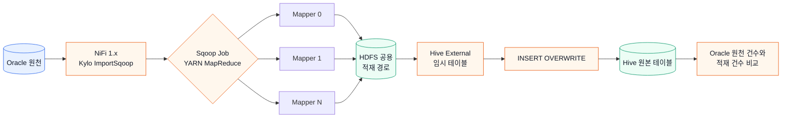

#### TO-BE 처리 구조

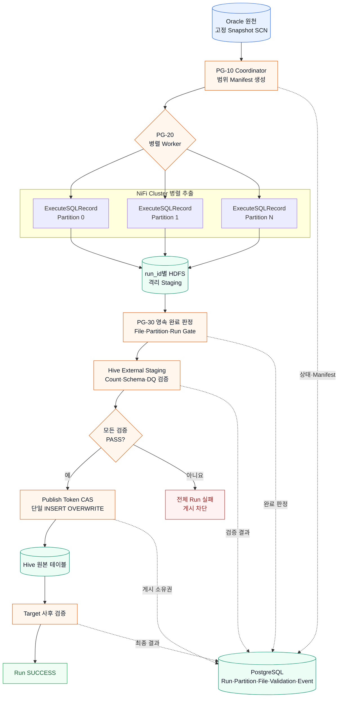

AS-IS에서는 Sqoop/YARN이 Mapper 실행과 전체 Job 실패를 담당한다. TO-BE에서는 NiFi가 병렬 Worker를 실행하고 PostgreSQL Manifest가 완료 판정의 원장이 되며, staging 검증을 통과한 단 하나의 게시 FlowFile만 최종 테이블을 변경한다.

Sqoop Mapper가 제공하던 분할 조회와 전체 Job 실패 의미를 NiFi Processor의 단순 병렬 실행만으로 대체해서는 안 된다. TO-BE는 데이터 처리 영역과 제어 영역을 분리한다.

- Data plane: Oracle 조회, Record 변환, HDFS 파일 기록
- Control plane: Run/Partition/File 상태, 완료 barrier, 검증, 게시 소유권과 복구

### 불변 실행 식별자와 격리

매 실행에 UUID `run_id`를 발급하고 FlowFile, PostgreSQL 관리 행, HDFS 경로와 로그에 동일하게 사용한다.

```text
job_key       = 적재 Job의 영구 식별자
business_key  = 업무일자 또는 적재 범위 식별자
run_id        = 한 번의 실행을 나타내는 UUID
snapshot_scn  = 해당 run이 읽는 Oracle 고정 SCN
partition_id  = split 범위 식별자
```

```text
/data/nifi/stage/<job_key>/run_id=<run_id>/part=<partition_id>/part-xxxx.parquet
```

실패한 run의 파일은 다른 실행 및 최종 테이블과 섞이지 않는다. 재실행은 이전 run을 수정하지 않고 새 `run_id`를 사용한다.

### Oracle 읽기 일관성

여러 JDBC Connection이 서로 다른 시점의 데이터를 읽지 않도록 시작 시점에 SCN을 한 번 고정한다. source metrics, partition 예상 건수와 실제 데이터 조회는 모두 동일한 `AS OF SCN`을 사용한다.

Flashback Query를 사용할 수 없다면 Oracle snapshot table, 불변 업무 마감 조건 또는 원천 변경이 없는 배치 구간을 사용한다. 추출 전후 `COUNT(*)`가 같다는 사실만으로 동일 시점 데이터는 보장되지 않는다.

### 범위 파티셔닝

`INSP_DTL_SEQ` 범위는 하한 포함·상한 미포함으로 생성하고 마지막 범위만 최댓값을 포함한다.

```text
partition 0   : seq >= b0   AND seq < b1
partition 1   : seq >= b1   AND seq < b2
partition N-1 : seq >= bN-1 AND seq <= max_seq
```

NULL은 사전 실패 또는 별도 `IS NULL` 파티션 중 하나로 명시한다. 각 range의 expected count를 동일 SCN에서 계산하고 그 합이 source count와 같은지 Worker 실행 전에 확인한다.

### 완료 판정의 원장

`Wait/Notify`와 NiFi Queue는 wake-up 수단이며 최종 원장이 아니다. PostgreSQL의 Run, Partition, File Manifest를 다시 조회하여 다음 조건을 모두 만족할 때만 추출 완료로 판정한다.

```text
manifest partition 수 = run.expected_partition_count
모든 partition 상태 = SUCCESS
FAILED/PENDING/RUNNING partition 수 = 0
SUM(partition.actual_row_count) = run.source_count
file audit의 chunk 수와 row count = 각 partition 결과
```

이 원칙 때문에 Notify 중복, cache 초기화 또는 NiFi 재기동이 발생해도 잘못 게시되지 않는다.

### 검증 및 게시 원칙

검증은 다음 네 경계를 통과한다.

1. Source: Oracle SCN 기준 count, min/max, NULL, 업무 집계
2. Extract: partition/file count, HDFS 성공 여부, row count 합계
3. Staging: Hive external table count, schema, PK 중복과 업무 집계
4. Target: `INSERT OVERWRITE` 후 동일 업무 범위의 count와 품질 지표

건수만 일치하면 누락과 중복이 상쇄될 수 있으므로 PK NULL/중복, 주요 금액 합계, 코드별 건수 및 필요한 경우 canonical hash를 함께 사용한다. 원천 0건은 기본적으로 게시하지 않는다.

게시 직전 `STAGING_VALIDATED → PUBLISHING` 상태를 publish token으로 compare-and-set하고, token 소유권을 확인한 단 하나의 FlowFile만 `INSERT OVERWRITE`를 실행한다. Hive 결과가 불명확한 timeout은 `PUBLISH_UNKNOWN`으로 남기고 자동 재실행하지 않는다.

### 실패 원칙

- 파티션 하나라도 최종 실패하면 전체 run을 실패시키고 게시를 금지한다.
- 일시적 Oracle/HDFS 오류만 제한 재시도한다.
- `ORA-01555`, 권한, SQL, schema 및 검증 오류는 즉시 실패한다.
- 한 run의 일부 파티션만 새 SCN으로 다시 읽지 않는다.
- 늦게 완료된 다른 파티션은 실패 run의 격리 경로에만 남고 성공 상태를 되돌리지 못한다.
- NiFi 재기동 후 PostgreSQL manifest를 기준으로 stale partition만 동일 SCN으로 복구한다.

---

## 2. 최상위 Canvas

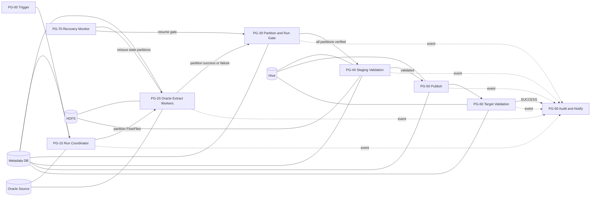

실행 정책은 다음과 같다.

| 영역 | 실행 노드 | Concurrent Tasks |
|---|---|---:|
| Trigger, Coordinator, Gate, Publish, Recovery | Primary Node | 1 |
| Oracle Extract, PutHDFS | All Nodes | 노드당 `WORKER.CONCURRENT.TASKS` 기준값 |
| Audit writer | All Nodes | 2~4 |

Coordinator에서 Worker로 가는 Connection은 `Round Robin` Load Balance를 설정한다. 그 외 제어 Connection은 load balance를 사용하지 않는다.

Concurrent Tasks는 정수 스케줄링 설정이라 Parameter(`#{...}`)나 Expression Language(`${...}`)를 참조할 수 없다. REST API에서도 정수 필드로 정의되어 있다. `WORKER.CONCURRENT.TASKS`는 환경별 기준값으로 관리하고, 배포 스크립트나 운영 절차에서 해당 Processor의 Concurrent Tasks에 정수로 입력한다.

---

## 3. Parameter Context

### 3.1 `PC_SQOOP_REPLACEMENT_COMMON`

| Parameter | 예시 | Sensitive | 용도 |
|---|---|---:|---|
| `META.JDBC.URL` | `jdbc:postgresql://meta:5432/nifiops` | N | 관리 DB |
| `META.JDBC.USER` | `nifi_ops` | N | 관리 DB 계정 |
| `META.JDBC.PASSWORD` | 미표시 | Y | 관리 DB 암호 |
| `ORACLE.JDBC.URL` | `jdbc:oracle:thin:@//host:1521/service` | N | 원천 Oracle |
| `ORACLE.JDBC.USER` | `nifi_reader` | N | 원천 조회 계정 |
| `ORACLE.JDBC.PASSWORD` | 미표시 | Y | 원천 암호 |
| `ORACLE.JDBC.DRIVER.PATH` | `/opt/nifi/jdbc/ojdbc11.jar` | N | JDBC Driver |
| `HIVE.JDBC.URL` | 환경별 HiveServer2 URL | N | HiveQL 실행 |
| `HIVE.USER` | service account | N | Hive 계정 |
| `HADOOP.CONF.FILES` | `core-site.xml,hdfs-site.xml` 절대경로 | N | PutHDFS |
| `HDFS.AUTH.MODE` | `simple` | N | 비-Ker버 HDFS 인증 방식 문서화 |
| `HDFS.STAGE.ROOT` | `/data/nifi/stage` | N | staging root |
| `HDFS.PERMISSIONS.UMASK` | `027` | N | PutHDFS 생성 파일/경로 umask |
| `HDFS.REPLICATION` | 환경 기본값 또는 `3` | N | 필요 시 PutHDFS replication override |
| `WORKER.CONCURRENT.TASKS` | `2` | N | 노드당 추출 병렬도 기준값. Concurrent Tasks에는 참조할 수 없으므로 배포 시 정수로 입력 |
| `ORACLE.POOL.MAX` | `8` | N | 전체 노드 정책과 맞춤 |
| `EXTRACT.FETCH.SIZE` | `5000` | N | JDBC fetch size |
| `EXTRACT.ROWS.PER.FILE` | `500000` | N | chunk 행 수, 부하 시험으로 조정 |
| `EXTRACT.QUERY.TIMEOUT` | `60 min` | N | 파티션 query timeout |
| `PARTITION.RETRY.MAX` | `3` | N | 일시 오류 재시도 |
| `PARTITION.WAIT.TIMEOUT` | `90 min` | N | 파티션 barrier timeout |
| `RUN.WAIT.TIMEOUT` | `6 hours` | N | 전체 run timeout |
| `RECOVERY.STALE.MINUTES` | `15` | N | stale 판정 |
| `ALLOW.EMPTY.SOURCE` | `false` | N | 0건 overwrite 방지 |
| `FAILED.RETENTION.DAYS` | `14` | N | 실패 staging 보존 |
| `SUCCESS.RETENTION.DAYS` | `3` | N | 성공 staging 보존 |

### 3.2 `PC_JOB_<JOB_NAME>`

| Parameter | 예시 | 설명 |
|---|---|---|
| `JOB.KEY` | `ORACLE_INSP_DTL_DAILY` | 관리용 고유 키 |
| `SRC.OWNER` | `APP` | Oracle owner |
| `SRC.TABLE` | `INSP_DTL` | Oracle table |
| `SRC.COLUMNS` | `COL_A,COL_B,...,INSP_DTL_SEQ` | 순서를 고정한 컬럼 목록 |
| `SRC.SPLIT.COLUMN` | `INSP_DTL_SEQ` | split-by 대체 컬럼 |
| `SRC.BASE.WHERE` | `BASE_DT = ?` | 승인된 고정 조건 템플릿 |
| `SRC.BUSINESS.KEY.TYPE` | `91` | JDBC type, DATE=91 등 |
| `PARTITION.COUNT` | `8` | 논리 파티션 수 |
| `SPLIT.NULL.POLICY` | `FAIL` | `FAIL` 또는 `SEPARATE` |
| `HIVE.STAGE.DB` | `STG_DB` | 임시 external DB |
| `HIVE.STAGE.TABLE.PREFIX` | `TMP_INSP_DTL_` | run별 테이블 prefix |
| `HIVE.STAGE.DDL.COLUMNS` | 실제 Hive DDL 컬럼 | external table schema |
| `HIVE.TARGET.DB` | `DW` | target DB |
| `HIVE.TARGET.TABLE` | `INSP_DTL` | target table |
| `HIVE.INSERT.COLUMNS` | 명시적 SELECT 컬럼 | `SELECT *` 금지 |
| `TARGET.PARTITION.CLAUSE` | `PARTITION (BASE_DT='...')` | 전체 overwrite면 빈 값 |
| `DQ.SOURCE.SQL` | 승인된 집계 SQL | count 외 검증 |
| `DQ.STAGE.SQL` | 대응 Hive SQL | 동일 의미의 집계 |
| `DQ.TARGET.SQL` | 대응 target SQL | 게시 후 검증 |

JDBC type 주요 값은 `NUMERIC=2`, `BIGINT=-5`, `VARCHAR=12`, `DATE=91`, `TIMESTAMP=93`이다. 실제 Oracle 컬럼 타입에 맞춰 지정한다.

---

## 4. Controller Services

| 이름 | 구현 | 주요 설정 |
|---|---|---|
| `CS_DBCP_ORACLE` | `HikariCPConnectionPool` | URL/계정/ojdbc, Max Total=`${ORACLE.POOL.MAX}`, validation query=`SELECT 1 FROM DUAL` |
| `CS_DBCP_META` | `HikariCPConnectionPool` | 관리 DB, Max Total 10~20, autocommit 정책 확인 |
| `CS_HIVE3_DBCP` | CFM 제공 Hive Connection Pool | HiveServer2의 실제 인증 방식 적용. Apache NiFi 2.x에는 Hive 구성요소가 없으므로 CFM 4.12.0 제공 이름을 확정 |
| `CS_JSON_READER` | `JsonTreeReader` | Schema Access=`Infer Schema`는 제어 레코드에만 사용 |
| `CS_JSON_WRITER_ARRAY` | `JsonRecordSetWriter` | Output Grouping=`Array`, pretty print=false |
| `CS_JSON_WRITER_LINE` | `JsonRecordSetWriter` | Output Grouping=`One Line per Object` |
| `CS_PARQUET_WRITER` | `ParquetRecordSetWriter` | Schema=`Inherit Record Schema`, compression=`SNAPPY` |
| `CS_PARQUET_READER` | `ParquetReader` | ValidateRecord에서 기록 결과 schema를 다시 읽음 |
| `CS_SCHEMA_REGISTRY` | 조직 표준 Schema Registry | target Avro schema를 버전으로 고정 |
| `CS_DMC_SERVER` | `MapCacheServer` | Wait/Notify signal 저장소. NiFi 1.x의 `DistributedMapCacheServer` |
| `CS_DMC_CLIENT` | `MapCacheClientService` | 모든 NiFi 노드가 같은 cache endpoint(host/port)를 가리킴. NiFi 1.x의 `DistributedMapCacheClientService` |

운영 데이터에는 schema inference를 사용하지 않는다. Oracle JDBC schema를 상속하되, Oracle `NUMBER`, `DATE`, `TIMESTAMP`, CLOB 처리 결과가 Hive DDL과 일치하는지 사전 시험하고 필요하면 `ConvertRecord`를 추가해 명시적 schema로 변환한다.

추출 `ExecuteSQLRecord`에는 `Use Avro Logical Types=true`를 명시한다. 기본값 `false`이면 DATE, TIMESTAMP, DECIMAL이 문자열로 기록되어 Hive DDL과 어긋난다.

시간대가 없는 원천 `DATE`/`TIMESTAMP`는 JDBC가 NiFi JVM 기본 시간대로 해석한다. 그 결과 Parquet에는 UTC로 변환된 `TIMESTAMP_MILLIS (isAdjustedToUTC=true)`로 기록된다. NiFi 2.4.0 PoC에서 JVM 시간대가 KST일 때 원천 `2026-09-28 00:00:01`이 `2026-09-27T15:00:01Z`로 저장됐고, 마이크로초 이하 정밀도는 버려졌다. Hive가 이 값을 읽는 방식은 Hive 버전과 parquet timestamp 설정에 따라 다르며, 건수 검증으로는 이 차이를 잡을 수 없다. 따라서 다음을 지킨다.

- NiFi JVM `-Duser.timezone`과 Hive parquet timestamp 해석 설정을 환경 표준으로 확정한다.
- 대표 TIMESTAMP/DATE 컬럼의 `MIN`/`MAX`를 Source, Staging, Target DQ 지표에 포함해 문자열 값으로 비교한다.
- 마이크로초 이상 정밀도가 업무상 필요한 컬럼은 추출 SQL에서 문자열로 변환하거나 명시적 schema로 정밀도를 확인한다.

### 4.1 PostgreSQL 관리 및 로그 스키마

PostgreSQL 13 이상을 기준으로 한다. 식별자는 따옴표 없이 소문자로 생성한다. NiFi에서는 UUID 값을 `VARCHAR` JDBC parameter로 전달하고 SQL에서 `CAST(? AS uuid)`로 변환하면 Driver별 UUID binding 차이를 줄일 수 있다.

#### Schema와 Run 테이블

```sql
CREATE SCHEMA IF NOT EXISTS nifi_ops;

CREATE TABLE nifi_ops.load_run (
    run_id                       uuid PRIMARY KEY,
    job_key                      varchar(200) NOT NULL,
    business_key                 varchar(200) NOT NULL,
    status                       varchar(40) NOT NULL,
    snapshot_scn                 numeric(38, 0),
    source_count                 bigint,
    source_null_split_count      bigint,
    source_min_split             numeric(38, 0),
    source_max_split             numeric(38, 0),
    expected_partition_count     integer,
    success_partition_count      integer NOT NULL DEFAULT 0,
    failed_partition_count       integer NOT NULL DEFAULT 0,
    extracted_count              bigint NOT NULL DEFAULT 0,
    staging_count                bigint,
    target_count                 bigint,
    hdfs_run_path                varchar(1000),
    stage_table_name             varchar(255),
    publish_token                uuid,
    retry_of_run_id              uuid REFERENCES nifi_ops.load_run(run_id),
    version_no                   integer NOT NULL DEFAULT 0,
    parameters                   jsonb NOT NULL DEFAULT '{}'::jsonb,
    started_at                   timestamptz NOT NULL DEFAULT clock_timestamp(),
    heartbeat_at                 timestamptz NOT NULL DEFAULT clock_timestamp(),
    extract_completed_at         timestamptz,
    publish_started_at           timestamptz,
    published_at                 timestamptz,
    completed_at                 timestamptz,
    error_stage                  varchar(80),
    error_code                   varchar(100),
    error_message                varchar(2000),
    CONSTRAINT ck_load_run_status CHECK (status IN (
        'CREATED', 'SNAPSHOT_FIXED', 'EXTRACTING',
        'EXTRACTED_VALIDATED', 'STAGING_VALIDATED',
        'PUBLISHING', 'PUBLISHED', 'SUCCESS',
        'FAILED_MANIFEST', 'FAILED_EXTRACT',
        'FAILED_STAGE_VALIDATION', 'FAILED_PUBLISH',
        'PUBLISH_UNKNOWN', 'FAILED_TARGET_VALIDATION',
        'FAILED_SNAPSHOT_EXPIRED', 'TIMED_OUT'
    )),
    CONSTRAINT ck_load_run_counts CHECK (
        COALESCE(source_count, 0) >= 0
        AND COALESCE(expected_partition_count, 0) >= 0
        AND success_partition_count >= 0
        AND failed_partition_count >= 0
        AND extracted_count >= 0
    )
);

-- 동일 Job과 업무키에는 활성 run 하나만 허용한다.
CREATE UNIQUE INDEX uq_load_run_active
    ON nifi_ops.load_run (job_key, business_key)
    WHERE status IN (
        'CREATED', 'SNAPSHOT_FIXED', 'EXTRACTING',
        'EXTRACTED_VALIDATED', 'STAGING_VALIDATED',
        'PUBLISHING', 'PUBLISHED', 'PUBLISH_UNKNOWN'
    );

CREATE INDEX ix_load_run_status_heartbeat
    ON nifi_ops.load_run (status, heartbeat_at);

CREATE INDEX ix_load_run_job_started
    ON nifi_ops.load_run (job_key, started_at DESC);
```

Partial unique index가 활성 실행 lock 역할을 한다. 최종 상태로 변경되면 같은 `job_key + business_key`의 새 run을 생성할 수 있다.

#### Partition Manifest

```sql
CREATE TABLE nifi_ops.load_partition (
    run_id                  uuid NOT NULL
                            REFERENCES nifi_ops.load_run(run_id) ON DELETE RESTRICT,
    partition_id            varchar(40) NOT NULL,
    lower_bound             numeric(38, 0),
    upper_bound             numeric(38, 0),
    upper_inclusive         boolean NOT NULL DEFAULT false,
    is_null_partition       boolean NOT NULL DEFAULT false,
    status                  varchar(20) NOT NULL DEFAULT 'PENDING',
    expected_row_count      bigint NOT NULL,
    actual_row_count        bigint,
    fragment_count          integer,
    file_count              integer,
    byte_count              bigint,
    attempt_count           integer NOT NULL DEFAULT 0,
    claim_token             uuid,
    worker_node             varchar(200),
    started_at              timestamptz,
    heartbeat_at            timestamptz,
    completed_at            timestamptz,
    error_code              varchar(100),
    error_message           varchar(2000),
    PRIMARY KEY (run_id, partition_id),
    CONSTRAINT ck_load_partition_status CHECK (status IN (
        'PENDING', 'RUNNING', 'RETRY', 'SUCCESS', 'FAILED', 'TIMED_OUT'
    )),
    CONSTRAINT ck_load_partition_counts CHECK (
        expected_row_count >= 0
        AND COALESCE(actual_row_count, 0) >= 0
        AND COALESCE(fragment_count, 0) >= 0
        AND COALESCE(file_count, 0) >= 0
        AND COALESCE(byte_count, 0) >= 0
        AND attempt_count >= 0
    ),
    CONSTRAINT ck_load_partition_bounds CHECK (
        is_null_partition
        OR (lower_bound IS NOT NULL AND upper_bound IS NOT NULL
            AND lower_bound <= upper_bound)
    )
);

CREATE INDEX ix_load_partition_status
    ON nifi_ops.load_partition (run_id, status);

CREATE INDEX ix_load_partition_recovery
    ON nifi_ops.load_partition (status, heartbeat_at)
    WHERE status IN ('RUNNING', 'RETRY');
```

#### HDFS File Manifest

```sql
CREATE TABLE nifi_ops.load_file (
    run_id                  uuid NOT NULL,
    partition_id            varchar(40) NOT NULL,
    chunk_index             integer NOT NULL,
    fragment_identifier     varchar(100),
    fragment_count          integer NOT NULL,
    hdfs_path               varchar(1500) NOT NULL,
    record_count            bigint NOT NULL,
    byte_count              bigint,
    checksum                varchar(128),
    status                  varchar(20) NOT NULL DEFAULT 'WRITTEN',
    written_at              timestamptz NOT NULL DEFAULT clock_timestamp(),
    updated_at              timestamptz NOT NULL DEFAULT clock_timestamp(),
    PRIMARY KEY (run_id, partition_id, chunk_index),
    FOREIGN KEY (run_id, partition_id)
        REFERENCES nifi_ops.load_partition(run_id, partition_id)
        ON DELETE RESTRICT,
    CONSTRAINT uq_load_file_path UNIQUE (hdfs_path),
    CONSTRAINT ck_load_file_status CHECK (status IN ('WRITTEN', 'VERIFIED', 'FAILED')),
    CONSTRAINT ck_load_file_counts CHECK (
        chunk_index >= 0 AND fragment_count > 0
        AND record_count >= 0 AND COALESCE(byte_count, 0) >= 0
    )
);

CREATE INDEX ix_load_file_partition_status
    ON nifi_ops.load_file (run_id, partition_id, status);
```

PutHDFS 성공 후 다음 UPSERT를 실행한다. 동일 chunk 재시도는 행을 추가하지 않고 결과를 갱신한다.

```sql
INSERT INTO nifi_ops.load_file (
    run_id, partition_id, chunk_index,
    fragment_identifier, fragment_count,
    hdfs_path, record_count, byte_count, status
) VALUES (
    CAST(? AS uuid), ?, ?, ?, ?, ?, ?, ?, 'WRITTEN'
)
ON CONFLICT (run_id, partition_id, chunk_index)
DO UPDATE SET
    fragment_identifier = EXCLUDED.fragment_identifier,
    fragment_count      = EXCLUDED.fragment_count,
    hdfs_path           = EXCLUDED.hdfs_path,
    record_count        = EXCLUDED.record_count,
    byte_count          = EXCLUDED.byte_count,
    status              = 'WRITTEN',
    updated_at          = clock_timestamp();
```

#### Validation 결과

```sql
CREATE TABLE nifi_ops.load_validation (
    validation_id          bigint GENERATED ALWAYS AS IDENTITY PRIMARY KEY,
    run_id                 uuid NOT NULL
                           REFERENCES nifi_ops.load_run(run_id) ON DELETE RESTRICT,
    stage                  varchar(30) NOT NULL,
    metric_name            varchar(150) NOT NULL,
    expected_value         text,
    actual_value           text,
    tolerance              text,
    result                 varchar(10) NOT NULL,
    query_version          varchar(50) NOT NULL,
    details                jsonb NOT NULL DEFAULT '{}'::jsonb,
    measured_at            timestamptz NOT NULL DEFAULT clock_timestamp(),
    CONSTRAINT ck_load_validation_stage CHECK (stage IN (
        'SOURCE', 'PARTITION', 'HDFS', 'STAGING', 'TARGET'
    )),
    CONSTRAINT ck_load_validation_result CHECK (result IN ('PASS', 'FAIL', 'WARN'))
);

CREATE INDEX ix_load_validation_run_stage
    ON nifi_ops.load_validation (run_id, stage, result);

CREATE UNIQUE INDEX uq_load_validation_metric
    ON nifi_ops.load_validation (run_id, stage, metric_name, query_version);
```

`expected_value`와 `actual_value`는 count뿐 아니라 hash 및 문자열 지표도 저장할 수 있도록 `text`로 둔다. 숫자 비교와 허용 오차 판정은 검증 SQL에서 수행하고 결과를 함께 저장한다.

#### PostgreSQL 로그 테이블

```sql
CREATE TABLE nifi_ops.load_event (
    event_id               uuid PRIMARY KEY,
    event_time             timestamptz NOT NULL DEFAULT clock_timestamp(),
    event_level            varchar(10) NOT NULL,
    event_name             varchar(80) NOT NULL,
    run_id                 uuid,
    job_key                varchar(200),
    business_key           varchar(200),
    partition_id           varchar(40),
    chunk_index            integer,
    process_group          varchar(100),
    processor_name         varchar(150),
    processor_id           varchar(100),
    node_id                varchar(200),
    attempt_no             integer,
    row_count              bigint,
    byte_count             bigint,
    duration_ms            bigint,
    error_class            varchar(40),
    error_code             varchar(100),
    message                varchar(2000),
    details                jsonb NOT NULL DEFAULT '{}'::jsonb,
    CONSTRAINT ck_load_event_level CHECK (event_level IN (
        'TRACE', 'DEBUG', 'INFO', 'WARN', 'ERROR'
    )),
    CONSTRAINT ck_load_event_values CHECK (
        COALESCE(attempt_no, 0) >= 0
        AND COALESCE(row_count, 0) >= 0
        AND COALESCE(byte_count, 0) >= 0
        AND COALESCE(duration_ms, 0) >= 0
    )
);

-- 실행 추적과 오류 검색을 위한 B-tree index
CREATE INDEX ix_load_event_run_time
    ON nifi_ops.load_event (run_id, event_time DESC);

CREATE INDEX ix_load_event_job_time
    ON nifi_ops.load_event (job_key, event_time DESC);

CREATE INDEX ix_load_event_error
    ON nifi_ops.load_event (event_time DESC, event_name)
    WHERE event_level IN ('WARN', 'ERROR');

-- 대용량 시계열 검색과 보존 삭제 지원
CREATE INDEX ix_load_event_time_brin
    ON nifi_ops.load_event USING brin (event_time);
```

`load_event.run_id`에는 의도적으로 Foreign Key를 두지 않는다. Run 정리 또는 비정상 초기화 상황에서도 운영 로그가 독립적으로 남고, 이벤트 기록 실패가 제어 트랜잭션을 방해하지 않게 하기 위해서다.

로그 보존 예시는 다음과 같다. 운영에서는 PostgreSQL scheduler 또는 외부 운영 Job으로 실행한다.

```sql
DELETE FROM nifi_ops.load_event
 WHERE event_time < clock_timestamp() - interval '90 days';

VACUUM (ANALYZE) nifi_ops.load_event;
```

이벤트량이 일 수백만 건 이상이면 `event_time` 월 단위 partition table로 전환하고 다음 달 partition을 미리 생성한다.

#### 원자적 Claim 함수

NiFi에서 `UPDATE` 영향 건수 대신 단일 Boolean 결과를 받으려면 다음 PostgreSQL 함수를 `ExecuteSQLRecord`로 호출할 수 있다.

```sql
CREATE OR REPLACE FUNCTION nifi_ops.claim_partition(
    p_run_id uuid,
    p_partition_id varchar,
    p_claim_token uuid,
    p_worker_node varchar
) RETURNS boolean
LANGUAGE sql
AS $$
    WITH claimed AS (
        UPDATE nifi_ops.load_partition p
           SET status = 'RUNNING',
               claim_token = p_claim_token,
               worker_node = p_worker_node,
               attempt_count = p.attempt_count + 1,
               started_at = COALESCE(p.started_at, clock_timestamp()),
               heartbeat_at = clock_timestamp(),
               error_code = NULL,
               error_message = NULL
          FROM nifi_ops.load_run r
         WHERE p.run_id = p_run_id
           AND p.partition_id = p_partition_id
           AND p.status IN ('PENDING', 'RETRY')
           AND r.run_id = p.run_id
           AND r.status = 'EXTRACTING'
        RETURNING 1
    )
    SELECT EXISTS (SELECT 1 FROM claimed);
$$;

CREATE OR REPLACE FUNCTION nifi_ops.claim_publish(
    p_run_id uuid,
    p_publish_token uuid
) RETURNS boolean
LANGUAGE sql
AS $$
    WITH claimed AS (
        UPDATE nifi_ops.load_run
           SET status = 'PUBLISHING',
               publish_token = p_publish_token,
               publish_started_at = clock_timestamp(),
               heartbeat_at = clock_timestamp(),
               version_no = version_no + 1
         WHERE run_id = p_run_id
           AND status = 'STAGING_VALIDATED'
        RETURNING 1
    )
    SELECT EXISTS (SELECT 1 FROM claimed);
$$;
```

#### 권한 예시

```sql
-- 역할은 DBA가 사전에 생성한다.
GRANT USAGE ON SCHEMA nifi_ops TO nifi_runtime;
GRANT SELECT, INSERT, UPDATE ON ALL TABLES IN SCHEMA nifi_ops TO nifi_runtime;
GRANT USAGE, SELECT ON ALL SEQUENCES IN SCHEMA nifi_ops TO nifi_runtime;
GRANT EXECUTE ON ALL FUNCTIONS IN SCHEMA nifi_ops TO nifi_runtime;

ALTER DEFAULT PRIVILEGES IN SCHEMA nifi_ops
    GRANT SELECT, INSERT, UPDATE ON TABLES TO nifi_runtime;
ALTER DEFAULT PRIVILEGES IN SCHEMA nifi_ops
    GRANT USAGE, SELECT ON SEQUENCES TO nifi_runtime;
```

NiFi runtime에는 일반 운영 중 `DELETE`, `TRUNCATE`, `DROP` 권한을 부여하지 않는다. 보존 삭제와 스키마 변경은 별도 DBA 역할로 수행한다.

---

## 5. 공통 FlowFile Attributes

| Attribute | 생성 위치 | 예시/의미 |
|---|---|---|
| `load.run.id` | Coordinator | UUID, 실행 불변 키 |
| `load.job.key` | Trigger | `ORACLE_INSP_DTL_DAILY` |
| `load.business.key` | Trigger | `2026-09-28` |
| `load.started.at` | Coordinator | UTC ISO-8601 |
| `load.snapshot.scn` | Snapshot query | 숫자 문자열 |
| `load.source.count` | Source metrics | 전체 source count |
| `load.partition.count` | Manifest | NULL 파티션 포함 실제 개수 |
| `load.hdfs.path` | Coordinator | run 전용 root |
| `load.stage.table` | Coordinator | 안전한 run suffix 포함 |
| `partition.id` | Manifest split | `0003` 또는 `NULL` |
| `partition.lower` | Manifest split | 포함 하한 |
| `partition.upper` | Manifest split | 상한 |
| `partition.upper.inclusive` | Manifest split | `true/false` |
| `partition.expected.rows` | Manifest split | 동일 SCN 예상 건수 |
| `partition.claim.token` | Worker | 중복 worker 방지 UUID |
| `partition.retry.count` | RetryFlowFile | 재시도 횟수 |
| `chunk.index` | Extract output | `${fragment.index}` |
| `chunk.record.count` | Extract output | `${record.count}` |
| `event.name` | 각 단계 | 구조화 이벤트 이름 |
| `error.stage` | 오류 경로 | `ORACLE_EXTRACT`, `HDFS_WRITE` 등 |
| `error.class` | 오류 경로 | `TRANSIENT`, `NON_RETRYABLE`, `VALIDATION` |
| `error.message` | 오류 경로 | 비밀값을 제거한 메시지 |

SCN, partition bound, count는 숫자 정규식으로 검증한 뒤 SQL에 사용한다. table/column/where 문자열을 외부 FlowFile에서 받지 않는다.

Parameter 참조는 Expression Language의 문자열 리터럴 안에서 치환되지 않는다. 예를 들어 `${load.partition.count:equals('#{PARTITION.COUNT}')}`는 문자 그대로의 `#{PARTITION.COUNT}`와 비교하므로 항상 false가 된다(NiFi 2.4.0 PoC에서 재현). Parameter 값과 비교할 때는 먼저 `UpdateAttribute`에서 `load.partition.planned=#{PARTITION.COUNT}`처럼 attribute로 옮긴 뒤 `${load.partition.count:equals(${load.partition.planned})}`로 비교한다.

---

## 6. PG-00 Trigger

### 6.1 Processor 흐름

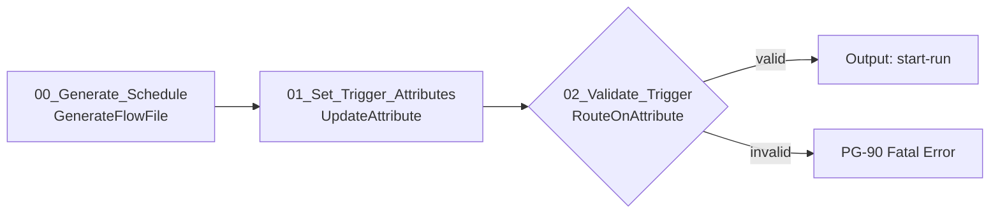

### 6.2 주요 Processor 설정

| ID | Processor | Scheduling | 주요 Properties | Relationship |
|---|---|---|---|---|
| 00 | `GenerateFlowFile` | Primary, 1, CRON | Custom Text=`{}`, Unique FlowFiles=true | success→01 |
| 01 | `UpdateAttribute` | Primary, 1, input driven | `load.job.key=#{JOB.KEY}`, `load.business.key=${now():format('yyyy-MM-dd','Asia/Seoul')}`, `load.trigger.type=SCHEDULE` | success→02 |
| 02 | `RouteOnAttribute` | Primary, 1 | 업무키 정규식, Job key와 필수 Parameter 존재 여부 검증 | valid→PG-10, unmatched→PG-90 Fatal |

외부에서 업무일자를 전달받는 경우 `HandleHttpRequest` 등을 직접 worker에 연결하지 않고 인증된 상위 orchestration flow가 이 Process Group의 Input Port를 호출하도록 한다.

---

## 7. PG-10 Run Coordinator

### 7.1 Processor 흐름

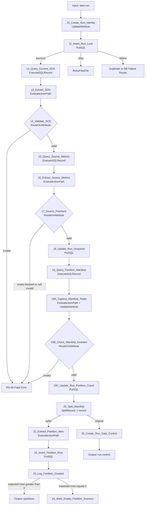

### 7.2 주요 Processor 설정

| ID | Processor | Scheduling | 주요 Properties | Relationship |
|---|---|---|---|---|
| 10 | `UpdateAttribute` | Primary, 1 | `load.run.id=${UUID()}`, 시작시각, run HDFS path와 stage table 계산 | success→11 |
| 11 | `PutSQL` | Primary, 1 | `CS_DBCP_META`, Batch Size=1, Fragmented=false, active partial unique index로 lock | success→12, retry→RetryFlowFile, failure→오류 분류 |
| 12 | `ExecuteSQLRecord` | Primary, 1 | `CS_DBCP_ORACLE`, current SCN SQL, `CS_JSON_WRITER_ARRAY`, Max Rows=0 | success→13, failure→PG-90 |
| 13 | `EvaluateJsonPath` | Primary, 1 | `load.snapshot.scn=$[0].SNAPSHOT_SCN`, Destination=attribute | matched→14, failure/unmatched→PG-90 |
| 14 | `RouteOnAttribute` | Primary, 1 | `${load.snapshot.scn:matches('^[0-9]+$')}` | valid→15, unmatched→PG-90 |
| 15 | `ExecuteSQLRecord` | Primary, 1 | `CS_DBCP_ORACLE`, source metrics SQL, JSON array writer, Query Timeout | success→16, failure→PG-90 |
| 16 | `EvaluateJsonPath` | Primary, 1 | count/min/max/null/DQ 값을 attribute로 추출 | matched→17, failure/unmatched→PG-90 |
| 17 | `RouteOnAttribute` | Primary, 1 | empty source, NULL 정책, min/max 유효성 | valid→18, invalid→PG-90 |
| 18 | `PutSQL` | Primary, 1 | `CS_DBCP_META`, SCN/metrics 저장, status=`EXTRACTING`, Fragmented=false | success→19, retry/failure→PG-90 |
| 19 | `ExecuteSQLRecord` | Primary, 1 | 동일 SCN manifest SQL(`MANIFEST_TOTAL` 포함), JSON writer, Max Rows=0, Output Batch=0 | success→19A, failure→PG-90 |
| 19A | `EvaluateJsonPath` + `UpdateAttribute` | Primary, 1 | `load.manifest.total=$[0].MANIFEST_TOTAL`, `load.partition.count=${record.count}`, `load.partition.planned=#{PARTITION.COUNT}` | success→19B, failure/unmatched→PG-90 |
| 19B | `RouteOnAttribute` | Primary, 1 | 7.4 불변식: manifest 합계 = source count, 파티션 수 = 계획 수 | valid→19C, unmatched→PG-90 `FAILED_MANIFEST` |
| 19C | `PutSQL` | Primary, 1 | expected partition count 저장, Batch Size=1, Fragmented=false | success→20, retry/failure→PG-90 |
| 20 | `SplitRecord` | Primary, 1 | Reader=`CS_JSON_READER`, Writer=`CS_JSON_WRITER_LINE`, Records Per Split=1 | splits→21, original→25, failure→PG-90 |
| 21 | `EvaluateJsonPath` | Primary, 1 | partition id/lower/upper/expected/null flag 추출 | matched→22, failure/unmatched→PG-90 |
| 22 | `PutSQL` | Primary, 1 | manifest INSERT, Fragmented=true, **Penalty Duration=0 sec**, Transaction Timeout 설정 | success→23, retry/failure→PG-90 |
| 23 | `UpdateAttribute` 또는 PG-90 port | Primary, 1 | `event.name=PARTITION_CREATED`, `event.level=DEBUG` | expected>0→Worker, expected=0→24 |
| 24 | `PutSQL` + `Notify` | Primary, 1 | 0건 partition을 SUCCESS/actual=0 처리 후 run progress signal | success→terminate, failure→PG-90 |
| 25 | `UpdateAttribute` + `ReplaceText` | Primary, 1 | control content=`{}`, 저장된 `load.partition.count` 유지 | success→PG-30 run-control |

중복 Run lock INSERT 실패는 일반 DB 장애와 구분해야 한다. SQLState/벤더코드로 unique violation이면 `DUPLICATE_ACTIVE_RUN`으로 종료하고, 연결 장애만 제한 재시도한다. NiFi 2.x `PutSQL`은 failure FlowFile에 `error.sql.state`, `error.code`, `error.message`를 추가하므로 PostgreSQL에서는 `${error.sql.state:equals('23505')}`로 분기한다. 14.6의 공통 오류 `UpdateAttribute`가 이 attribute를 덮어쓰지 않도록 원본 값을 먼저 참조한다.

22는 Penalty Duration을 반드시 `0 sec`로 설정한다. Fragmented=true인 `PutSQL`은 같은 `fragment.identifier`의 FlowFile이 일부만 poll되면 그 FlowFile들을 penalize해 queue로 되돌린다. penalized FlowFile은 다음 poll에서 제외되므로, 앞단 Processor가 split을 나눠 전달하면 FlowFile마다 penalty 만료 시각이 어긋난다. 그러면 매 poll이 일부만 보게 되어 manifest INSERT가 끝나지 않는 livelock이 발생한다. NiFi 2.4.0 PoC에서 8개 파티션이 22 앞에서 무기한 정지하는 현상이 재현됐고, Penalty Duration을 0으로 바꾸자 즉시 해소됐다. 또한 `Transaction Timeout`을 설정해, fragment가 끝내 모이지 않으면 failure(`FAILED_MANIFEST`)로 보낸다. fragment 의존 자체를 없애려면 split 전에 manifest 전체를 한 SQL 문장 또는 한 트랜잭션으로 INSERT하는 구조로 바꿀 수 있다.

### 7.3 Source metric SQL

`snapshot_scn`은 숫자 검증을 마친 시스템 생성 값이다. 업무값은 bind parameter를 사용한다.

```sql
SELECT COUNT(*) AS SOURCE_COUNT,
       MIN(INSP_DTL_SEQ) AS MIN_SEQ,
       MAX(INSP_DTL_SEQ) AS MAX_SEQ,
       SUM(CASE WHEN INSP_DTL_SEQ IS NULL THEN 1 ELSE 0 END) AS NULL_SEQ_COUNT,
       COUNT(DISTINCT INSP_DTL_SEQ) AS DISTINCT_SEQ_COUNT
  FROM APP.INSP_DTL AS OF SCN ${load.snapshot.scn}
 WHERE BASE_DT = ?
```

```text
sql.args.1.type  = #{SRC.BUSINESS.KEY.TYPE}
sql.args.1.value = ${load.business.key}
```

실제 구현에서는 `APP.INSP_DTL`, 컬럼, WHERE 부분을 Job Parameter로 치환한다.

### 7.4 Manifest SQL 원칙

Oracle `CONNECT BY LEVEL <= #{PARTITION.COUNT}` 또는 관리 DB에서 경계를 생성한다. 모든 파티션은 다음 규칙을 만족해야 한다.

```text
0..N-2 : split_column >= lower AND split_column < upper
N-1    : split_column >= lower AND split_column <= upper
NULL    : split_column IS NULL, SPLIT.NULL.POLICY=SEPARATE일 때만
```

각 range의 `EXPECTED_ROW_COUNT`를 동일 SCN에서 계산한다. 0건 range는 Worker에 보내지 않고 manifest에서 바로 성공 처리한다. Manifest 생성 후 아래 불변식을 확인한다.

```text
SUM(expected_row_count) = source_count
AND range overlap count = 0
AND range gap count = 0
```

19 manifest SQL은 각 행에 `SUM(EXPECTED_ROW_COUNT) OVER () AS MANIFEST_TOTAL`을 함께 반환한다. 19A가 이 값과 실제 manifest 행 수를 attribute로 추출하고, 19B가 split 전에 다음 조건을 검사한다.

```text
valid = ${load.manifest.total:equals(${load.source.count})}
        AND ${load.partition.count:equals(${load.partition.planned})}
```

`SPLIT.NULL.POLICY=SEPARATE`이면 NULL 파티션만큼 `load.partition.planned`에 1을 더한다. 경계는 `lower(i+1) = upper(i)`가 되도록 하나의 식으로 생성하므로 overlap/gap이 구조적으로 생기지 않는다. 경계를 다른 방식으로 만든다면 `LAG(upper_bound) OVER (ORDER BY partition_id) <> lower_bound`인 행 수도 함께 반환해 0인지 검사한다.

불변식 불일치는 `FAILED_MANIFEST`이며 Worker를 시작하지 않는다. 0건 파티션을 24에서 성공 처리할 때도 `${load.run.id}`의 `partitions` counter를 1 증가시켜 Run Wait가 불필요하게 만료될 때까지 기다리지 않게 한다.

---

## 8. PG-20 Oracle Extract Workers

### 8.1 Processor 흐름

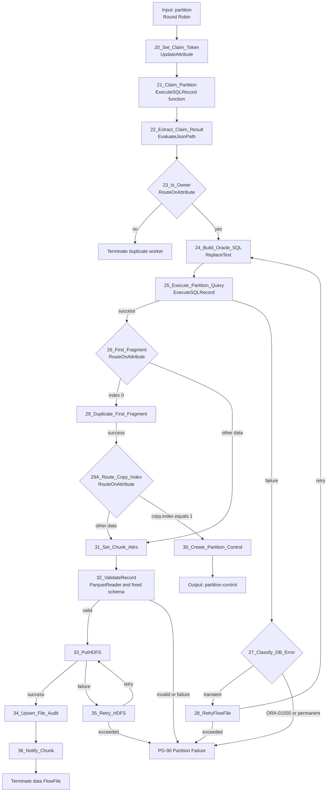

### 8.2 주요 Processor 설정

PG-20의 Connection은 PG-10에서 들어오는 입력에만 Round Robin Load Balance를 적용한다. 각 Worker Processor는 All Nodes에서 동작하며 동시성은 Oracle pool 상한을 넘지 않게 한다.

| ID | Processor | Scheduling | 주요 Properties | Relationship |
|---|---|---|---|---|
| 20 | `UpdateAttribute` | All Nodes, worker concurrency | `partition.claim.token=${UUID()}`, worker node와 시작시각 설정 | success→21 |
| 21 | `ExecuteSQLRecord` | All Nodes, worker concurrency | `CS_DBCP_META`, `claim_partition` 호출, JSON array writer, Max Rows=0 | success→22, failure→PG-90/제한 재시도 |
| 22 | `EvaluateJsonPath` | All Nodes, worker concurrency | `partition.claimed=$[0].claimed` | matched→23, failure/unmatched→PG-90 |
| 23 | `RouteOnAttribute` | All Nodes, worker concurrency | `${partition.claimed:equals('true')}` | true→24, false→중복 Worker 종료 |
| 24 | `ReplaceText` | All Nodes, worker concurrency | Replacement Strategy=Entire text, partition 유형별 Oracle SQL 생성 | success→25, failure→PG-90 |
| 25 | `ExecuteSQLRecord` | All Nodes, worker concurrency | `CS_DBCP_ORACLE`, `CS_PARQUET_WRITER`, Fetch/Rows/Timeout은 아래 표 참조 | success→26, failure→27 |
| 26 | `RouteOnAttribute` | All Nodes, worker concurrency | `${fragment.index:equals('0')}` | first→29, other→31 |
| 27 | `RouteOnAttribute` | All Nodes, worker concurrency | Oracle vendor code/SQLState로 transient, ORA-01555, permanent 분류 | transient→28, non-retryable→PG-90 |
| 28 | `RetryFlowFile` | All Nodes, worker concurrency | Retry Attribute=`partition.retry.count`, Maximum=`#{PARTITION.RETRY.MAX}`, Penalize=true | retry→24, exceeded/failure→PG-90 |
| 29 | `DuplicateFlowFile` | All Nodes, worker concurrency | Number of Copies=1; 원본과 복제본이 모두 `success`로 나가며 `copy.index` attribute가 붙음 | success→29A |
| 29A | `RouteOnAttribute` | All Nodes, worker concurrency | `control=${copy.index:equals('1')}` | control→30, unmatched→31 |
| 30 | `ReplaceText` + `UpdateAttribute` | All Nodes, worker concurrency | content=`{}`, partition control 속성과 `fragment.count` 유지 | success→PG-30 partition-control |
| 31 | `UpdateAttribute` | All Nodes, worker concurrency | chunk index/count, 결정적 filename, HDFS part path 설정 | success→32 |
| 32 | `ValidateRecord` | All Nodes, worker concurrency | Reader=`CS_PARQUET_READER`, Writer=`CS_PARQUET_WRITER`, validation schema 고정 | valid→33, invalid/failure→PG-90 |
| 33 | `PutHDFS` | All Nodes, HDFS 부하 기준 | Hadoop config만 설정, Kerberos service 미설정, umask, replication, replace, Write and rename | success→34, failure→35 |
| 34 | `PutSQL` | All Nodes, worker concurrency | `CS_DBCP_META`, `load_file` UPSERT, Batch=1, Fragmented=false | success→36, retry/failure→PG-90 |
| 35 | `RetryFlowFile` | All Nodes, worker concurrency | HDFS 전용 retry attribute, 최대 횟수와 penalty 설정 | retry→33, exceeded/failure→PG-90 |
| 36 | `Notify` | All Nodes, worker concurrency | Cache=`CS_DMC_CLIENT`, key=`run_id:partition_id`, counter=`chunks`, delta=1 | success→data FlowFile 종료, failure→PG-90 |

### 8.3 Claim 구현

20에서 `partition.claim.token=${UUID()}`를 생성한다. 21은 4.1에서 정의한 PostgreSQL 함수를 호출한다.

```sql
SELECT nifi_ops.claim_partition(
    CAST(? AS uuid),
    ?,
    CAST(? AS uuid),
    ?
) AS claimed;
```

parameter 순서는 `run_id`, `partition_id`, `claim_token`, `worker_node`이다. 21은 `CS_DBCP_META`와 JSON array writer를 사용하고, 22는 `$[0].claimed`를 추출한다. 값이 true인 FlowFile만 Oracle 조회로 진행한다. 함수 내부의 조건부 `UPDATE ... RETURNING`이 소유권 획득과 결과 반환을 한 PostgreSQL statement에서 수행하므로 동일 파티션의 이중 Worker를 막는다.

### 8.4 Extract SQL 생성

중간 파티션:

```sql
SELECT #{SRC.COLUMNS}
  FROM #{SRC.OWNER}.#{SRC.TABLE} AS OF SCN ${load.snapshot.scn}
 WHERE #{SRC.BASE.WHERE}
   AND #{SRC.SPLIT.COLUMN} >= ?
   AND #{SRC.SPLIT.COLUMN} < ?
```

마지막 파티션은 `< ?` 대신 `<= ?`, NULL 파티션은 `IS NULL`을 사용한다.

```text
sql.args.1 = business key
sql.args.2 = lower bound, NUMERIC(2)
sql.args.3 = upper bound, NUMERIC(2)
```

24 `ReplaceText`는 Entire text를 위 SQL로 치환한다. 25 `ExecuteSQLRecord` 설정은 다음과 같다.

| Property | 값 |
|---|---|
| Database Connection Pooling Service | `CS_DBCP_ORACLE` |
| SQL select query | 빈 값, FlowFile content 사용 |
| Record Writer | `CS_PARQUET_WRITER` |
| Fetch Size | `#{EXTRACT.FETCH.SIZE}` |
| Max Rows Per FlowFile | `#{EXTRACT.ROWS.PER.FILE}` |
| Output Batch Size | `0` |
| Max Wait Time | `#{EXTRACT.QUERY.TIMEOUT}` |
| Use Avro Logical Types | `true` (DATE/TIMESTAMP/DECIMAL 타입 유지, 4장 참조) |
| Concurrent Tasks | `WORKER.CONCURRENT.TASKS` 기준값을 정수로 입력 (Parameter 참조 불가) |
| Execution | All Nodes |

`Output Batch Size=0`이어야 한 ResultSet의 `fragment.count`, `fragment.index`, `fragment.identifier`가 완전하게 생성된다. 파티션 크기가 너무 커 session/repository 압력이 생기면 Output Batch를 켜기보다 논리 파티션 수를 늘린다.

### 8.5 Chunk 기록

31에서 다음 속성을 만든다.

```text
chunk.index        = ${fragment.index:padLeft(6,'0')}
chunk.record.count = ${record.count}
filename           = part-${partition.id}-${chunk.index}.parquet
load.hdfs.part.path = ${load.hdfs.path}/part=${partition.id}
```

33 `PutHDFS`:

| Property | 값 |
|---|---|
| Hadoop Configuration Resources | `#{HADOOP.CONF.FILES}` |
| Kerberos User Service | 설정하지 않음 |
| Directory | `${load.hdfs.part.path}` |
| Conflict Resolution Strategy | `replace` |
| Writing Strategy | `Write and rename` |
| Permissions umask | `#{HDFS.PERMISSIONS.UMASK}` |
| Replication | `#{HDFS.REPLICATION}` 또는 공란으로 HDFS 기본값 사용 |
| Concurrent Tasks | Worker 동시성과 HDFS 부하에 맞춰 설정 |

HDFS에는 Kerberos가 적용되지 않았으므로 `Kerberos User Service`, principal, keytab을 구성하지 않는다. NiFi 프로세스를 실행하는 OS 사용자가 HDFS client의 effective user가 되므로 staging root와 하위 경로에 필요한 POSIX 권한 또는 ACL을 사전에 부여한다. `core-site.xml`의 인증 방식과 `fs.defaultFS`가 실제 HDFS 환경을 가리키는지 확인한다. `replace`는 run 전용 경로와 결정적 파일명인 경우에만 허용한다.

34는 `(run_id, partition_id, chunk_index)` unique key로 `nifi_ops.load_file`을 upsert한다. 저장 값은 `record.count`, `absolute.hdfs.path`, file size, fragment count, status=`WRITTEN`이다. 동일 chunk 재시도는 같은 행을 갱신한다.

32 `ValidateRecord`는 Reader=`CS_PARQUET_READER`, validation schema=`CS_SCHEMA_REGISTRY`의 승인 버전, Writer=`CS_PARQUET_WRITER`로 설정한다. `invalid` 또는 `failure`가 한 건이라도 발생하면 해당 partition 전체를 실패시킨다. 대용량 재직렬화 비용이 허용되지 않으면 이 Processor를 제거할 수 있지만, 그 경우 동일 schema 검증을 staging Hive 조회에서 필수로 수행한다.

36 `Notify`:

```text
Release Signal Identifier = ${load.run.id}:${partition.id}
Signal Counter Name       = chunks
Signal Counter Delta      = 1
Attribute Cache Regex     = ^(load\.run\.id|partition\.id)$
```

Notify 중복이나 cache 유실이 있어도 PG-30은 반드시 DB file audit를 재검증한다.

---

## 9. PG-30 Partition and Run Gate

### 9.1 Processor 흐름

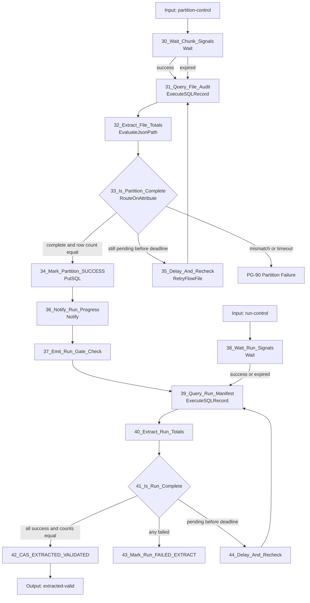

### 9.2 주요 Processor 설정

| ID | Processor | Scheduling | 주요 Properties | Relationship |
|---|---|---|---|---|
| 30 | `Wait` | Primary, 1 | Cache=`CS_DMC_CLIENT`, partition signal key/counter, target=`${fragment.count}`, expiration 설정 | success/expired→31, wait→자기 입력 queue, failure→PG-90 |
| 31 | `ExecuteSQLRecord` | Primary, 1 | `CS_DBCP_META`, `load_file`의 file/row/failed 합계 조회, JSON writer | success→32, failure→재시도/PG-90 |
| 32 | `EvaluateJsonPath` | Primary, 1 | audit file count, row count, failed count와 run status 추출 | matched→33, failure/unmatched→PG-90 |
| 33 | `RouteOnAttribute` | Primary, 1 | chunk 수, expected rows, deadline, run status 비교 | complete→34, pending→35, mismatch/timeout→PG-90 |
| 34 | `PutSQL` | Primary, 1 | claim token 조건으로 partition SUCCESS 및 실제 count/file/byte 저장, Fragmented=false | success→36, retry/failure→PG-90 |
| 35 | `RetryFlowFile` | Primary, 1 | partition gate polling count, deadline 전 penalty | retry→31, exceeded/failure→PG-90 |
| 36 | `Notify` | Primary, 1 | key=`${load.run.id}`, counter=`partitions`, delta=1 | success→37, failure→39 DB 확인 경로 |
| 37 | `UpdateAttribute` + Output Port | Primary, 1 | `gate.source=partition-success` | success→39 |
| 38 | `Wait` | Primary, 1 | run signal key/counter, target=`${load.partition.count}`, run expiration | success/expired→39, wait→자기 queue, failure→39 |
| 39 | `ExecuteSQLRecord` | Primary, 1 | PostgreSQL partition 상태/count 집계 SQL, JSON writer | success→40, failure→재시도/PG-90 |
| 40 | `EvaluateJsonPath` | Primary, 1 | total/success/failed/pending/extracted count 추출 | matched→41, failure/unmatched→PG-90 |
| 41 | `RouteOnAttribute` | Primary, 1 | 전체 완료식과 source count 비교 | complete→42, any failed→43, pending→44 |
| 42 | `PutSQL` | Primary, 1 | status `EXTRACTING→EXTRACTED_VALIDATED` CAS, 완료 count 저장 | success→PG-40, retry/failure→PG-90 |
| 43 | `PutSQL` | Primary, 1 | status `EXTRACTING→FAILED_EXTRACT`, 오류 요약/완료시각 저장 | success→PG-90 알림, failure→관리 DB 장애 알림 |
| 44 | `RetryFlowFile` | Primary, 1 | run gate polling count와 deadline 적용 | retry→39, exceeded/failure→43 |

30 `Wait` 설정:

```text
Release Signal Identifier = ${load.run.id}:${partition.id}
Signal Counter Name       = chunks
Target Signal Count       = ${fragment.count}
Expiration Duration       = #{PARTITION.WAIT.TIMEOUT}
Wait Mode                 = Keep in upstream connection
```

Connection에는 FIFO Prioritizer를 설정한다. `expired`도 즉시 실패시키지 않고 DB를 조회한다. cache가 유실되었지만 HDFS와 audit가 모두 성공했을 수 있기 때문이다.

38 `Wait` 설정:

```text
Release Signal Identifier = ${load.run.id}
Signal Counter Name       = partitions
Target Signal Count       = ${load.partition.count}
Expiration Duration       = #{RUN.WAIT.TIMEOUT}
Wait Mode                 = Keep in upstream connection
```

38의 `expired`도 39로 연결한다. cache 신호가 없거나 중복되어도 run manifest의 상태와 count만이 최종 판정 기준이다.

33 완료 조건:

```text
audit.file_count = fragment.count
AND audit.row_count = partition.expected.rows
AND audit.failed_file_count = 0
AND run.status = EXTRACTING
```

34는 claim token과 현재 상태까지 조건으로 `SUCCESS`를 갱신한다. 완료 후 36은 run key로 progress signal을 보낸다.

```text
Release Signal Identifier = ${load.run.id}
Signal Counter Name       = partitions
Signal Counter Delta      = 1
```

41의 최종 완료 조건은 다음 SQL 결과로만 판정한다.

```text
total_partition_count = expected_partition_count
success_partition_count = expected_partition_count
failed_partition_count = 0
pending_partition_count = 0
SUM(actual_row_count) = source_count
```

`Wait/Notify` counter 값만으로 42로 갈 수 없다. 42는 `status='EXTRACTING'` 조건의 CAS update로 `EXTRACTED_VALIDATED`를 선점한다.

Partition failure 공통 경로는 partition과 run을 실패 상태로 갱신한 뒤 별도의 `run-gate-check` FlowFile을 39로 보낸다. 따라서 다른 파티션 신호를 모두 기다리지 않고 `failed_partition_count > 0`을 확인해 조기에 전체 실패시킬 수 있다.

---

## 10. PG-40 Staging Validation

### 10.1 Processor 흐름

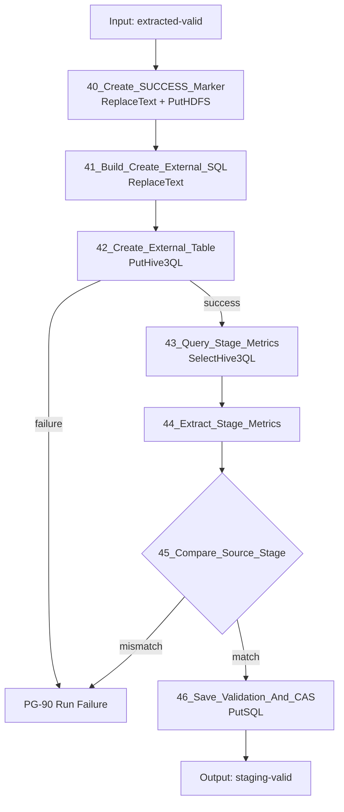

### 10.2 주요 Processor 설정

| ID | Processor | Scheduling | 주요 Properties | Relationship |
|---|---|---|---|---|
| 40A | `ReplaceText` | Primary, 1 | Replacement Strategy=Entire text, Replacement Value=빈 값 | success→40B, failure→PG-90 |
| 40B | `UpdateAttribute` | Primary, 1 | `filename=_SUCCESS`, Directory=`${load.hdfs.path}` | success→40C |
| 40C | `PutHDFS` | Primary, 1 | Hadoop config만 설정, Kerberos service 미설정, Write and rename, conflict=replace | success→41, failure→PG-90/제한 재시도 |
| 41 | `ReplaceText` | Primary, 1 | 승인된 external table DDL로 전체 content 치환 | success→42, failure→PG-90 |
| 42 | `PutHive3QL` 또는 `PutClouderaHiveQL` | Primary, 1 | `CS_HIVE3_DBCP`, Query Timeout, DDL 1건 | success→43, failure→PG-90 |
| 43 | `SelectHive3QL` 또는 `ExecuteSQLRecord` | Primary, 1 | stage count/NULL/중복/min/max/업무 합계 SQL, JSON writer | success→44, failure→PG-90 |
| 44 | `EvaluateJsonPath` | Primary, 1 | stage metrics를 `validation.stage.*` attribute로 추출 | matched→45, failure/unmatched→PG-90 |
| 45 | `RouteOnAttribute` | Primary, 1 | source/extracted/staging count 및 DQ 지표 비교 | match→46, mismatch→PG-90 |
| 46 | `PutSQL` | Primary, 1 | validation UPSERT/INSERT 후 `EXTRACTED_VALIDATED→STAGING_VALIDATED` CAS, Fragmented=false | success→PG-50, retry/failure→PG-90 |

40은 기존 control FlowFile의 content를 `ReplaceText`로 비우고 `filename=_SUCCESS`를 설정한 뒤 run root에 `Write and rename`으로 기록한다. FlowFile attribute는 유지되므로 PutHDFS 성공 관계에서 바로 41로 진행한다. 이 파일은 global manifest 검증 후에만 존재한다.

41의 예시 SQL:

```sql
CREATE EXTERNAL TABLE #{HIVE.STAGE.DB}.${load.stage.table} (
  #{HIVE.STAGE.DDL.COLUMNS}
)
STORED AS PARQUET
LOCATION '${load.hdfs.path}'
```

`load.stage.table`은 `${load.run.id}`에서 하이픈을 제거한 안전한 suffix만 사용하고 정규식으로 검증한다.

Apache NiFi 2.x에는 Hive 번들이 없다. NiFi 2.4.0 배포본의 Processor 목록에서 `PutHive3QL`/`SelectHive3QL`이 없음을 확인했다. 이 문서의 `PutHive3QL`, `SelectHive3QL`, `PutClouderaHiveQL`, `CS_HIVE3_DBCP`는 CFM이 제공하는 Hive 구성요소를 가리키는 자리표시자다. 구현 전에 CFM 4.12.0 supported processors 목록(21장)에서 실제 Processor와 Controller Service 이름, 지원 속성(Query Timeout, Rollback On Failure 등)을 확정한다. 제공 구성요소가 없다면 Hive JDBC driver와 `ExecuteSQL`/`ExecuteSQLRecord`로 DDL·DML을 실행할 수 있는지 사전 시험한 뒤 대체한다.

42는 확정된 Hive 실행 Processor를 사용한다. 43은 Hive 조회 Processor가 제공되면 사용하고, 환경 표준이 Hive JDBC라면 `ExecuteSQLRecord + CS_HIVE3_DBCP`로 대체한다.

필수 stage 지표:

```sql
SELECT COUNT(*) AS STAGE_COUNT,
       SUM(CASE WHEN INSP_DTL_SEQ IS NULL THEN 1 ELSE 0 END) AS NULL_SEQ_COUNT,
       COUNT(*) - COUNT(DISTINCT <BUSINESS_PK>) AS DUP_PK_COUNT,
       MIN(INSP_DTL_SEQ) AS MIN_SEQ,
       MAX(INSP_DTL_SEQ) AS MAX_SEQ,
       SUM(<BUSINESS_AMOUNT>) AS AMOUNT_SUM,
       CAST(MIN(<BUSINESS_TIMESTAMP>) AS STRING) AS MIN_TS,
       CAST(MAX(<BUSINESS_TIMESTAMP>) AS STRING) AS MAX_TS
  FROM #{HIVE.STAGE.DB}.${load.stage.table}
```

`MIN_TS`/`MAX_TS`는 동일 의미로 계산한 원천 값과 문자열로 비교한다. 시간대 해석이 어긋나면 count는 같아도 이 지표가 불일치한다.

46은 `nifi_ops.load_validation`에 지표별 PASS/FAIL을 저장하고, 모두 PASS일 때만 `STAGING_VALIDATED`로 CAS 갱신한다.

---

## 11. PG-50 Publish

### 11.1 Processor 흐름

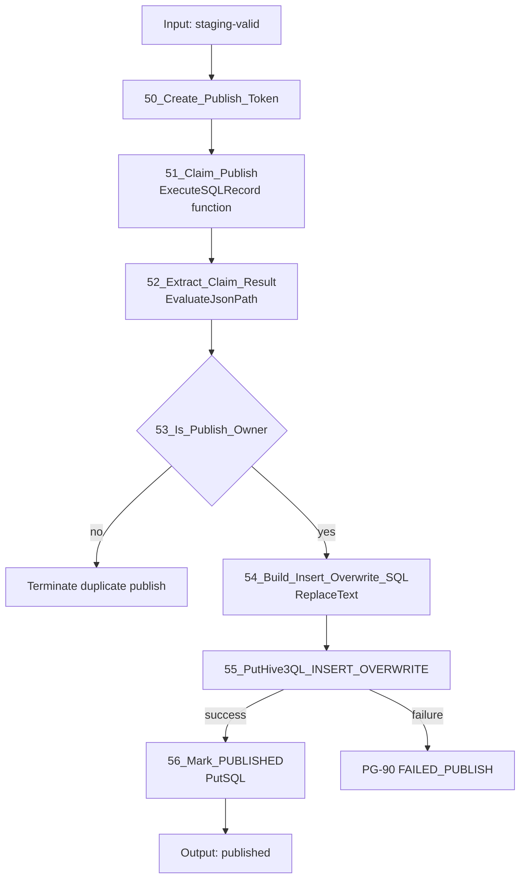

### 11.2 주요 Processor 설정

| ID | Processor | Scheduling | 주요 Properties | Relationship |
|---|---|---|---|---|
| 50 | `UpdateAttribute` | Primary, 1 | `publish.token=${UUID()}`, publish 요청시각 | success→51 |
| 51 | `ExecuteSQLRecord` | Primary, 1 | `CS_DBCP_META`, `claim_publish` 함수, JSON array writer, Max Rows=0 | success→52, failure→PG-90 |
| 52 | `EvaluateJsonPath` | Primary, 1 | `publish.claimed=$[0].claimed` | matched→53, failure/unmatched→PG-90 |
| 53 | `RouteOnAttribute` | Primary, 1 | `${publish.claimed:equals('true')}` | true→54, false→중복 publish 종료 |
| 54 | `ReplaceText` | Primary, 1 | 승인된 target/partition/column로 `INSERT OVERWRITE` SQL 생성 | success→55, failure→PG-90 |
| 55 | `PutHive3QL` 또는 `PutClouderaHiveQL` | Primary, 1 | `CS_HIVE3_DBCP`, Query Timeout, Concurrent=1, 환경 지원 시 Rollback On Failure=true | success→56, failure/timeout→PG-90 또는 PUBLISH_UNKNOWN |
| 56 | `PutSQL` | Primary, 1 | publish token 조건으로 `PUBLISHING→PUBLISHED`, published_at 저장 | success→PG-60, retry/failure→PG-90 |

50에서 `publish.token=${UUID()}`를 만들고 51에서 4.1의 PostgreSQL 함수를 호출한다.

```sql
SELECT nifi_ops.claim_publish(
    CAST(? AS uuid),
    CAST(? AS uuid)
) AS claimed;
```

parameter 순서는 `run_id`, `publish_token`이다. 52가 `$[0].claimed`를 추출하고 true인 한 FlowFile만 55로 진입한다.

54 SQL 예시:

```sql
INSERT OVERWRITE TABLE #{HIVE.TARGET.DB}.#{HIVE.TARGET.TABLE}
#{TARGET.PARTITION.CLAUSE}
SELECT #{HIVE.INSERT.COLUMNS}
  FROM #{HIVE.STAGE.DB}.${load.stage.table}
```

전체 테이블이 아니라 업무일자 파티션만 교체해야 한다면 `TARGET.PARTITION.CLAUSE`를 반드시 설정한다. SQL에는 FlowFile에서 받은 임의 identifier를 사용하지 않는다.

Hive 응답을 받지 못해 성공 여부가 불명확한 timeout은 자동 재실행하지 않고 `PUBLISH_UNKNOWN`으로 기록한다. Recovery Monitor가 Hive query history와 target 지표를 확인한 후 운영 정책에 따라 확정한다.

---

## 12. PG-60 Target Validation

### 12.1 Processor 흐름

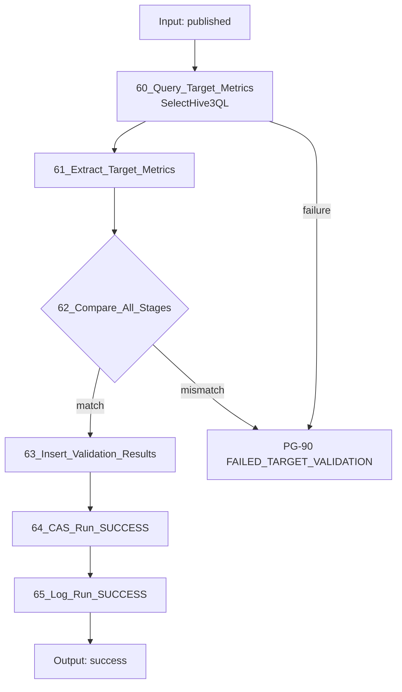

### 12.2 주요 Processor 설정

| ID | Processor | Scheduling | 주요 Properties | Relationship |
|---|---|---|---|---|
| 60 | `SelectHive3QL` 또는 `ExecuteSQLRecord` | Primary, 1 | target 업무 범위 count/NULL/중복/min/max/업무 합계 SQL, JSON writer | success→61, failure→PG-90 |
| 61 | `EvaluateJsonPath` | Primary, 1 | target metrics를 `validation.target.*` attribute로 추출 | matched→62, failure/unmatched→PG-90 |
| 62 | `RouteOnAttribute` | Primary, 1 | source/extracted/stage/target count와 DQ 지표 비교 | match→63, mismatch→PG-90 |
| 63 | `PutSQL` | Primary, 1 | `nifi_ops.load_validation`에 TARGET 지표 저장, Fragmented=false | success→64, retry/failure→PG-90 |
| 64 | `PutSQL` | Primary, 1 | `PUBLISHED→SUCCESS` CAS, target_count/completed_at 저장 | success→65, retry/failure→PG-90 |
| 65 | `UpdateAttribute` + PG-90 port | Primary, 1 | `event.name=RUN_SUCCESS`, `event.level=INFO`, 최종 count/duration 설정 | success→완료 Output Port |

62 조건:

```text
target_count = stage_count = extracted_count = source_count
AND target key/null/duplicate metrics pass
AND target business aggregates = stage/source aggregates
```

64는 `status='PUBLISHED'` 조건에서만 `SUCCESS`로 갱신하고 완료시각과 모든 count를 저장한다. Target 검증 실패 시 재추출이나 overwrite를 자동 반복하지 않는다.

---

## 13. PG-70 Recovery Monitor

### 13.1 Processor 흐름

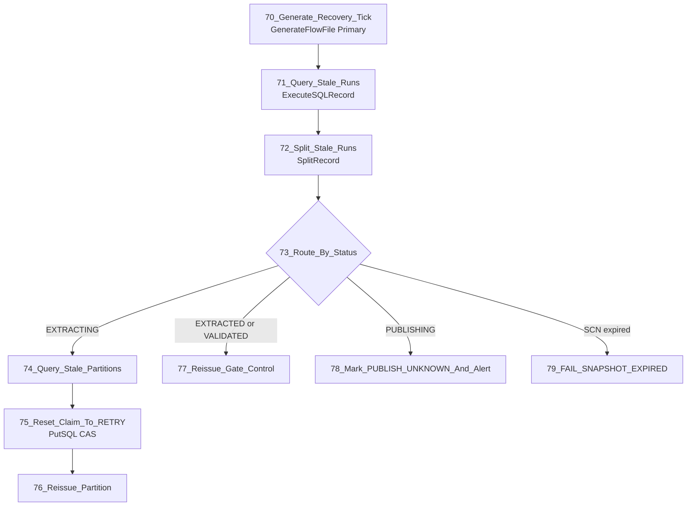

### 13.2 주요 Processor 설정

| ID | Processor | Scheduling | 주요 Properties | Relationship |
|---|---|---|---|---|
| 70 | `GenerateFlowFile` | Primary, 1, 5분 | Custom Text=`{}`, recovery tick 속성 설정 | success→71 |
| 71 | `ExecuteSQLRecord` | Primary, 1 | `CS_DBCP_META`, 활성 상태와 heartbeat 임계시간으로 stale run 조회, JSON writer | success→72, failure→PG-90 |
| 72 | `SplitRecord` | Primary, 1 | JSON reader/writer, Records Per Split=1 | splits→73, original→terminate, failure→PG-90 |
| 73 | `RouteOnAttribute` | Primary, 1 | run status별 recovery 경로 분기 | EXTRACTING→74, validated→77, PUBLISHING→78, SCN expired→79 |
| 74 | `ExecuteSQLRecord` | Primary, 1 | stale `RUNNING/RETRY` partition과 claim token 조회 | success→SplitRecord/75, failure→PG-90 |
| 75 | `PutSQL` | Primary, 1 | 기존 claim token과 heartbeat 조건의 CAS로 status=`RETRY`, claim 초기화 | success→76, retry/failure→PG-90 |
| 76 | `UpdateAttribute` + Output Port | Primary, 1 | 기존 run_id/snapshot_scn/partition bounds 유지, recovery event 설정 | success→PG-20 Round Robin 입력 |
| 77 | `UpdateAttribute` + Output Port | Primary, 1 | run-control 재생성, 저장된 expected partition count 사용 | success→PG-30 run gate |
| 78 | `PutSQL` + PG-90 port | Primary, 1 | `PUBLISHING→PUBLISH_UNKNOWN`, 자동 재실행 금지, ERROR 알림 | success→운영 확인 queue |
| 79 | `PutSQL` + PG-90 port | Primary, 1 | `FAILED_SNAPSHOT_EXPIRED`, error/completed_at 저장 | success→실패 알림 |

- Primary Node, 5분 주기, Concurrent Tasks=1
- `heartbeat_at < now - #{RECOVERY.STALE.MINUTES}`인 활성 run만 조회
- stale partition은 현재 claim token과 timestamp를 조건으로 CAS reset
- 동일 `run_id + partition_id`와 같은 SCN으로만 재발행
- Oracle UNDO에서 SCN을 읽을 수 없으면 전체 run 실패
- `PUBLISHING`은 자동 `INSERT OVERWRITE` 재실행 금지

---

## 14. PG-90 Audit, Error and Notification

### 14.1 이벤트 흐름

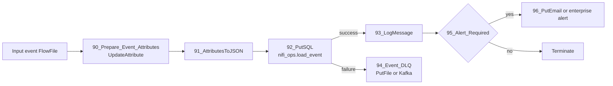

업무 상태를 바꾸는 `nifi_ops.load_run/load_partition/load_file/load_validation` 기록은 각 주 흐름에서 동기적으로 처리한다. PG-90 이벤트는 관측용이며, 이벤트 DB 장애가 데이터 FlowFile을 무한 정지시키지 않도록 로컬 보호 DLQ 또는 운영 Kafka로 보낸다.

### 14.2 주요 Processor 설정

| ID | Processor | Scheduling | 주요 Properties | Relationship |
|---|---|---|---|---|
| 90 | `UpdateAttribute` | All Nodes, 2~4 | event_id/time/level/name, run/partition/chunk, 오류 및 처리량 속성 정규화 | success→91 |
| 91 | `AttributesToJSON` | All Nodes, 2~4 | Destination=flowfile-content, 지정 attribute 목록만 포함, pretty print=false | success→92, failure→94 |
| 92 | `PutSQL` | All Nodes, 2~4 | `CS_DBCP_META`, event INSERT prepared SQL, Batch=1, Fragmented=false | success→93, retry/failure→94 |
| 93 | `LogMessage` | All Nodes, 2~4 | Prefix=`SQOOP_REPLACEMENT`, Level=`${event.level}`, 구조화 JSON message | success→95 |
| 94 | `PutFile` 또는 운영 Kafka Publisher | All Nodes, 1~2 | 복구 가능한 DLQ 경로 또는 topic, 결정적 event filename/key | success→오류 카운터, failure→Bulletin/운영 알림 |
| 95 | `RouteOnAttribute` | All Nodes, 2~4 | ERROR, PUBLISH_UNKNOWN, 최종 실패 등 알림 대상 분기 | alert→96, unmatched→terminate |
| 96 | `PutEmail` 또는 조직 알림 Processor | All Nodes, 1 | 제목에 job/run/status, 본문에 비밀값 없는 요약 | success→terminate, failure→DLQ/Bulletin |

### 14.3 PostgreSQL 이벤트 기록

테이블은 4.1의 `nifi_ops.load_event` DDL을 사용한다. `90_Prepare_Event_Attributes`는 아래 PostgreSQL 컬럼명과 동일한 attribute를 만들고, `91_AttributesToJSON`은 해당 attribute 목록을 FlowFile content로 직렬화한다. `92_PutSQL`은 `CS_DBCP_META`, Batch Size=1, Support Fragmented Transactions=false로 설정한다.

`UpdateAttribute` 동적 Property 예시는 다음과 같다.

```text
event_id      = ${UUID()}
event_time    = ${now():format("yyyy-MM-dd'T'HH:mm:ss.SSSXXX","UTC")}
event_level   = ${event.level}
event_name    = ${event.name}
run_id        = ${load.run.id}
job_key       = ${load.job.key}
business_key  = ${load.business.key}
partition_id  = ${partition.id}
chunk_index   = ${chunk.index}
process_group = ${event.process.group}
processor_name = ${event.processor.name}
node_id       = ${hostname(true)}
attempt_no    = ${partition.retry.count}
row_count     = ${event.row.count}
duration_ms   = ${event.duration.ms}
error_class   = ${error.class}
error_code    = ${error.code}
message       = ${error.message}
```

`AttributesToJSON`은 Destination=`flowfile-content`, Attributes List=`event_id,event_time,event_level,event_name,run_id,job_key,business_key,partition_id,chunk_index,process_group,processor_name,node_id,attempt_no,row_count,duration_ms,error_class,error_code,message`로 설정한다. 이 content는 DLQ와 운영 분석에 사용하고, DB INSERT는 아래 prepared SQL을 사용한다.

```sql
INSERT INTO nifi_ops.load_event (
    event_id, event_time, event_level, event_name,
    run_id, job_key, business_key, partition_id, chunk_index,
    process_group, processor_name, node_id,
    attempt_no, row_count, duration_ms,
    error_class, error_code, message
) VALUES (
    CAST(? AS uuid), CAST(? AS timestamptz), ?, ?,
    CAST(NULLIF(?, '') AS uuid), ?, ?, ?, CAST(NULLIF(?, '') AS integer),
    ?, ?, ?,
    CAST(NULLIF(?, '') AS integer), CAST(NULLIF(?, '') AS bigint),
    CAST(NULLIF(?, '') AS bigint),
    NULLIF(?, ''), NULLIF(?, ''), NULLIF(?, '')
);
```

`sql.args.1`부터 `sql.args.18`까지 위 컬럼 순서로 매핑하고 type은 문자열 전달이 가능한 `VARCHAR(12)`를 사용한다. PostgreSQL `CAST/NULLIF`가 UUID, timestamp 및 숫자 변환을 담당하므로 선택 숫자 값이 비어 있어도 INSERT가 실패하지 않는다.

생성되는 JSON 예시는 다음과 같다.

```json
{
  "event_id": "0199d100-1111-7000-8000-000000000001",
  "event_time": "2026-09-28T05:10:12.123Z",
  "event_level": "INFO",
  "event_name": "PARTITION_SUCCESS",
  "run_id": "0199d100-2222-7000-8000-000000000002",
  "job_key": "ORACLE_INSP_DTL_DAILY",
  "business_key": "2026-09-28",
  "partition_id": "0003",
  "chunk_index": 2,
  "process_group": "PG-30 Partition and Run Gate",
  "processor_name": "34_Mark_Partition_SUCCESS",
  "node_id": "nifi-02.example.com",
  "attempt_no": 1,
  "row_count": 500000,
  "duration_ms": 82451,
  "error_class": null,
  "error_code": null,
  "message": "partition validation passed"
}
```

이벤트 INSERT 실패는 main flow 상태를 되돌리지 않고 JSON content를 DLQ에 저장하되, Run/Partition/File/Validation 상태 기록 실패는 해당 단계 자체를 실패시킨다.

### 14.4 필수 이벤트

| Level | Event | 기록 시점 |
|---|---|---|
| INFO | `RUN_STARTED` | run lock 획득 |
| INFO | `SNAPSHOT_FIXED` | SCN/source metrics 확정 |
| INFO | `MANIFEST_CREATED` | partition manifest 완성 |
| INFO | `PARTITION_STARTED` | claim 성공 |
| DEBUG | `CHUNK_WRITTEN` | PutHDFS 성공; 운영 로그량에 따라 DB file audit만 유지 가능 |
| INFO | `PARTITION_SUCCESS` | 파티션 row/file 검증 성공 |
| ERROR | `PARTITION_FAILED` | 재시도 소진 또는 비일시 오류 |
| INFO | `EXTRACT_VALIDATED` | 전체 파티션 검증 성공 |
| INFO | `STAGE_VALIDATED` | external table 검증 성공 |
| INFO | `PUBLISH_STARTED` | publish CAS 획득 |
| INFO | `PUBLISH_FINISHED` | HiveQL 성공 응답 |
| ERROR | `PUBLISH_UNKNOWN` | timeout/연결 단절로 결과 불명 |
| INFO | `RUN_SUCCESS` | target 검증 완료 |
| ERROR | `RUN_FAILED` | 최종 실패 확정 |
| WARN | `RECOVERY_REISSUED` | stale partition 재발행 |

### 14.5 `LogMessage` 형식

```text
Log Prefix  = SQOOP_REPLACEMENT
Log Level   = ${event.level}
Log Message = {"event":"${event.name}","run_id":"${load.run.id}",
 "job_key":"${load.job.key}","business_key":"${load.business.key}",
 "partition_id":"${partition.id}","chunk_index":"${chunk.index}",
 "node":"${hostname(true)}","attempt":"${partition.retry.count}",
 "rows":"${event.row.count}","duration_ms":"${event.duration.ms}",
 "error_class":"${error.class}","error_code":"${error.code}",
 "message":"${error.message}"}
```

`error.message`는 줄바꿈 제거, 길이 제한 및 비밀값 마스킹 후 기록한다. SQL 본문 전체, JDBC URL의 credential, 원천 행 데이터는 로그에 기록하지 않는다.

### 14.6 오류 공통 경로

각 Processor의 failure 관계에는 먼저 전용 `UpdateAttribute`를 둔다.

```text
error.stage     = ORACLE_EXTRACT | HDFS_WRITE | STAGE_VALIDATE | PUBLISH ...
error.processor = 25_Execute_Partition_Query
error.class     = TRANSIENT | NON_RETRYABLE | VALIDATION | UNKNOWN
error.code      = processor가 제공한 SQLState/vendor code 또는 INTERNAL
error.message   = processor error attribute, 없으면 고정 설명
event.level     = ERROR
event.name      = PARTITION_FAILED 또는 RUN_FAILED
```

`ExecuteSQLRecord`의 `executesql.error.message`처럼 Processor가 제공하는 attribute를 사용한다. PutHDFS처럼 구체적인 오류 attribute가 없는 경우 `PutHDFS routed failure; see bulletin and provenance for run_id/partition_id`를 기록하고 NiFi Bulletin/Provenance와 상관 조회한다.

---

## 15. Connection과 Back Pressure

| Connection | Object threshold | Data threshold | 기타 |
|---|---:|---:|---|
| Coordinator → Worker | `2 × 전체 worker 수` 이상 | 제어 FlowFile이므로 100 MB | Round Robin |
| ExecuteSQLRecord → Validate/PutHDFS | 100~500 | HDFS 지연을 견디되 repository 용량의 20% 이하 | Oldest First |
| PutHDFS retry loop | 100 | 10 GB 예시 | RetryFlowFile penalty 사용 |
| Partition Wait | 예상 partition 수 × active run | 100 MB | FIFO Prioritizer |
| Run Wait | active run 수 | 10 MB | FIFO Prioritizer |
| Audit | 10,000 | 1 GB | 중요 이벤트 우선순위 가능 |

정확한 값은 평균 FlowFile 크기, Content Repository 용량, 동시 run 수로 산정한다. Back Pressure가 걸렸는데 Coordinator가 새 run을 계속 생성하지 않도록 활성 run lock을 유지한다.

### 15.1 `PutSQL`의 fragment 처리 주의사항

`SplitRecord`가 만든 partition FlowFile에는 `fragment.identifier/count/index`가 남는다. 따라서 다음 설정을 명시하지 않으면 일부 `PutSQL`이 모든 fragment가 모일 때까지 기다리는 의도치 않은 동작을 할 수 있다.

| 사용처 | Support Fragmented Transactions | Batch Size |
|---|---:|---:|
| 22 manifest 전체 INSERT | `true` | 기본 DBCP/Hikari에서는 fragmented 모드가 Batch Size 제한을 받지 않음; Penalty Duration=`0 sec` 필수 |
| Worker claim/update | `false` | 1 |
| File audit upsert | `false` | 1 또는 소규모 batch |
| Partition/Run 상태 CAS | `false` | 1 |
| Validation/Event INSERT | `false` | 처리량에 맞춤 |

Worker 이후의 FlowFile에는 Oracle query가 새로 설정한 fragment 속성도 있으므로, Worker 영역의 `PutSQL`에서는 항상 `Support Fragmented Transactions=false`를 명시한다.

Fragmented=true인 `PutSQL`은 일부 fragment만 poll되면 FlowFile을 penalize해 되돌리므로 Penalty Duration이 0보다 크면 livelock이 생길 수 있다(7.2의 22 참조). Fragmented=true를 쓰는 모든 `PutSQL`은 Penalty Duration=`0 sec`와 Transaction Timeout을 함께 설정한다.

---

## 16. Retry 분류

| 분류 | 예 | 동작 |
|---|---|---|
| 일시적 | connection reset, 일시 HDFS unavailable, DB pool timeout | 최대 `${PARTITION.RETRY.MAX}`, penalty/backoff 후 같은 partition 재시도 |
| 스냅샷 불가 | `ORA-01555`, snapshot too old | 즉시 전체 run 실패, 새 SCN 일부 재시도 금지 |
| 영구 SQL | ORA-00942, 문법/컬럼/권한 오류 | 즉시 실패 |
| 데이터 | schema 변환 실패, expected/actual mismatch | 즉시 실패 및 파일 격리 |
| 게시 불명 | Hive timeout, connection loss after submit | `PUBLISH_UNKNOWN`, 자동 overwrite 재실행 금지 |

`RetryFlowFile` 설정 예:

```text
Retry Attribute               = partition.retry.count
Maximum Retries               = #{PARTITION.RETRY.MAX}
Penalize Retries              = true
Fail on Non-numerical Overwrite = true
Reuse Mode                    = Fail on Reuse
```

Connection의 Penalty Duration으로 최소 backoff를 설정한다. 더 긴 지수 backoff가 필요하면 retry count별 `RouteOnAttribute`와 `ControlRate`/지연 queue를 사용한다.

---

## 17. 상태 변경과 게시 안전장치

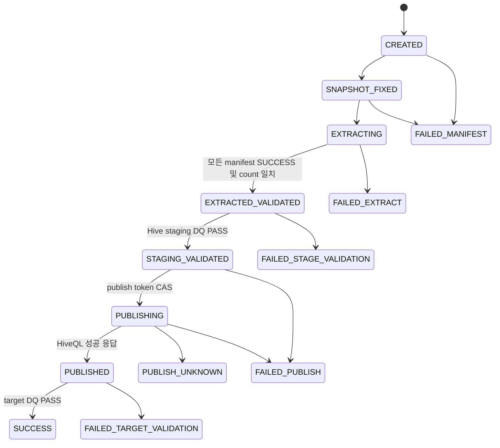

모든 상태 변경 SQL은 `WHERE run_id=? AND status=<expected>` 조건을 사용한다. publish token 소유권 검증, active run unique constraint, Primary Node scheduling을 함께 적용해 중복 게시를 방지한다.

---

## 18. NiFi 운영 설정

- 모든 Coordinator Processor: `Run Schedule=0 sec` 또는 입력 기반, `Concurrent Tasks=1`, `Execution=Primary Node`
- Worker: `Execution=All Nodes`, 입력 Connection Round Robin
- DB pool 상한: `노드 수 × worker concurrent tasks + control 여유`가 Oracle 승인 세션 수를 넘지 않게 설정
- Processor `Yield Duration`: DB/HDFS failure 폭주 방지를 위해 10~30초부터 시험
- Provenance: run/partition/chunk 상관 분석이 가능한 기간 유지
- Bulletin: ERROR/WARN 수집을 모니터링 시스템에 연계
- Parameter Context 변경 권한과 NiFi Policy를 운영자/개발자로 분리
- 민감 Parameter는 버전관리 flow JSON에 평문으로 포함하지 않음
- flow definition은 NiFi Registry 또는 조직 표준 Git 배포 절차로 승격

---

## 19. 구현 및 검증 순서

1. 관리 테이블과 unique/CAS 조건을 먼저 구현한다.
2. `PARTITION.COUNT=1`, 작은 기준 데이터로 source → HDFS만 구현한다.
3. 경계값, NULL, 0건, Oracle 타입을 검증한다.
4. chunk/file audit 및 partition gate를 구현한다.
5. 2/4/8 partition으로 늘려 병렬성과 DB 부하를 측정한다.
6. external staging DDL과 count/DQ를 구현한다.
7. 비운영 target에서 `INSERT OVERWRITE`와 복구 시험을 수행한다.
8. Target validation과 최종 상태를 연결한다.
9. 노드 종료, cache 초기화, NiFi 재기동, HDFS 오류, `ORA-01555`를 주입한다.
10. Recovery Monitor와 보존/정리 flow를 마지막에 활성화한다.

운영 승인 조건:

```text
파티션 하나가 실패하면 PutHive3QL 호출 건수는 0이다.
중복 FlowFile/Notify/cache 유실 후에도 manifest DB 검증 없이는 publish되지 않는다.
재기동 후 동일 run_id와 snapshot_scn으로만 복구된다.
source = partition sum = staging = target 검증이 모두 PASS인 경우만 SUCCESS이다.
PUBLISH_UNKNOWN은 사람 또는 별도 reconciliation 없이 자동 재실행되지 않는다.
```

---

## 20. 용어집

### 플랫폼과 NiFi 구성요소

| 용어 | 정의 | 이 문서에서의 의미 |
|---|---|---|
| CFM | Cloudera Flow Management | NiFi 2.6.0을 포함하는 목표 플랫폼 버전은 CFM 4.12.0이다. |
| NiFi | Apache NiFi 데이터 흐름 자동화 플랫폼 | Sqoop을 대신하여 Oracle 병렬 조회, HDFS 기록, 완료 판정과 Hive 게시를 조정한다. |
| Kylo | NiFi 기반 데이터 레이크 관리 플랫폼 | AS-IS에서 Kylo의 `ImportSqoop` Processor를 사용한다. |
| Sqoop | RDBMS와 Hadoop 간 대량 데이터 전송 도구 | TO-BE에서 제거하며 Mapper의 병렬 실행과 Job 완료 의미를 NiFi로 재구현한다. |
| Processor | NiFi Flow의 단일 처리 컴포넌트 | `ExecuteSQLRecord`, `PutHDFS`, `Wait`, `Notify`, `PutSQL` 등이 해당한다. |
| Process Group | 여러 Processor와 Connection을 묶은 논리 단위 | `PG-10 Coordinator`, `PG-20 Worker`처럼 책임별로 Flow를 분리한다. |
| FlowFile | NiFi에서 content와 attribute를 함께 운반하는 객체 | 데이터 chunk 또는 run/partition 제어 메시지를 전달한다. |
| Content | FlowFile가 가리키는 실제 데이터 | Parquet 데이터, SQL 문장 또는 제어용 JSON이 될 수 있다. |
| Attribute | FlowFile에 연결된 문자열 메타데이터 | `load.run.id`, `partition.id`, `record.count` 등 제어와 상관관계에 사용한다. |
| Connection | Processor 사이에서 FlowFile을 보관하는 Queue | Back Pressure, Prioritizer 및 cluster load balancing을 설정한다. |
| Controller Service | 여러 Processor가 공유하는 연결·직렬화 서비스 | JDBC pool, Record Reader/Writer, Distributed Cache client를 제공한다. |
| Parameter Context | Flow 설정값과 민감정보를 묶어 공급하는 NiFi 기능 | DB URL, table, concurrency, HDFS 경로와 timeout을 환경별로 관리한다. |
| Primary Node | NiFi cluster에서 단일 실행 Processor를 담당하는 선출 노드 | Trigger, Coordinator, Gate, Publish와 Recovery Monitor가 실행된다. |
| All Nodes | NiFi cluster의 모든 노드에서 실행되는 스케줄링 방식 | PG-20 Worker가 partition FlowFile을 분산 처리한다. |
| Concurrent Tasks | 한 Processor가 동시에 실행할 수 있는 task 수 | Oracle 동시 JDBC session과 HDFS 쓰기 동시성을 결정한다. |
| Round Robin | FlowFile을 cluster 노드에 순환 분배하는 load balancing 전략 | Coordinator에서 PG-20 Worker로 가는 입력 Connection에만 적용한다. |
| Back Pressure | Queue 크기 또는 데이터량이 임계값에 도달하면 upstream 실행을 억제하는 기능 | HDFS 지연이나 DB 병목이 NiFi repository 고갈로 이어지는 것을 방지한다. |
| Provenance | FlowFile 처리 이력을 기록하는 NiFi 기능 | `run_id/partition_id/chunk_index`로 장애 경로를 추적한다. |
| Bulletin | Processor 또는 Controller Service의 경고·오류 알림 | Processor가 상세 오류 attribute를 제공하지 않을 때 운영 진단에 사용한다. |

### 실행, 분할과 상태 관리

| 용어 | 정의 | 이 문서에서의 의미 |
|---|---|---|
| Job | 반복 실행 가능한 하나의 적재 정의 | 원천·대상·컬럼·조건이 같은 논리 적재이며 `job_key`로 식별한다. |
| `job_key` | 적재 Job의 영구 식별자 | 예: `ORACLE_INSP_DTL_DAILY`; 업무일자와 분리한다. |
| `business_key` | 한 적재가 대상으로 하는 업무 범위 | 업무일자, 기준일 또는 대상 partition 값이다. |
| Run | Job이 한 번 실행된 인스턴스 | 고유한 `run_id`, snapshot SCN과 HDFS 격리 경로를 갖는다. |
| `run_id` | 한 Run을 식별하는 UUID | 모든 FlowFile, PostgreSQL 행, HDFS 경로와 로그의 최상위 상관키다. |
| Partition | 원천 조회를 병렬화하기 위해 나눈 데이터 범위 | `INSP_DTL_SEQ`의 하한 포함·상한 미포함 범위다. |
| `partition_id` | Run 내부 partition 식별자 | `0000`, `0001` 또는 NULL 전용 partition 값이다. |
| Chunk | 한 partition 결과를 파일 크기에 맞춰 나눈 단위 | 하나의 Parquet FlowFile 및 HDFS 파일과 대응한다. |
| Manifest | 처리 대상과 예상 결과를 기록한 영속 목록 | PostgreSQL의 `load_run`, `load_partition`, `load_file`이 완료 판정의 원장이다. |
| Control plane | 실행 상태와 완료·게시 결정을 관리하는 영역 | Coordinator, PostgreSQL Manifest, Gate, Recovery Monitor가 해당한다. |
| Data plane | 실제 데이터를 읽고 변환하고 쓰는 영역 | Oracle 조회, Parquet 변환과 HDFS 기록이 해당한다. |
| Claim token | Worker가 partition 처리 소유권을 얻을 때 사용하는 UUID | `claim_partition` 함수가 중복 Worker 실행을 방지한다. |
| Publish token | 최종 게시 소유권을 식별하는 UUID | `claim_publish` 함수가 하나의 FlowFile만 `INSERT OVERWRITE`하게 한다. |
| CAS | Compare-And-Set; 기대 상태일 때만 값을 변경하는 방식 | `WHERE status='STAGING_VALIDATED'` 같은 조건부 UPDATE로 중복 상태 전이를 막는다. |
| Active Run Lock | 동일 Job과 업무키의 동시 실행을 막는 제약 | PostgreSQL partial unique index로 구현한다. |
| Heartbeat | 실행 중인 Run/Partition이 살아 있음을 나타내는 갱신 시각 | Recovery Monitor가 stale 작업을 판정하는 기준이다. |
| Stale | 일정 시간 heartbeat가 갱신되지 않은 상태 | 동일 SCN을 유지한 채 claim을 회수하여 partition을 재발행할 수 있다. |

### 데이터베이스와 저장소

| 용어 | 정의 | 이 문서에서의 의미 |
|---|---|---|
| SCN | Oracle System Change Number | 병렬 쿼리가 동일한 시점의 데이터를 읽도록 Run 시작 시 고정한다. |
| Flashback Query | 과거 SCN 또는 timestamp의 Oracle 데이터를 조회하는 기능 | 모든 source metric과 partition query에 동일한 `AS OF SCN`을 사용한다. |
| `ORA-01555` | 필요한 UNDO가 사라져 과거 snapshot을 읽을 수 없는 Oracle 오류 | 동일 Run의 부분 재시도를 금지하고 새 `run_id/SCN`으로 전체 재실행한다. |
| JDBC | Java Database Connectivity | NiFi가 Oracle, PostgreSQL 및 HiveServer2와 통신하는 인터페이스다. |
| Connection Pool | DB Connection을 재사용하고 동시 접속 수를 제한하는 서비스 | `CS_DBCP_ORACLE`, `CS_DBCP_META`, `CS_HIVE3_DBCP`로 구분한다. |
| Fetch Size | JDBC가 한 번에 가져오는 row 수에 대한 힌트 | Oracle 왕복 횟수와 NiFi memory 사용량을 조정한다. |
| HDFS | Hadoop Distributed File System | Oracle 추출 결과 Parquet와 `_SUCCESS` marker를 저장한다. |
| Simple Authentication | Kerberos 없이 OS 사용자명 기반으로 동작하는 Hadoop 인증 방식 | 이 프로젝트의 HDFS 인증 방식이며 NiFi OS 사용자의 POSIX/ACL 권한이 필요하다. |
| Effective User | HDFS가 요청 주체로 인식하는 사용자 | 비-Ker버 환경에서는 일반적으로 NiFi 프로세스 OS 사용자다. |
| Parquet | 컬럼 기반 파일 형식 | Oracle 추출 결과의 기본 HDFS 저장 형식이다. |
| Staging | 최종 게시 전 데이터를 격리하고 검증하는 임시 영역 | `run_id`별 HDFS 경로와 Hive external table로 구성한다. |
| External Table | 데이터 파일은 외부 경로에 두고 Hive가 metadata만 관리하는 테이블 | 검증 단계에서 해당 Run의 HDFS 경로만 참조한다. |
| Target Table | 사용자가 조회하는 최종 Hive 테이블 | 모든 사전 검증을 통과한 후에만 변경한다. |
| `INSERT OVERWRITE` | 대상 테이블 또는 partition의 기존 데이터를 새 결과로 교체하는 Hive DML | Publish token을 소유한 단일 FlowFile만 실행한다. |
| `_SUCCESS` | 데이터 쓰기 완료를 표시하는 빈 marker 파일 | 모든 partition과 file 검증이 끝난 후에만 Run root에 생성한다. |
| Write and Rename | 임시 파일을 완전히 쓴 뒤 최종 파일명으로 rename하는 방식 | 독자가 부분 파일을 읽는 것을 방지하는 PutHDFS 설정이다. |
| UPSERT | 행이 없으면 INSERT, 있으면 UPDATE하는 쓰기 방식 | 동일 chunk 재시도 시 `load_file`을 멱등하게 기록한다. |

### 완료 판정, 검증과 장애 처리

| 용어 | 정의 | 이 문서에서의 의미 |
|---|---|---|
| Barrier/Gate | 여러 병렬 작업이 모두 특정 상태에 도달할 때까지 다음 단계를 막는 장치 | Chunk→Partition→Run의 3단계 완료 판정을 수행한다. |
| `Wait` | cache의 release signal이 목표 수에 도달할 때까지 FlowFile을 보류하는 Processor | 빠른 완료 wake-up에 사용하며 최종 성공 원장은 아니다. |
| `Notify` | `Wait`가 확인할 counter signal을 cache에 기록하는 Processor | chunk 및 partition 진행 신호를 전달한다. |
| Distributed Cache | 여러 NiFi 노드가 공유하는 key/counter 저장소 | `Wait/Notify` 신호를 저장하지만 재기동 안전한 최종 상태로 간주하지 않는다. |
| Fragment | 한 ResultSet 또는 Record 묶음에서 파생된 FlowFile 집합 | `fragment.identifier/count/index`로 chunk의 소속과 순서를 식별한다. |
| `record.count` | Record Writer가 FlowFile에 기록한 row 수 | file manifest와 partition 실제 건수 합산에 사용한다. |
| DQ | Data Quality | count, schema, NULL, 중복, min/max, 업무 합계 및 hash 검증을 뜻한다. |
| Reconciliation | 서로 다른 처리 단계의 지표를 대조하는 작업 | Source=Partition 합계=Staging=Target인지 검증한다. |
| Idempotency | 같은 요청을 반복해도 최종 결과가 한 번 실행한 것과 같은 성질 | 결정적 HDFS 경로, file UPSERT와 CAS 상태 전이로 확보한다. |
| Retryable/Transient Error | 시간이 지나면 성공할 가능성이 있는 일시 오류 | connection reset, 일시적 HDFS 장애 등에 제한 재시도를 적용한다. |
| Non-retryable Error | 동일 입력으로 반복해도 해결되지 않는 오류 | SQL 문법, 권한, schema, 검증 오류와 `ORA-01555`가 해당한다. |
| Backoff | 재시도 사이의 대기시간을 점차 늘리는 방식 | DB/HDFS 장애 시 과도한 반복 호출을 막는다. |
| DLQ | Dead Letter Queue | PostgreSQL event 기록에 실패한 JSON 로그를 복구 가능하게 보관한다. |
| `PUBLISH_UNKNOWN` | Hive 게시 요청의 성공 여부를 확정할 수 없는 Run 상태 | timeout 후 자동 overwrite 재실행을 금지하고 target과 Hive 이력을 확인한다. |
| `FAILED_TARGET_VALIDATION` | 게시 후 Target 검증이 실패한 상태 | 자동 재추출·재게시하지 않고 중대 운영 오류로 처리한다. |
| Recovery Monitor | 비정상 중단 Run과 Partition을 찾아 복구하는 제어 Flow | PostgreSQL heartbeat와 상태를 기준으로 동일 SCN 작업만 재발행한다. |

---

## 21. Processor 지원 근거

- CFM 4.12.0 supported processors: https://docs.cloudera.com/cfm/4.12.0/release-notes/topics/cfm-supported-processors.html
- `ExecuteSQLRecord`: https://nifi.apache.org/components/org.apache.nifi.processors.standard.ExecuteSQLRecord/
- `PutSQL`: https://nifi.apache.org/components/org.apache.nifi.processors.standard.PutSQL/
- `SplitRecord`: https://nifi.apache.org/components/org.apache.nifi.processors.standard.SplitRecord/
- `Wait`: https://nifi.apache.org/components/org.apache.nifi.processors.standard.Wait/
- `Notify`: https://nifi.apache.org/components/org.apache.nifi.processors.standard.Notify/
- `PutHDFS`: https://nifi.apache.org/docs/nifi-docs/components/org.apache.nifi/nifi-hadoop-nar/1.28.0/org.apache.nifi.processors.hadoop.PutHDFS/
- `RetryFlowFile`: https://nifi.apache.org/components/org.apache.nifi.processors.standard.RetryFlowFile/
- `LogMessage`: https://nifi.apache.org/components/org.apache.nifi.processors.standard.LogMessage/
