# CFM 4.12.0 Sqoop 제거 통합 설계 및 NiFi Flow 구현 명세

> 기준: CFM 4.12.0 / Apache NiFi 2.6.0, Oracle → HDFS Parquet → Hive External Staging → `INSERT OVERWRITE`
>
> 완료 판정과 상태 기록은 Load Control API(Python FastAPI)가 담당한다. API 계약, 판정 트랜잭션, FastAPI 구현은 [Load Control API 설계](./load-control-api-design.md)(이하 "API 설계")에 있다.

## 1. 구현 범위와 전제

이 문서는 Sqoop 제거를 위한 아키텍처 설계와 NiFi Canvas 구현 명세를 하나로 통합한다. 설계 원칙, 상태 및 검증 모델부터 Process Group, Processor, Controller Service, Parameter Context, PostgreSQL DDL, 오류 처리와 로그까지 포함한다.

역할은 다음과 같이 나눈다.

- NiFi: 원천 조회, Parquet 변환, HDFS 기록, Hive DDL·DQ·`INSERT OVERWRITE` 실행. 결과는 모두 Load Control API에 보고한다.
- Load Control API: PostgreSQL 원장 기록, 불변식 검증, 파티션·run 완료 판정, 상태 전이(CAS), 검증 flow 호출(outbox), timeout 정리(sweeper).
- PostgreSQL `nifi_ops`: 원장. 업무 테이블에 쓰는 주체는 API 하나이고, NiFi는 관측 이벤트(`load_event`)만 직접 기록한다.

예시 이름은 다음 규칙을 사용한다.

```text
Process Group : PG-번호-기능
Processor     : 번호_동사_대상
ControllerSvc : CS_종류_용도
Parameter     : 대문자 점 표기(예: SRC.TABLE)
Attribute     : load.* / partition.* / error.* / event.*
```

테이블 DDL, 컬럼 목록, 업무 WHERE 조건은 실제 대상별로 확정해야 한다. 테이블명과 컬럼명은 JDBC bind parameter가 될 수 없으므로 승인된 Parameter Context에서만 공급한다.

---

## 설계 개요와 핵심 보장

### AS-IS와 TO-BE

#### AS-IS 처리 구조

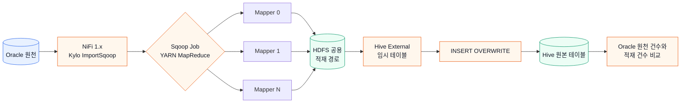

#### TO-BE 처리 구조

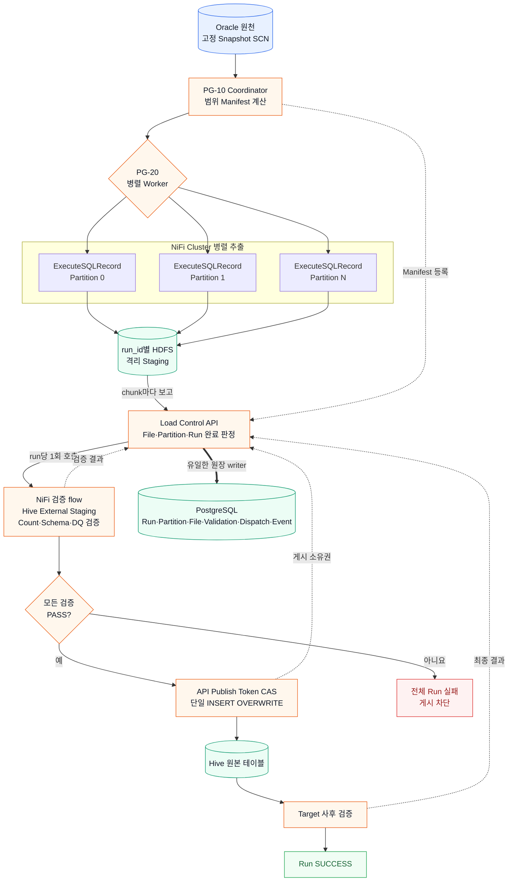

AS-IS에서는 Sqoop/YARN이 Mapper 실행과 전체 Job 실패를 담당한다. TO-BE에서는 NiFi가 병렬 Worker를 실행하고, Load Control API가 PostgreSQL Manifest를 원장으로 완료를 판정한다. staging 검증을 통과하고 API에서 publish token을 얻은 단 하나의 FlowFile만 최종 테이블을 변경한다.

Sqoop Mapper가 제공하던 분할 조회와 전체 Job 실패 의미를 NiFi Processor의 단순 병렬 실행만으로 대체해서는 안 된다. TO-BE는 데이터 처리 영역과 제어 영역을 분리한다.

- Data plane (NiFi): Oracle 조회, Record 변환, HDFS 파일 기록, Hive 검증 조회와 게시 SQL 실행
- Control plane (Load Control API + PostgreSQL): Run/Partition/File 상태, 완료 판정, 검증 flow 호출, 게시 소유권과 복구

### 불변 실행 식별자와 격리

매 실행에 UUID `run_id`를 발급하고 FlowFile, PostgreSQL 관리 행, HDFS 경로와 로그에 동일하게 사용한다.

```text
job_key       = 적재 Job의 영구 식별자
business_key  = 업무일자 또는 적재 범위 식별자
run_id        = 한 번의 실행을 나타내는 UUID
snapshot_scn  = 해당 run이 읽는 Oracle 고정 SCN
partition_id  = split 범위 식별자
```

```text
/data/nifi/stage/<job_key>/run_id=<run_id>/part-<partition_id>-<chunk_index>.parquet
```

파일은 run root 바로 아래에 평탄하게 둔다. 파일명에 `partition_id`와 `chunk_index`가 들어가므로 하위 디렉터리 없이도 고유하다. `part=<partition_id>/` 같은 하위 디렉터리를 두면 run root를 `LOCATION`으로 지정한 비파티션 external table이 Hive 설정(`hive.mapred.supports.subdirectories`, `mapreduce.input.fileinputformat.input.dir.recursive`)에 따라 하위 파일을 읽지 않아 0건이 될 수 있다. 또 `key=value` 형식은 Hive partition 디렉터리로 오인될 수 있다.

실패한 run의 파일은 다른 실행 및 최종 테이블과 섞이지 않는다. 재실행은 이전 run을 수정하지 않고 새 `run_id`를 사용한다.

### Oracle 읽기 일관성

여러 JDBC Connection이 서로 다른 시점의 데이터를 읽지 않도록 시작 시점에 SCN을 한 번 고정한다. source metrics, partition 예상 건수와 실제 데이터 조회는 모두 동일한 `AS OF SCN`을 사용한다.

Flashback Query를 사용할 수 없다면 Oracle snapshot table, 불변 업무 마감 조건 또는 원천 변경이 없는 배치 구간을 사용한다(PostgreSQL 등 Oracle 이외 원천은 아래 참조). 추출 전후 `COUNT(*)`가 같다는 사실만으로 동일 시점 데이터는 보장되지 않는다.

#### Oracle 이외 원천 (PostgreSQL)

PostgreSQL에는 `AS OF SCN`에 해당하는 과거 시점 조회가 없다. `pg_export_snapshot()`으로 내보낸 snapshot은 내보낸 트랜잭션이 열려 있는 동안에만 쓸 수 있는데, NiFi Connection Pool의 서로 다른 connection과 Processor 사이에서 그 트랜잭션을 유지할 수 없다. 따라서 다음 중 하나를 필수 전제로 둔다.

- 불변 업무 마감 조건: 대상 `business_key` 범위의 행이 적재 시점에 더 이상 변경되지 않음을 업무적으로 보장
- 원천 측 snapshot table: 마감 시점에 원천에서 별도 테이블로 복제한 뒤 그 테이블을 추출

SQL에서는 `AS OF SCN` 절을 제거하고, 7.2의 14·15(SCN 조회·추출) 단계를 생략하거나 마감 확인 조회로 대체한다. PostgreSQL JDBC driver는 autocommit=false일 때만 Fetch Size(server-side cursor)를 적용한다. 그러므로 추출 `ExecuteSQLRecord`에 `Set Auto Commit=false`를 설정한다. 설정하지 않으면 파티션 결과 전체를 NiFi 메모리에 적재한다. 이 구성은 NiFi 2.4.0 + PostgreSQL 16 PoC에서 105,000건, 8파티션으로 검증했다.

### 범위 파티셔닝

`INSP_DTL_SEQ` 범위는 하한 포함·상한 미포함으로 생성하고 마지막 범위만 최댓값을 포함한다.

```text
partition 0   : seq >= b0   AND seq < b1
partition 1   : seq >= b1   AND seq < b2
partition N-1 : seq >= bN-1 AND seq <= max_seq
```

NULL은 사전 실패 또는 별도 `IS NULL` 파티션 중 하나로 명시한다. 각 range의 expected count를 동일 SCN에서 계산하고 그 합이 source count와 같은지 Worker 실행 전에 확인한다.

### 완료 판정의 원장

PostgreSQL의 Run, Partition, File Manifest가 원장이고, 원장에 쓰는 주체는 Load Control API 하나다. NiFi Worker는 PutHDFS가 성공한 chunk마다 API에 보고한다. API는 보고마다 run 행을 잠근 트랜잭션에서 다음을 판정한다.

```text
파티션 완료:
  받은 chunk 수 = fragment.count, chunk_index가 0..n-1로 연속
  SUM(record_count) = partition.expected_row_count

run 완료:
  manifest partition 수 = run.expected_partition_count
  모든 partition 상태 = SUCCESS
  SUM(partition.actual_row_count) = run.source_count
```

run 완료 CAS(`EXTRACTING → EXTRACTED_VALIDATED`)에 성공한 단 하나의 보고만, 같은 트랜잭션에서 검증 flow 호출(outbox)을 예약한다. NiFi Queue, FlowFile 수, cache 신호는 판정에 쓰지 않는다. 따라서 중복 보고, NiFi 재기동, API 재기동이 있어도 잘못 게시되지 않는다. 판정 트랜잭션의 상세는 API 설계 3장, 호출 전달 보장은 4장을 따른다.

### 검증 및 게시 원칙

검증은 다음 네 경계를 통과한다.

1. Source: Oracle SCN 기준 count, min/max, NULL, 업무 집계
2. Extract: partition/file count, HDFS 성공 여부, row count 합계
3. Staging: Hive external table count, schema, PK 중복과 업무 집계
4. Target: `INSERT OVERWRITE` 후 동일 업무 범위의 count와 품질 지표

건수만 일치하면 누락과 중복이 상쇄될 수 있으므로 PK NULL/중복, 주요 금액 합계, 코드별 건수 및 필요한 경우 canonical hash를 함께 사용한다. 원천 0건은 기본적으로 게시하지 않는다.

게시 직전 API의 `POST /publish/claim`이 `STAGING_VALIDATED → PUBLISHING` 상태를 publish token으로 compare-and-set하고, `claimed=true`를 받은 단 하나의 FlowFile만 `INSERT OVERWRITE`를 실행한다. Hive 결과가 불명확한 timeout은 `PUBLISH_UNKNOWN`으로 남기고 자동 재실행하지 않는다.

### 실패 원칙

- 파티션 하나라도 최종 실패하면 전체 run을 실패시키고 게시를 금지한다.
- 일시적 Oracle/HDFS 오류만 제한 재시도한다.
- `ORA-01555`, 권한, SQL, schema 및 검증 오류는 즉시 실패한다.
- 한 run의 일부 파티션만 새 SCN으로 다시 읽지 않는다.
- 늦게 완료된 다른 파티션은 실패 run의 격리 경로에만 남고 성공 상태를 되돌리지 못한다.
- stale partition과 timeout은 API sweeper가 PostgreSQL manifest를 기준으로 정리한다. 기본 정책은 run 실패 후 새 `run_id`로 재실행이고, 재발행을 켜면 동일 `run_id`와 SCN으로만 재발행한다(13장).

---

## 2. Canvas 구조

Flow를 하나의 Process Group에 평면으로 그리지 않는다. Job마다 Job PG를 두고, 그 안을 책임별 자식 PG로 나눠 Input/Output Port로 연결한다. API 호출을 받는 PG-05만 모든 Job이 공유하므로 root에 둔다.

```text
root
├── PG-05 Control Receiver            공통. PC_SQOOP_REPLACEMENT_COMMON
└── JOB_ORACLE_INSP_DTL_DAILY          Job PG. PC_JOB_ORACLE_INSP_DTL_DAILY, Controller Service
    ├── PG-00 Trigger
    ├── PG-10 Run Coordinator
    ├── PG-20 Extract Worker
    ├── PG-40 Staging Validation
    ├── PG-50 Publish
    ├── PG-60 Target Validation
    ├── PG-70 Cleanup
    └── PG-90 Error and Event
```

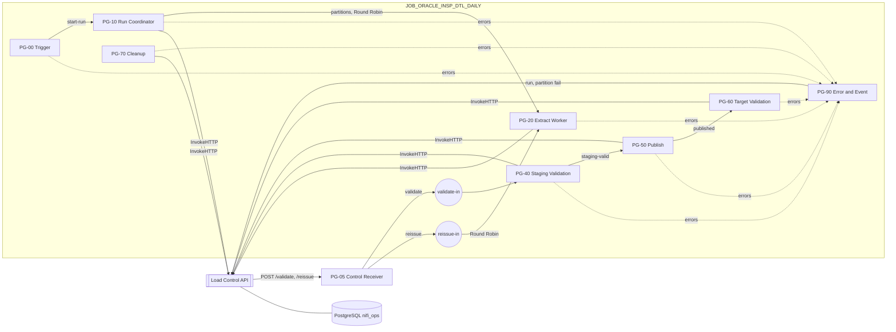

| 연결 | 출발 | 도착 | Load Balance |
|---|---|---|---|
| `start-run` | PG-00 Output Port | PG-10 Input Port | 없음 |
| `partitions` | PG-10 Output Port | PG-20 Input Port | Round Robin |
| `validate` | PG-05 Output Port(Job별) | Job PG `validate-in` → PG-40 Input Port | 없음 |
| `reissue` | PG-05 Output Port(Job별) | Job PG `reissue-in` → PG-20 Input Port | Round Robin |
| `staging-valid` | PG-40 Output Port | PG-50 Input Port | 없음 |
| `published` | PG-50 Output Port | PG-60 Input Port | 없음 |
| `errors` | 각 자식 PG Output Port | PG-90 Input Port | 없음 |

가이드 초안의 PG-30 Partition and Run Gate(Wait/Notify)와 PG-70 Recovery Monitor는 없다. 완료 판정은 API가 하고, 검증 flow는 API의 호출을 PG-05가 받아 시작한다(9장). 복구는 API sweeper가 담당한다(13장). PG-70 번호는 보존 기간이 지난 staging table과 run 경로를 지우는 PG-70 Cleanup(13.3)에 쓴다.

참조 구현은 `poc/build_flow_v3.py`(PostgreSQL 원천, NiFi 2.4.0에서 검증)와 `poc/build_flow_v4.py`(같은 구조의 Oracle 원천, Oracle 23ai Free·CFM 4.12에서 검증)다. V3는 PG-05를 Job PG 안에 두었고, V4는 위 구조대로 root에 두고 Job끼리 공유한다(9.5).

### 2.1 구현 규칙

모든 PG에 다음 규칙을 적용한다. NiFi 2.4.0 PoC V3(`poc/build_flow_v3.py`)는 이 규칙으로 PG-00, 10, 20, 05, 40 입구, 90을 Processor 41개로 구현했다(`poc/REVIEW.md` 6장).

1. **재시도**: Processor relationship 재시도(Retry Count, Retried Relationships, Backoff Policy=Penalize FlowFile, Max Backoff Period)를 쓴다. `RetryFlowFile`은 두지 않는다. 재시도를 다 쓴 FlowFile은 해당 relationship 연결로 간다(16장).
2. **오류 경로**: 실패 지점마다 오류용 `UpdateAttribute`를 두지 않는다. 단계 입구에 이미 있는 `UpdateAttribute`가 `load.stage`를 지정하고, 모든 실패 relationship은 PG의 `errors` Output Port로 보낸다. PG-90이 `load.stage`와 Processor가 남긴 attribute로 오류 코드와 메시지를 만들고, 필요한 실패 보고 API를 호출한다(14장).
3. **요청 본문**: API 요청 본문은 `ReplaceText`(Replacement Strategy=Always Replace) 하나로 만든다. EL로 JSON을 쓰고 문자열 값은 `escapeJson()`으로 감싼다. `UpdateAttribute` + `AttributesToJSON` 조합은 쓰지 않는다.
4. **이벤트**: 상태 전이 이벤트는 API가 같은 트랜잭션에서 기록한다. NiFi는 오류와 경고만 기록한다(14.4).
5. **판정**: 판정은 API가 한다. NiFi는 API 응답의 boolean(`claimed`, `started`, `stageValidated`, `success`)으로만 분기하고, chunk 보고처럼 판정 결과를 담은 응답은 다시 해석하지 않는다.
6. **attribute 평가 순서**: 하나의 `UpdateAttribute` 안에서 방금 만든 attribute를 참조하지 않는다. 모든 속성은 들어온 attribute 기준으로 평가된다(8.2).

자식 PG는 Parameter Context를 상속하지 않는다. Job PG와 모든 자식 PG에 같은 `PC_JOB_<JOB_NAME>`을 지정한다. Controller Service는 Job PG에 두고 자식 PG가 공유한다. Trigger(PG-00의 00)는 DISABLED로 배포해 Job PG를 시작할 때 즉시 실행되지 않게 한다.

### 2.2 PG별 Processor 수

| PG | Processor | PoC 검증 |
|---|---:|---|
| PG-00 Trigger | 3 | 검증 |
| PG-10 Run Coordinator | 10 | PostgreSQL 원천 V3(SCN 조회 2개를 뺀 8개)와 Oracle 원천 V4(10개)로 검증 |
| PG-20 Extract Worker | 9 (+ 선택 `ValidateRecord` 1) | 검증(`ValidateRecord` 제외) |
| PG-05 Control Receiver | 6 (root 공통, Job 수와 무관) | V4로 검증(root, Job 2개 동시 실행) |
| PG-40 Staging Validation | 15 | V4로 검증(CFM 4.12, Hive 4.0.1) |
| PG-50 Publish | 12 (PoC 10: 55A·56F 생략, 11.2) | V4로 검증 |
| PG-60 Target Validation | 7 | V4로 검증 |
| PG-70 Cleanup | 11 | V4로 검증 |
| PG-90 Error and Event | 8 (+ 선택 DLQ·알림 2) | 검증(선택 제외) |

### 2.3 실행 정책

| 영역 | 실행 노드 | Concurrent Tasks |
|---|---|---:|
| PG-00 Trigger, PG-10 Coordinator | Primary Node | 1 |
| PG-20 Worker(Oracle 조회, PutHDFS, API 보고) | All Nodes | 노드당 `WORKER.CONCURRENT.TASKS` 기준값 |
| PG-05 Control Receiver, PG-40, PG-50, PG-60 | All Nodes | 1 |
| PG-70 Cleanup | 70(주기 트리거)은 Primary Node, 나머지는 All Nodes | 1 |
| PG-90 Error and Event | All Nodes | 2~4 |

API는 NiFi LB 주소 하나로 검증 flow를 호출하므로 어느 노드가 요청을 받을지 정할 수 없다. 그래서 PG-40~60은 All Nodes로 스케줄한다. Primary Node로 제한하면 다른 노드가 받은 FlowFile이 처리되지 않는다. 중복 실행은 Primary Node가 아니라 API의 CAS(`/validation/start`, `/publish/claim`)가 막는다.

Concurrent Tasks와 Retry Count는 정수 스케줄링 설정이라 Parameter(`#{...}`)나 Expression Language(`${...}`)를 참조할 수 없다. REST API에서도 정수 필드로 정의되어 있다. `WORKER.CONCURRENT.TASKS`, `CONTROL.API.RETRY.MAX` 같은 값은 환경별 기준값으로 관리하고, 배포 스크립트나 운영 절차에서 해당 Processor에 정수로 입력한다.

---

## 3. Parameter Context

### 3.1 `PC_SQOOP_REPLACEMENT_COMMON`

| Parameter | 예시 | Sensitive | 용도 |
|---|---|---:|---|
| `CONTROL.API.URL` | `http://load-control.internal:8080/v1` | N | Load Control API base URL. NiFi↔API는 HTTP만 쓴다 |
| `CONTROL.API.AUTHORIZATION` | 미표시(`Bearer <token>`) | Y | API 인증 헤더 값 전체(role=`nifi`). Sensitive 속성은 Parameter 참조 하나만 값으로 가질 수 있어 `Bearer `까지 Parameter에 넣는다(9.2) |
| `CONTROL.API.TIMEOUT` | `30 sec` | N | `InvokeHTTP` Socket Read Timeout |
| `CONTROL.API.RETRY.MAX` | `5` | N | `InvokeHTTP` Retry Count 기준값. Retry Count는 정수 설정이라 Parameter를 참조할 수 없으므로 배포 시 입력한다. backoff와 곱해 API 재기동 시간보다 길게(9.3) |
| `CONTROL.LISTEN.PORT` | `9443` | N | API→NiFi 호출 수신 포트(PG-05). 모든 Job이 공유 |
| `META.JDBC.URL` | `jdbc:postgresql://meta:5432/nifiops` | N | 관리 DB. PG-90 이벤트 기록 전용 |
| `META.JDBC.USER` | `nifi_runtime` | N | `load_event` INSERT 권한만 가진 계정 |
| `META.JDBC.PASSWORD` | 미표시 | Y | 관리 DB 암호 |
| `META.JDBC.DRIVER.PATH` | `/opt/nifi/jdbc/postgresql-42.7.3.jar` | N | 관리 DB(PostgreSQL) JDBC Driver. 원천과 드라이버가 다르므로 경로를 나눈다 |
| `ORACLE.JDBC.URL` | `jdbc:oracle:thin:@//host:1521/service` | N | 원천 Oracle |
| `ORACLE.JDBC.USER` | `nifi_reader` | N | 원천 조회 계정 |
| `ORACLE.JDBC.PASSWORD` | 미표시 | Y | 원천 암호 |
| `ORACLE.JDBC.DRIVER.PATH` | `/opt/nifi/jdbc/ojdbc11.jar` | N | 원천 Oracle JDBC Driver |
| `HIVE.JDBC.URL` | 환경별 HiveServer2 URL | N | HiveQL 실행 |
| `HIVE.USER` | service account | N | Hive 접속 사용자 이름. HiveServer2는 인증 없이 쓴다 |
| `HADOOP.CONF.FILES` | `core-site.xml,hdfs-site.xml` 절대경로 | N | PutHDFS |
| `HDFS.AUTH.MODE` | `simple` | N | 비-Kerberos HDFS. 권한 검사는 하지 않는다 |
| `HDFS.STAGE.ROOT` | `/data/nifi/stage` | N | staging root |
| `HDFS.PERMISSIONS.UMASK` | `027` | N | PutHDFS 생성 파일/경로 umask(HDFS 권한 검사를 하지 않으므로 접근 제어 수단은 아니다) |
| `HDFS.REPLICATION` | 환경 기본값 또는 `3` | N | 필요 시 PutHDFS replication override |
| `WORKER.CONCURRENT.TASKS` | `2` | N | 노드당 추출 병렬도 기준값. Concurrent Tasks에는 참조할 수 없으므로 배포 시 정수로 입력 |
| `ORACLE.POOL.MAX` | `8` | N | `CS_DBCP_ORACLE` 최대 연결 수. 전체 노드 정책과 맞춤 |
| `ORACLE.NUMBER.DEFAULT.PRECISION` | `38` | N | 정밀도 없는 `NUMBER` 컬럼을 Parquet decimal로 쓸 때의 precision(PG-20 34, 4장) |
| `ORACLE.NUMBER.DEFAULT.SCALE` | `10` | N | 같은 경우의 scale. 더 긴 소수는 오류 없이 반올림된다(`0`이면 1.37 → 1). 정수부가 precision − scale 자리를 넘으면 파티션이 실패한다 |
| `EXTRACT.FETCH.SIZE` | `5000` | N | JDBC fetch size |
| `EXTRACT.ROWS.PER.FILE` | `500000` | N | chunk 행 수, 부하 시험으로 조정 |
| `EXTRACT.QUERY.TIMEOUT` | `60 min` | N | 파티션 query timeout |
| `PARTITION.RETRY.MAX` | `3` | N | PutHDFS Retry Count 기준값(배포 시 입력). 파티션 쿼리는 재시도하지 않는다(16장) |
| `ALLOW.EMPTY.SOURCE` | `false` | N | 0건 overwrite 방지. `POST /runs`로 API에도 전달 |
| `CLEANUP.BATCH` | `50` | N | PG-70이 한 주기에 정리할 최대 run 수. 보존 기간은 API 설정 `cleanup.success_retention`(기본 3일)·`cleanup.failed_retention`(기본 14일)이다(13.3) |

run timeout, stale 판정, dispatch 재시도 같은 제어 설정은 NiFi Parameter가 아니라 API 설정(`config.yaml`, API 설계 9.4)이다. `EXTRACT.QUERY.TIMEOUT`은 NiFi와 API 양쪽에 같은 값을 둔다. API는 이 값으로 stale 여부를 판단한다.

### 3.2 `PC_JOB_<JOB_NAME>`

| Parameter | 예시 | 설명 |
|---|---|---|
| `JOB.KEY` | `ORACLE_INSP_DTL_DAILY` | 관리용 고유 키 |
| `BUSINESS.KEY` | `2026-09-28` | 선택. 재처리·시험용 고정 업무일자. 두면 PG-00 01이 `now()` 대신 이 값을 쓴다(PoC 빌더는 이 방식) |
| `SRC.OWNER` | `APP` | Oracle owner |
| `SRC.TABLE` | `INSP_DTL` | Oracle table |
| `SRC.COLUMNS` | `INSP_DTL_SEQ, BASE_DT, CAST(AMOUNT AS NUMBER(18,2)) AS AMOUNT, ...` | 순서를 고정한 컬럼 목록. 정밀도 없는 `NUMBER`는 `CAST(... AS NUMBER(p,s))`로 정밀도를 명시한다(4장) |
| `SRC.SPLIT.COLUMN` | `INSP_DTL_SEQ` | split-by 대체 컬럼 |
| `SRC.BASE.WHERE` | `BASE_DT = TO_DATE('${load.business.key}', 'YYYY-MM-DD')` | 승인된 고정 조건 템플릿. 업무키는 PG-00에서 형식을 고정한 값만 들어간다(6.2) |
| `PARTITION.COUNT` | `8` | 논리 파티션 수 |
| `SPLIT.NULL.POLICY` | `FAIL` | `FAIL` 또는 `SEPARATE` |
| `HIVE.STAGE.DB` | `STG_DB` | 임시 external DB |
| `HIVE.STAGE.TABLE.PREFIX` | `TMP_INSP_DTL_` | run별 테이블 prefix |
| `HIVE.STAGE.DDL.COLUMNS` | 실제 Hive DDL 컬럼 | external table schema |
| `HIVE.TARGET.DB` | `DW` | target DB |
| `HIVE.TARGET.TABLE` | `INSP_DTL` | target table |
| `HIVE.INSERT.COLUMNS` | 명시적 SELECT 컬럼 | `SELECT *` 금지 |
| `TARGET.PARTITION.CLAUSE` | `PARTITION (BASE_DT='...')` | 전체 overwrite면 빈 값 |
| `DQ.AMOUNT.COLUMN` | `AMOUNT` | 원천·stage·target 금액 합계 지표 컬럼(7.3, 10.3) |
| `DQ.TIMESTAMP.COLUMN` | `REG_TS` | 시간대 해석 차이를 잡는 `MIN_TS`/`MAX_TS` 지표 컬럼(4장, 7.3, 10.3) |
| `DQ.SOURCE.SQL` | 승인된 집계 SQL | count 외 검증 |
| `DQ.STAGE.SQL` | 대응 Hive SQL | 동일 의미의 집계 |
| `DQ.TARGET.SQL` | 대응 target SQL | 게시 후 검증 |

업무키를 JDBC bind parameter(`sql.args.N`)로 넘기지 않는다. `sql.args.N` attribute는 FlowFile을 따라다니며, 이후 같은 FlowFile로 실행하는 parameter 없는 SQL(예: SCN 조회)에도 적용되어 parameter 개수 오류를 일으킬 수 있다. 대신 PG-00에서 업무키 형식을 정규식으로 고정하고 EL로 SQL에 넣는다.

---

## 4. Controller Services

| 이름 | 구현 | 주요 설정 |
|---|---|---|
| `CS_DBCP_ORACLE` | `HikariCPConnectionPool` | Driver Class=`oracle.jdbc.OracleDriver`, URL·계정·Driver 경로=`#{ORACLE.JDBC.*}`, Max Total=`#{ORACLE.POOL.MAX}`, validation query=`SELECT 1 FROM DUAL` |
| `CS_DBCP_META` | `HikariCPConnectionPool` | 관리 DB(PostgreSQL), `load_event` INSERT 전용(PG-90). Driver Class=`org.postgresql.Driver`, URL·계정·Driver 경로=`#{META.JDBC.*}`, validation query=`SELECT 1`, Max Total 4~8 |
| `CS_HIVE3_DBCP` | CFM 4.12 `ClouderaHiveConnectionPool`(`nifi-cdf-hive-nar`) | HiveServer2는 인증 없이 접속한다(Kerberos User Service 없음). `DBCPService`를 구현하므로 `ExecuteSQLRecord`에도 쓴다. URL에 `hive.resultset.use.unique.column.names=false`(10.3). Apache NiFi 2.x에는 Hive 구성요소가 없다 |
| `CS_JSON_WRITER_ARRAY` | `JsonRecordSetWriter` | Output Grouping=`Array`, pretty print=false |
| `CS_PARQUET_WRITER` | `ParquetRecordSetWriter` | Schema=`Inherit Record Schema`, compression=`SNAPPY` |
| `CS_PARQUET_READER` | `ParquetReader` | ValidateRecord에서 기록 결과 schema를 다시 읽음 |
| `CS_SCHEMA_REGISTRY` | 조직 표준 Schema Registry | target Avro schema를 버전으로 고정 |
| `CS_HTTP_CONTEXT_MAP` | `StandardHttpContextMap` | `HandleHttpRequest`/`HandleHttpResponse` 요청 연결 보관, Request Expiration 1 min |

가이드 초안의 `CS_DMC_SERVER`(`MapCacheServer`)와 `CS_DMC_CLIENT`(`MapCacheClientService`)는 Wait/Notify를 쓰지 않으므로 두지 않는다. NiFi↔API는 HTTP만 쓰므로 SSL Context Service(`CS_SSL_CLIENT`, `CS_SSL_SERVER`)도 두지 않는다. API 호출은 Bearer 토큰으로 role을 구분한다.

운영 데이터에는 schema inference를 사용하지 않는다. Oracle JDBC schema를 상속하되, Oracle `NUMBER`, `DATE`, `TIMESTAMP`, CLOB 처리 결과가 Hive DDL과 일치하는지 사전 시험하고 필요하면 `ConvertRecord`를 추가해 명시적 schema로 변환한다.

추출 `ExecuteSQLRecord`에는 `Use Avro Logical Types=true`를 명시한다. 기본값 `false`이면 DATE, TIMESTAMP, DECIMAL이 문자열로 기록되어 Hive DDL과 어긋난다.

Oracle의 정밀도 없는 `NUMBER` 컬럼은 JDBC가 precision 0으로 알려 주므로, `ExecuteSQLRecord`의 Default Decimal Precision/Scale(기본 10, 0)로 기록된다. 기본값 그대로면 소수가 정수로 반올림되거나 큰 값에서 파티션이 실패한다. PoC(V4, Oracle 23ai Free)에서 확인한 동작은 다음과 같다.

| 경우 | 결과 |
|---|---|
| 소수 자릿수가 scale보다 많음 | 오류 없이 HALF_UP 반올림. scale `0`이면 `AMOUNT` 1.37 → 1, 2.74 → 3이 되고 run은 성공한다. 건수 검증으로는 잡히지 않고 `AMOUNT_SUM` 비교(10.3)에서만 드러난다 |
| 정수부가 precision − scale 자리를 넘음 | `AvroTypeException: Cannot encode decimal with precision 41 as max precision 38`로 해당 파티션이 `SQL_ERROR` 실패, run `FAILED_EXTRACT`. 값이 깨진 채 적재되지는 않는다 |
| 기본값(38, 10) | 모든 값이 `decimal(38,10)`. `1/3` → `0.3333333333`, 23자리 정수 그대로 |

그래서 원천 컬럼은 `SRC.COLUMNS`에서 `CAST(col AS NUMBER(p,s))`로 정밀도를 명시하고, 남는 경우를 위해 34의 Default Decimal Precision/Scale을 `#{ORACLE.NUMBER.DEFAULT.PRECISION}`/`#{ORACLE.NUMBER.DEFAULT.SCALE}`로 지정한다. Oracle `DATE`는 시각까지 담고 있어 Parquet에 timestamp로 기록되므로 아래 시간대 규칙을 똑같이 적용한다.

시간대가 없는 원천 `DATE`/`TIMESTAMP`는 JDBC가 NiFi JVM 기본 시간대로 해석한다. 그 결과 Parquet에는 UTC로 변환된 `TIMESTAMP_MILLIS (isAdjustedToUTC=true)`로 기록된다. NiFi 2.4.0 PoC에서 JVM 시간대가 KST일 때 원천 `2026-09-28 00:00:01`이 `2026-09-27T15:00:01Z`로 저장됐고, 마이크로초 이하 정밀도는 버려졌다. Hive가 이 값을 읽는 방식은 Hive 버전과 parquet timestamp 설정에 따라 다르며, 건수 검증으로는 이 차이를 잡을 수 없다. 따라서 다음을 지킨다.

- NiFi JVM `-Duser.timezone`과 Hive parquet timestamp 해석 설정을 환경 표준으로 확정한다.
- 대표 TIMESTAMP/DATE 컬럼의 `MIN`/`MAX`를 Source, Staging, Target DQ 지표에 포함해 문자열 값으로 비교한다.
- 마이크로초 이상 정밀도가 업무상 필요한 컬럼은 추출 SQL에서 문자열로 변환하거나 명시적 schema로 정밀도를 확인한다.

### 4.1 PostgreSQL 관리 및 로그 스키마

PostgreSQL 13 이상을 기준으로 한다. 식별자는 따옴표 없이 소문자로 생성한다. 이 절의 DDL이 원본이며, 운영 DB에는 Load Control API 저장소의 Alembic baseline migration으로 배포한다(API 설계 9.9).

`load_run`, `load_partition`, `load_file`, `load_validation`, `load_dispatch`는 API만 쓴다. NiFi는 `load_event`에만 INSERT한다. 이 절의 SQL에서 `:name` 형식은 API의 bind parameter, `?`는 NiFi `PutSQL` parameter다.

#### Schema와 Run 테이블

```sql
CREATE SCHEMA IF NOT EXISTS nifi_ops;

CREATE TABLE nifi_ops.load_run (
    run_id                       uuid PRIMARY KEY,
    job_key                      varchar(200) NOT NULL,
    business_key                 varchar(200) NOT NULL,
    status                       varchar(40) NOT NULL,
    snapshot_scn                 numeric(38, 0),
    source_count                 bigint,
    source_null_split_count      bigint,
    source_min_split             numeric(38, 0),
    source_max_split             numeric(38, 0),
    expected_partition_count     integer,
    success_partition_count      integer NOT NULL DEFAULT 0,
    failed_partition_count       integer NOT NULL DEFAULT 0,
    extracted_count              bigint NOT NULL DEFAULT 0,
    staging_count                bigint,
    target_count                 bigint,
    hdfs_run_path                varchar(1000),
    stage_table_name             varchar(255),
    publish_token                uuid,
    retry_of_run_id              uuid REFERENCES nifi_ops.load_run(run_id),
    version_no                   integer NOT NULL DEFAULT 0,
    parameters                   jsonb NOT NULL DEFAULT '{}'::jsonb,
    started_at                   timestamptz NOT NULL DEFAULT clock_timestamp(),
    heartbeat_at                 timestamptz NOT NULL DEFAULT clock_timestamp(),
    extract_completed_at         timestamptz,
    publish_started_at           timestamptz,
    published_at                 timestamptz,
    completed_at                 timestamptz,
    error_stage                  varchar(80),
    error_code                   varchar(100),
    error_message                varchar(2000),
    cleaned_at                   timestamptz,          -- PG-70이 staging table·run 경로를 지운 시각(13.3)
    CONSTRAINT ck_load_run_status CHECK (status IN (
        'CREATED', 'EXTRACTING',
        'EXTRACTED_VALIDATED', 'STAGE_VALIDATING', 'STAGING_VALIDATED',
        'PUBLISHING', 'PUBLISHED', 'SUCCESS',
        'FAILED_MANIFEST', 'FAILED_EXTRACT',
        'FAILED_STAGE_VALIDATION', 'FAILED_PUBLISH',
        'PUBLISH_UNKNOWN', 'FAILED_TARGET_VALIDATION',
        'FAILED_SNAPSHOT_EXPIRED', 'TIMED_OUT'
    )),
    CONSTRAINT ck_load_run_counts CHECK (
        COALESCE(source_count, 0) >= 0
        AND COALESCE(expected_partition_count, 0) >= 0
        AND success_partition_count >= 0
        AND failed_partition_count >= 0
        AND extracted_count >= 0
    )
);

-- 동일 Job과 업무키에는 활성 run 하나만 허용한다.
CREATE UNIQUE INDEX uq_load_run_active
    ON nifi_ops.load_run (job_key, business_key)
    WHERE status IN (
        'CREATED', 'EXTRACTING',
        'EXTRACTED_VALIDATED', 'STAGE_VALIDATING', 'STAGING_VALIDATED',
        'PUBLISHING', 'PUBLISHED', 'PUBLISH_UNKNOWN'
    );

CREATE INDEX ix_load_run_status_heartbeat
    ON nifi_ops.load_run (status, heartbeat_at);

-- 정리 대상 조회(13.3). 정리된 run은 인덱스에서 빠진다.
CREATE INDEX ix_load_run_cleanup
    ON nifi_ops.load_run (job_key, completed_at)
    WHERE cleaned_at IS NULL;

CREATE INDEX ix_load_run_job_started
    ON nifi_ops.load_run (job_key, started_at DESC);
```

Partial unique index가 활성 실행 lock 역할을 한다. 최종 상태로 변경되면 같은 `job_key + business_key`의 새 run을 생성할 수 있다. `POST /runs`가 이 index 위반(SQLSTATE `23505`)을 409 `DUPLICATE_ACTIVE_RUN`으로 응답한다.

`STAGE_VALIDATING`은 검증 flow가 시작됐음을 나타낸다. API는 `EXTRACTED_VALIDATED → STAGE_VALIDATING` CAS에 성공한 호출에만 검증 시작을 허락해, outbox가 같은 run을 두 번 전달해도 검증이 한 번만 실행되게 한다.

#### Partition Manifest

```sql
CREATE TABLE nifi_ops.load_partition (
    run_id                  uuid NOT NULL
                            REFERENCES nifi_ops.load_run(run_id) ON DELETE RESTRICT,
    partition_id            varchar(40) NOT NULL,
    lower_bound             numeric(38, 0),
    upper_bound             numeric(38, 0),
    upper_inclusive         boolean NOT NULL DEFAULT false,
    is_null_partition       boolean NOT NULL DEFAULT false,
    status                  varchar(20) NOT NULL DEFAULT 'PENDING',
    expected_row_count      bigint NOT NULL,
    actual_row_count        bigint,
    fragment_count          integer,
    file_count              integer,
    byte_count              bigint,
    attempt_count           integer NOT NULL DEFAULT 0,
    claim_token             uuid,
    worker_node             varchar(200),
    started_at              timestamptz,
    heartbeat_at            timestamptz,
    completed_at            timestamptz,
    error_code              varchar(100),
    error_message           varchar(2000),
    PRIMARY KEY (run_id, partition_id),
    CONSTRAINT ck_load_partition_status CHECK (status IN (
        'PENDING', 'RUNNING', 'RETRY', 'SUCCESS', 'FAILED', 'TIMED_OUT'
    )),
    CONSTRAINT ck_load_partition_counts CHECK (
        expected_row_count >= 0
        AND COALESCE(actual_row_count, 0) >= 0
        AND COALESCE(fragment_count, 0) >= 0
        AND COALESCE(file_count, 0) >= 0
        AND COALESCE(byte_count, 0) >= 0
        AND attempt_count >= 0
    ),
    CONSTRAINT ck_load_partition_bounds CHECK (
        is_null_partition
        OR (lower_bound IS NOT NULL AND upper_bound IS NOT NULL
            AND lower_bound <= upper_bound)
    )
);

CREATE INDEX ix_load_partition_status
    ON nifi_ops.load_partition (run_id, status);

CREATE INDEX ix_load_partition_recovery
    ON nifi_ops.load_partition (status, heartbeat_at)
    WHERE status IN ('RUNNING', 'RETRY');
```

#### HDFS File Manifest

```sql
CREATE TABLE nifi_ops.load_file (
    run_id                  uuid NOT NULL,
    partition_id            varchar(40) NOT NULL,
    chunk_index             integer NOT NULL,
    fragment_identifier     varchar(100),
    fragment_count          integer NOT NULL,
    hdfs_path               varchar(1500) NOT NULL,
    record_count            bigint NOT NULL,
    byte_count              bigint,
    checksum                varchar(128),
    status                  varchar(20) NOT NULL DEFAULT 'WRITTEN',
    written_at              timestamptz NOT NULL DEFAULT clock_timestamp(),
    updated_at              timestamptz NOT NULL DEFAULT clock_timestamp(),
    PRIMARY KEY (run_id, partition_id, chunk_index),
    FOREIGN KEY (run_id, partition_id)
        REFERENCES nifi_ops.load_partition(run_id, partition_id)
        ON DELETE RESTRICT,
    CONSTRAINT uq_load_file_path UNIQUE (hdfs_path),
    CONSTRAINT ck_load_file_status CHECK (status IN ('WRITTEN', 'VERIFIED', 'FAILED')),
    CONSTRAINT ck_load_file_counts CHECK (
        chunk_index >= 0 AND fragment_count > 0
        AND record_count >= 0 AND COALESCE(byte_count, 0) >= 0
    )
);

CREATE INDEX ix_load_file_partition_status
    ON nifi_ops.load_file (run_id, partition_id, status);
```

API `POST .../chunks`가 run과 partition 행을 잠근 뒤 다음 UPSERT를 실행한다. 동일 chunk 재시도는 행을 추가하지 않고 결과를 갱신한다. 파티션이 이미 `SUCCESS`인데 값이 다른 보고가 오면 API가 409 `CHUNK_CONFLICT`로 거부하고 트랜잭션을 rollback한다.

```sql
INSERT INTO nifi_ops.load_file (
    run_id, partition_id, chunk_index,
    fragment_identifier, fragment_count,
    hdfs_path, record_count, byte_count, status
) VALUES (
    CAST(:run_id AS uuid), :partition_id, :chunk_index,
    :fragment_identifier, :chunk_count,
    :hdfs_path, :record_count, :byte_count, 'WRITTEN'
)
ON CONFLICT (run_id, partition_id, chunk_index)
DO UPDATE SET
    fragment_identifier = EXCLUDED.fragment_identifier,
    fragment_count      = EXCLUDED.fragment_count,
    hdfs_path           = EXCLUDED.hdfs_path,
    record_count        = EXCLUDED.record_count,
    byte_count          = EXCLUDED.byte_count,
    status              = 'WRITTEN',
    updated_at          = clock_timestamp();
```

#### Validation 결과

```sql
CREATE TABLE nifi_ops.load_validation (
    validation_id          bigint GENERATED ALWAYS AS IDENTITY PRIMARY KEY,
    run_id                 uuid NOT NULL
                           REFERENCES nifi_ops.load_run(run_id) ON DELETE RESTRICT,
    stage                  varchar(30) NOT NULL,
    metric_name            varchar(150) NOT NULL,
    expected_value         text,
    actual_value           text,
    tolerance              text,
    result                 varchar(10) NOT NULL,
    query_version          varchar(50) NOT NULL,
    details                jsonb NOT NULL DEFAULT '{}'::jsonb,
    measured_at            timestamptz NOT NULL DEFAULT clock_timestamp(),
    CONSTRAINT ck_load_validation_stage CHECK (stage IN (
        'SOURCE', 'PARTITION', 'HDFS', 'STAGING', 'TARGET'
    )),
    CONSTRAINT ck_load_validation_result CHECK (result IN ('PASS', 'FAIL', 'WARN'))
);

CREATE INDEX ix_load_validation_run_stage
    ON nifi_ops.load_validation (run_id, stage, result);

CREATE UNIQUE INDEX uq_load_validation_metric
    ON nifi_ops.load_validation (run_id, stage, metric_name, query_version);
```

`expected_value`와 `actual_value`는 count뿐 아니라 hash 및 문자열 지표도 저장할 수 있도록 `text`로 둔다. 숫자 비교와 허용 오차 판정은 검증 SQL에서 수행하고 결과를 함께 저장한다.

#### Dispatch Outbox

run 완료 CAS와 같은 트랜잭션에서 검증 flow 호출을 예약하는 outbox다. API worker의 dispatcher가 commit 후 NiFi로 전달한다(API 설계 4장).

```sql
CREATE TABLE nifi_ops.load_dispatch (
    dispatch_id         uuid PRIMARY KEY,
    run_id              uuid NOT NULL
                        REFERENCES nifi_ops.load_run(run_id) ON DELETE RESTRICT,
    dispatch_type       varchar(30) NOT NULL,
    partition_id        varchar(40),
    status              varchar(20) NOT NULL DEFAULT 'PENDING',
    attempt_count       integer NOT NULL DEFAULT 0,
    next_attempt_at     timestamptz NOT NULL DEFAULT clock_timestamp(),
    last_http_status    integer,
    last_error          varchar(2000),
    created_at          timestamptz NOT NULL DEFAULT clock_timestamp(),
    sent_at             timestamptz,
    acked_at            timestamptz,
    CONSTRAINT ck_load_dispatch_type CHECK (dispatch_type IN (
        'VALIDATE_RUN', 'REISSUE_PARTITION'
    )),
    CONSTRAINT ck_load_dispatch_status CHECK (status IN (
        'PENDING', 'SENT', 'ACKED', 'DEAD'
    )),
    CONSTRAINT ck_load_dispatch_partition CHECK (
        (dispatch_type = 'VALIDATE_RUN' AND partition_id IS NULL)
        OR (dispatch_type = 'REISSUE_PARTITION' AND partition_id IS NOT NULL)
    )
);

-- run당 검증 호출은 하나만 존재한다.
CREATE UNIQUE INDEX uq_load_dispatch_validate
    ON nifi_ops.load_dispatch (run_id)
    WHERE dispatch_type = 'VALIDATE_RUN';

CREATE INDEX ix_load_dispatch_due
    ON nifi_ops.load_dispatch (status, next_attempt_at)
    WHERE status IN ('PENDING', 'SENT');
```

`PENDING`은 전송 대기, `SENT`는 NiFi가 2xx로 수신함, `ACKED`는 검증 flow가 `/validation/start`로 실제 시작을 알림, `DEAD`는 최대 시도 초과다. `uq_load_dispatch_validate`는 run 행 잠금과 CAS가 깨지더라도 검증 호출이 두 번 예약되지 않게 하는 마지막 방어선이다.

#### PostgreSQL 로그 테이블

```sql
CREATE TABLE nifi_ops.load_event (
    event_id               uuid PRIMARY KEY,
    event_time             timestamptz NOT NULL DEFAULT clock_timestamp(),
    event_level            varchar(10) NOT NULL,
    event_name             varchar(80) NOT NULL,
    run_id                 uuid,
    job_key                varchar(200),
    business_key           varchar(200),
    partition_id           varchar(40),
    chunk_index            integer,
    process_group          varchar(100),
    processor_name         varchar(150),
    processor_id           varchar(100),
    node_id                varchar(200),
    attempt_no             integer,
    row_count              bigint,
    byte_count             bigint,
    duration_ms            bigint,
    error_class            varchar(40),
    error_code             varchar(100),
    message                varchar(2000),
    details                jsonb NOT NULL DEFAULT '{}'::jsonb,
    CONSTRAINT ck_load_event_level CHECK (event_level IN (
        'TRACE', 'DEBUG', 'INFO', 'WARN', 'ERROR'
    )),
    CONSTRAINT ck_load_event_values CHECK (
        COALESCE(attempt_no, 0) >= 0
        AND COALESCE(row_count, 0) >= 0
        AND COALESCE(byte_count, 0) >= 0
        AND COALESCE(duration_ms, 0) >= 0
    )
);

-- 실행 추적과 오류 검색을 위한 B-tree index
CREATE INDEX ix_load_event_run_time
    ON nifi_ops.load_event (run_id, event_time DESC);

CREATE INDEX ix_load_event_job_time
    ON nifi_ops.load_event (job_key, event_time DESC);

CREATE INDEX ix_load_event_error
    ON nifi_ops.load_event (event_time DESC, event_name)
    WHERE event_level IN ('WARN', 'ERROR');

-- 대용량 시계열 검색과 보존 삭제 지원
CREATE INDEX ix_load_event_time_brin
    ON nifi_ops.load_event USING brin (event_time);
```

`load_event.run_id`에는 의도적으로 Foreign Key를 두지 않는다. Run 정리 또는 비정상 초기화 상황에서도 운영 로그가 독립적으로 남고, 이벤트 기록 실패가 제어 트랜잭션을 방해하지 않게 하기 위해서다.

로그 보존 예시는 다음과 같다. 운영에서는 PostgreSQL scheduler 또는 외부 운영 Job으로 실행한다.

```sql
DELETE FROM nifi_ops.load_event
 WHERE event_time < clock_timestamp() - interval '90 days';

VACUUM (ANALYZE) nifi_ops.load_event;
```

이벤트량이 일 수백만 건 이상이면 `event_time` 월 단위 partition table로 전환하고 다음 달 partition을 미리 생성한다.

#### Claim과 상태 전이

파티션 claim, publish claim, 모든 상태 전이는 API가 조건부 `UPDATE ... RETURNING`으로 실행한다. 가이드 초안의 `claim_partition`/`claim_publish` PostgreSQL 함수는 만들지 않는다. 같은 claim token의 재요청을 성공으로 돌려주는 멱등 규칙이 필요하기 때문이다. 함수 버전은 claim 응답을 잃고 재요청하면 `false`를 반환해 Worker가 스스로 종료하고, 파티션이 sweeper까지 멈춘다.

파티션 claim은 다음 SQL로 구현한다.

```sql
UPDATE nifi_ops.load_partition p
   SET status = 'RUNNING',
       claim_token = CAST(:claim_token AS uuid),
       worker_node = :worker_node,
       attempt_count = p.attempt_count
                       + CASE WHEN p.claim_token = CAST(:claim_token AS uuid) THEN 0 ELSE 1 END,
       started_at = COALESCE(p.started_at, clock_timestamp()),
       heartbeat_at = clock_timestamp(),
       error_code = NULL,
       error_message = NULL
  FROM nifi_ops.load_run r
 WHERE p.run_id = CAST(:run_id AS uuid)
   AND p.partition_id = :partition_id
   AND r.run_id = p.run_id
   AND r.status = 'EXTRACTING'
   AND (p.status IN ('PENDING', 'RETRY')
        OR (p.status = 'RUNNING' AND p.claim_token = CAST(:claim_token AS uuid)))
RETURNING p.status, p.attempt_count;
```

반환 행이 있으면 `claimed=true`다. API는 이 문장 앞에 `load_run` 행을 `FOR UPDATE`로 잠근다. 모든 상태 변경에서 잠금 순서(`load_run` → `load_partition` → `load_file` → `load_dispatch`)를 고정해 deadlock을 피한다(API 설계 9.5).

#### 권한 예시

```sql
-- 역할은 DBA가 사전에 생성한다.
-- Load Control API 런타임 계정: 원장과 outbox 쓰기
GRANT USAGE ON SCHEMA nifi_ops TO load_control_api;
GRANT SELECT, INSERT, UPDATE ON
    nifi_ops.load_run, nifi_ops.load_partition, nifi_ops.load_file,
    nifi_ops.load_validation, nifi_ops.load_dispatch
    TO load_control_api;
GRANT INSERT, SELECT ON nifi_ops.load_event TO load_control_api;
GRANT USAGE, SELECT ON ALL SEQUENCES IN SCHEMA nifi_ops TO load_control_api;

-- NiFi 런타임 계정: 관측 이벤트만 기록
GRANT USAGE ON SCHEMA nifi_ops TO nifi_runtime;
GRANT INSERT ON nifi_ops.load_event TO nifi_runtime;
```

NiFi 계정이 원장을 직접 바꿀 수 없어야 "원장 writer는 API 하나"라는 전제가 운영 중에도 유지된다. 두 런타임 계정 모두 `DELETE`, `TRUNCATE`, `DROP` 권한을 받지 않는다. 스키마 변경은 migration 전용 계정이 하고, 보존 삭제는 별도 DBA 역할로 수행한다.

---

## 5. 공통 FlowFile Attributes

| Attribute | 생성 위치 | 예시/의미 |
|---|---|---|
| `load.run.id` | API `POST /runs` 응답 | UUID, 실행 불변 키 |
| `load.job.key` | Trigger | `ORACLE_INSP_DTL_DAILY` |
| `load.business.key` | Trigger | `2026-09-28` |
| `load.stage` | 각 단계 입구의 `UpdateAttribute` | 현재 단계. PG-90이 오류 분류와 실패 보고 대상 결정에 쓴다(14.2) |
| `load.snapshot.scn` | PG-10 SCN 조회, 재발행 본문 | 숫자 문자열 |
| `load.source.count` | `/validation/start` 응답 | 전체 source count |
| `load.hdfs.path` | API `POST /runs` 응답 | run 전용 root |
| `load.stage.table` | API `POST /runs` 응답 | 안전한 run suffix 포함 |
| `load.dispatch.id` | 검증 호출 수신 | outbox dispatch UUID, `/validation/start`에 전달 |
| `partition.id` | Manifest 응답 split | `0003` 또는 `NULL` |
| `partition.lower` | Manifest 응답 split | 포함 하한 |
| `partition.upper` | Manifest 응답 split | 상한 |
| `partition.upper.inclusive` | Manifest 응답 split | `true/false` |
| `partition.is.null` | Manifest 응답 split | NULL 전용 파티션 여부 |
| `partition.expected.rows` | Manifest 응답 split | 동일 SCN 예상 건수 |
| `partition.claim.token` | Worker | 중복 worker 방지 UUID |
| `chunk.index` | PG-20 35 | `${fragment.index}`, 이벤트 기록용 |
| `api.response` | `InvokeHTTP` | 응답 본문(`Response Body Attribute Name`). EL `jsonPath()`로 분기한다. 2xx가 아닌 응답의 본문도 여기에 들어간다(9.3) |
| `invokehttp.status.code` | `InvokeHTTP` | HTTP 상태 코드. 409/422 구분 |
| `invokehttp.java.exception.class` | `InvokeHTTP` | 연결 실패·timeout 시 예외 클래스. PG-90이 `API_UNREACHABLE`로 분류 |
| `executesql.error.message` | `ExecuteSQLRecord` | SQL 실패 메시지. PG-90이 `ORA-nnnnn` 코드를 추출 |
| `error.stage`, `error.code`, `error.class`, `error.message` | PG-90 90 | 정규화한 오류 정보(14.2). 각 PG에서는 만들지 않는다 |

SCN, partition bound, count는 숫자 정규식으로 검증한 뒤 SQL에 사용한다. table/column/where 문자열을 외부 FlowFile에서 받지 않는다.

Parameter 참조는 Expression Language의 문자열 리터럴 안에서 치환되지 않는다. 예를 들어 `${record.count:equals('#{PARTITION.COUNT}')}`는 문자 그대로의 `#{PARTITION.COUNT}`와 비교하므로 항상 false가 된다(NiFi 2.4.0 PoC에서 재현). Parameter 값과 비교할 때는 먼저 `UpdateAttribute`에서 `load.partition.planned=#{PARTITION.COUNT}`처럼 attribute로 옮긴 뒤 `${record.count:equals(${load.partition.planned})}`로 비교한다.

---

## 6. PG-00 Trigger

### 6.1 Processor 흐름

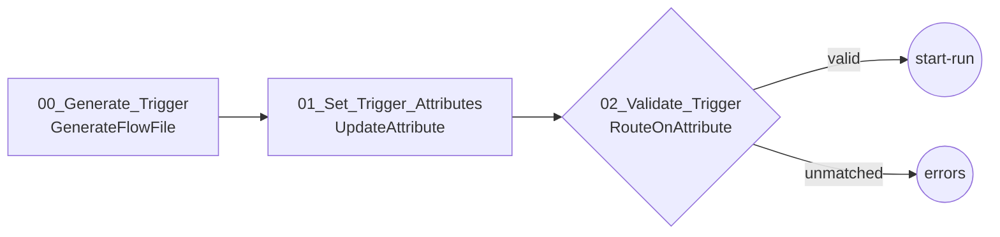

### 6.2 주요 Processor 설정

| ID | Processor | Scheduling | 주요 Properties | Relationship |
|---|---|---|---|---|
| 00 | `GenerateFlowFile` | Primary, 1, CRON | Custom Text=`{}`. DISABLED로 배포한 뒤 운영 전환 시 enable | success→01 |
| 01 | `UpdateAttribute` | Primary, 1 | `load.job.key=#{JOB.KEY}`, `load.business.key=${now():format('yyyy-MM-dd','Asia/Seoul')}`, `load.trigger.type=SCHEDULE`, `load.stage=RUN_CREATE` | success→02 |
| 02 | `RouteOnAttribute` | Primary, 1 | `valid=${load.business.key:matches('^[0-9]{4}-[0-9]{2}-[0-9]{2}$')}` | valid→`start-run`, unmatched→`errors` |

업무키는 `SRC.BASE.WHERE`를 통해 SQL에 들어가므로(3.2) 02의 정규식이 SQL 주입을 막는 경계다. API도 `businessKey` 형식을 검증하지만, API의 허용 문자 범위가 SQL에 넣기에는 넓으므로 02를 생략하지 않는다.

외부에서 업무일자를 전달받는 경우 `HandleHttpRequest` 등을 직접 worker에 연결하지 않고, 인증된 상위 orchestration flow가 이 Process Group의 Input Port를 호출하도록 한다.

---

## 7. PG-10 Run Coordinator

### 7.1 Processor 흐름

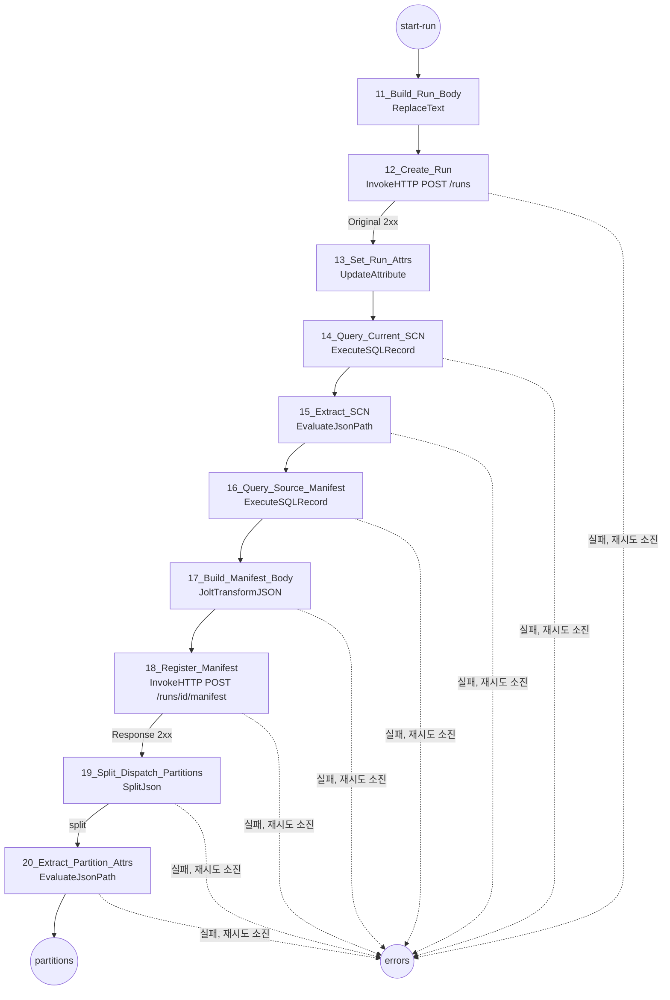

가이드 초안과 달라진 점은 다음과 같다.

- run lock INSERT, snapshot 저장, manifest 불변식 검사, 파티션 행별 INSERT, 0건 파티션 처리, run-control 생성이 없다. 모두 API 두 번 호출(`POST /runs`, `POST /manifest`)로 대체된다.
- 원천 지표와 파티션 경계·건수를 SQL 한 문장(16)으로 계산한다. 별도의 source metric 조회, 추출, 사전 검사(0건, NULL split, 합계)는 두지 않는다. 사전 검사는 API의 manifest 불변식 검사가 같은 조건으로 수행한다(7.4).
- 파티션 행별 `PutSQL`(Fragmented=true)이 없으므로, PoC에서 재현된 fragment livelock이 구조적으로 생기지 않는다.
- run을 만든 뒤 실패하면 run을 `FAILED_MANIFEST`로 보고해야 한다. 보고하지 않으면 run이 `CREATED`로 남아 active run lock을 잡고, API sweeper의 timeout까지 같은 업무키를 다시 실행할 수 없다. 이 보고는 PG-10이 아니라 PG-90이 `load.stage=MANIFEST`를 보고 수행한다(14.2).

### 7.2 주요 Processor 설정

| ID | Processor | Scheduling | 주요 Properties | Relationship |
|---|---|---|---|---|
| 11 | `ReplaceText` | Primary, 1 | 본문 `{"jobKey":"${load.job.key}","businessKey":"${load.business.key}","hdfsRoot":"#{HDFS.STAGE.ROOT}","stageTablePrefix":"#{HIVE.STAGE.TABLE.PREFIX}","allowEmptySource":#{ALLOW.EMPTY.SOURCE}}` | success→12 |
| 12 | `InvokeHTTP` | Primary, 1 | 9.2 공통 설정, URL=`#{CONTROL.API.URL}/runs`, `Response Body Attribute Name=api.response` | Original→13, No Retry/Retry/Failure→`errors` |
| 13 | `UpdateAttribute` | Primary, 1 | `load.run.id=${api.response:jsonPath('$.runId')}`, `load.hdfs.path=${api.response:jsonPath('$.hdfsRunPath')}`, `load.stage.table=${api.response:jsonPath('$.stageTable')}`, `load.stage=MANIFEST` | success→14 |
| 14 | `ExecuteSQLRecord` | Primary, 1 | `CS_DBCP_ORACLE`, `SELECT TO_CHAR(CURRENT_SCN) AS SNAPSHOT_SCN FROM V$DATABASE`, `CS_JSON_WRITER_ARRAY` | success→15, failure→`errors` |
| 15 | `EvaluateJsonPath` | Primary, 1 | `load.snapshot.scn=$[0].SNAPSHOT_SCN`, Destination=flowfile-attribute | matched→16, unmatched/failure→`errors` |
| 16 | `ExecuteSQLRecord` | Primary, 1 | `CS_DBCP_ORACLE`, 원천 지표+manifest SQL(7.3), JSON array writer, Max Wait Time=`#{EXTRACT.QUERY.TIMEOUT}` | success→17, failure→`errors` |
| 17 | `JoltTransformJSON` | Primary, 1 | 0번 행에서 SCN과 원천 지표를 꺼내고 배열을 `partitions`로 감싼다(아래 spec) | success→18, failure→`errors` |
| 18 | `InvokeHTTP` | Primary, 1 | 9.2 공통 설정, URL=`#{CONTROL.API.URL}/runs/${load.run.id}/manifest`. `Response Body Attribute Name`은 비워 응답을 content로 받음 | Response→19, No Retry/Retry/Failure→`errors`, Original→auto-terminate |
| 19 | `SplitJson` | Primary, 1 | JsonPath Expression=`$.dispatchPartitions` | split→20, failure→`errors` |
| 20 | `EvaluateJsonPath` | Primary, 1 | `partition.id=$.partitionId`, `partition.lower=$.lowerBound`, `partition.upper=$.upperBound`, `partition.upper.inclusive=$.upperInclusive`, `partition.is.null=$.isNullPartition`, `partition.expected.rows=$.expectedRowCount` | matched→`partitions`, unmatched/failure→`errors` |

`V$DATABASE` 조회 권한이 없으면 14를 `SELECT TO_CHAR(DBMS_FLASHBACK.GET_SYSTEM_CHANGE_NUMBER) AS SNAPSHOT_SCN FROM DUAL`로 바꾼다. 16은 SCN이 숫자가 아니면 SQL 오류로 실패하도록 `${load.snapshot.scn:matches('^[0-9]+$'):ifElse(${load.snapshot.scn},'INVALID_SCN')}`로 넣는다. 숫자 검증용 `RouteOnAttribute`를 따로 두지 않는다.

17 `JoltTransformJSON` spec. SCN과 계획 파티션 수도 16의 SQL 결과 컬럼(`SNAPSHOT_SCN`, `PLANNED_PARTITION_COUNT`)에서 가져오므로 spec에 EL이나 Parameter가 없다. Oracle은 따옴표 없는 별칭을 대문자로 돌려주므로 키는 대문자다. shift는 `"0"`과 `"*"`가 같은 키에 맞으면 `"0"`만 적용하므로, 0번 행에도 파티션 필드 매핑을 함께 둔다.

```json
[
  { "operation": "shift",
    "spec": {
      "0": {
        "PARTITION_ID": "partitions[&1].partitionId",
        "LOWER_BOUND": "partitions[&1].lowerBound",
        "UPPER_BOUND": "partitions[&1].upperBound",
        "UPPER_INCLUSIVE": "partitions[&1].upperInclusive",
        "IS_NULL_PARTITION": "partitions[&1].isNullPartition",
        "EXPECTED_ROW_COUNT": "partitions[&1].expectedRowCount",
        "SNAPSHOT_SCN": "snapshotScn",
        "SOURCE_COUNT": "sourceCount",
        "SOURCE_NULL_SPLIT_COUNT": "sourceNullSplitCount",
        "SOURCE_MIN": "sourceMinSplit",
        "SOURCE_MAX": "sourceMaxSplit",
        "PLANNED_PARTITION_COUNT": "plannedPartitionCount",
        "AMOUNT_SUM": "sourceMetrics.AMOUNT_SUM",
        "MIN_TS": "sourceMetrics.MIN_TS",
        "MAX_TS": "sourceMetrics.MAX_TS" },
      "*": {
        "PARTITION_ID": "partitions[&1].partitionId",
        "LOWER_BOUND": "partitions[&1].lowerBound",
        "UPPER_BOUND": "partitions[&1].upperBound",
        "UPPER_INCLUSIVE": "partitions[&1].upperInclusive",
        "IS_NULL_PARTITION": "partitions[&1].isNullPartition",
        "EXPECTED_ROW_COUNT": "partitions[&1].expectedRowCount" } } }
]
```

`InvokeHTTP` 응답 처리 규칙: `Response Body Attribute Name`을 설정하면 응답 본문은 **Original** relationship의 FlowFile에 attribute로 붙는다. 응답 본문을 content로 받아야 하는 18만 Response relationship을 쓴다. 2xx가 아니면 요청 FlowFile이 Retry(5xx)나 No Retry(4xx)로 가며, 재시도를 다 쓰면 `errors`로 간다.

중복 실행은 API가 active run unique index 위반을 409 `DUPLICATE_ACTIVE_RUN`으로 응답해 구분한다. NiFi는 SQLState를 해석하지 않는다. PG-90이 `load.stage=RUN_CREATE`이고 409이면 WARN `DUPLICATE_ACTIVE_RUN`으로 기록한다(14.2).

### 7.3 원천 지표와 Manifest SQL

원천 지표와 파티션별 예상 건수를 한 문장에서 같은 SCN으로 계산한다. 한 문장이므로 지표와 파티션 건수가 같은 시점 값임이 보장된다. 아래는 16의 SQL Query 속성 그대로다(`poc/build_flow_v4.py` 16). `@SCN@`은 7.2의 숫자 검증 식 `${load.snapshot.scn:matches('^[0-9]+$'):ifElse(${load.snapshot.scn},'INVALID_SCN')}`로 바꿔 넣는다.

```sql
WITH m AS (
  SELECT COUNT(*) AS source_count, COUNT(*) - COUNT(#{SRC.SPLIT.COLUMN}) AS null_cnt,
         NVL(MIN(#{SRC.SPLIT.COLUMN}), 0) AS mn, NVL(MAX(#{SRC.SPLIT.COLUMN}), 0) AS mx,
         NVL(SUM(#{DQ.AMOUNT.COLUMN}), 0) AS amount_sum,
         MIN(#{DQ.TIMESTAMP.COLUMN}) AS min_ts, MAX(#{DQ.TIMESTAMP.COLUMN}) AS max_ts
    FROM #{SRC.OWNER}.#{SRC.TABLE} AS OF SCN @SCN@
   WHERE #{SRC.BASE.WHERE}
), g AS (
  SELECT LEVEL - 1 AS pid FROM DUAL CONNECT BY LEVEL <= #{PARTITION.COUNT}
), b AS (
  SELECT g.pid,
         m.mn + FLOOR(g.pid * (m.mx - m.mn + 1) / #{PARTITION.COUNT}) AS lo,
         CASE WHEN g.pid = #{PARTITION.COUNT} - 1 THEN m.mx
              ELSE m.mn + FLOOR((g.pid + 1) * (m.mx - m.mn + 1) / #{PARTITION.COUNT}) END AS hi,
         CASE WHEN g.pid = #{PARTITION.COUNT} - 1 THEN 1 ELSE 0 END AS incl
    FROM m CROSS JOIN g
), c AS (
  SELECT b.pid, b.lo, b.hi, b.incl,
         (SELECT COUNT(*) FROM #{SRC.OWNER}.#{SRC.TABLE} AS OF SCN @SCN@ s
           WHERE #{SRC.BASE.WHERE}
             AND s.#{SRC.SPLIT.COLUMN} >= b.lo
             AND (s.#{SRC.SPLIT.COLUMN} < b.hi OR (b.incl = 1 AND s.#{SRC.SPLIT.COLUMN} = b.hi))) AS cnt
    FROM b
)
SELECT LPAD(c.pid, 4, '0') AS PARTITION_ID,
       TO_CHAR(c.lo) AS LOWER_BOUND, TO_CHAR(c.hi) AS UPPER_BOUND,
       CASE c.incl WHEN 1 THEN 'true' ELSE 'false' END AS UPPER_INCLUSIVE,
       'false' AS IS_NULL_PARTITION, TO_CHAR(c.cnt) AS EXPECTED_ROW_COUNT,
       TO_CHAR(@SCN@) AS SNAPSHOT_SCN,
       TO_CHAR(m.source_count) AS SOURCE_COUNT, TO_CHAR(m.null_cnt) AS SOURCE_NULL_SPLIT_COUNT,
       TO_CHAR(m.mn) AS SOURCE_MIN, TO_CHAR(m.mx) AS SOURCE_MAX,
       TO_CHAR(#{PARTITION.COUNT}) AS PLANNED_PARTITION_COUNT,
       TO_CHAR(m.amount_sum) AS AMOUNT_SUM,
       TO_CHAR(m.min_ts, 'YYYY-MM-DD HH24:MI:SS') AS MIN_TS,
       TO_CHAR(m.max_ts, 'YYYY-MM-DD HH24:MI:SS') AS MAX_TS
  FROM c CROSS JOIN m
 ORDER BY c.pid
```

- 숫자와 SCN은 모두 `TO_CHAR`로 문자열로 반환한다. API는 숫자 문자열을 정수로 받아들인다(API 설계 9.4). boolean은 Oracle 19c 이하에 SQL 타입이 없으므로 `'true'`/`'false'` 문자열이며 API가 boolean으로 받는다.
- `MIN_TS`/`MAX_TS`는 초 단위 형식(`YYYY-MM-DD HH24:MI:SS`)이다. `DATE` 컬럼에는 소수 초 형식(`FF`)을 쓸 수 없기 때문이다. stage·target 지표도 같은 형식으로 만든다(10.3). `TIMESTAMP` 컬럼의 소수 초까지 비교해야 하면 양쪽 모두 `FF6`/`.SSSSSS` 형식으로 바꾼다.
- 원천이 0건이면 경계를 0으로 두고 모든 파티션의 예상 건수가 0이 된다. 허용 여부는 API가 `allowEmptySource`로 판정한다.
- NULL 파티션(`SPLIT.NULL.POLICY=SEPARATE`)은 위 SQL에 없다. 필요하면 `IS NULL` 행을 `UNION ALL`로 추가한다(7.4).

이 구조는 PostgreSQL 원천 V3(`poc/build_flow_v3.py` 14)로 NiFi 2.4.0에서 검증했다. 위 Oracle SQL은 V4(`poc/build_flow_v4.py` 16)로 Oracle 23ai Free에서 실행했다(`poc/REVIEW.md` 7.4). `(업무 조건, split 컬럼)` 인덱스가 있으면 상관 서브쿼리가 인덱스 범위 스캔으로 처리된다. 운영 테이블에서는 실행 계획을 다시 확인한다. 파티션마다 상관 서브쿼리가 원천을 다시 읽으므로, split 컬럼과 업무 조건에 맞는 인덱스가 없으면 `GROUP BY` 방식(`WIDTH_BUCKET` 등으로 버킷을 계산해 한 번에 집계)으로 바꾼다.

### 7.4 Manifest SQL 원칙

모든 파티션은 다음 규칙을 만족해야 한다.

```text
0..N-2 : split_column >= lower AND split_column < upper
N-1    : split_column >= lower AND split_column <= upper
NULL    : split_column IS NULL, SPLIT.NULL.POLICY=SEPARATE일 때만
```

각 range의 `EXPECTED_ROW_COUNT`를 동일 SCN에서 계산한다. 결과 컬럼 이름은 17의 Jolt spec과 일치해야 한다. 경계, 건수, SCN, 원천 지표는 모두 `TO_CHAR(...)`로 문자열로 반환한다. `NUMBER(38)` 값이 JSON 숫자로 바뀌며 정밀도를 잃는 것을 막기 위해서다. `SPLIT.NULL.POLICY=SEPARATE`이면 `IS NULL` 파티션 행을 `UNION ALL`로 추가하고 `PLANNED_PARTITION_COUNT`에 1을 더한다.

불변식은 API가 `POST /manifest`에서 한 트랜잭션으로 검증한다(API 설계 3.4).

```text
SUM(expected_row_count) = source_count
AND 파티션 수 = plannedPartitionCount
AND lower(i+1) = upper(i), 마지막 파티션만 upper_inclusive = true
AND NULL 파티션은 SPLIT.NULL.POLICY=SEPARATE일 때만 존재
AND source_count = 0이면 allowEmptySource = true일 때만 허용
```

불일치면 API가 run을 `FAILED_MANIFEST`로 기록하고 422를 반환한다. NiFi는 Worker를 시작하지 않고 PG-90에 이벤트만 남긴다(PG-90은 422면 run 실패를 다시 보고하지 않는다). `expectedRowCount=0`인 파티션은 API가 바로 `SUCCESS`(actual=0)로 기록하고 `dispatchPartitions`에서 뺀다. 그래서 0건 파티션은 Worker로 가지 않는다.

---

## 8. PG-20 Extract Worker

### 8.1 Processor 흐름

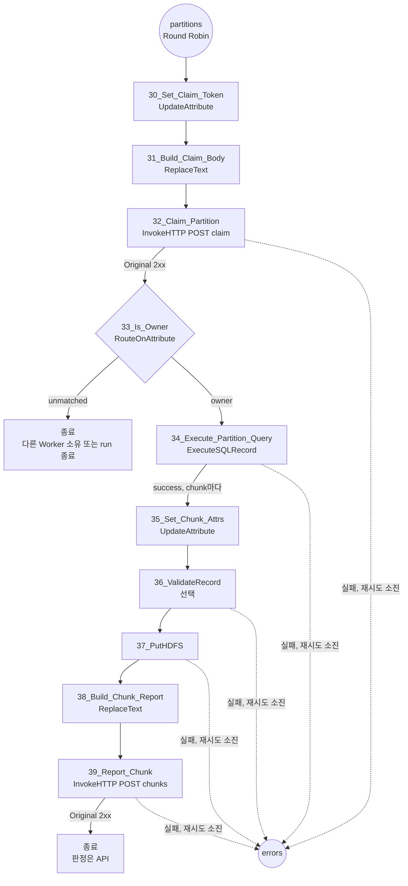

Worker에는 대기 단계가 없다. 각 chunk는 HDFS에 기록되고 API에 보고되면 끝난다. 파티션과 run의 완료는 API가 보고를 받을 때마다 판정한다(9장). 가이드 초안의 첫 fragment 분기, `DuplicateFlowFile`, partition-control FlowFile, file audit `PutSQL`, `Notify`는 없다. API 보고에 `chunkCount=${fragment.count}`가 들어가므로 파티션 완료 판정에 별도 control FlowFile이 필요 없다.

파티션 실패 보고(`POST .../fail`)도 PG-20에 두지 않는다. 34·36·37·39의 실패는 `errors`로 가고, PG-90이 claim에 성공한 파티션(`load.stage`가 `EXTRACT` 또는 `CHUNK_WRITE`이고 `api.response`의 `claimed=true`)이면 파티션 실패를 보고한다(14.2).

### 8.2 주요 Processor 설정

PG-20의 입력 Connection(PG-10 `partitions`, PG-05 `reissue`)에만 Round Robin Load Balance를 적용한다. 각 Worker Processor는 All Nodes에서 동작하며 동시성은 Oracle pool 상한을 넘지 않게 한다.

| ID | Processor | Scheduling | 주요 Properties | Relationship |
|---|---|---|---|---|
| 30 | `UpdateAttribute` | All Nodes, worker concurrency | `partition.claim.token=${UUID()}`, `load.stage=EXTRACT` | success→31 |
| 31 | `ReplaceText` | All Nodes, worker concurrency | 본문 `{"claimToken":"${partition.claim.token}","workerNode":"${hostname(true):escapeJson()}"}` | success→32 |
| 32 | `InvokeHTTP` | All Nodes, worker concurrency | 9.2 공통 설정, URL=`#{CONTROL.API.URL}/runs/${load.run.id}/partitions/${partition.id}/claim`, `Response Body Attribute Name=api.response` | Original→33, No Retry/Retry/Failure→`errors` |
| 33 | `RouteOnAttribute` | All Nodes, worker concurrency | `owner=${api.response:jsonPath('$.claimed'):equals('true')}`이고 `partition.lower`, `partition.upper`, `load.snapshot.scn`이 숫자 정규식에 맞을 것(NULL 파티션은 경계 검사 제외) | owner→34, unmatched→auto-terminate |
| 34 | `ExecuteSQLRecord` | All Nodes, worker concurrency | `CS_DBCP_ORACLE`, SQL Query 속성에 파티션 SQL(8.4), `CS_PARQUET_WRITER`. 재시도 없음(16장) | success→35, failure→`errors` |
| 35 | `UpdateAttribute` | All Nodes, worker concurrency | `filename=part-${partition.id}-${fragment.index:padLeft(6,'0')}.parquet`, `chunk.index=${fragment.index}`, `load.stage=CHUNK_WRITE` | success→36 |
| 36 | `ValidateRecord` (선택) | All Nodes, worker concurrency | Reader=`CS_PARQUET_READER`, Writer=`CS_PARQUET_WRITER`, validation schema 고정 | valid→37, invalid/failure→`errors` |
| 37 | `PutHDFS` | All Nodes, HDFS 부하 기준 | 8.5 표. Retry Count=`PARTITION.RETRY.MAX` 기준값, Retried Relationships=failure | success→38, failure→`errors` |
| 38 | `ReplaceText` | All Nodes, worker concurrency | chunk 보고 본문(8.5) | success→39 |
| 39 | `InvokeHTTP` | All Nodes, worker concurrency | 9.2 공통 설정, URL=`.../partitions/${partition.id}/chunks`, `Response Body Attribute Name=api.response` | Original→auto-terminate, No Retry/Retry/Failure→`errors` |

30은 token만 만들고 본문은 31에서 만든다. `UpdateAttribute`는 모든 속성을 **들어온** attribute 기준으로 평가하므로, 같은 Processor 안에서 방금 만든 `partition.claim.token`을 참조하면 빈 값이 된다. API PoC에서 이 때문에 모든 claim이 422(`claimToken` UUID 형식 오류)를 받는 것을 재현했다.

claim 응답을 잃고 32가 재시도하면 같은 FlowFile, 즉 같은 `partition.claim.token`으로 다시 요청한다. API는 같은 token의 재요청에 `claimed=true`를 돌려주므로 Worker가 스스로 종료하지 않는다(4.1 "Claim과 상태 전이"). relationship 재시도는 들어온 FlowFile을 다시 처리하므로 token이 바뀌지 않는다.

`claimed=false`는 다른 Worker가 이미 처리 중이거나 run이 실패 또는 종료된 경우다(`$.runStatus`로 구분). 둘 다 정상 경합이므로 오류로 남기지 않고 종료한다.

### 8.3 Claim과 실패 보고

- claim은 API가 run 행을 잠근 뒤 조건부 UPDATE로 처리한다. run이 `EXTRACTING`이 아니면 `claimed=false`이므로 실패한 run의 대기 파티션은 Oracle 조회를 시작하지 않는다.
- 파티션 실패는 PG-90이 보고한다. `errorCode`는 PG-90이 `executesql.error.message`에서 추출한 `ORA-nnnnn` 코드이거나 `CHUNK_WRITE_FAILED` 같은 단계 코드다. API는 같은 트랜잭션에서 partition `FAILED`, run `FAILED_EXTRACT`로 바꾼다. `errorCode=ORA-01555`이면 `FAILED_SNAPSHOT_EXPIRED`로 바꾼다.
- 실패 후 같은 run의 다른 Worker는 Oracle 쿼리를 중단하지 않고 끝까지 실행한다. 이후 chunk 보고는 200(`runStatus=FAILED_*`)을 받고 종료하며, 파일은 실패 run의 격리 경로에만 남는다.
- 가이드 초안의 실패 시 Wait 해제 Notify는 필요 없다. 기다리는 FlowFile이 없기 때문이다.

### 8.4 Extract SQL 생성

SQL은 34의 SQL Query 속성에 둔다. 가이드 초안의 SQL 생성용 `ReplaceText`는 두지 않는다. 경계와 SCN은 33에서 숫자 정규식으로 검증한 값만 EL로 넣고, 업무키는 PG-00에서 형식을 고정한 값이 `#{SRC.BASE.WHERE}`로 들어간다(3.2).

`SPLIT.NULL.POLICY=FAIL`(NULL 파티션 없음)이면 다음과 같다.

```sql
SELECT #{SRC.COLUMNS}
  FROM #{SRC.OWNER}.#{SRC.TABLE} AS OF SCN ${load.snapshot.scn}
 WHERE #{SRC.BASE.WHERE}
   AND #{SRC.SPLIT.COLUMN} >= ${partition.lower}
   AND #{SRC.SPLIT.COLUMN} ${partition.upper.inclusive:equals('true'):ifElse('<=','<')} ${partition.upper}
```

`SPLIT.NULL.POLICY=SEPARATE`이면 NULL 파티션과 범위 파티션을 SQL의 상수 조건으로 나눈다. Parameter는 EL 문자열 리터럴 안에서 치환되지 않으므로(5장) `#{SRC.SPLIT.COLUMN}`을 EL 밖에 둔다. 상수 조건은 실행 계획에서 제거된다.

```sql
SELECT #{SRC.COLUMNS}
  FROM #{SRC.OWNER}.#{SRC.TABLE} AS OF SCN ${load.snapshot.scn}
 WHERE #{SRC.BASE.WHERE}
   AND (   ('${partition.is.null}' = 'true' AND #{SRC.SPLIT.COLUMN} IS NULL)
        OR ('${partition.is.null}' <> 'true'
            AND #{SRC.SPLIT.COLUMN} >= ${partition.lower:replaceEmpty('NULL')}
            AND #{SRC.SPLIT.COLUMN} ${partition.upper.inclusive:equals('true'):ifElse('<=','<')} ${partition.upper:replaceEmpty('NULL')}))
```

34 `ExecuteSQLRecord` 설정은 다음과 같다.

| Property | 값 |
|---|---|
| Database Connection Pooling Service | `CS_DBCP_ORACLE` |
| SQL Query | 위 SQL |
| Record Writer | `CS_PARQUET_WRITER` |
| Fetch Size | `#{EXTRACT.FETCH.SIZE}` |
| Max Rows Per FlowFile | `#{EXTRACT.ROWS.PER.FILE}` |
| Output Batch Size | `0` |
| Max Wait Time | `#{EXTRACT.QUERY.TIMEOUT}` |
| Use Avro Logical Types | `true` (DATE/TIMESTAMP/DECIMAL 타입 유지, 4장 참조) |
| Default Decimal Precision | `#{ORACLE.NUMBER.DEFAULT.PRECISION}` (정밀도 없는 `NUMBER`, 4장) |
| Default Decimal Scale | `#{ORACLE.NUMBER.DEFAULT.SCALE}` |
| Set Auto Commit | `true` (기본값. Oracle은 autocommit과 무관하게 Fetch Size를 적용한다) |
| Retry Count | `0` (16장) |
| Concurrent Tasks | `WORKER.CONCURRENT.TASKS` 기준값을 정수로 입력 (Parameter 참조 불가) |
| Execution | All Nodes |

`Output Batch Size=0`이어야 한 ResultSet의 `fragment.count`, `fragment.index`, `fragment.identifier`가 완전하게 생성된다. 파티션 크기가 너무 커 session/repository 압력이 생기면 Output Batch를 켜기보다 논리 파티션 수를 늘린다.

PostgreSQL 원천이면 `AS OF SCN`을 빼고 `Set Auto Commit=false`를 둔다(1장 "Oracle 이외 원천").

### 8.5 Chunk 기록과 보고

35에서 다음 속성을 만든다.

```text
filename    = part-${partition.id}-${fragment.index:padLeft(6,'0')}.parquet
chunk.index = ${fragment.index}
load.stage  = CHUNK_WRITE
```

하위 디렉터리를 만들지 않으므로 별도 part path attribute는 두지 않는다(1장 경로 원칙 참조).

37 `PutHDFS`:

| Property | 값 |
|---|---|
| Hadoop Configuration Resources | `#{HADOOP.CONF.FILES}` |
| Kerberos User Service | 설정하지 않음 |
| Directory | `${load.hdfs.path}` (run root, 하위 디렉터리 없음) |
| Conflict Resolution Strategy | `replace` |
| Writing Strategy | `Write and rename` |
| Permissions umask | `#{HDFS.PERMISSIONS.UMASK}` |
| Replication | `#{HDFS.REPLICATION}` 또는 공란으로 HDFS 기본값 사용 |
| Retry | Retry Count=`PARTITION.RETRY.MAX` 기준값, Retried Relationships=failure, Backoff=Penalize FlowFile |
| Concurrent Tasks | Worker 동시성과 HDFS 부하에 맞춰 설정 |

HDFS에는 Kerberos가 적용되지 않았으므로 `Kerberos User Service`, principal, keytab을 구성하지 않는다. HDFS 권한 검사는 하지 않으므로(`dfs.permissions.enabled=false`) NiFi가 쓴 파일을 Hive가 별도 권한 부여 없이 읽는다. `core-site.xml`의 인증 방식과 `fs.defaultFS`가 실제 HDFS 환경을 가리키는지 확인한다. `replace`는 run 전용 경로와 결정적 파일명인 경우에만 허용한다.

38 `ReplaceText`는 PutHDFS **성공 이후에** content를 보고 JSON으로 바꾼다. 그 전에 `InvokeHTTP`를 호출하면 Parquet content가 요청 본문으로 전송된다. Replacement Strategy=Always Replace이므로 Parquet content를 읽지 않는다.

```json
{"claimToken":"${partition.claim.token}","chunkIndex":${fragment.index},"chunkCount":${fragment.count},
 "fragmentIdentifier":"${fragment.identifier}","hdfsPath":"${absolute.hdfs.path:escapeJson()}/${filename}",
 "recordCount":${record.count},"byteCount":${fileSize}}
```

`chunkIndex`는 0부터 시작하는 숫자(`fragment.index`)다. 파일명에 쓰는 0 채움 값과 구분한다. `fileSize`는 EL 평가 시점, 즉 content를 바꾸기 전 Parquet 크기다. API는 `hdfsPath`가 해당 run의 `hdfs_run_path` 아래인지 검증한다.

API는 보고를 받을 때마다 같은 트랜잭션에서 다음을 처리한다(API 설계 3.2).

1. run과 partition 행 잠금, claim token 확인
2. `load_file` UPSERT, partition·run `heartbeat_at` 갱신
3. 받은 chunk 수가 `chunkCount`에 도달하면 파티션 판정: row 합계가 expected와 같으면 `SUCCESS`, 다르면 `FAILED`와 run `FAILED_EXTRACT`
4. 파티션이 `SUCCESS`가 되면 run 판정: 모두 `SUCCESS`이고 합계가 source count와 같으면 `EXTRACTED_VALIDATED`와 검증 호출 예약

응답 예시:

```json
{ "recorded": true, "partitionStatus": "SUCCESS", "runStatus": "EXTRACTED_VALIDATED",
  "receivedChunks": 3, "chunkCount": 3, "validationScheduled": true }
```

NiFi는 이 응답으로 흐름을 바꾸지 않는다. 39의 Original은 auto-terminate한다. 파티션 판정과 이벤트(`PARTITION_SUCCESS`, `PARTITION_FAILED`, `EXTRACT_VALIDATED`)는 API가 기록한다.

heartbeat는 claim과 chunk 보고 때만 갱신된다. `ExecuteSQLRecord`는 `Output Batch Size=0`이면 ResultSet을 끝까지 읽은 뒤 모든 chunk FlowFile을 한 번에 내보낸다. 따라서 파티션 쿼리가 실행되는 동안(최대 `EXTRACT.QUERY.TIMEOUT`)에는 heartbeat가 갱신되지 않는다. API sweeper의 stale 기준(13장)은 이 공백을 고려해 정한다.

39가 재시도를 다 써도 보고하지 못하면 파티션은 미완료로 남는다. 이 경우 run은 API sweeper가 timeout으로 정리한다. HDFS 파일은 run 격리 경로에 있으므로 다른 run에 영향을 주지 않는다.

36 `ValidateRecord`는 Reader=`CS_PARQUET_READER`, validation schema=`CS_SCHEMA_REGISTRY`의 승인 버전, Writer=`CS_PARQUET_WRITER`로 설정한다. `invalid` 또는 `failure`가 한 건이라도 발생하면 `errors`를 거쳐 해당 partition 전체를 실패시킨다. 대용량 재직렬화 비용이 허용되지 않으면 이 Processor를 제거할 수 있지만, 그 경우 동일 schema 검증을 staging Hive 조회에서 필수로 수행한다.

---

## 9. Load Control API 연동과 완료 판정

가이드 초안의 PG-30 Partition and Run Gate(Wait/Notify, `MapCacheServer`, 폴링 루프)는 두지 않는다. 완료 판정은 Load Control API가 chunk 보고마다 수행하고, run 완료를 확정한 보고 하나만 검증 flow 호출을 예약한다. 이 장은 NiFi가 API와 연동하는 공통 규칙을 정의한다. API 내부 동작은 API 설계 3~5장을 따른다.

### 9.1 완료 판정 흐름

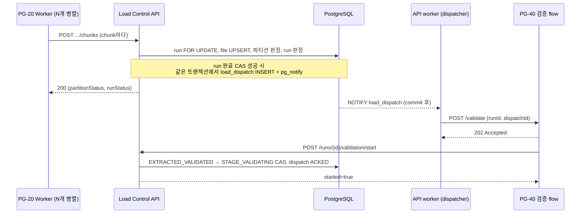

판정 결과와 NiFi 동작은 다음과 같다.

| 상황 | API 처리 | NiFi 동작 |
|---|---|---|
| 파티션 진행 중 | file 기록 | 39 Original에서 종료 |
| 파티션 완료, run 진행 중 | partition `SUCCESS`, `PARTITION_SUCCESS` 이벤트 | 39 Original에서 종료 |
| 마지막 파티션 완료 | run `EXTRACTED_VALIDATED`, outbox 예약, `EXTRACT_VALIDATED` 이벤트 | 39 Original에서 종료. 검증 flow는 API가 시작 |
| row 수 불일치 | partition `FAILED`, run `FAILED_EXTRACT`, `PARTITION_FAILED` 이벤트 | 39 Original에서 종료 |
| 이미 실패한 run의 보고 | file만 기록, `runStatus=FAILED_*` | 39 Original에서 종료 |
| Processor 실패 보고(PG-90 95) | partition `FAILED`, run `FAILED_EXTRACT` | PG-90이 오류 이벤트 기록 |

PoC에서 PG-30이 실패 후 0.1초 만에 run 실패를 확정하던 동작은 API에서 `fail` 호출 한 번으로 즉시 확정된다. 기다리는 FlowFile이 없으므로 Wait 해제 처리도 없다.

### 9.2 `InvokeHTTP` 공통 설정

| Property | 값 |
|---|---|
| HTTP Method | `POST` (조회는 `GET`) |
| HTTP URL | `#{CONTROL.API.URL}/runs/${load.run.id}/...` |
| SSL Context Service | 설정하지 않음(HTTP) |
| Connection Timeout | `5 sec` |
| Socket Read Timeout | `#{CONTROL.API.TIMEOUT}` |
| Request Content-Type | `application/json` |
| Request Body Enabled | `true` (FlowFile content가 본문) |
| Response Body Attribute Name | `api.response` (응답이 작은 호출). PG-10 18만 비움 |
| Response Body Attribute Size | `16384` |
| Response Generation Required | `false` |
| 동적 속성 `Authorization` | `#{CONTROL.API.AUTHORIZATION}` — **Sensitive 동적 속성**으로 추가해야 Sensitive Parameter를 참조할 수 있다. Sensitive 속성은 Parameter 참조 외의 텍스트를 가질 수 없으므로 `Bearer #{...}`처럼 쓰면 NiFi가 400으로 거부한다(NiFi 2.4.0에서 확인). Parameter 값을 `Bearer <token>` 전체로 둔다 |
| 동적 속성 `X-Request-Id` | `${UUID()}` |
| 동적 속성 `X-Run-Id` | `${load.run.id}` |
| Retry Count | `CONTROL.API.RETRY.MAX` 기준값(정수 입력) |
| Retried Relationships | `Retry`, `Failure` |
| Backoff Policy | Penalize FlowFile |
| Max Backoff Period | `1 min` |
| Penalty Duration | `5 sec` |
| Relationship | Original(또는 Response)→다음 단계, `No Retry`, `Retry`, `Failure`→`errors` |

요청 본문은 앞 단계의 `ReplaceText`가 EL로 만든 JSON이다(2.1 규칙 3). API는 알 수 없는 필드를 422로 거부하므로(API 설계 9.4) 본문에는 API 필드만 넣는다. 문자열 값은 `escapeJson()`으로 감싸고, 숫자 값(`fragment.index`, `record.count`, `fileSize`)은 따옴표 없이 넣는다. 본문이 `{}`인 호출(`/stage-validated`, `/success`)도 `ReplaceText`로 `{}`를 만든다. 앞 호출의 content가 남아 있으면 그 내용이 본문으로 가기 때문이다.

### 9.3 Relationship 처리

| HTTP 결과 | Relationship | 처리 |
|---|---|---|
| 2xx | Original(`Response Body Attribute Name` 설정 시) 또는 Response | 응답 본문으로 분기 |
| 409 (`CLAIM_MISMATCH`, `CHUNK_CONFLICT`, `DUPLICATE_ACTIVE_RUN`) | No Retry | `errors` → PG-90. 재시도하지 않음 |
| 404, 422 (run 없음, 입력·불변식 위반) | No Retry | `errors` → PG-90 ERROR. 입력 오류이므로 재시도하지 않음 |
| 5xx | Retry | relationship 재시도 후 소진되면 `errors` |
| 연결 실패, timeout | Failure | relationship 재시도 후 소진되면 `errors`(PG-90 `API_UNREACHABLE`) |

`Response Body Attribute Name`을 설정하면 2xx가 아닌 응답의 본문도 그 attribute(`api.response`)에 들어가고 `invokehttp.response.body`는 비어 있다(NiFi 2.4.0 PoC에서 확인). 오류 코드는 `${api.response:jsonPath('$.code')}`로 확인하며, PG-90은 두 attribute를 모두 본다. API 호출 재시도는 모든 상태 변경 호출이 멱등이기 때문에 안전하다. 같은 chunk 보고나 같은 token의 claim이 두 번 가도 결과는 한 번 호출한 것과 같다.

재시도 대기는 API 재기동 시간을 견딜 만큼 길어야 한다. Penalty Duration 5초에서 시작해 두 배씩 늘고 Max Backoff Period 1분에서 멈추므로, Retry Count 5회면 약 5+10+20+40+60초 = 2분 15초다. API가 이보다 오래 내려가면 보고가 유실되고, run은 sweeper가 timeout으로 정리한다(13장). 이 경우 데이터는 잘못 게시되지 않고 run이 실패할 뿐이다.

### 9.4 API 호출 목록

| Process Group | 호출 | 상태 전이 |
|---|---|---|
| PG-10 | `POST /runs` | run `CREATED` |
| PG-10 | `POST /runs/{id}/manifest` | `EXTRACTING`, 0건 파티션 `SUCCESS` |
| PG-10, PG-40~60 | `POST /runs/{id}/fail` | 지정 단계 실패 상태 |
| PG-20 | `POST /runs/{id}/partitions/{pid}/claim` | partition `RUNNING` |
| PG-20 | `POST /runs/{id}/partitions/{pid}/chunks` | partition `SUCCESS`, run `EXTRACTED_VALIDATED` |
| PG-20 | `POST /runs/{id}/partitions/{pid}/fail` | partition `FAILED`, run `FAILED_EXTRACT` |
| PG-40 | `POST /runs/{id}/validation/start` | `STAGE_VALIDATING` |
| PG-40, PG-60 | `POST /runs/{id}/validations` | `load_validation` 기록 |
| PG-40 | `POST /runs/{id}/stage-validated` | `STAGING_VALIDATED` |
| PG-50 | `POST /runs/{id}/publish/claim` | `PUBLISHING` |
| PG-50 | `POST /runs/{id}/publish/result` | `PUBLISHED`, `FAILED_PUBLISH`, `PUBLISH_UNKNOWN` |
| PG-60 | `POST /runs/{id}/success` | `SUCCESS` |

요청·응답 형식은 API 설계 5장을 따른다.

### 9.5 API 호출 수신: PG-05 Control Receiver

API는 검증 시작(`VALIDATE_RUN`)과 선택 기능인 파티션 재발행(`REISSUE_PARTITION`)을 NiFi에 HTTP로 요청한다. Job마다 Job PG와 Parameter Context(`PC_JOB_<JOB_NAME>`)가 다르고 한 포트는 하나의 `HandleHttpRequest`만 열 수 있다. 그래서 root에 공통 PG-05 하나를 두고 요청 경로의 `jobKey`로 각 Job PG의 Input Port(`validate-in`, `reissue-in`)에 전달한다.

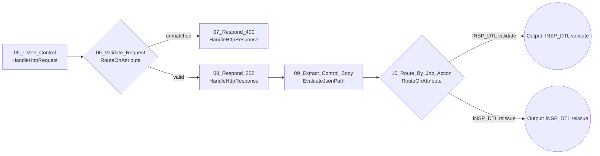

| ID | Processor | Scheduling | 주요 Properties | Relationship |
|---|---|---|---|---|
| 05 | `HandleHttpRequest` | All Nodes, 1 | Listening Port=`#{CONTROL.LISTEN.PORT}`(HTTP), HTTP Context Map=`CS_HTTP_CONTEXT_MAP`, Allowed Paths=`/(validate\|reissue)/(ORACLE_INSP_DTL_DAILY\|...)`(등록된 Job만), Allow GET/PUT/DELETE/HEAD/OPTIONS=false | success→06 |
| 06 | `RouteOnAttribute` | All Nodes, 1 | `http.method`=POST, `http.headers.X-Run-Id`와 `X-Dispatch-Id`가 UUID 형식 | valid→08, unmatched→07 |
| 07 | `HandleHttpResponse` | All Nodes, 1 | HTTP Status Code=400 | success→auto-terminate |
| 08 | `HandleHttpResponse` | All Nodes, 1 | HTTP Status Code=202 | success→09 |
| 09 | `EvaluateJsonPath` | All Nodes, 1 | Path Not Found Behavior=ignore. `load.run.id=$.runId`, `load.dispatch.id=$.dispatchId`와 재발행 필드(`partition.id`, `load.business.key`, `load.snapshot.scn`, `load.hdfs.path`, `partition.lower`, `partition.upper`, `partition.upper.inclusive`, `partition.is.null`, `partition.expected.rows`)를 한 번에 추출. 검증 요청에는 없는 필드가 빈 값이 된다 | matched→10, unmatched/failure→auto-terminate |
| 10 | `RouteOnAttribute` | All Nodes, 1 | Job·동작별 route. 예: `validate.ORACLE_INSP_DTL_DAILY=${http.request.uri:equals('/validate/ORACLE_INSP_DTL_DAILY')}`, `reissue.ORACLE_INSP_DTL_DAILY=${http.request.uri:equals('/reissue/ORACLE_INSP_DTL_DAILY')}` | Job별 Output Port(`validate-<JOB>`, `reissue-<JOB>`), unmatched→auto-terminate |

- 검증은 수십 분 걸릴 수 있으므로 08에서 먼저 202를 응답하고 HTTP 연결을 붙잡지 않는다. API는 2xx를 받으면 dispatch를 `SENT`로 바꾸고, 검증 flow가 `/validation/start`를 호출해야 `ACKED`가 된다. 202 응답 직후 노드가 죽어 FlowFile이 사라지면 API가 ACK timeout 뒤 다시 보낸다.
- 등록되지 않은 `jobKey`는 05의 Allowed Paths에서 걸러져 `HandleHttpRequest`가 404로 응답한다. 07·09·10의 unmatched도 API 쪽에서 ACK timeout 후 재전송되고, 계속 실패하면 dispatch가 `DEAD`가 되어 API가 `DISPATCH_DEAD` 이벤트로 알린다. 그래서 PG-05는 별도 오류 기록 Processor를 두지 않는다. 원인은 NiFi Bulletin과 Provenance로 확인한다.
- `HandleHttpRequest`는 모든 노드에서 동작한다. API는 NiFi LB 주소(`nifi.receiver_url`)로 호출하며, 어느 노드가 받든 Job PG의 첫 단계 CAS가 중복 실행을 막는다. 그래서 PG-40~60은 All Nodes로 스케줄한다(2.3).
- 새 Job을 추가하면 05의 Allowed Paths에 `jobKey`를 넣고, 10에 route 두 개(validate, reissue)와 Output Port를 추가해 새 Job PG의 Input Port에 연결한다. V4 빌더는 이 등록을 자동으로 한다. PG-05가 없으면 만들고, 있으면 PG-05를 멈춘 뒤 route·Port·root 연결을 추가하고 Allowed Paths를 등록된 Job 목록으로 다시 쓴 다음 시작한다. 멈춘 몇 초 동안 온 호출은 연결 실패가 되어 API dispatcher가 backoff 후 다시 보낸다. Job을 지울 때는 그 Job의 것만 지우고(`poc/teardown_flow.py`), 마지막 Job이면 PG-05도 지운다.
- PG-05는 공통 Parameter Context(`PC_SQOOP_REPLACEMENT_COMMON`, `CONTROL.LISTEN.PORT`)를 쓴다. 이 Context는 모든 Job Context가 상속하므로 Job을 만들거나 지울 때 지우지 않는다.
- 05는 HTTP로 받는다. 방화벽으로 수신 포트를 API worker 호스트에만 연다. 06이 `X-Run-Id`, `X-Dispatch-Id` 형식을 검사하고, 실제 처리 여부는 PG-40의 `/validation/start` CAS가 정한다.

---

## 10. PG-40 Staging Validation

### 10.1 Processor 흐름

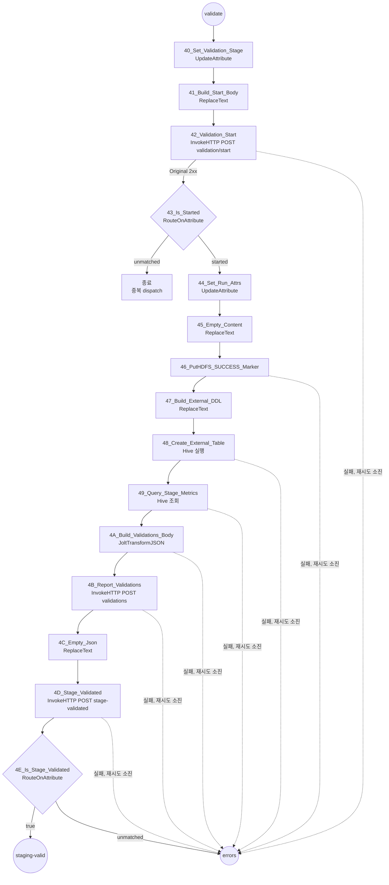

PoC V4에서 40~4E 전체를 CFM 4.12(NiFi 2.6.0)와 Apache Hive 4.0.1로 검증했다(REVIEW 7.9).

### 10.2 주요 Processor 설정

| ID | Processor | Scheduling | 주요 Properties | Relationship |
|---|---|---|---|---|
| 40 | `UpdateAttribute` | All Nodes, 1 | `load.stage=VALIDATION_START` | success→41 |
| 41 | `ReplaceText` | All Nodes, 1 | 본문 `{"dispatchId":"${load.dispatch.id}","node":"${hostname(true):escapeJson()}"}` | success→42 |
| 42 | `InvokeHTTP` | All Nodes, 1 | 9.2 공통 설정, URL=`#{CONTROL.API.URL}/runs/${load.run.id}/validation/start`, `Response Body Attribute Name=api.response` | Original→43, No Retry/Retry/Failure→`errors` |
| 43 | `RouteOnAttribute` | All Nodes, 1 | `started=${api.response:jsonPath('$.started'):equals('true')}` | started→44, unmatched→auto-terminate |
| 44 | `UpdateAttribute` | All Nodes, 1 | 응답에서 `load.job.key`, `load.business.key`, `load.snapshot.scn`, `load.hdfs.path`, `load.stage.table`, `load.source.count`, `load.extracted.count`, `validation.source.*`(`$.sourceMetrics.*`)를 `jsonPath()`로 추출. `filename=_SUCCESS`, `load.stage=STAGE_VALIDATION` | success→45 |
| 45 | `ReplaceText` | All Nodes, 1 | Replacement Value=빈 값 | success→46 |
| 46 | `PutHDFS` | All Nodes, 1 | Directory=`${load.hdfs.path}`, Write and rename, conflict=replace, Retry Count 기준값 | success→47, failure→`errors` |
| 47 | `ReplaceText` | All Nodes, 1 | 승인된 external table DDL로 전체 content 치환 | success→48 |
| 48 | `PutClouderaHiveQL` | All Nodes, 1 | `CS_HIVE3_DBCP`, Query timeout, Batch Size=1, Rollback On Failure=false, DDL 1건, `retry` 재시도 3회 | success→49, failure/retry→`errors` |
| 49 | `ExecuteSQLRecord` | All Nodes, 1 | `CS_HIVE3_DBCP`, 지표·기대값·PASS/FAIL을 한 번에 계산하는 SQL(10.3), JSON writer | success→4A, failure→`errors` |
| 4A | `JoltTransformJSON` | All Nodes, 1 | 지표 행 배열을 `{"stage":"STAGING","queryVersion":"v1","metrics":[...]}`로 변환 | success→4B, failure→`errors` |
| 4B | `InvokeHTTP` | All Nodes, 1 | `POST /runs/${load.run.id}/validations` | Original→4C, No Retry/Retry/Failure→`errors` |
| 4C | `ReplaceText` | All Nodes, 1 | 본문 `{}` | success→4D |
| 4D | `InvokeHTTP` | All Nodes, 1 | `POST /runs/${load.run.id}/stage-validated`, `Response Body Attribute Name=api.response` | Original→4E, No Retry/Retry/Failure→`errors` |
| 4E | `RouteOnAttribute` | All Nodes, 1 | `${api.response:jsonPath('$.stageValidated'):equals('true')}` | matched→`staging-valid`, unmatched→`errors` |

검증 flow는 API 호출로 새로 시작되므로, PG-10에서 만든 attribute(SCN, source count, source DQ 지표)를 가지고 있지 않다. 그래서 42의 `/validation/start` 응답이 검증에 필요한 값을 모두 돌려준다. source DQ 지표는 PG-10이 `/manifest` 요청의 `sourceMetrics`로 보내 API가 `load_validation`(stage=`SOURCE`)에 저장해 둔 값이다(API 설계 5.3).

42는 반드시 첫 API 호출이다. API는 `EXTRACTED_VALIDATED → STAGE_VALIDATING` CAS에 성공한 호출에만 `started=true`를 돌려준다. 같은 run의 검증 요청이 두 번 와도(outbox 재전송, LB 재시도) 두 번째는 43에서 종료된다. 43 이전의 실패는 `load.stage=VALIDATION_START`이므로 PG-90이 이벤트만 남기고, API가 ACK timeout 뒤 다시 보낸다. 44 이후의 실패는 `load.stage=STAGE_VALIDATION`이므로 PG-90이 run을 `FAILED_STAGE_VALIDATION`으로 보고한다(14.2). 4E의 `stageValidated=false`도 같은 경로로 실패를 확정한다.

45~46은 수신 FlowFile의 content를 비우고 run root에 `_SUCCESS`를 `Write and rename`으로 기록한다. FlowFile attribute는 유지되므로 PutHDFS 성공 관계에서 바로 47로 진행한다. 이 파일은 API가 run 완료를 확정한 뒤에만 존재한다. NiFi 2.4.0 PoC에서 0바이트 `_SUCCESS`가 생성됨을 확인했다.

47의 예시 SQL:

```sql
CREATE EXTERNAL TABLE #{HIVE.STAGE.DB}.${load.stage.table} (
  #{HIVE.STAGE.DDL.COLUMNS}
)
STORED AS PARQUET
LOCATION '${load.hdfs.path}'
```

`load.stage.table`은 `${load.run.id}`에서 하이픈을 제거한 안전한 suffix만 사용하고 정규식으로 검증한다.

Apache NiFi 2.x에는 Hive 번들이 없다. CFM 4.12.0의 Hive 구성요소는 `ClouderaHiveConnectionPool`, `PutClouderaHiveQL`, `SelectClouderaHiveQL`이다(`nifi-cdf-hive-nar`). PoC는 DDL·DML(48, 55)에 `PutClouderaHiveQL`을, 지표 조회(49, 61)에 `ExecuteSQLRecord`와 JSON writer를 썼다. `SelectClouderaHiveQL`은 Avro·CSV만 내보내 Jolt 앞에 변환이 하나 더 필요하다. PoC에서 확인한 `PutClouderaHiveQL` 동작:

- SQL 오류(`SemanticException` 등)는 `failure`로 가지만 FlowFile에 오류 attribute를 남기지 않는다. 원인은 bulletin에만 있다
- HiveServer2에 연결할 수 없으면 `failure`·`retry`로 보내지 않고 세션을 rollback해 FlowFile을 입력 큐에 남긴다. Hive가 돌아오면 그대로 이어서 실행한다

### 10.3 Stage 지표 SQL

비교를 NiFi `RouteOnAttribute`로 하지 않고 SQL 안에서 한다. 기대값은 44가 `/validation/start` 응답에서 꺼낸 attribute이고, SQL은 지표마다 한 행(`metric_name`, `expected_value`, `actual_value`, `result`)을 돌려준다. 4A는 이 행을 그대로 `metrics` 배열로 옮긴다.

```sql
WITH s AS (
  SELECT COUNT(*) AS cnt,
         COALESCE(SUM(CASE WHEN INSP_DTL_SEQ IS NULL THEN 1 ELSE 0 END), 0) AS null_cnt,
         COUNT(*) - COUNT(DISTINCT <BUSINESS_PK>) AS dup_cnt,
         COALESCE(SUM(<BUSINESS_AMOUNT>), 0) AS amount_sum,
         COALESCE(DATE_FORMAT(MIN(<BUSINESS_TIMESTAMP>), 'yyyy-MM-dd HH:mm:ss'), '') AS min_ts,
         COALESCE(DATE_FORMAT(MAX(<BUSINESS_TIMESTAMP>), 'yyyy-MM-dd HH:mm:ss'), '') AS max_ts
    FROM #{HIVE.STAGE.DB}.${load.stage.table}
)
SELECT 'STAGE_COUNT' AS metric_name, '${load.source.count}' AS expected_value, CAST(cnt AS STRING) AS actual_value,
       IF(cnt = ${load.source.count} AND cnt = ${load.extracted.count}, 'PASS', 'FAIL') AS result FROM s
UNION ALL
SELECT 'NULL_SPLIT_COUNT', '0', CAST(null_cnt AS STRING), IF(null_cnt = 0, 'PASS', 'FAIL') FROM s
UNION ALL
SELECT 'DUP_PK_COUNT', '0', CAST(dup_cnt AS STRING), IF(dup_cnt = 0, 'PASS', 'FAIL') FROM s
UNION ALL
SELECT 'AMOUNT_SUM', '${validation.source.AMOUNT_SUM}', CAST(amount_sum AS STRING),
       IF(CAST(amount_sum AS DECIMAL(38,2)) = CAST('${validation.source.AMOUNT_SUM}' AS DECIMAL(38,2)), 'PASS', 'FAIL') FROM s
UNION ALL
SELECT 'MIN_TS', '${validation.source.MIN_TS}', min_ts, IF(min_ts = '${validation.source.MIN_TS}', 'PASS', 'FAIL') FROM s
UNION ALL
SELECT 'MAX_TS', '${validation.source.MAX_TS}', max_ts, IF(max_ts = '${validation.source.MAX_TS}', 'PASS', 'FAIL') FROM s
```

`MIN_TS`/`MAX_TS`는 원천(7.3)과 같은 형식(`yyyy-MM-dd HH:mm:ss`)의 문자열로 비교한다. `CAST(... AS STRING)`은 소수 초를 붙일 수 있어 원천 형식과 달라지므로 `DATE_FORMAT`으로 맞춘다. 시간대 해석이 어긋나면 count는 같아도 이 지표가 불일치한다(4장). Hive는 결과 컬럼 이름을 소문자로 돌려주므로 4A의 Jolt spec은 소문자 이름(`metric_name` 등)을 `metricName` 등으로 옮긴다. Hive JDBC는 기본으로 컬럼 이름 앞에 table alias를 붙이므로(`hive.resultset.use.unique.column.names=true`) JDBC URL에 `?hive.resultset.use.unique.column.names=false`를 둔다. 건수 지표 이름은 `STAGE_COUNT`(target은 `TARGET_COUNT`)로 한다. API가 이 이름의 값을 `staging_count`·`target_count`로 저장한다. 빈 결과에서 `SUM`·`MIN`·`MAX`가 NULL이 되어 비교가 어긋나지 않도록 `COALESCE`로 원천(7.3의 `NVL`)과 맞춘다. 실제 SQL에 들어가는 attribute는 PoC 빌더처럼 숫자·허용 문자만 남기도록 EL로 걸러 넣는다. CTE가 지표마다 다시 계산되면 `hive.optimize.cte.materialize.threshold`로 한 번만 계산하게 한다.

4B는 지표별 PASS/FAIL을 모두 보고한다. FAIL이 있어도 먼저 기록한 뒤 4D에서 판정한다. API는 NiFi의 판정을 그대로 믿지 않고, 저장된 STAGING 지표가 모두 PASS일 때만 `STAGE_VALIDATING → STAGING_VALIDATED`로 CAS 갱신하고 `stageValidated=true`를 돌려준다.

---

## 11. PG-50 Publish

### 11.1 Processor 흐름

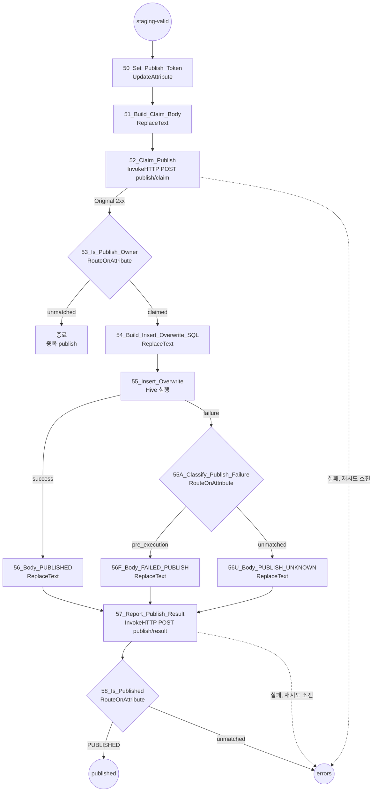

PoC V4에서 CFM 4.12와 Apache Hive 4.0.1로 검증했다(REVIEW 7.9). 55A·56F는 두지 않았다(아래).

### 11.2 주요 Processor 설정

| ID | Processor | Scheduling | 주요 Properties | Relationship |
|---|---|---|---|---|
| 50 | `UpdateAttribute` | All Nodes, 1 | `publish.token=${UUID()}`, `load.stage=PUBLISH` | success→51 |
| 51 | `ReplaceText` | All Nodes, 1 | 본문 `{"publishToken":"${publish.token}"}` | success→52 |
| 52 | `InvokeHTTP` | All Nodes, 1 | `POST /runs/${load.run.id}/publish/claim`, `Response Body Attribute Name=api.response` | Original→53, No Retry/Retry/Failure→`errors` |
| 53 | `RouteOnAttribute` | All Nodes, 1 | `claimed=${api.response:jsonPath('$.claimed'):equals('true')}` | claimed→54, unmatched→auto-terminate |
| 54 | `ReplaceText` | All Nodes, 1 | 승인된 target/partition/column로 `INSERT OVERWRITE` SQL 생성 | success→55 |
| 55 | `PutClouderaHiveQL` | All Nodes, 1 | `CS_HIVE3_DBCP`, Query timeout, Batch Size=1, Rollback On Failure=false. **재시도 없음** | success→56, failure/retry→56U(PoC). 오류 attribute가 있는 Processor면 failure→55A |
| 55A | `RouteOnAttribute` | All Nodes, 1 | 오류 attribute로 실행 전 실패 여부 판별(아래 기준) | pre_execution→56F, unmatched→56U |
| 56, 56F, 56U | `ReplaceText` | All Nodes, 1 | 본문 `{"publishToken":"${publish.token}","outcome":"PUBLISHED"}`(56). 56F·56U는 `outcome`을 `FAILED_PUBLISH`·`PUBLISH_UNKNOWN`으로 하고 `"errorCode"`, `"message"`(`escapeJson`)를 넣는다 | success→57 |
| 57 | `InvokeHTTP` | All Nodes, 1 | `POST /runs/${load.run.id}/publish/result`, `Response Body Attribute Name=api.response` | Original→58, No Retry/Retry/Failure→`errors` |
| 58 | `RouteOnAttribute` | All Nodes, 1 | `published=${api.response:jsonPath('$.runStatus'):equals('PUBLISHED')}` | published→`published`, unmatched→`errors`(이벤트만) |

52는 API가 `STAGING_VALIDATED → PUBLISHING`을 publish token으로 CAS하고 결과를 `claimed`로 돌려준다. 같은 token의 재요청은 `claimed=true`이므로, 응답을 잃고 재시도해도 게시 소유권을 잃지 않는다. token은 50에서 한 번만 만들고, relationship 재시도는 같은 FlowFile을 다시 보내므로 token이 바뀌지 않는다.

게시 결과는 PG-50이 57에서 직접 보고한다. PG-90은 `load.stage=PUBLISH`인 오류에 대해 run 실패를 보고하지 않고 이벤트만 기록한다(14.2). 결과를 PG-90에 맡기면 `PUBLISH_UNKNOWN`과 `FAILED_PUBLISH` 구분이 사라지기 때문이다.

57은 token이 일치할 때만 `PUBLISHING → PUBLISHED`로 바꾼다. Hive 실행은 성공했는데 57이 재시도를 다 써도 API에 보고하지 못하면 run은 `PUBLISHING`에 남는다. API sweeper가 `recovery.publish_stale` 경과 후 `PUBLISH_UNKNOWN`으로 바꾸고 알린다. 이 경우 자동 재게시는 하지 않는다.

54 SQL 예시:

```sql
INSERT OVERWRITE TABLE #{HIVE.TARGET.DB}.#{HIVE.TARGET.TABLE}
#{TARGET.PARTITION.CLAUSE}
SELECT #{HIVE.INSERT.COLUMNS}
  FROM #{HIVE.STAGE.DB}.${load.stage.table}
```

전체 테이블이 아니라 업무일자 파티션만 교체해야 한다면 `TARGET.PARTITION.CLAUSE`를 반드시 설정한다. SQL에는 FlowFile에서 받은 임의 identifier를 사용하지 않는다.

55는 relationship 재시도를 설정하지 않는다. `INSERT OVERWRITE`를 자동으로 다시 실행하면 결과가 불명확한 게시를 반복하게 된다. Hive 응답을 받지 못해 성공 여부가 불명확한 timeout은 `PUBLISH_UNKNOWN`으로 기록한다. 운영자가 Hive query history와 target 지표를 확인한 뒤 API의 운영자 엔드포인트(`POST /runs/{id}/publish-unknown/resolve`)로 확정한다.

Hive Processor의 `failure` relationship만으로는 "SQL이 실행되지 않은 실패"와 "실행 후 응답을 잃은 경우"를 구분할 수 없다. 따라서 55의 failure는 기본적으로 `PUBLISH_UNKNOWN`으로 보낸다. 55A는 실행 전에 실패했음이 확실한 경우에만 `FAILED_PUBLISH`로 분류한다.

- SQL 구문/의미 오류: SQLState class `42`, Hive `ParseException`/`SemanticException`
- 권한 오류: authorization 실패 메시지
- 연결 획득 실패: 연결 수립 단계 오류로, 문장 제출 전임이 확실한 경우

timeout, connection reset, 원인 불명 오류는 모두 `PUBLISH_UNKNOWN`이다. CFM 4.12 `PutClouderaHiveQL`은 failure FlowFile에 오류 attribute(SQLState, message)를 붙이지 않는다(PoC에서 `SemanticException`으로 확인). 그래서 PoC는 55A와 56F를 두지 않고 모든 failure·retry를 `PUBLISH_UNKNOWN`으로 보고하며, 운영자가 bulletin과 Hive 이력을 보고 확정한다. 연결 획득 실패는 failure로 오지 않고 FlowFile이 55 앞 큐에 남는다(10.2). 이때 SQL은 제출되지 않았으므로 Hive가 돌아온 뒤 실행돼도 안전하다.

---

## 12. PG-60 Target Validation

### 12.1 Processor 흐름

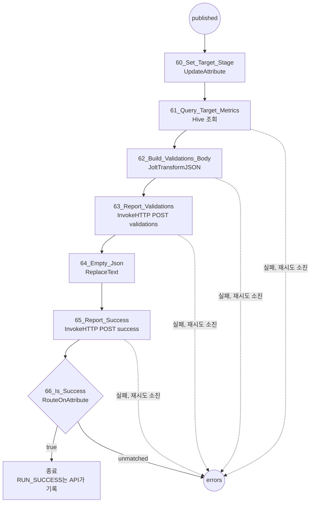

PoC V4에서 CFM 4.12와 Apache Hive 4.0.1로 검증했다(REVIEW 7.9).

### 12.2 주요 Processor 설정

| ID | Processor | Scheduling | 주요 Properties | Relationship |
|---|---|---|---|---|
| 60 | `UpdateAttribute` | All Nodes, 1 | `load.stage=TARGET_VALIDATION` | success→61 |
| 61 | `ExecuteSQLRecord` | All Nodes, 1 | `CS_HIVE3_DBCP`, target 업무 범위의 지표·기대값·PASS/FAIL SQL(10.3과 같은 형식, FROM만 target 업무 범위, 건수 지표는 `TARGET_COUNT`) | success→62, failure→`errors` |
| 62 | `JoltTransformJSON` | All Nodes, 1 | `{"stage":"TARGET","queryVersion":"v1","metrics":[...]}` | success→63, failure→`errors` |
| 63 | `InvokeHTTP` | All Nodes, 1 | `POST /runs/${load.run.id}/validations` | Original→64, No Retry/Retry/Failure→`errors` |
| 64 | `ReplaceText` | All Nodes, 1 | 본문 `{}`(`targetCount`는 선택 필드) | success→65 |
| 65 | `InvokeHTTP` | All Nodes, 1 | `POST /runs/${load.run.id}/success`, `Response Body Attribute Name=api.response` | Original→66, No Retry/Retry/Failure→`errors` |
| 66 | `RouteOnAttribute` | All Nodes, 1 | `${api.response:jsonPath('$.success'):equals('true')}` | matched→auto-terminate, unmatched→`errors` |

PG-40에서 이어진 같은 FlowFile이므로 44가 꺼낸 source 기대값 attribute를 61의 SQL에 그대로 쓴다. 61 이후의 실패와 66의 `success=false`는 `load.stage=TARGET_VALIDATION`이므로 PG-90이 run을 `FAILED_TARGET_VALIDATION`으로 보고한다(14.2).

61 조건:

```text
target_count = stage_count = extracted_count = source_count
AND target key/null/duplicate metrics pass
AND target business aggregates = stage/source aggregates
```

API는 65에서 저장된 TARGET 지표가 모두 PASS이고 `status='PUBLISHED'`일 때만 `SUCCESS`로 갱신하며, 완료시각과 모든 count를 저장하고 `RUN_SUCCESS` 이벤트를 기록한다. Target 검증 실패 시 재추출이나 overwrite를 자동 반복하지 않는다.

---

## 13. 복구: API Sweeper와 재발행

가이드 초안의 PG-70 Recovery Monitor(NiFi `GenerateFlowFile` 주기 조회 + `PutSQL` CAS)는 두지 않는다. stale 판정과 상태 정리는 Load Control API의 worker 프로세스가 수행한다(API 설계 7장). NiFi는 API가 재발행을 요청할 때만 관여한다. 끝난 run의 staging table과 HDFS run 경로 삭제는 PG-70 Cleanup이 한다(13.3).

### 13.1 Sweeper 규칙

| 대상 | 조건 | 동작 |
|---|---|---|
| 파티션 `RUNNING` | `heartbeat_at < now - recovery.stale` | `recovery.mode=FAIL`: run `TIMED_OUT`. `REISSUE`: claim 초기화 후 `RETRY`, 이전 chunk 기록 무효화, `REISSUE_PARTITION` dispatch. 시도 횟수가 `recovery.max_attempts`에 도달하면 run `TIMED_OUT` |
| run `CREATED`, `EXTRACTING` | `started_at + recovery.run_timeout < now` | `TIMED_OUT`, 알림 |
| dispatch `SENT` | ACK timeout 경과, run이 아직 `EXTRACTED_VALIDATED` | `PENDING`으로 되돌려 재전송 |
| run `STAGE_VALIDATING`, `PUBLISHED` | heartbeat가 `recovery.validation_stale`보다 오래됨 | ERROR 알림. 자동 전이하지 않음 |
| run `PUBLISHING` | `publish_started_at + recovery.publish_stale < now` | `PUBLISH_UNKNOWN`, ERROR 알림. 자동 재실행 금지 |

- `recovery.stale`은 `EXTRACT.QUERY.TIMEOUT` + 파티션당 chunk 기록·보고 소요시간 + 여유보다 크게 잡는다. heartbeat는 claim과 chunk 보고에서만 갱신되고 파티션 쿼리 실행 중에는 갱신되지 않는다(8.5). 이 값이 query timeout(60분)보다 짧으면 정상 실행 중인 파티션을 stale로 판정하므로, API는 `recovery.stale <= recovery.extract_query_timeout`이면 시작하지 않는다.
- 1단계 운영은 `recovery.mode=FAIL`이다. stale 파티션이 생기면 run 전체를 실패시키고 새 `run_id`로 재실행한다.
- `ORA-01555`는 Worker가 `fail`로 보고하며, API가 run을 `FAILED_SNAPSHOT_EXPIRED`로 바꾼다. 같은 run의 일부 파티션만 새 SCN으로 읽지 않는다.

### 13.2 재발행 수신 (선택)

`recovery.mode=REISSUE`일 때만 사용한다. API는 stale 파티션의 claim을 CAS로 초기화한 뒤 `REISSUE_PARTITION` dispatch를 만들고, PG-05를 거쳐 Job PG의 `reissue-in`으로 전달한다. 요청 본문에는 Worker 실행에 필요한 값이 모두 들어 있다.

```json
{ "runId": "...", "dispatchId": "...", "partitionId": "0003",
  "businessKey": "2026-09-28", "snapshotScn": "1234567890",
  "hdfsRunPath": "/data/nifi/stage/...", "lowerBound": "45001", "upperBound": "60001",
  "upperInclusive": false, "isNullPartition": false, "expectedRowCount": 15000 }
```

재발행 수신에는 별도 Processor가 없다. PG-05의 09가 본문 필드를 `load.*`, `partition.*` attribute로 한 번에 추출하고(9.5), 10이 Job PG의 `reissue-in`으로 보낸다. `reissue-in`은 PG-20의 `partitions` Input Port에 Round Robin으로 연결된다. 숫자 검증(SCN, 경계)은 PG-20의 33이 수행한다. 재발행 이벤트(`RECOVERY_REISSUED`)는 API sweeper가 기록한다.

재발행된 FlowFile은 PG-20의 30에서 새 claim token을 만들어 claim한다. 이 claim이 재발행 수신 확인(ACK)이 되며, ACK 없이 `dispatch.ack_timeout`이 지나면 API가 재발행 요청을 다시 보낸다. API는 `RETRY` 상태 파티션만 claim을 허용하므로 이전 Worker가 늦게 살아나도 이전 token의 chunk 보고는 409 `CLAIM_MISMATCH`로 거부된다. API는 재발행 전에 이전 시도의 chunk 기록을 집계에서 빼므로, 새 Worker의 보고만으로 파티션을 판정한다. 같은 `run_id + partition_id`와 같은 SCN, 같은 결정적 파일명을 쓰므로 PutHDFS `replace`로 이전 파일을 덮어쓴다. 재발행은 Oracle UNDO 보존 시간이 run 최대 시간보다 길다는 것을 확인한 뒤 켠다.


### 13.3 staging table·run 경로 정리: PG-70 Cleanup

끝난 run의 staging external table과 HDFS run 경로(Parquet chunk, `_SUCCESS`)는 보존 기간이 지나면 지운다. 무엇을 언제 지울지는 원장을 가진 API가 정하고, NiFi는 지우고 결과를 보고한다.

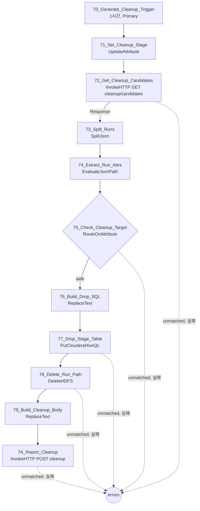

| ID | Processor | Scheduling | 주요 Properties | Relationship |
|---|---|---|---|---|
| 70 | `GenerateFlowFile` | Primary Node, 1시간 | 빈 JSON 하나 | success→71 |
| 71 | `UpdateAttribute` | All Nodes, 1 | `load.stage=CLEANUP`, `cleanup.path.prefix=#{HDFS.STAGE.ROOT}/#{JOB.KEY}/run_id=`, `cleanup.table.prefix=#{HIVE.STAGE.TABLE.PREFIX}` | success→72 |
| 72 | `InvokeHTTP` | All Nodes, 1 | `GET /cleanup/candidates?jobKey=#{JOB.KEY}&limit=#{CLEANUP.BATCH}`, 응답을 content로 | Response→73, No Retry/Retry/Failure→`errors` |
| 73 | `SplitJson` | All Nodes, 1 | `$.runs` | split→74 |
| 74 | `EvaluateJsonPath` | All Nodes, 1 | `load.run.id`, `load.hdfs.path`, `load.stage.table` | matched→75 |
| 75 | `RouteOnAttribute` | All Nodes, 1 | run ID가 UUID, `load.hdfs.path`가 `cleanup.path.prefix` + run ID와 정확히 같음, table 이름이 `^[a-z0-9_]+$`이고 접두사로 시작 | safe→76, unmatched→`errors` |
| 76 | `ReplaceText` | All Nodes, 1 | `DROP TABLE IF EXISTS #{HIVE.STAGE.DB}.${load.stage.table}` | success→77 |
| 77 | `PutClouderaHiveQL` | All Nodes, 1 | `CS_HIVE3_DBCP`, `retry` 재시도 3회 | success→78, failure/retry→`errors` |
| 78 | `DeleteHDFS` | All Nodes, 1 | Path=`${load.hdfs.path}`, Recursive=true, `failure` 재시도 3회 | success→79, failure→`errors` |
| 79 | `ReplaceText` | All Nodes, 1 | 본문 `{"droppedTable":"...","deletedPath":"..."}` | success→7A |
| 7A | `InvokeHTTP` | All Nodes, 1 | `POST /runs/${load.run.id}/cleanup` | Original→종료, No Retry/Retry/Failure→`errors` |

- **대상 판정(API)**: `cleaned_at IS NULL`이고 끝난 시각(`completed_at`)이 보존 기간을 지난 run. `SUCCESS`는 `cleanup.success_retention`(기본 3일), 실패 상태(`FAILED_*`)와 `TIMED_OUT`은 `cleanup.failed_retention`(기본 14일)이다. 진행 중인 run과 `PUBLISH_UNKNOWN`(운영자 확정 전)은 대상이 아니다. `POST /cleanup`도 같은 조건을 다시 확인해 대상이 아니면 409 `CLEANUP_NOT_DUE`로 거부한다.
- **삭제 범위 고정(75)**: `DeleteHDFS`는 경로 패턴(glob)도 받으므로 API 응답을 그대로 믿지 않는다. 지울 경로가 `#{HDFS.STAGE.ROOT}/#{JOB.KEY}/run_id=<run ID>`와 정확히 같을 때만 진행한다. NiFi는 EL 문자열 리터럴 안의 Parameter 참조(`literal('#{X}')`)를 치환하지 않으므로 비교할 값을 71에서 attribute로 만든다.
- **순서와 멱등성**: staging은 external table이라 DROP해도 파일이 남는다. 그래서 77(DROP) 뒤 78(경로 삭제)을 한다. `DROP TABLE IF EXISTS`와 없는 경로의 `DeleteHDFS`는 모두 성공으로 끝나므로, 중간에 실패해도 다음 주기에 같은 run을 처음부터 다시 처리하면 된다. target은 `INSERT OVERWRITE`로 복사된 별도 파일이므로 staging을 지워도 영향이 없다.
- **실패**: `load.stage=CLEANUP` 오류는 PG-90이 이벤트(`CLEANUP_FAILED`, 경로·table 이름 포함)만 남긴다. run 상태는 바꾸지 않는다. 75에서 거부된 run(예: `HDFS.STAGE.ROOT`를 바꾸기 전 run)은 매 주기 다시 거부되므로, 운영자가 경로를 직접 지우고 operator 토큰으로 `POST /runs/{id}/cleanup`을 호출해 기록한다.
- 정리 기록은 API가 `cleaned_at`과 `RUN_CLEANED` 이벤트로 남긴다.

---

## 14. PG-90 Error and Event

모든 자식 PG의 `errors` Output Port가 PG-90의 Input Port 하나로 모인다. PG-90은 오류를 정규화하고, 상태 보고가 필요한 오류는 Load Control API에 실패를 보고한 뒤, `load_event`와 로그를 남긴다.

### 14.1 Processor 흐름

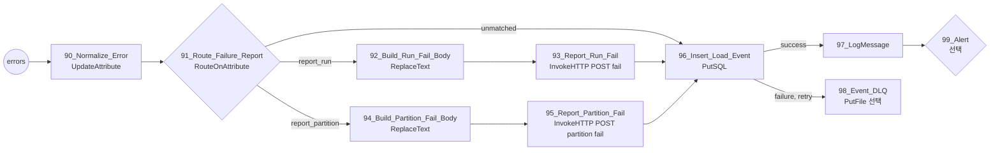

업무 상태를 바꾸는 기록(`load_run`, `load_partition`, `load_file`, `load_validation`, `load_dispatch`)은 각 PG가 API를 동기적으로 호출해 처리하고, 상태 전이 이벤트는 API가 같은 트랜잭션에서 `load_event`에 기록한다. PG-90은 NiFi Processor 오류만 기록한다. 이벤트 DB 장애가 FlowFile을 무한 정지시키지 않도록 96의 실패는 로컬 DLQ 또는 운영 Kafka로 보낸다.

### 14.2 주요 Processor 설정

| ID | Processor | Scheduling | 주요 Properties | Relationship |
|---|---|---|---|---|
| 90 | `UpdateAttribute` | All Nodes, 2~4 | `error.stage`, `error.code`, `error.class`, `error.message`, `error.level`, `error.event`, `load.fail.expected`, `load.fail.status`를 아래 규칙으로 계산 | success→91 |
| 91 | `RouteOnAttribute` | All Nodes, 2~4 | `report_run`, `report_partition`(아래 규칙) | report_run→92, report_partition→94, unmatched→96 |
| 92 | `ReplaceText` | All Nodes, 2~4 | 본문 `{"expectedStatus":"${load.fail.expected}","failStatus":"${load.fail.status}","errorStage":"${error.stage}","errorCode":"${error.code}","message":"<escapeJson한 error.message>"}` | success→93 |
| 93 | `InvokeHTTP` | All Nodes, 2~4 | `POST /runs/${load.run.id}/fail`, 9.2 공통 설정 | 모든 relationship→96 |
| 94 | `ReplaceText` | All Nodes, 2~4 | 본문 `{"claimToken":"${partition.claim.token}","errorStage":"${error.stage}","errorClass":"${error.class}","errorCode":"${error.code}","message":"<escapeJson한 error.message>"}` | success→95 |
| 95 | `InvokeHTTP` | All Nodes, 2~4 | `POST /runs/${load.run.id}/partitions/${partition.id}/fail`, 9.2 공통 설정 | 모든 relationship→96 |
| 96 | `PutSQL` | All Nodes, 2~4 | `CS_DBCP_META`, `load_event` INSERT(14.3), Batch=1, Support Fragmented Transactions=false | success→97, failure/retry→98 |
| 97 | `LogMessage` | All Nodes, 2~4 | Prefix=`SQOOP_REPLACEMENT`, Level=`${error.level:toLower()}`, 구조화 JSON(14.5) | success→99 또는 auto-terminate |
| 98 | `PutFile` 또는 운영 Kafka Publisher (선택) | All Nodes, 1~2 | 복구 가능한 DLQ 경로 또는 topic | success→auto-terminate, failure→Bulletin |
| 99 | 알림 Processor (선택) | All Nodes, 1 | ERROR 수준을 조직 알림으로 전달. API 이벤트 기반 알림이 있으면 두지 않는다 | auto-terminate |

**90 오류 정규화 규칙.** 같은 `UpdateAttribute` 안에서는 방금 만든 값을 참조할 수 없으므로(2.1 규칙 6), 식마다 원천 attribute를 직접 쓴다.

| 속성 | 규칙 |
|---|---|
| `error.stage` | `${load.stage}`. 없으면 `CONTROL_RECEIVER` |
| `error.code` | 409이면 응답 본문의 `$.code`(`DUPLICATE_ACTIVE_RUN`, `CLAIM_MISMATCH`, `CHUNK_CONFLICT` 등) → 그 밖의 3xx~5xx이면 `HTTP_<code>` → `invokehttp.java.exception.class`가 있으면 `API_UNREACHABLE` → `executesql.error.message`에 `ORA-nnnnn`이 있으면 그 코드, 없으면 `SQL_ERROR` → 그 밖에는 `<stage>_FAILED` |
| `error.level` | 409이면 `WARN`(정상 경합, 9.3), 그 밖에는 `ERROR` |
| `error.event` | 409이면 응답 본문의 `$.code`, 그 밖에는 `<stage>_FAILED` |
| `error.class` | 연결 예외면 `TRANSIENT`, 4xx면 `VALIDATION`, 그 밖에는 `NON_RETRYABLE` |
| `error.message` | 3xx~5xx이면 `invokehttp.response.body`, 없으면 `api.response`(9.3) → `executesql.error.message` → `invokehttp.java.exception.message` → 고정 문구 `processor routed failure; see bulletin and provenance` |
| `load.fail.expected`, `load.fail.status` | 아래 표 |

상태 코드는 3xx~5xx만 본다. 2xx는 앞 단계 API 호출이 성공한 흔적으로 FlowFile에 남아 있을 뿐이기 때문이다. `error.level`과 `error.event`를 90에서 미리 정하는 이유는 93·95의 실패 보고 호출이 `invokehttp.status.code`를 덮어쓰기 때문이다. 재발행 뒤 이전 시도의 chunk 보고가 늦게 도착하면 API가 409 `CLAIM_MISMATCH`로 거부하는데, 이는 정상 경합이므로 WARN으로 남는다(NiFi 2.4.0 PoC에서 확인). PutHDFS처럼 오류 attribute를 남기지 않는 Processor의 실패는 `load.stage`로만 식별되므로(예: `CHUNK_WRITE_FAILED`), 상세 원인은 NiFi Bulletin과 Provenance에서 `run_id`, `partition_id`로 찾는다.

**91 실패 보고 규칙.**

| `load.stage` | 보고 | `expectedStatus` → `failStatus` | 조건 |
|---|---|---|---|
| `RUN_CREATE` | 없음(이벤트만) | - | run이 만들어지지 않았다 |
| `MANIFEST` | `report_run` | `CREATED` → `FAILED_MANIFEST` | `load.run.id`가 있고, manifest 422가 아님(422면 API가 이미 기록) |
| `EXTRACT`, `CHUNK_WRITE` | `report_partition` | partition `FAILED`, run `FAILED_EXTRACT` | `api.response`의 `claimed=true`(claim에 성공한 파티션) |
| `VALIDATION_START` | 없음(이벤트만) | - | API가 ACK timeout 뒤 다시 보낸다 |
| `STAGE_VALIDATION` | `report_run` | `STAGE_VALIDATING` → `FAILED_STAGE_VALIDATION` | |
| `PUBLISH` | 없음(이벤트만) | - | PG-50이 `publish/result`로 직접 보고한다(11.2) |
| `TARGET_VALIDATION` | `report_run` | `PUBLISHED` → `FAILED_TARGET_VALIDATION` | |

claim 응답 이후 chunk 보고 전까지 `api.response`는 claim 응답으로 남아 있다. 그래서 `claimed=true` 조건으로 "이 Worker가 소유한 파티션의 실패"만 보고한다. 93·95의 결과와 무관하게 96에서 이벤트를 기록한다. 보고 자체가 실패하면 run은 API sweeper가 timeout으로 정리한다.

### 14.3 PostgreSQL 이벤트 기록

테이블은 4.1의 `nifi_ops.load_event` DDL을 사용한다. 96은 SQL Statement 속성에 EL로 값을 넣는다. 문자열은 작은따옴표를 두 개로 바꾸고 줄바꿈을 제거하며 1,500자로 자른다. 값은 모두 NiFi 내부 attribute에서 오며 업무 데이터나 외부 입력 원문은 넣지 않는다. 운영 표준이 prepared statement라면 90에서 `sql.args.N.type/value`를 함께 만들고 `?` 자리표시자를 쓴다.

```sql
INSERT INTO nifi_ops.load_event (
    event_id, event_level, event_name, run_id, job_key, business_key,
    partition_id, chunk_index, process_group, node_id,
    error_class, error_code, message
) VALUES (
    gen_random_uuid(),
    '${error.level}', '${error.event}',
    CAST(NULLIF('${load.run.id}', '') AS uuid),
    COALESCE(NULLIF('${load.job.key}', ''), '#{JOB.KEY}'),
    NULLIF('${load.business.key}', ''), NULLIF('${partition.id}', ''),
    CAST(NULLIF('${chunk.index}', '') AS integer),
    'JOB_ORACLE_INSP_DTL_DAILY', '${hostname(true)}',
    NULLIF('${error.class}', ''), NULLIF('${error.code}', ''),
    NULLIF('<정리한 error.message>', '')
);
```

`job_key`의 `'#{JOB.KEY}'`는 EL 밖에 있으므로 Parameter가 치환된다. 이벤트 INSERT 실패는 main flow 상태를 되돌리지 않는다.

### 14.4 필수 이벤트

| Level | Event | 기록 시점 | 기록 주체 |
|---|---|---|---|
| INFO | `RUN_STARTED` | run 생성(active lock 획득) | API |
| WARN | `DUPLICATE_ACTIVE_RUN` | 같은 업무키 활성 run 존재(409) | NiFi PG-90 |
| WARN | `CLAIM_MISMATCH`, `CHUNK_CONFLICT` | 재발행 등으로 claim token이 바뀐 뒤 이전 시도의 보고(409) | NiFi PG-90 |
| INFO | `MANIFEST_CREATED` | SCN·metric 저장, manifest 등록 | API |
| ERROR | `MANIFEST_INVALID` | 불변식 위반, `FAILED_MANIFEST` | API |
| INFO | `PARTITION_STARTED` | claim 성공 | API |
| INFO | `PARTITION_SUCCESS` | 파티션 row/file 판정 성공 | API |
| ERROR | `PARTITION_FAILED` | 실패 보고, row 수 불일치 | API |
| INFO | `EXTRACT_VALIDATED` | 전체 파티션 판정 성공, 검증 호출 예약 | API |
| ERROR | `DISPATCH_DEAD` | 검증·재발행 호출 최대 시도 초과 | API |
| INFO | `STAGE_VALIDATION_STARTED` | `/validation/start` CAS 성공 | API |
| INFO | `STAGE_VALIDATED` | external table 검증 성공 | API |
| INFO | `PUBLISH_STARTED` | publish CAS 획득 | API |
| ERROR | `PUBLISH_UNKNOWN` | 결과 불명 보고 또는 sweeper 판정 | API |
| INFO | `RUN_SUCCESS` | target 검증 완료 | API |
| ERROR | `RUN_FAILED` | 최종 실패 확정 | API |
| ERROR | `RUN_TIMED_OUT` | sweeper timeout | API |
| WARN | `RECOVERY_REISSUED` | stale partition 재발행 | API |
| ERROR | `<STAGE>_FAILED` | NiFi Processor 실패. `error_code`에 `HTTP_<code>`, `API_UNREACHABLE`, `ORA-nnnnn`, `<STAGE>_FAILED` 등 | NiFi PG-90 |

NiFi는 상태 전이 이벤트를 다시 기록하지 않는다. NiFi에서도 기록하면 `EXTRACT_VALIDATED`, `STAGE_VALIDATION_STARTED` 같은 이벤트가 API와 NiFi 양쪽에 중복으로 남는다. 같은 실패가 API의 `PARTITION_FAILED`/`RUN_FAILED`와 NiFi의 `<STAGE>_FAILED`로 함께 남는 것은 의도한 것이다. 전자는 상태, 후자는 Processor 오류 상세다.

### 14.5 `LogMessage` 형식

```text
Log Prefix  = SQOOP_REPLACEMENT
Log Level   = ${error.level:toLower()}
Log Message = {"stage":"${error.stage}","code":"${error.code}","class":"${error.class}",
 "run_id":"${load.run.id}","job_key":"${load.job.key}","business_key":"${load.business.key}",
 "partition_id":"${partition.id}","message":"<escapeJson한 error.message>"}
```

`error.message`는 줄바꿈 제거, 길이 제한 및 비밀값 마스킹 후 기록한다. SQL 본문 전체, JDBC URL의 credential, 원천 행 데이터는 로그에 기록하지 않는다.

---

## 15. Connection과 Back Pressure

| Connection | Object threshold | Data threshold | 기타 |
|---|---:|---:|---|
| PG-10 `partitions` → PG-20 | `2 × 전체 worker 수` 이상 | 제어 FlowFile이므로 100 MB | Round Robin |
| PG-20 34 → 35~37 | 100~500 | HDFS 지연을 견디되 repository 용량의 20% 이하 | Oldest First |
| PG-20 37 → 38 → 39 | 1,000 | 100 MB | PutHDFS 후 content를 보고 JSON으로 바꾸므로 작음 |
| PG-05 → Job PG `validate-in`, `reissue-in` | active run 수 × 2 | 10 MB | 검증·재발행 요청 |
| 각 PG `errors` → PG-90 | 10,000 | 1 GB | 오류 폭주 시에도 main flow를 막지 않도록 넉넉히 |

relationship 재시도 중인 FlowFile은 penalty 상태로 **해당 Processor의 입력 Connection**에 남는다. 별도의 retry loop Connection이 없으므로, 입력 Connection의 threshold에 재시도 대기분을 포함해 산정한다. 예를 들어 API가 내려가 있으면 39의 입력 Connection에 보고 대기 FlowFile이 쌓이고, threshold에 도달하면 37(PutHDFS)이 멈춘다.

정확한 값은 평균 FlowFile 크기, Content Repository 용량, 동시 run 수로 산정한다. Back Pressure가 걸렸는데 Coordinator가 새 run을 계속 생성하지 않도록 활성 run lock을 유지한다.

### 15.1 `PutSQL` 사용 범위

NiFi의 `PutSQL`은 PG-90의 `load_event` INSERT(96)에만 쓴다. 원장 쓰기는 모두 API 호출이므로 가이드 초안의 manifest 행별 INSERT(Fragmented=true)와 그로 인한 livelock 문제는 생기지 않는다.

`SplitJson`이나 `ExecuteSQLRecord`가 만든 FlowFile에는 `fragment.identifier/count/index`가 남아 있다. 오류 FlowFile이 이 attribute를 가진 채 96에 들어오면 `PutSQL`이 fragment가 모두 모일 때까지 기다릴 수 있다. 따라서 96은 `Support Fragmented Transactions=false`를 반드시 명시한다. NiFi 2.4.0 PoC에서 Fragmented=true인 `PutSQL`이 일부 fragment만 poll되면 FlowFile을 penalize해 되돌리고, Penalty Duration이 0보다 크면 livelock이 생기는 것을 재현했다.

---

## 16. Retry 분류

| 분류 | 예 | 동작 |
|---|---|---|
| API 일시 장애 | 5xx, 연결 실패, timeout | `InvokeHTTP` relationship 재시도(Retry, Failure). 소진 시 `errors` → PG-90, run은 API sweeper가 정리 |
| API 거부 | 409, 404, 422 | 재시도하지 않음(No Retry → `errors`). 409는 정상 경합(WARN), 404/422는 설정·입력 오류(ERROR) |
| HDFS 일시 장애 | 일시 HDFS unavailable | `PutHDFS` relationship 재시도(failure). 소진 시 파티션 실패 |
| 원천 SQL 오류 | connection reset, `ORA-01555`, ORA-00942, 문법/권한 오류 | 재시도하지 않음. 즉시 파티션 실패 보고 후 run 실패, 새 `run_id`로 재실행 |
| 데이터 | schema 변환 실패, expected/actual mismatch | 즉시 실패 및 파일 격리 |
| 게시 불명 | Hive timeout, connection loss after submit | 재시도하지 않음. `PUBLISH_UNKNOWN`, 자동 overwrite 재실행 금지 |

relationship 재시도 설정(Processor 설정의 Relationships 탭):

```text
Retry Count           = 기준값(InvokeHTTP: CONTROL.API.RETRY.MAX, PutHDFS: PARTITION.RETRY.MAX)
Retried Relationships = InvokeHTTP: Retry, Failure / PutHDFS: failure
Backoff Policy        = Penalize FlowFile
Max Backoff Period    = 1 min
Penalty Duration      = 5 sec (Scheduling 탭)
```

재시도는 같은 FlowFile을 같은 Processor가 다시 처리하는 방식이다. penalty가 시도마다 두 배로 늘어 Max Backoff Period에서 멈춘다. 재시도를 다 쓰면 FlowFile은 해당 relationship의 Connection(`errors`)으로 간다. `RetryFlowFile`과 달리 재시도 횟수 attribute가 남지 않고 Processor도 늘지 않는다. 대신 오류 종류에 따라 재시도 여부를 나눌 수 없다. 그래서 다음 Processor는 재시도를 켜지 않는다.

- 파티션 쿼리(PG-20 34): `ORA-01555`나 권한 오류처럼 같은 SCN으로 다시 해도 실패할 오류까지 재시도하면, 긴 쿼리를 그만큼 반복한 뒤에야 실패가 확정된다. 일시 오류로 run 하나가 실패하는 비용이 더 작다고 보고 재시도하지 않는다. 일시 오류 재시도가 꼭 필요하면 34의 failure를 `RouteOnAttribute`(오류 코드 분류)와 `RetryFlowFile`로 보내는 가이드 초안 방식을 이 Processor에만 쓴다. NiFi 2.4.0 PostgreSQL PoC는 원천이 짧은 쿼리라 Retry Count 3으로 시험했다.
- Hive 게시(PG-50 55): 자동 재실행이 결과 불명 게시를 반복하기 때문이다(11.2).

---

## 17. 상태 변경과 게시 안전장치

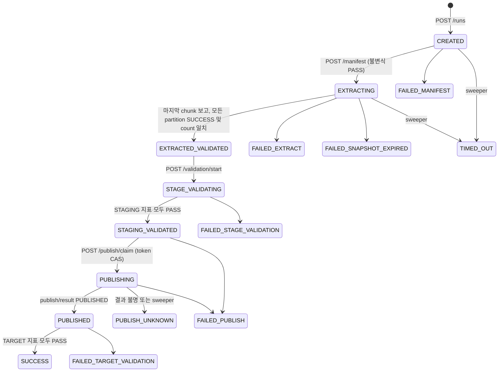

모든 상태 변경은 API가 `WHERE run_id = :run_id AND status = <expected>` 조건의 `UPDATE ... RETURNING`으로 실행하고, 반환 행 수로 성공 여부를 판단한다. 중복 게시는 다음이 함께 막는다.

- active run partial unique index: 같은 업무키의 동시 run 차단
- run 행 잠금 + run 완료 CAS + `uq_load_dispatch_validate`: 검증 호출 예약 1회
- `STAGE_VALIDATING` CAS: 검증 flow 실행 1회
- publish token CAS: `INSERT OVERWRITE` 실행 1회

NiFi의 Primary Node 실행 제한에 의존하지 않는다. PG-40~60은 All Nodes에서 실행된다(2장).

### 17.1 CAS 결과 확인

가이드 초안에서는 NiFi `PutSQL`이 UPDATE 영향 행 수가 0이어도 `success`로 보내는 문제 때문에 CAS 결과를 별도로 확인해야 했다. 이제 CAS는 API 내부 코드가 반환 행으로 확인하고, NiFi에는 결과(`claimed`, `started`, `stageValidated`, `success`)만 돌려준다. NiFi는 이 boolean으로 분기한다.

| 전이 | API 엔드포인트 | NiFi 분기 attribute |
|---|---|---|
| partition `PENDING/RETRY → RUNNING` | `POST .../claim` | `$.claimed` |
| partition `RUNNING → SUCCESS`, run `EXTRACTING → EXTRACTED_VALIDATED` | `POST .../chunks` | 분기 없음(로그만) |
| run `EXTRACTED_VALIDATED → STAGE_VALIDATING` | `POST /validation/start` | `$.started` |
| run `STAGE_VALIDATING → STAGING_VALIDATED` | `POST /stage-validated` | `$.stageValidated` |
| run `STAGING_VALIDATED → PUBLISHING` | `POST /publish/claim` | `$.claimed` |
| run `PUBLISHING → PUBLISHED` | `POST /publish/result` | 2xx 여부 |
| run `PUBLISHED → SUCCESS` | `POST /success` | `$.success` |

API 쪽 구현과 동시성 테스트는 API 설계 9.5~9.6, 11장을 따른다.

---

## 18. NiFi 운영 설정

- Canvas: Job PG 아래 자식 PG와 Port로 구성한다(2장). Job PG와 자식 PG 모두에 `PC_JOB_<JOB_NAME>`을 지정하고, Controller Service는 Job PG에 둔다
- 배포: Trigger(PG-00 00)는 DISABLED로 배포하고 Job PG를 시작한 뒤 운영 전환 시점에 enable한다. 참조 빌더는 `poc/build_flow_v3.py`
- Trigger, Coordinator: `Run Schedule=0 sec` 또는 입력 기반, `Concurrent Tasks=1`, `Execution=Primary Node`
- Worker: `Execution=All Nodes`, 입력 Connection Round Robin
- Control Receiver와 검증·게시 flow: `Execution=All Nodes`, `Concurrent Tasks=1`. 중복 방지는 API CAS가 담당
- DB pool 상한: `노드 수 × worker concurrent tasks + control 여유`가 Oracle 승인 세션 수를 넘지 않게 설정
- `InvokeHTTP` 동시 호출 수: `노드 수 × worker concurrent tasks`가 API 처리 용량과 관리 DB 연결 수 안에 들도록 API 인스턴스 수를 정한다(API 설계 9.10)
- Processor `Yield Duration`: DB/HDFS/API failure 폭주 방지를 위해 10~30초부터 시험
- relationship 재시도(Retry Count, Retried Relationships, Backoff)는 16장 기준으로 Processor마다 설정한다. Retry Count는 Parameter를 참조할 수 없으므로 배포 스크립트가 정수로 넣는다
- Provenance: run/partition/chunk 상관 분석이 가능한 기간 유지. API 로그와 `X-Request-Id`, `run_id`로 대조
- Bulletin: ERROR/WARN 수집을 모니터링 시스템에 연계
- Parameter Context 변경 권한과 NiFi Policy를 운영자/개발자로 분리
- 민감 Parameter(`CONTROL.API.AUTHORIZATION`, DB 암호)는 빌더 config 파일(권한 `600`, 저장소 밖)에만 둔다. `InvokeHTTP`의 `Authorization`은 Sensitive 동적 속성으로 설정
- Flow는 빌더(`poc/build_flow_v4.py`)를 환경별 config 파일로 실행해 만든다. 빌더와 Load Control API 계약(엔드포인트, 필드)을 같은 저장소에서 함께 버전 관리한다

---

## 19. 구현 및 검증 순서

1. 관리 테이블(Alembic baseline)과 Load Control API 골격, 판정 트랜잭션, 동시성 테스트를 먼저 구현한다(API 설계 12장).
2. `PARTITION.COUNT=1`, 작은 기준 데이터로 PG-10 → PG-20 → API 보고까지 구현한다.
3. 경계값, NULL, 0건, Oracle 타입을 검증한다.
4. 2/4/8 partition으로 늘려 병렬성, API 응답 시간, run 잠금 대기, DB 부하를 측정한다.
5. outbox dispatcher와 PG-05 Control Receiver를 연결해 검증 flow 호출을 확인한다.
6. external staging DDL과 count/DQ를 구현한다.
7. 비운영 target에서 `INSERT OVERWRITE`와 `PUBLISH_UNKNOWN` 경로를 시험한다.
8. Target validation과 최종 상태를 연결한다.
9. 장애를 주입한다: NiFi 노드 종료, NiFi 재기동, API 인스턴스 종료, API worker 종료, 관리 DB 연결 차단, HDFS 오류, `ORA-01555`, 검증 호출 수신 실패.
10. API sweeper(`recovery.mode=FAIL`)와 보존/정리 flow를 활성화하고, NiFi 계정의 원장 쓰기 권한을 회수한다.

운영 승인 조건:

```text
파티션 하나가 실패하면 검증 flow 호출(dispatch)과 Hive 게시 호출 건수는 0이다.
중복 보고, 동시 완료, API 재기동 후에도 run당 STAGE_VALIDATING 진입과 INSERT OVERWRITE는 각각 1회다.
NiFi 계정으로 load_run/load_partition/load_file/load_validation/load_dispatch를 변경할 수 없다.
API 장애 중 진행된 run은 성공으로 판정되지 않고, 복구 후 정상 판정되거나 TIMED_OUT으로 끝난다.
재발행을 켠 경우 동일 run_id와 snapshot_scn으로만 복구된다.
source = partition sum = staging = target 검증이 모두 PASS인 경우만 SUCCESS이다.
PUBLISH_UNKNOWN은 사람 또는 별도 reconciliation 없이 자동 재실행되지 않는다.
```

---

## 20. 용어집

### 플랫폼과 NiFi 구성요소

| 용어 | 정의 | 이 문서에서의 의미 |
|---|---|---|
| CFM | Cloudera Flow Management | NiFi 2.6.0을 포함하는 목표 플랫폼 버전은 CFM 4.12.0이다. |
| NiFi | Apache NiFi 데이터 흐름 자동화 플랫폼 | Sqoop을 대신하여 Oracle 병렬 조회, HDFS 기록, Hive 검증과 게시를 실행한다. 완료 판정은 하지 않는다. |
| Load Control API | 적재 상태 원장과 완료 판정을 담당하는 FastAPI 서비스 | 유일한 원장 writer. chunk 보고마다 완료를 판정하고 검증 flow를 호출한다. |
| FastAPI | Python 비동기 웹 프레임워크 | Load Control API 구현 프레임워크. `python -m load_control.server`가 uvicorn으로 실행한다. |
| Kylo | NiFi 기반 데이터 레이크 관리 플랫폼 | AS-IS에서 Kylo의 `ImportSqoop` Processor를 사용한다. |
| Sqoop | RDBMS와 Hadoop 간 대량 데이터 전송 도구 | TO-BE에서 제거하며 Mapper의 병렬 실행과 Job 완료 의미를 NiFi로 재구현한다. |
| Job PG | Job 하나의 Flow를 담는 상위 Process Group | 자식 PG(PG-00~90)와 Controller Service를 담고 `PC_JOB_<JOB_NAME>`을 지정한다(2장). |
| Input/Output Port | Process Group 사이에서 FlowFile을 주고받는 연결점 | `start-run`, `partitions`, `errors` 등으로 자식 PG를 연결한다. |
| Relationship 재시도 | Processor 설정의 Retry Count·Retried Relationships·Backoff로 같은 FlowFile을 다시 처리하는 기능 | `RetryFlowFile` 대신 `InvokeHTTP`, `PutHDFS` 재시도에 쓴다(16장). |
| Processor | NiFi Flow의 단일 처리 컴포넌트 | `ExecuteSQLRecord`, `PutHDFS`, `InvokeHTTP`, `HandleHttpRequest` 등이 해당한다. |
| `InvokeHTTP` | HTTP 요청을 보내고 응답으로 분기하는 Processor | NiFi→API 보고와 상태 전이 요청에 사용한다. |
| `HandleHttpRequest`/`HandleHttpResponse` | NiFi에서 HTTP 요청을 받고 응답하는 Processor 쌍 | PG-05가 API의 검증·재발행 호출을 받는다. |
| Process Group | 여러 Processor와 Connection을 묶은 논리 단위 | `PG-10 Coordinator`, `PG-20 Worker`처럼 책임별로 Flow를 분리한다. |
| FlowFile | NiFi에서 content와 attribute를 함께 운반하는 객체 | 데이터 chunk 또는 run/partition 제어 메시지를 전달한다. |
| Content | FlowFile가 가리키는 실제 데이터 | Parquet 데이터, SQL 문장 또는 제어용 JSON이 될 수 있다. |
| Attribute | FlowFile에 연결된 문자열 메타데이터 | `load.run.id`, `partition.id`, `record.count` 등 제어와 상관관계에 사용한다. |
| Connection | Processor 사이에서 FlowFile을 보관하는 Queue | Back Pressure, Prioritizer 및 cluster load balancing을 설정한다. |
| Controller Service | 여러 Processor가 공유하는 연결·직렬화 서비스 | JDBC pool, Record Reader/Writer, SSL Context, HTTP Context Map을 제공한다. |
| Parameter Context | Flow 설정값과 민감정보를 묶어 공급하는 NiFi 기능 | DB URL, table, concurrency, HDFS 경로와 timeout을 환경별로 관리한다. |
| Primary Node | NiFi cluster에서 단일 실행 Processor를 담당하는 선출 노드 | Trigger와 Coordinator가 실행된다. 중복 방지 수단으로 쓰지 않는다. |
| All Nodes | NiFi cluster의 모든 노드에서 실행되는 스케줄링 방식 | PG-20 Worker, PG-05 Control Receiver, PG-40~60이 실행된다. |
| Concurrent Tasks | 한 Processor가 동시에 실행할 수 있는 task 수 | Oracle 동시 JDBC session과 HDFS 쓰기 동시성을 결정한다. |
| Round Robin | FlowFile을 cluster 노드에 순환 분배하는 load balancing 전략 | Coordinator에서 PG-20 Worker로 가는 입력 Connection에만 적용한다. |
| Back Pressure | Queue 크기 또는 데이터량이 임계값에 도달하면 upstream 실행을 억제하는 기능 | HDFS 지연이나 DB 병목이 NiFi repository 고갈로 이어지는 것을 방지한다. |
| Provenance | FlowFile 처리 이력을 기록하는 NiFi 기능 | `run_id/partition_id/chunk_index`로 장애 경로를 추적한다. |
| Bulletin | Processor 또는 Controller Service의 경고·오류 알림 | Processor가 상세 오류 attribute를 제공하지 않을 때 운영 진단에 사용한다. |

### 실행, 분할과 상태 관리

| 용어 | 정의 | 이 문서에서의 의미 |
|---|---|---|
| Job | 반복 실행 가능한 하나의 적재 정의 | 원천·대상·컬럼·조건이 같은 논리 적재이며 `job_key`로 식별한다. |
| `job_key` | 적재 Job의 영구 식별자 | 예: `ORACLE_INSP_DTL_DAILY`; 업무일자와 분리한다. |
| `business_key` | 한 적재가 대상으로 하는 업무 범위 | 업무일자, 기준일 또는 대상 partition 값이다. |
| Run | Job이 한 번 실행된 인스턴스 | 고유한 `run_id`, snapshot SCN과 HDFS 격리 경로를 갖는다. |
| `run_id` | 한 Run을 식별하는 UUID | 모든 FlowFile, PostgreSQL 행, HDFS 경로와 로그의 최상위 상관키다. |
| Partition | 원천 조회를 병렬화하기 위해 나눈 데이터 범위 | `INSP_DTL_SEQ`의 하한 포함·상한 미포함 범위다. |
| `partition_id` | Run 내부 partition 식별자 | `0000`, `0001` 또는 NULL 전용 partition 값이다. |
| Chunk | 한 partition 결과를 파일 크기에 맞춰 나눈 단위 | 하나의 Parquet FlowFile 및 HDFS 파일과 대응한다. |
| Manifest | 처리 대상과 예상 결과를 기록한 영속 목록 | PostgreSQL의 `load_run`, `load_partition`, `load_file`이 완료 판정의 원장이며 API만 쓴다. |
| Control plane | 실행 상태와 완료·게시 결정을 관리하는 영역 | Load Control API(판정, outbox, sweeper)와 PostgreSQL Manifest가 해당한다. |
| Data plane | 실제 데이터를 읽고 변환하고 쓰는 영역 | Oracle 조회, Parquet 변환과 HDFS 기록이 해당한다. |
| Claim token | Worker가 partition 처리 소유권을 얻을 때 사용하는 UUID | API `POST .../claim`이 중복 Worker 실행을 막고, chunk 보고의 소유권 확인에도 쓴다. |
| Publish token | 최종 게시 소유권을 식별하는 UUID | API `POST /publish/claim`이 하나의 FlowFile만 `INSERT OVERWRITE`하게 한다. |
| CAS | Compare-And-Set; 기대 상태일 때만 값을 변경하는 방식 | `WHERE status='STAGING_VALIDATED'` 같은 조건부 UPDATE로 중복 상태 전이를 막는다. |
| Active Run Lock | 동일 Job과 업무키의 동시 실행을 막는 제약 | PostgreSQL partial unique index로 구현한다. |
| Heartbeat | 실행 중인 Run/Partition이 살아 있음을 나타내는 갱신 시각 | claim과 chunk 보고 때 API가 갱신하며, sweeper가 stale 작업을 판정하는 기준이다. |
| Stale | 일정 시간 heartbeat가 갱신되지 않은 상태 | 기본은 run `TIMED_OUT`. 재발행을 켜면 동일 SCN으로 claim을 회수해 재발행한다. |

### 데이터베이스와 저장소

| 용어 | 정의 | 이 문서에서의 의미 |
|---|---|---|
| SCN | Oracle System Change Number | 병렬 쿼리가 동일한 시점의 데이터를 읽도록 Run 시작 시 고정한다. |
| Flashback Query | 과거 SCN 또는 timestamp의 Oracle 데이터를 조회하는 기능 | 모든 source metric과 partition query에 동일한 `AS OF SCN`을 사용한다. |
| `ORA-01555` | 필요한 UNDO가 사라져 과거 snapshot을 읽을 수 없는 Oracle 오류 | 동일 Run의 부분 재시도를 금지하고 새 `run_id/SCN`으로 전체 재실행한다. |
| JDBC | Java Database Connectivity | NiFi가 Oracle, PostgreSQL 및 HiveServer2와 통신하는 인터페이스다. |
| Connection Pool | DB Connection을 재사용하고 동시 접속 수를 제한하는 서비스 | `CS_DBCP_ORACLE`, `CS_DBCP_META`, `CS_HIVE3_DBCP`로 구분한다. |
| Fetch Size | JDBC가 한 번에 가져오는 row 수에 대한 힌트 | Oracle 왕복 횟수와 NiFi memory 사용량을 조정한다. |
| HDFS | Hadoop Distributed File System | Oracle 추출 결과 Parquet와 `_SUCCESS` marker를 저장한다. |
| Simple Authentication | Kerberos 없이 OS 사용자명 기반으로 동작하는 Hadoop 인증 방식 | 이 프로젝트의 HDFS 인증 방식이다. HDFS 권한 검사는 하지 않는다. |
| Effective User | HDFS가 요청 주체로 인식하는 사용자 | 비-Ker버 환경에서는 일반적으로 NiFi 프로세스 OS 사용자다. |
| Parquet | 컬럼 기반 파일 형식 | Oracle 추출 결과의 기본 HDFS 저장 형식이다. |
| Staging | 최종 게시 전 데이터를 격리하고 검증하는 임시 영역 | `run_id`별 HDFS 경로와 Hive external table로 구성한다. |
| External Table | 데이터 파일은 외부 경로에 두고 Hive가 metadata만 관리하는 테이블 | 검증 단계에서 해당 Run의 HDFS 경로만 참조한다. |
| Target Table | 사용자가 조회하는 최종 Hive 테이블 | 모든 사전 검증을 통과한 후에만 변경한다. |
| `INSERT OVERWRITE` | 대상 테이블 또는 partition의 기존 데이터를 새 결과로 교체하는 Hive DML | Publish token을 소유한 단일 FlowFile만 실행한다. |
| `_SUCCESS` | 데이터 쓰기 완료를 표시하는 빈 marker 파일 | 모든 partition과 file 검증이 끝난 후에만 Run root에 생성한다. |
| Write and Rename | 임시 파일을 완전히 쓴 뒤 최종 파일명으로 rename하는 방식 | 독자가 부분 파일을 읽는 것을 방지하는 PutHDFS 설정이다. |
| UPSERT | 행이 없으면 INSERT, 있으면 UPDATE하는 쓰기 방식 | 동일 chunk 재시도 시 `load_file`을 멱등하게 기록한다. |

### 완료 판정, 검증과 장애 처리

| 용어 | 정의 | 이 문서에서의 의미 |
|---|---|---|
| Barrier/Gate | 여러 병렬 작업이 모두 특정 상태에 도달할 때까지 다음 단계를 막는 장치 | API가 chunk 보고마다 Chunk→Partition→Run 순서로 판정한다. NiFi에는 대기 단계가 없다. |
| Outbox | 상태 변경과 같은 트랜잭션에 외부 호출 요청을 기록하는 패턴 | `load_dispatch`. run 완료와 검증 호출 예약을 원자적으로 묶는다. |
| Dispatch | outbox에 기록된 NiFi 호출 한 건 | `PENDING → SENT → ACKED`. 최대 시도 초과 시 `DEAD`. |
| Dispatcher | outbox를 읽어 NiFi로 전달하는 API worker 작업 | `LISTEN/NOTIFY`로 깨어나고 lease로 행을 선점한다. |
| Lease | 처리 중인 행을 일정 시간 다른 worker가 가져가지 못하게 하는 선점 방식 | dispatcher가 전송 동안 DB 트랜잭션을 열지 않게 한다. |
| Sweeper | stale·timeout 상태를 주기적으로 정리하는 API worker 작업 | 가이드 초안의 Recovery Monitor를 대체한다. |
| `Wait`/`Notify` | NiFi cache 기반 신호 대기 Processor | 가이드 초안에서 완료 wake-up에 썼으나 현재 설계에서는 쓰지 않는다. |
| Fragment | 한 ResultSet 또는 Record 묶음에서 파생된 FlowFile 집합 | `fragment.identifier/count/index`로 chunk의 소속과 순서를 식별한다. |
| `record.count` | Record Writer가 FlowFile에 기록한 row 수 | file manifest와 partition 실제 건수 합산에 사용한다. |
| DQ | Data Quality | count, schema, NULL, 중복, min/max, 업무 합계 및 hash 검증을 뜻한다. |
| Reconciliation | 서로 다른 처리 단계의 지표를 대조하는 작업 | Source=Partition 합계=Staging=Target인지 검증한다. |
| Idempotency | 같은 요청을 반복해도 최종 결과가 한 번 실행한 것과 같은 성질 | 결정적 HDFS 경로, file UPSERT, 같은 token 재요청 허용, CAS 상태 전이로 확보한다. 모든 API 상태 변경 호출의 전제다. |
| Retryable/Transient Error | 시간이 지나면 성공할 가능성이 있는 일시 오류 | connection reset, 일시적 HDFS 장애 등에 제한 재시도를 적용한다. |
| Non-retryable Error | 동일 입력으로 반복해도 해결되지 않는 오류 | SQL 문법, 권한, schema, 검증 오류와 `ORA-01555`가 해당한다. |
| Backoff | 재시도 사이의 대기시간을 점차 늘리는 방식 | DB/HDFS 장애 시 과도한 반복 호출을 막는다. |
| DLQ | Dead Letter Queue | PostgreSQL event 기록에 실패한 JSON 로그를 복구 가능하게 보관한다. |
| `PUBLISH_UNKNOWN` | Hive 게시 요청의 성공 여부를 확정할 수 없는 Run 상태 | timeout 후 자동 overwrite 재실행을 금지하고 target과 Hive 이력을 확인한다. |
| `FAILED_TARGET_VALIDATION` | 게시 후 Target 검증이 실패한 상태 | 자동 재추출·재게시하지 않고 중대 운영 오류로 처리한다. |
| `STAGE_VALIDATING` | 검증 flow가 시작된 Run 상태 | `/validation/start` CAS로 진입하며, 중복 검증 호출을 걸러 낸다. |

---

## 21. Processor 지원 근거

- CFM 4.12.0 supported processors: https://docs.cloudera.com/cfm/4.12.0/release-notes/topics/cfm-supported-processors.html
- `ExecuteSQLRecord`: https://nifi.apache.org/components/org.apache.nifi.processors.standard.ExecuteSQLRecord/
- `PutSQL`: https://nifi.apache.org/components/org.apache.nifi.processors.standard.PutSQL/
- `InvokeHTTP`: https://nifi.apache.org/components/org.apache.nifi.processors.standard.InvokeHTTP/
- `HandleHttpRequest`: https://nifi.apache.org/components/org.apache.nifi.processors.standard.HandleHttpRequest/
- `HandleHttpResponse`: https://nifi.apache.org/components/org.apache.nifi.processors.standard.HandleHttpResponse/
- `ReplaceText`: https://nifi.apache.org/components/org.apache.nifi.processors.standard.ReplaceText/
- `JoltTransformJSON`: https://nifi.apache.org/components/org.apache.nifi.processors.jolt.JoltTransformJSON/
- `SplitJson`: https://nifi.apache.org/components/org.apache.nifi.processors.standard.SplitJson/
- FastAPI: https://fastapi.tiangolo.com/
- PostgreSQL `NOTIFY`: https://www.postgresql.org/docs/current/sql-notify.html
- PostgreSQL `SELECT ... FOR UPDATE SKIP LOCKED`: https://www.postgresql.org/docs/current/sql-select.html#SQL-FOR-UPDATE-SHARE
- `PutHDFS`: https://nifi.apache.org/docs/nifi-docs/components/org.apache.nifi/nifi-hadoop-nar/1.28.0/org.apache.nifi.processors.hadoop.PutHDFS/
- Relationship 재시도(Retry Count, Backoff): https://nifi.apache.org/docs/nifi-docs/html/user-guide.html#settings-tab
- `RetryFlowFile`(파티션 쿼리 일시 오류 재시도가 필요한 경우만): https://nifi.apache.org/components/org.apache.nifi.processors.standard.RetryFlowFile/
- `LogMessage`: https://nifi.apache.org/components/org.apache.nifi.processors.standard.LogMessage/
