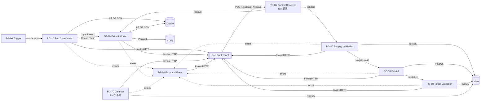

# Flow 설치·운영 매뉴얼

`poc/build_flow_v4.py`로 NiFi Flow를 만들고 실행·확인·복구하는 방법이다. 설계 설명은 [NiFi Flow 설계](../nifi-sqoop-removal-guide.md), 검증 결과는 [VERIFICATION.md](./VERIFICATION.md)에 있다.

## 1. 개요

Oracle 원천을 SCN 하나로 고정해 파티션별로 병렬 추출하고, Hive staging 검증 → `INSERT OVERWRITE` 게시 → target 검증까지 진행해 run을 `SUCCESS`로 끝낸다. 상태 판정은 Load Control API가 한다.



| 항목 | 내용 |
|---|---|
| 필요 NiFi | **Cloudera CFM 4.12**(NiFi 2.6). Hive 구성요소(`ClouderaHiveConnectionPool`, `PutClouderaHiveQL`)가 필요해 Apache NiFi로는 만들 수 없다 |
| 만들어지는 것 | Job PG `JOB_<JOB.KEY>`(자식 PG 8개, Processor 73개)와 root `PG-05 Control Receiver`(모든 Job 공유, Processor 6개) |
| 쓰지 않는 기능 | PG-20 `ValidateRecord`, PG-90 DLQ·알림(선택 항목, [TODO.md](../TODO.md)) |

## 2. 구성

### 2.1 Process Group과 Processor

모든 Processor에는 역할을 설명하는 한글 Comment가, 각 PG에는 흐름을 적은 Label이 있다.

| PG | Processor | 하는 일 |
|---|---|---|
| PG-00 Trigger | 00 ~ 02 | 업무일자(`BUSINESS.KEY`)로 실행을 시작하고 형식을 검사한다. 00은 DISABLED로 만들어진다 |
| PG-10 Run Coordinator | 11 ~ 13 | API에 run을 만든다. 같은 업무일자의 진행 중 run이 있으면 409 |
| | 14 ~ 15 | Oracle SCN을 고정한다 |
| | 16 | 같은 SCN으로 원천 지표와 파티션 범위·예상 건수를 계산한다 |
| | 17 ~ 20 | manifest를 API에 등록하고 실행할 파티션을 하나씩 나눈다 |
| PG-20 Extract Worker | 30 ~ 33 | 파티션 소유권을 claim한다 |
| | 34 | `AS OF SCN`으로 파티션을 조회해 Parquet chunk로 만든다. **재시도하지 않는다** |
| | 35 ~ 36 | run 경로에 `part-<파티션>-<chunk>.parquet`을 쓴다 |
| | 37 ~ 38 | chunk마다 API에 보고한다 |
| PG-05 Control Receiver(root) | 05 ~ 10 | API의 `POST /validate/<JOB.KEY>`, `/reissue/<JOB.KEY>`를 받아 해당 Job PG로 보낸다. 등록되지 않은 Job은 404 |
| PG-40 Staging Validation | 40 ~ 46 | 검증 시작을 API에 알리고(run당 1회) `_SUCCESS`를 쓴다 |
| | 47 ~ 4B | external staging 테이블을 만들고 지표를 계산해 API에 기록한다 |
| | 4C ~ 4E | API 판정이 통과면 PG-50으로 보낸다 |
| PG-50 Publish | 50 ~ 53 | 게시 소유권을 claim한다 |
| | 54 ~ 58 | `INSERT OVERWRITE`(**재시도 없음**)하고 결과를 API에 보고한다 |
| PG-60 Target Validation | 60 ~ 66 | target 지표를 기록하고 `/success`를 요청한다 |
| PG-70 Cleanup | 70 ~ 7A | 보존 기간이 지난 run의 staging 테이블과 HDFS 경로를 지운다 |
| PG-90 Error and Event | 90 ~ 97 | 실패를 오류 코드로 정리하고 API에 보고하고 `load_event`·NiFi 로그에 남긴다 |

### 2.2 결과 위치

```text
HDFS : #{HDFS.STAGE.ROOT}/<JOB.KEY>/run_id=<run_id>/part-<partition_id>-<chunk>.parquet, _SUCCESS
Hive : #{HIVE.STAGE.DB}.<prefix><run_id 하이픈 제거>     (staging, 보존 기간 뒤 삭제)
       #{HIVE.TARGET.DB}.#{HIVE.TARGET.TABLE}             (target, #{TARGET.PARTITION.CLAUSE} 교체)
```

## 3. 사전 준비

### 3.1 NiFi

- 모든 노드의 같은 경로에 ojdbc(`ORACLE.JDBC.DRIVER.PATH`)와 PostgreSQL JDBC(`META.JDBC.DRIVER.PATH`)를 둔다
- `HADOOP.CONF.FILES`로 쓸 `core-site.xml`, `hdfs-site.xml`을 둔다
- `CONTROL.LISTEN.PORT`(PG-05 수신 포트)가 비어 있어야 한다. 모든 노드가 이 포트를 연다. API의 `nifi.receiver_url`은 노드 하나 또는 그 앞의 LB로 둔다
- NiFi JVM 시간대와 Hive `hive.local.time.zone`을 같게 둔다(다르면 시각 지표가 FAIL)

### 3.2 Oracle

```sql
CREATE USER NIFI_READER IDENTIFIED BY <pw>;
GRANT CREATE SESSION TO NIFI_READER;
GRANT SELECT ON APP.INSP_DTL TO NIFI_READER;
GRANT FLASHBACK ON APP.INSP_DTL TO NIFI_READER;     -- AS OF SCN
GRANT SELECT ON SYS.V_$DATABASE TO NIFI_READER;     -- 14 SCN 조회
```

`V$DATABASE` 권한을 줄 수 없으면 14의 SQL을 `SELECT TO_CHAR(DBMS_FLASHBACK.GET_SYSTEM_CHANGE_NUMBER) AS SNAPSHOT_SCN FROM DUAL`로 바꾸고 `DBMS_FLASHBACK` 실행 권한을 준다.

| 확인 항목 | 기준 |
|---|---|
| `UNDO_RETENTION`, undo 크기 | run 최대 소요시간보다 길게. 부족하면 run이 `FAILED_SNAPSHOT_EXPIRED` |
| 인덱스 | `(업무 조건 컬럼, split 컬럼)`. 16과 34가 범위 스캔을 한다 |
| split 컬럼 NULL | 업무 조건 범위에 NULL이 있으면 API가 manifest를 거부한다 |
| 세션 수 | `노드 수 × 34 Concurrent Tasks + 여유 ≤ 승인 세션 수`가 되게 `ORACLE.POOL.MAX`를 정한다 |

### 3.3 Hive

staging·target DB와 target 테이블을 미리 만든다(빌더는 만들지 않는다).

```sql
CREATE DATABASE IF NOT EXISTS stg;
CREATE DATABASE IF NOT EXISTS dw;
CREATE EXTERNAL TABLE dw.insp_dtl (
  INSP_DTL_SEQ DECIMAL(19,0), ITEM_CD STRING, AMOUNT DECIMAL(18,2), REG_TS TIMESTAMP, NOTE STRING)
PARTITIONED BY (base_dt STRING) STORED AS PARQUET TBLPROPERTIES ('external.table.purge'='true');
```

`HIVE.JDBC.URL`에는 `hive.resultset.use.unique.column.names=false`를 반드시 붙인다.

### 3.4 Load Control API

[load-control-api/README.md](../load-control-api/README.md) 순서대로 설치·migration·시작한다. `config/config.yaml`의 `nifi.receiver_url`은 `http://<nifi-host>:<CONTROL.LISTEN.PORT>`. `curl <API>/readyz`가 `{"status":"ok"}`면 준비된 것이다.

## 4. 설정 파일

`poc/config.v4.example.json`을 복사해 값을 채운다. 비밀번호와 토큰이 들어가므로 권한 `600`, 저장소 밖에 둔다.

### 4.1 `names`(보통 생략)

| 키 | 기본값 |
|---|---|
| `process_group` | `JOB_<JOB.KEY>` |
| `job_context` | `PC_JOB_<JOB.KEY>` |
| `common_context` | `PC_SQOOP_REPLACEMENT_COMMON`(모든 Job이 같게) |
| `control_receiver` | `PG-05 Control Receiver` |

### 4.2 `common_params`

| Parameter | 예시 | 의미 |
|---|---|---|
| `CONTROL.API.URL` | `http://api-host:8080/v1` | Load Control API 주소 |
| `CONTROL.API.AUTHORIZATION` | `Bearer <token>` | `Bearer `를 포함한 전체 값 |
| `CONTROL.API.TIMEOUT` | `30 secs` | API 응답 대기 |
| `CONTROL.LISTEN.PORT` | `9443` | PG-05 수신 포트 |
| `CLEANUP.BATCH` | `50` | PG-70이 한 번에 정리할 run 수 |
| `META.JDBC.URL`, `USER`, `PASSWORD`, `DRIVER.PATH` | | 관리 DB(PostgreSQL). `load_event` INSERT 권한이면 된다 |
| `ORACLE.JDBC.URL`, `USER`, `PASSWORD`, `DRIVER.PATH` | `jdbc:oracle:thin:@//host:1521/SERVICE` | 원천 Oracle |
| `ORACLE.POOL.MAX` | `8` | Oracle 최대 연결 수 |
| `ORACLE.NUMBER.DEFAULT.PRECISION`, `SCALE` | `38`, `10` | 정밀도 없는 `NUMBER`의 기본 정밀도. scale을 작게 두면 **오류 없이 반올림**된다 |
| `HADOOP.CONF.FILES` | `/etc/hadoop/conf/core-site.xml,...` | HDFS 설정 파일 |
| `HDFS.STAGE.ROOT` | `/data/nifi/stage` | run 경로의 상위 |
| `HDFS.PERMISSIONS.UMASK` | `027` | 파일 umask |
| `HIVE.JDBC.URL` | `jdbc:hive2://hs2:10000/default?hive.resultset.use.unique.column.names=false` | HiveServer2 |
| `HIVE.JDBC.USER`, `PASSWORD`, `HIVE.POOL.MAX`, `HIVE.QUERY.TIMEOUT` | `nifi`, -, `4`, `1800` | Hive 접속, 연결 수, 문장 timeout(초) |
| `EXTRACT.FETCH.SIZE`, `EXTRACT.ROWS.PER.FILE`, `EXTRACT.QUERY.TIMEOUT` | `5000`, `500000`, `60 min` | 파티션 조회 fetch, chunk 행 수, timeout |

### 4.3 `job_params`

| Parameter | 예시 | 의미 |
|---|---|---|
| `JOB.KEY` | `ORACLE_INSP_DTL_DAILY` | Job 식별자(대문자·숫자·`_`) |
| `BUSINESS.KEY` | `2026-09-28` | 실행할 업무일자 |
| `SRC.OWNER`, `SRC.TABLE` | `APP`, `INSP_DTL` | 원천 테이블 |
| `SRC.COLUMNS` | `INSP_DTL_SEQ, BASE_DT, ITEM_CD, CAST(AMOUNT AS NUMBER(18,2)) AS AMOUNT, REG_TS, NOTE` | 추출 컬럼. 정밀도 없는 `NUMBER`는 CAST |
| `SRC.SPLIT.COLUMN`, `PARTITION.COUNT` | `INSP_DTL_SEQ`, `8` | 분할 컬럼(숫자)과 파티션 수 |
| `SRC.BASE.WHERE` | `BASE_DT = TO_DATE('${load.business.key}', 'YYYY-MM-DD')` | 업무 조건 |
| `ALLOW.EMPTY.SOURCE` | `false` | 원천 0건 허용 여부 |
| `DQ.AMOUNT.COLUMN`, `DQ.TIMESTAMP.COLUMN`, `DQ.PK.COLUMN` | `AMOUNT`, `REG_TS`, `INSP_DTL_SEQ` | 금액 합계, 시각 최소·최대, PK 중복 지표 컬럼 |
| `HIVE.STAGE.DB`, `HIVE.STAGE.TABLE.PREFIX` | `stg`, `TMP_INSP_DTL_` | staging DB와 테이블 접두사 |
| `HIVE.STAGE.DDL.COLUMNS` | `INSP_DTL_SEQ DECIMAL(19,0), BASE_DT TIMESTAMP, ...` | staging 컬럼. 이름은 `SRC.COLUMNS` 결과와, 타입은 7.3 표와 맞춘다 |
| `HIVE.TARGET.DB`, `HIVE.TARGET.TABLE` | `dw`, `insp_dtl` | 게시 대상 |
| `TARGET.PARTITION.CLAUSE` | `PARTITION (base_dt='${load.business.key}')` | 교체할 파티션. 비우면 테이블 전체를 덮어쓴다 |
| `HIVE.INSERT.COLUMNS` | `INSP_DTL_SEQ, ITEM_CD, AMOUNT, REG_TS, NOTE` | target에 넣을 컬럼(파티션 컬럼 제외) |
| `TARGET.BUSINESS.WHERE` | `base_dt = '${load.business.key}'` | target 검증 범위. 교체한 파티션과 같게 |

## 5. 설치와 실행

### 5.1 Flow 생성

```bash
python3 poc/build_flow_v4.py http://<nifi-host>:<port>/nifi-api my-config.json > flow_ids.json
```

- Job PG, 자식 PG, Job Parameter Context, Controller Service를 만들고 Controller Service를 enable한다
- 공통 Parameter Context는 없으면 만들고 있으면 값만 맞춘다
- root PG-05가 없으면 만들고, 이 Job을 등록한 뒤 PG-05를 시작한다(이때 PG-05가 몇 초 멈춘다)
- 출력(`flow_ids.json`)은 PG·Processor id다. 같은 이름의 Job PG가 있으면 먼저 5.5로 지운다

### 5.2 시작

NiFi UI에서 Job PG `JOB_<JOB.KEY>`를 Start한다. Trigger(00)는 DISABLED라 실행되지 않는다. PG-70의 정리 트리거는 바로 한 번 실행된다(무엇을 지울지는 API가 정하므로 안전하다).

### 5.3 업무일자 1회 실행

1. Job Parameter Context의 `BUSINESS.KEY`를 바꾼다
2. 00_Generate_Trigger를 Enable한다
3. 00에서 **Run Once**를 실행한다(Primary Node에서만 돌므로 클러스터에서도 run 하나)

> **주의**: 00을 enable한 채로 Job PG를 다시 Start하면 00도 바로 한 번 실행된다. 다시 Start하기 전에 00을 DISABLED로 둔다.

### 5.4 정기 실행

00의 스케줄(기본 1일)을 운영 일정으로 바꾸고 RUNNING으로 둔다. 업무일자를 자동으로 정하려면 01의 `load.business.key`를 날짜 EL(예: `${now():toNumber():minus(86400000):format('yyyy-MM-dd')}`)로 바꾼다.

### 5.5 삭제

```bash
python3 poc/teardown_flow.py http://<nifi-host>:<port>/nifi-api my-config.json
```

Job PG와 Job Parameter Context를 지우고 PG-05에서 이 Job의 등록만 지운다. 마지막 Job이면 PG-05와 공통 Context도 지운다. 관리 DB 기록과 HDFS 파일은 지우지 않는다.

### 5.6 Job 추가

config를 하나 더 만들어 5.1을 실행한다. `JOB.KEY`와 원천·target 관련 `job_params`만 바꾸고 `common_params`는 기존 Job과 같게 둔다(빌더가 공통 값을 덮어쓴다).

## 6. 실행 확인

### 6.1 관리 DB

```sql
-- run(최근 5개)
SELECT run_id, status, source_count, extracted_count, staging_count, target_count, error_stage, error_code
  FROM nifi_ops.load_run ORDER BY started_at DESC LIMIT 5;

-- 파티션
SELECT partition_id, status, expected_row_count, actual_row_count, file_count, attempt_count
  FROM nifi_ops.load_partition WHERE run_id = '<run_id>' ORDER BY partition_id;

-- 지표(SOURCE, STAGING, TARGET)
SELECT stage, metric_name, expected_value, actual_value, result
  FROM nifi_ops.load_validation WHERE run_id = '<run_id>' ORDER BY stage, metric_name;

-- 오류·경고
SELECT event_time, event_level, event_name, error_code, partition_id, message
  FROM nifi_ops.load_event WHERE run_id = '<run_id>' AND event_level <> 'INFO' ORDER BY event_time;
```

정상이면 run `SUCCESS`, 네 건수가 같고, 모든 지표 `PASS`다. run 상태의 뜻은 [API 설계](../load-control-api-design.md) 3장.

### 6.2 Hive

```sql
SHOW PARTITIONS dw.insp_dtl;
SELECT count(*), sum(amount), min(reg_ts), max(reg_ts) FROM dw.insp_dtl WHERE base_dt = '2026-09-28';
```

### 6.3 로그

- API: `load-control-api/logs/server.log`, `worker.log`. `grep <run_id> logs/*.log`로 한 run의 모든 API 호출과 판정을 따라간다
- NiFi: `nifi-app.log`의 `SQOOP_REPLACEMENT` 줄(PG-90), bulletin, provenance(`run_id`, `partition.id` attribute로 검색)

### 6.4 같은 업무일자 다시 실행

진행 중인 run이 있으면 `DUPLICATE_ACTIVE_RUN`으로 거부된다. 끝난 run(성공·실패)이면 그대로 다시 Trigger한다. 새 `run_id`·새 SCN으로 실행되고 target 파티션이 교체된다. `PUBLISH_UNKNOWN`은 먼저 7.5로 확정한다.

## 7. 오류와 대응

### 7.1 오류 코드

NiFi 오류는 PG-90이 `load_event`와 NiFi 로그에 남기고, run·파티션 실패는 API가 `RUN_FAILED`, `PARTITION_FAILED`로 함께 남긴다.

| 이벤트·코드 | 원인 | 대응 |
|---|---|---|
| `DUPLICATE_ACTIVE_RUN`(WARN) | 같은 업무일자의 진행 중 run | 기존 run 상태 확인. 데이터 영향 없음 |
| `CLAIM_MISMATCH`(WARN) | 재발행 뒤 이전 시도의 늦은 보고 | 정상. 조치 없음 |
| `ORA-01555` | 고정 SCN의 undo가 사라짐(`FAILED_SNAPSHOT_EXPIRED`) | undo를 늘리거나 변경이 적은 시간에 새로 실행 |
| `ORA-nnnnn` | 권한(`ORA-00942`, `ORA-01031`), 문법, 연결 | SQL·권한을 고치고 새로 실행 |
| `SQL_ERROR` | ORA 코드 없는 추출 오류(예: decimal precision 초과) | 해당 컬럼을 큰 precision으로 CAST |
| `CHUNK_WRITE_FAILED` | HDFS 쓰기 실패 | HDFS 상태 확인 |
| `API_UNREACHABLE`, `HTTP_<code>` | API 호출 재시도 소진 | API 상태 확인. 진행 중 run은 sweeper가 `TIMED_OUT`으로 정리 |
| `STAGE_VALIDATION_FAILED` | staging DDL·조회 실패 또는 지표 FAIL(메시지에 API의 `reasons`) | `load_validation` STAGING 행과 NiFi bulletin을 보고 원인(데이터, DDL 타입, 시간대)을 고친 뒤 새로 실행 |
| `PUBLISH_UNKNOWN` + `PUBLISH_FAILED` | 게시 실패(실행 여부 불명) | 7.5 |
| `TARGET_VALIDATION_FAILED` | target 지표 FAIL | `TARGET.BUSINESS.WHERE`와 `TARGET.PARTITION.CLAUSE`가 같은 범위인지 확인. 자동 재게시 없음 |
| `CLEANUP_FAILED` | 정리 실패(메시지에 경로·테이블) | 다음 주기에 자동 재시도. 경로 검사 거부는 반복되므로 7.6의 수동 정리 |

재시도 횟수는 빌더에 고정돼 있다: API 호출 5회, `PutHDFS` 3회, Hive DDL 3회, 파티션 조회(34)·게시(55) 0회. HiveServer2에 연결할 수 없으면 Hive 단계는 실패하지 않고 대기했다가 이어서 진행한다.

### 7.2 재처리 원칙

- 실패한 run의 일부만 다시 하지 않는다. 새로 Trigger해 새 `run_id`·새 SCN으로 전체를 다시 한다
- 실패한 run의 HDFS 파일은 그 run 경로에만 남고 `_SUCCESS`가 없다
- 게시와 target 검증 실패는 자동으로 다시 하지 않는다
- 멈춘 파티션을 같은 SCN으로 재발행하는 것은 API를 `recovery.mode=REISSUE`로 띄운 경우만이다

### 7.3 타입과 시간대

| Oracle | Parquet | Hive DDL |
|---|---|---|
| `NUMBER(p,s)`, `CAST(... AS NUMBER(p,s))` | `decimal(p,s)` | `DECIMAL(p,s)` |
| `NUMBER(19)` | `decimal(19,0)` | `DECIMAL(19,0)` |
| `DATE`, `TIMESTAMP` | `timestamp(ms)`. 날짜만 있어도 timestamp. 마이크로초 이하는 버려진다 | `TIMESTAMP` |
| `VARCHAR2` | string | `STRING` |

정밀도 없는 `NUMBER`는 `ORACLE.NUMBER.DEFAULT.PRECISION`/`SCALE`로 기록된다. 소수 자릿수가 scale보다 많으면 오류 없이 반올림되고(건수 검증으로는 안 보이고 `AMOUNT_SUM`에서만 드러난다), 정수부가 precision − scale을 넘으면 파티션이 실패한다.

### 7.4 run 상태가 멈췄을 때

| 상태 | 확인 |
|---|---|
| `EXTRACTING`이 오래 감 | PG-20 큐, NiFi bulletin. 멈춘 파티션은 sweeper가 `recovery.stale` 뒤 정리 |
| `EXTRACTED_VALIDATED`에서 멈춤 | `load_dispatch` 상태. `DEAD`면 PG-05 수신(포트, 등록된 Job)을 확인하고 운영자 API로 재전송(`POST /v1/runs/<run_id>/dispatches/<dispatch_id>/resend`) |
| `STAGE_VALIDATING`, `PUBLISHED`에서 멈춤 | PG-40·60 큐와 bulletin, HiveServer2 상태 |

### 7.5 `PUBLISH_UNKNOWN` 확정

게시 SQL이 실행됐는지 알 수 없는 상태다. 같은 업무일자의 새 run도 막힌다. Hive query history와 target 데이터를 확인한 뒤 operator 토큰으로 확정한다.

```bash
curl -X POST -H "Authorization: Bearer <operator-token>" -H 'Content-Type: application/json' \
  -d '{"resolution":"FAILED_PUBLISH","reason":"SemanticException으로 컴파일 단계에서 실패, target 변경 없음"}' \
  <API>/v1/runs/<run_id>/publish-unknown/resolve
```

target이 실제로 바뀌었고 데이터가 맞으면 `"resolution":"PUBLISHED"`로 확정한다. 이 경우 PG-60이 실행되지 않으므로 target 검증은 직접 한다.

### 7.6 정리(PG-70)

- 대상: 끝난 run 중 보존 기간이 지난 run(`SUCCESS` 3일, 실패·`TIMED_OUT` 14일, API `cleanup` 설정). 진행 중 run과 `PUBLISH_UNKNOWN`은 지우지 않는다
- 지우는 것: staging 테이블과 HDFS run 경로. target은 건드리지 않는다
- 대상 확인: `curl -H "Authorization: Bearer <token>" "<API>/v1/cleanup/candidates?jobKey=<JOB.KEY>"`

경로 검사에서 거부된 run(예: `HDFS.STAGE.ROOT`를 바꾸기 전 run)은 직접 지우고 기록한다.

```bash
hdfs dfs -rm -r '<hdfsRunPath>'                       # 경로를 두 번 확인한다
beeline -e "DROP TABLE IF EXISTS <HIVE.STAGE.DB>.<stageTable>"
curl -X POST -H "Authorization: Bearer <operator-token>" -H 'Content-Type: application/json' \
  -d '{"droppedTable":"<db.table>","deletedPath":"<hdfsRunPath>"}' <API>/v1/runs/<run_id>/cleanup
```

## 8. 시험 환경 구성

운영 Oracle·HDFS·Hive가 없을 때 쓰는 구성이다.

### 8.1 Oracle(컨테이너)

```bash
docker run -d --name nifi-poc-oracle --restart unless-stopped -p 1521:1521 \
  -e ORACLE_PASSWORD=<sys-pw> gvenzl/oracle-free:23-slim
```

시험 데이터(업무일자 `2026-09-28` 105,000건, seq 30001~45000 공백, 다른 일자 5,000건):

```sql
-- sqlplus sys/<sys-pw>@//localhost:1521/FREEPDB1 as sysdba
CREATE USER APP IDENTIFIED BY <pw> QUOTA UNLIMITED ON USERS DEFAULT TABLESPACE USERS;
CREATE TABLE APP.INSP_DTL (
  INSP_DTL_SEQ NUMBER(19), BASE_DT DATE NOT NULL, ITEM_CD VARCHAR2(10) NOT NULL,
  AMOUNT NUMBER NOT NULL, REG_TS TIMESTAMP NOT NULL, NOTE VARCHAR2(4000));
INSERT /*+ APPEND */ INTO APP.INSP_DTL
SELECT g, DATE '2026-09-28', 'C' || MOD(g,17), ROUND(MOD(g,1000) * 1.37, 2),
       TIMESTAMP '2026-09-28 00:00:00' + NUMTODSINTERVAL(g,'SECOND'),
       CASE WHEN MOD(g,10) = 0 THEN NULL ELSE 'note ' || g END
  FROM (SELECT LEVEL g FROM DUAL CONNECT BY LEVEL <= 120000) WHERE g NOT BETWEEN 30001 AND 45000;
COMMIT;
INSERT INTO APP.INSP_DTL
SELECT CASE WHEN g <= 5 THEN NULL ELSE 200000 + g END, DATE '2026-09-27', 'X', 1, SYSTIMESTAMP, NULL
  FROM (SELECT LEVEL g FROM DUAL CONNECT BY LEVEL <= 5000);
COMMIT;
CREATE INDEX APP.IX_INSP_DTL_BASE_SEQ ON APP.INSP_DTL(BASE_DT, INSP_DTL_SEQ);
-- NIFI_READER 생성과 권한은 3.2
```

기대 결과: 105,000건, `SUM(AMOUNT)` 71,853,075, 파티션 8개 중 0002가 0건.

### 8.2 HDFS·Hive(컨테이너)

`poc/hdfs-hive/compose.yaml`이 NameNode·DataNode(Hadoop 3.4.1)와 HiveServer2(Hive 4.0.1)를 host network로 띄운다. 주소는 NiFi 노드에서 보이는 `192.168.122.1`이다(다르면 `conf/*.xml`을 고친다).

```bash
cd poc/hdfs-hive
docker volume create nifi-poc-hdfs-hive_hive
docker run --rm -u root -v nifi-poc-hdfs-hive_hive:/opt/hive/data --entrypoint chown apache/hive:4.0.1 hive:hive /opt/hive/data
docker compose up -d namenode datanode
docker exec nifi-poc-namenode hdfs dfs -mkdir -p /data/nifi/stage /tmp/hive /user \
  /warehouse/tablespace/managed/hive /warehouse/tablespace/external/hive
docker exec nifi-poc-namenode hdfs dfs -chmod -R 1777 /tmp
docker compose up -d hiveserver2
# 3.3의 DB·target 테이블 생성 후, 모든 NiFi 노드에 conf/core-site.xml, conf/hdfs-site.xml을 복사해 HADOOP.CONF.FILES로 지정
```

- HDFS 권한 검사는 끈다(`dfs.permissions.enabled=false`)
- Hive 시간대는 NiFi 노드와 같게(`hive.local.time.zone`)
- Hive 4는 DB 디렉터리가 이미 있으면 `CREATE DATABASE`가 실패한다. metastore를 새로 만들었다면 빈 `/warehouse/tablespace/managed/hive/<db>.db`를 지운다
