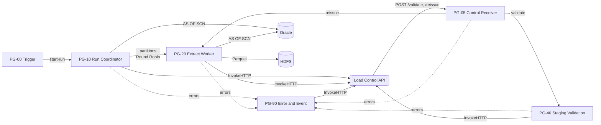

# V4 Oracle 원천 Flow 사용 매뉴얼

`poc/build_flow_v4.py`로 만드는 V4 Flow의 구성, 준비, 설치, 실행, 확인, 오류 대응 방법을 설명한다. 설계 근거는 `nifi-sqoop-removal-guide.md`(가이드), 시험 결과는 `poc/REVIEW.md` 7장에 있다.

## 1. 개요

V4는 V3(PostgreSQL 원천)와 같은 구조와 Load Control API 계약을 쓰고 원천만 Oracle로 바꾼 Flow다. 작업 시작 시 Oracle SCN을 하나 고정하고, 원천 지표·manifest 계산과 모든 파티션 추출이 같은 SCN(`AS OF SCN`)을 읽는다.



| 항목 | 내용 |
|---|---|
| 구현 범위 | 추출 단계(PG-00, 10, 20), API 호출 수신(PG-05), 검증 시작과 `_SUCCESS` 기록(PG-40 입구), 오류 처리(PG-90) |
| 미구현 | Hive staging 검증, `INSERT OVERWRITE`, Target 검증(PG-40 나머지, PG-50, PG-60). run은 `STAGE_VALIDATING`에서 멈춘다 |
| 검증 환경 | Apache NiFi 2.4.0 단일 노드, Oracle Database 23ai Free, ojdbc11 21.15, PostgreSQL 16, HDFS 대신 `file:///` |
| 구성 | PG 7개(상위 1 + 자식 6), Processor 43개, Connection 75개, Port 13개 |

운영 적용에 남은 일은 `TODO.md`에 있다.

## 2. 구성

### 2.1 Process Group과 Processor

모든 Processor에는 역할을 설명하는 한글 COMMENT가 있고, 각 PG에는 역할·흐름·입출력·주의점을 적은 Label이 있다.

| PG | Processor | 역할 |
|---|---|---|
| PG-00 Trigger | 00_Generate_Trigger, 01_Set_Trigger_Attributes, 02_Validate_Trigger | 업무일자(`BUSINESS.KEY`)로 실행 요청을 만들고 형식을 검사한다. 00은 DISABLED로 만들어진다 |
| PG-10 Run Coordinator | 11_Build_Run_Body, 12_Create_Run, 13_Set_Run_Attrs | API에 run을 만든다. 같은 업무일자의 활성 run이 있으면 409 |
| | 14_Query_Current_SCN, 15_Extract_SCN | `V$DATABASE.CURRENT_SCN`을 조회해 `load.snapshot.scn`에 넣는다 |
| | 16_Query_Source_Manifest | 같은 SCN으로 원천 지표(건수, 금액 합계, `MIN_TS`/`MAX_TS`)와 파티션 범위·예상 건수를 SQL 한 문장으로 계산한다 |
| | 17_Build_Manifest_Body, 18_Register_Manifest | manifest를 API에 등록한다. 0건 파티션은 API가 바로 SUCCESS 처리한다 |
| | 19_Split_Dispatch_Partitions, 20_Extract_Partition_Attrs | API가 돌려준 실행 대상 파티션을 FlowFile 하나씩으로 나눈다 |
| PG-20 Extract Worker | 30_Set_Claim_Token, 31_Build_Claim_Body, 32_Claim_Partition, 33_Is_Owner | 파티션 소유권을 API에서 claim한다. 33은 SCN이 숫자인지도 검사한다 |
| | 34_Execute_Partition_Query | `AS OF SCN`으로 파티션 범위를 조회해 Parquet chunk로 만든다. **재시도하지 않는다** |
| | 35_Set_Chunk_Attrs, 36_PutHDFS | `part-<파티션>-<chunk>.parquet`을 run 경로에 기록한다 |
| | 37_Build_Chunk_Report, 38_Report_Chunk | chunk마다 API에 보고한다. 파티션·run 완료 판정은 API가 한다 |
| PG-05 Control Receiver | 05_Listen_Control, 06_Validate_Request, 07_Respond_400, 08_Respond_202, 09_Extract_Control_Body, 10_Route_By_Action | API worker의 `POST /validate/<JOB.KEY>`, `POST /reissue/<JOB.KEY>`를 받아 PG-40 또는 PG-20으로 보낸다 |
| PG-40 Staging Validation | 40_Set_Validation_Stage ~ 46_PutHDFS_SUCCESS_Marker | API `/validation/start` CAS에 성공한 요청만 run 경로에 `_SUCCESS`를 쓴다. Hive 단계가 들어갈 자리다 |
| PG-90 Error and Event | 90_Normalize_Error ~ 97_LogMessage | 모든 실패를 오류 코드로 정리하고, run·파티션 실패를 API에 보고하고, `load_event`에 기록한다 |

### 2.2 Controller Service

| 이름 | 용도 |
|---|---|
| `CS_DBCP_ORACLE` | 원천 Oracle. `oracle.jdbc.OracleDriver`, 검사 쿼리 `SELECT 1 FROM DUAL`, 최대 연결 `#{ORACLE.POOL.MAX}` |
| `CS_DBCP_META` | 관리 DB(PostgreSQL). PG-90의 `load_event` INSERT 전용 |
| JSON/Parquet Reader·Writer | manifest JSON 처리, Parquet chunk 기록 |
| `StandardHttpContextMap` | PG-05 `HandleHttpRequest`/`HandleHttpResponse` |

### 2.3 데이터 흐름과 결과

1. Trigger가 실행 요청을 만들면 PG-10이 run을 만들고 SCN을 고정한다.
2. 16이 계산한 파티션 범위로 manifest를 등록한다. 범위는 split 컬럼의 최소~최대를 `PARTITION.COUNT`개로 나눈 하한 포함·상한 미포함 구간이고, 마지막 파티션만 상한을 포함한다.
3. PG-20이 파티션마다 claim → 추출 → HDFS 기록 → chunk 보고를 한다.
4. 마지막 chunk 보고에서 API가 run을 `EXTRACTED_VALIDATED`로 판정하고 검증 호출(dispatch)을 예약한다.
5. API worker가 PG-05를 호출하면 PG-40이 `/validation/start`로 run을 `STAGE_VALIDATING`으로 바꾸고 `_SUCCESS`를 기록한다.

HDFS 결과 경로:

```text
#{HDFS.STAGE.ROOT}/<JOB.KEY>/run_id=<run_id>/part-<partition_id>-<chunk>.parquet
#{HDFS.STAGE.ROOT}/<JOB.KEY>/run_id=<run_id>/_SUCCESS
```

## 3. 사전 준비

### 3.1 NiFi

- `extensions/`에 `nifi-parquet-nar`, `nifi-hadoop-nar`, `nifi-hadoop-libraries-nar`가 있어야 한다(Apache NiFi 2.4.0 기본 배포본에는 없음)
- ojdbc(`ORACLE.JDBC.DRIVER.PATH`)와 PostgreSQL JDBC(`META.JDBC.DRIVER.PATH`) 파일을 모든 노드의 같은 경로에 둔다
- `HADOOP.CONF.FILES`에 지정할 `core-site.xml`, `hdfs-site.xml`을 둔다
- `CONTROL.LISTEN.PORT`(PG-05 수신 포트)가 비어 있어야 한다

### 3.2 Oracle

조회 계정에는 다음 권한만 준다.

```sql
CREATE USER NIFI_READER IDENTIFIED BY <pw>;
GRANT CREATE SESSION TO NIFI_READER;
GRANT SELECT ON APP.INSP_DTL TO NIFI_READER;
GRANT FLASHBACK ON APP.INSP_DTL TO NIFI_READER;     -- AS OF SCN
GRANT SELECT ON SYS.V_$DATABASE TO NIFI_READER;     -- 14 SCN 조회
```

`V$DATABASE` 권한을 줄 수 없으면 14의 SQL을 `SELECT TO_CHAR(DBMS_FLASHBACK.GET_SYSTEM_CHANGE_NUMBER) AS SNAPSHOT_SCN FROM DUAL`로 바꾸고 `DBMS_FLASHBACK` 실행 권한을 준다.

함께 확인할 것:

| 항목 | 기준 |
|---|---|
| `UNDO_RETENTION`, undo 크기 | run 최대 소요시간보다 길어야 한다. 부족하면 `ORA-01555`로 run이 `FAILED_SNAPSHOT_EXPIRED`가 된다 |
| 인덱스 | `(업무 조건 컬럼, split 컬럼)` 인덱스. 16과 34가 범위 스캔을 한다 |
| split 컬럼 NULL | 업무 조건 범위에 NULL이 있으면 API가 manifest를 거부한다(V4는 NULL 파티션을 만들지 않음) |
| 세션 수 | `노드 수 × 34 Concurrent Tasks + 여유`가 승인 세션 수 이하가 되게 `ORACLE.POOL.MAX`를 정한다 |

### 3.3 Load Control API

`load-control-api/README.md` 기준으로 준비한다.

```bash
cd load-control-api
# 관리 DB migration
LCA_CONFIG=config.yaml alembic upgrade head
# NiFi용 토큰의 digest를 만들어 config.yaml auth.token_digests.nifi에 넣는다
python -m load_control.security "<nifi-token>"
# API와 worker(dispatcher + sweeper) 실행
python -m load_control.server --config config.yaml
python -m load_control.worker --config config.yaml
```

`config.yaml`의 `nifi.receiver_url`은 `http(s)://<nifi-host>:<CONTROL.LISTEN.PORT>`로 둔다. `curl <API>/readyz`가 `{"status":"ok"}`면 준비된 것이다.

## 4. 설정 파일

`poc/config.v4.example.json`을 복사해 값을 채운다. 암호와 토큰이 들어가므로 권한을 `600`으로 두고 저장소에 넣지 않는다.

### 4.1 `names`

| 키 | 기본값 | 의미 |
|---|---|---|
| `process_group` | `SQOOP_REPLACEMENT_POC_V4` | 상위 PG 이름 |
| `common_context` | `PC_SQOOP_REPLACEMENT_COMMON_V4` | 공통 Parameter Context |
| `job_context` | `PC_JOB_ORACLE_INSP_DTL_DAILY_V4` | Job Parameter Context(상위·자식 PG 모두에 지정됨) |

### 4.2 `common_params`

| Parameter | 예시 | 의미 |
|---|---|---|
| `CONTROL.API.URL` | `http://api-host:8080/v1` | Load Control API 기본 URL |
| `CONTROL.API.AUTHORIZATION` | `Bearer <token>` | Sensitive. `Bearer `를 포함한 전체 값을 넣는다(속성에 문자열을 덧붙일 수 없음) |
| `CONTROL.API.TIMEOUT` | `30 secs` | `InvokeHTTP` 타임아웃 |
| `CONTROL.API.RETRY.MAX` | `5` | API 호출 재시도 기준값. Retry Count는 Parameter를 참조할 수 없어 V4 빌더는 이 값을 읽지 않고 5회로 고정한다(7.1) |
| `CONTROL.LISTEN.PORT` | `9443` | PG-05 수신 포트 |
| `META.JDBC.URL`, `META.JDBC.USER`, `META.JDBC.PASSWORD`, `META.JDBC.DRIVER.PATH` | | 관리 DB(PostgreSQL). NiFi 계정은 `load_event` INSERT 권한만 있으면 된다 |
| `ORACLE.JDBC.URL` | `jdbc:oracle:thin:@//host:1521/SERVICE` | 원천 Oracle |
| `ORACLE.JDBC.USER`, `ORACLE.JDBC.PASSWORD`, `ORACLE.JDBC.DRIVER.PATH` | | 조회 계정과 ojdbc 경로 |
| `ORACLE.POOL.MAX` | `8` | `CS_DBCP_ORACLE` 최대 연결 수 |
| `ORACLE.NUMBER.DEFAULT.PRECISION` | `38` | 정밀도 없는 `NUMBER`를 decimal로 쓸 때의 precision |
| `ORACLE.NUMBER.DEFAULT.SCALE` | `10` | 같은 경우의 scale. 작게 두면 오류 없이 반올림된다(7.2) |
| `HADOOP.CONF.FILES` | `/etc/hadoop/conf/core-site.xml,...` | PutHDFS 설정 파일 |
| `HDFS.STAGE.ROOT` | `/data/nifi/stage` | run 경로의 상위 디렉터리 |
| `HDFS.PERMISSIONS.UMASK` | `027` | 기록 파일 umask |
| `EXTRACT.FETCH.SIZE` | `5000` | JDBC fetch size |
| `EXTRACT.ROWS.PER.FILE` | `500000` | Parquet 파일(chunk) 하나의 최대 행 수 |
| `EXTRACT.QUERY.TIMEOUT` | `60 min` | 34 쿼리 타임아웃 |
| `PARTITION.RETRY.MAX` | `3` | V4 빌더는 사용하지 않는다(34는 재시도하지 않음, 7.4). V3와 설정 형식을 맞추기 위해 남아 있다 |

### 4.3 `job_params`

| Parameter | 예시 | 의미 |
|---|---|---|
| `JOB.KEY` | `ORACLE_INSP_DTL_DAILY` | Job 식별자. HDFS 경로, PG-05 수신 경로에 쓰인다 |
| `BUSINESS.KEY` | `2026-09-28` | 업무일자(`YYYY-MM-DD`). 실행마다 바꾼다 |
| `SRC.OWNER`, `SRC.TABLE` | `APP`, `INSP_DTL` | 원천 테이블 |
| `SRC.COLUMNS` | `INSP_DTL_SEQ, BASE_DT, ITEM_CD, CAST(AMOUNT AS NUMBER(18,2)) AS AMOUNT, REG_TS, NOTE` | 추출 컬럼(순서 고정). 정밀도 없는 `NUMBER`는 반드시 CAST |
| `SRC.SPLIT.COLUMN` | `INSP_DTL_SEQ` | 파티션 분할 컬럼(숫자) |
| `SRC.BASE.WHERE` | `BASE_DT = TO_DATE('${load.business.key}', 'YYYY-MM-DD')` | 업무 조건. `${load.business.key}`로 업무일자를 참조 |
| `DQ.AMOUNT.COLUMN` | `AMOUNT` | 금액 합계 지표 컬럼 |
| `DQ.TIMESTAMP.COLUMN` | `REG_TS` | `MIN_TS`/`MAX_TS` 지표 컬럼 |
| `PARTITION.COUNT` | `8` | 파티션 수 |
| `HIVE.STAGE.TABLE.PREFIX` | `TMP_INSP_DTL_` | staging 테이블 이름 접두사(API가 run별 이름을 만듦) |
| `ALLOW.EMPTY.SOURCE` | `false` | 원천 0건을 허용할지 |

## 5. 설치와 실행

### 5.1 Flow 생성

```bash
python3 poc/build_flow_v4.py http://<nifi-host>:<port>/nifi-api my-config.v4.json > flow_ids.json
```

- NiFi root 아래에 상위 PG, 자식 PG 6개, Parameter Context 2개, Controller Service를 만들고 Controller Service를 enable한다
- 표준 출력은 생성한 PG·Processor id(JSON)다. 이후 조작에 쓰므로 저장해 둔다
- 같은 이름의 PG가 이미 있으면 먼저 5.5로 지운다

생성 직후 Controller Service가 enable되는 동안 34 등이 잠시 INVALID로 보인다. 몇 초 뒤 모두 VALID가 되는지 확인한다.

### 5.2 시작

NiFi UI에서 상위 PG `SQOOP_REPLACEMENT_POC_V4`를 Start한다. REST API로는 다음과 같다.

```bash
curl -X PUT -H 'Content-Type: application/json' \
  -d '{"id":"<process_group id>","state":"RUNNING"}' \
  http://<nifi-host>:<port>/nifi-api/flow/process-groups/<process_group id>
```

Trigger(00)는 DISABLED라 PG를 시작해도 실행되지 않는다.

### 5.3 실행(업무일자 1회)

1. Job Parameter Context의 `BUSINESS.KEY`를 실행할 업무일자로 바꾼다
2. 00_Generate_Trigger를 Enable한다(상태가 STOPPED가 됨)
3. 00_Generate_Trigger에서 **Run Once**를 실행한다

> **주의**: 00을 enable한 상태로 상위 PG를 다시 Start하면 00도 RUNNING이 되어 바로 한 번 실행된다(스케줄 1일). 같은 업무일자의 run이 진행 중이면 `DUPLICATE_ACTIVE_RUN`으로 거부되어 데이터에는 영향이 없지만, PG를 다시 시작하기 전에 00을 STOPPED 또는 DISABLED로 둔다.

### 5.4 정기 실행

00의 스케줄(기본 Timer 1일)을 운영 일정(예: CRON)으로 바꾸고 RUNNING으로 둔다. 업무일자를 자동으로 정하려면 01_Set_Trigger_Attributes의 `load.business.key` 식을 날짜 EL(예: `${now():toNumber():minus(86400000):format('yyyy-MM-dd')}`)로 바꾼다.

### 5.5 삭제

```bash
python3 poc/teardown_flow.py http://<nifi-host>:<port>/nifi-api my-config.v4.json
```

`names`에 적힌 PG와 Parameter Context를 지운다. 관리 DB 기록과 HDFS 파일은 지우지 않는다.

## 6. 실행 확인

### 6.1 run 상태

| 상태 | 의미 |
|---|---|
| `CREATED` | run 생성, manifest 등록 전 |
| `EXTRACTING` | manifest 등록, 파티션 추출 중 |
| `EXTRACTED_VALIDATED` | 모든 파티션 성공, 검증 호출 대기 |
| `STAGE_VALIDATING` | PG-40이 검증을 시작함. **V4는 여기서 멈춘다** |
| `FAILED_MANIFEST` | run 생성 후 SCN 조회·manifest 계산·등록 실패 |
| `FAILED_EXTRACT` | 파티션 하나 이상 실패 |
| `FAILED_SNAPSHOT_EXPIRED` | 파티션 쿼리가 `ORA-01555`/`ORA-08180`으로 실패 |
| `TIMED_OUT` | API sweeper가 시간 초과로 정리 |

### 6.2 관리 DB 조회

```sql
-- run
SELECT run_id, status, snapshot_scn, source_count, expected_partition_count,
       success_partition_count, extracted_count, error_stage, error_code
  FROM nifi_ops.load_run ORDER BY started_at DESC LIMIT 5;

-- 파티션
SELECT partition_id, status, lower_bound, upper_bound, expected_row_count,
       actual_row_count, file_count, attempt_count
  FROM nifi_ops.load_partition WHERE run_id = '<run_id>' ORDER BY partition_id;

-- 원천 지표
SELECT metric_name, actual_value FROM nifi_ops.load_validation WHERE run_id = '<run_id>';

-- 검증 호출
SELECT dispatch_type, status, last_http_status FROM nifi_ops.load_dispatch WHERE run_id = '<run_id>';

-- 오류·경고(INFO는 API의 상태 전이 기록)
SELECT event_time, process_group, event_level, event_name, error_code, partition_id, message
  FROM nifi_ops.load_event WHERE run_id = '<run_id>' AND event_level <> 'INFO' ORDER BY event_time;
```

정상 실행이면 run `STAGE_VALIDATING`, 모든 파티션 `SUCCESS`, `extracted_count = source_count`, dispatch `VALIDATE_RUN`이 `ACKED`(202)다.

### 6.3 결과 파일 검증

Parquet 행 수·합계를 같은 업무일자의 Oracle 값과 비교한다. 예: DuckDB

```sql
SET TimeZone = 'UTC';
SELECT count(*), count(DISTINCT INSP_DTL_SEQ), min(INSP_DTL_SEQ), max(INSP_DTL_SEQ), sum(AMOUNT)
  FROM read_parquet('<run 경로>/*.parquet', hive_partitioning = false);
```

`hive_partitioning = false`를 주지 않으면 경로의 `run_id=`가 컬럼으로 추가된다. timestamp는 NiFi JVM 시간대 기준으로 UTC로 바뀌어 저장되므로 원천 KST `2026-09-28 00:00:01`은 `2026-09-27 15:00:01+00`으로 보인다(7.3).

### 6.4 같은 업무일자 다시 실행

같은 업무일자에 활성 run(실패·성공으로 끝나지 않은 run)이 있으면 새 run이 거부된다. V4는 `STAGE_VALIDATING`에서 멈추므로, PoC에서 같은 업무일자를 다시 실행하려면 해당 run을 끝난 상태로 바꾼다.

```sql
UPDATE nifi_ops.load_run SET status = 'SUCCESS', completed_at = now() WHERE run_id = '<run_id>';
```

운영에서는 PG-50·60이 run을 끝내므로 이 작업이 필요 없다. 실패한 run은 이미 끝난 상태이므로 그대로 다시 Trigger하면 새 `run_id`·새 SCN으로 실행된다.

## 7. 오류와 대응

### 7.1 오류 코드

NiFi 오류는 PG-90이 `load_event`(process_group=상위 PG 이름)와 NiFi 로그(97_LogMessage)에 남긴다. 파티션·run 실패는 API가 `PARTITION_FAILED`, `RUN_FAILED`로 함께 남긴다.

| 이벤트·코드 | 수준 | 원인 | 대응 |
|---|---|---|---|
| `DUPLICATE_ACTIVE_RUN` | WARN | 같은 업무일자의 활성 run이 있음 | 기존 run 상태를 확인한다. 기존 run 변화 없음 |
| `CLAIM_MISMATCH` | WARN | 재발행 뒤 이전 시도의 chunk 보고가 늦게 도착 | 정상 경합. 조치 없음 |
| `ORA-01555` | ERROR | 고정 SCN의 undo가 사라짐. run `FAILED_SNAPSHOT_EXPIRED` | undo 보존 시간·크기를 늘리거나 변경이 적은 시간에 실행한 뒤 새로 Trigger한다 |
| `ORA-nnnnn`(그 밖) | ERROR | 권한(`ORA-00942`, `ORA-01031`), SQL 문법, 연결 오류 | 메시지와 34·14·16의 SQL을 확인하고 고친 뒤 새로 Trigger한다 |
| `SQL_ERROR` | ERROR | ORA 코드가 없는 추출 오류. 예: `Cannot encode decimal with precision 41 as max precision 38` | 7.2. 해당 컬럼을 큰 precision으로 CAST한다 |
| `CHUNK_WRITE_FAILED` | ERROR | PutHDFS 실패(경로 권한, HDFS 장애) | HDFS 상태와 `HDFS.STAGE.ROOT` 권한을 확인한다 |
| `API_UNREACHABLE`, `HTTP_<code>` | ERROR | API 호출 재시도를 모두 소진 | API 상태를 확인한다. 진행 중 run은 sweeper가 `TIMED_OUT`으로 정리한다 |
| `INVALID_SCN`(SQL 오류 메시지 안) | ERROR | SCN 속성이 숫자가 아님 | 14·15 결과를 확인한다 |

Processor 내장 재시도 횟수는 빌더에 고정돼 있다: API 호출(`InvokeHTTP`) `Retry`·`Failure` 5회, PutHDFS `failure` 3회, 34는 0회. 바꾸려면 빌더의 `retry=(...)` 값을 고친다. API가 잠시 중단돼도 이 재시도(penalty 증가)로 기다렸다가 재기동 후 이어서 진행한다(REVIEW 7.4).

### 7.2 정밀도 없는 `NUMBER`

`SRC.COLUMNS`에서 CAST하지 않은 정밀도 없는 `NUMBER`는 `ORACLE.NUMBER.DEFAULT.PRECISION`/`SCALE`로 기록된다(REVIEW 7.6).

| 경우 | 결과 |
|---|---|
| 기본값(38, 10) | `decimal(38,10)`. 소수 11자리부터 반올림 |
| 소수 자릿수 > scale | **오류 없이 반올림**. scale `0`이면 1.37 → 1. 건수 검증으로는 드러나지 않는다 |
| 정수부 자릿수 > precision − scale | 파티션 `SQL_ERROR` 실패, run `FAILED_EXTRACT` |

### 7.3 타입과 시간대

| Oracle | Parquet |
|---|---|
| `NUMBER(19)` | `decimal(19,0)`. Hive DDL은 `DECIMAL(19,0)` 또는 `BIGINT`로 CAST |
| `NUMBER(p,s)`, `CAST(... AS NUMBER(p,s))` | `decimal(p,s)` |
| `DATE`, `TIMESTAMP` | `timestamp[ms, UTC]`. `DATE`도 timestamp가 되고, 시간대 없는 값은 NiFi JVM 시간대로 해석되어 UTC로 저장된다. 마이크로초 이하는 버려진다 |
| `VARCHAR2` | string |

NiFi JVM `-Duser.timezone`과 Hive parquet timestamp 해석 설정을 함께 정하고, `MIN_TS`/`MAX_TS` 지표로 확인한다(가이드 4장).

### 7.4 재처리 원칙

- 파티션 쿼리(34)는 재시도하지 않는다. 같은 SCN으로 긴 쿼리를 반복하지 않기 위해서다
- 실패한 run의 일부 파티션만 다시 읽지 않는다. 새로 Trigger해 새 `run_id`·새 SCN으로 전체를 다시 실행한다
- 실패한 run의 HDFS 파일은 그 run 경로에만 남고 `_SUCCESS`가 없다. 다음 run과 섞이지 않는다
- API를 `recovery.mode=REISSUE`로 띄운 경우에만 sweeper가 멈춘 파티션을 같은 `run_id`·같은 SCN으로 재발행한다(가이드 13장)

## 8. Oracle 시험 환경 구성

Oracle이 없는 환경에서 시험할 때 쓴 구성이다(REVIEW 7.4).

```bash
docker run -d --name nifi-poc-oracle --restart unless-stopped -p 1521:1521 \
  -e ORACLE_PASSWORD=<sys-pw> gvenzl/oracle-free:23-slim
docker logs -f nifi-poc-oracle      # "DATABASE IS READY TO USE" 확인
```

시험 데이터(업무일자 `2026-09-28` 105,000건, seq 30001~45000 공백으로 0건 파티션 1개, 다른 일자 5,000건):

```sql
-- sqlplus sys/<sys-pw>@//localhost:1521/FREEPDB1 as sysdba
CREATE USER APP IDENTIFIED BY <pw> QUOTA UNLIMITED ON USERS DEFAULT TABLESPACE USERS;
CREATE TABLE APP.INSP_DTL (
  INSP_DTL_SEQ NUMBER(19), BASE_DT DATE NOT NULL, ITEM_CD VARCHAR2(10) NOT NULL,
  AMOUNT NUMBER NOT NULL, REG_TS TIMESTAMP NOT NULL, NOTE VARCHAR2(4000));
INSERT /*+ APPEND */ INTO APP.INSP_DTL
SELECT g, DATE '2026-09-28', 'C' || MOD(g,17), ROUND(MOD(g,1000) * 1.37, 2),
       TIMESTAMP '2026-09-28 00:00:00' + NUMTODSINTERVAL(g,'SECOND'),
       CASE WHEN MOD(g,10) = 0 THEN NULL ELSE 'note ' || g END
  FROM (SELECT LEVEL g FROM DUAL CONNECT BY LEVEL <= 120000) WHERE g NOT BETWEEN 30001 AND 45000;
COMMIT;
INSERT INTO APP.INSP_DTL
SELECT CASE WHEN g <= 5 THEN NULL ELSE 200000 + g END, DATE '2026-09-27', 'X', 1, SYSTIMESTAMP, NULL
  FROM (SELECT LEVEL g FROM DUAL CONNECT BY LEVEL <= 5000);
COMMIT;
CREATE INDEX APP.IX_INSP_DTL_BASE_SEQ ON APP.INSP_DTL(BASE_DT, INSP_DTL_SEQ);
EXEC DBMS_STATS.GATHER_TABLE_STATS('APP','INSP_DTL');
-- NIFI_READER 생성과 권한은 3.2
```

설정 파일은 `ORACLE.JDBC.URL=jdbc:oracle:thin:@//localhost:1521/FREEPDB1`로 둔다. 기대 결과는 105,000건, `SUM(AMOUNT)` 71,853,075, 파티션 8개 중 0002가 0건이다.

## 9. 참고

| 문서 | 내용 |
|---|---|
| `poc/REVIEW.md` 7장 | V4 변경점, 시험 결과(정상·중복·HDFS 실패·API 중단·재발행·`NUMBER`·`ORA-01555`) |
| `nifi-sqoop-removal-guide.md` 7·8·16장 | PG-10·20 설계, SCN과 manifest SQL, 재시도 분류 |
| `load-control-api-design.md` | API 계약, 완료 판정, outbox, sweeper |
| `load-control-api/README.md` | API 설치·실행·테스트 |
| `TODO.md` | 운영 적용에 남은 일 |
